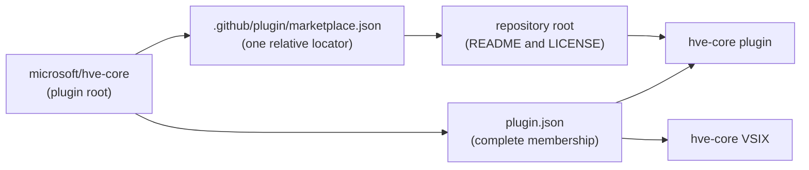

HVE Core delivers one complete component set through the `hve-core` VS Code extension and Copilot CLI plugin. Choose a managed installation or copy selected components from a clone.

## Managed Installation

Install `ise-hve-essentials.hve-core` from the VS Code Marketplace, or register this repository as a Copilot CLI marketplace and install `hve-core@hve-core`.

Stable and PreRelease contain the same complete component set. They differ in source ownership, cadence, and version. See [HVE Core Identity and Channels](packages) for the release contract.

## Selective Clone Adoption

Teams that need a repository-owned subset can use `hve-core-installer`.

1. Clone or pin the HVE Core version to adopt.
2. Choose every component declared by root `plugin.json`, or select a subset.
3. Review component kinds and collisions before writes.
4. Choose automatic source updates or a controlled pinned version.

The installer can copy agents, prompts, instructions, and complete skill directories. It preserves repository-relative paths and records the result in `.hve-tracking.json` schema version 2. Hooks are not copied.

### Decision Matrix

| Environment               | Team | Updates    | Recommended Method                         |
|---------------------------|------|------------|--------------------------------------------|
| **Any** (simplest)        | Any  | Auto       | [VS Code Extension](methods/extension) ⭐   |
| Local (no container)      | Solo | Manual     | [Peer Directory Clone](methods/peer-clone) |
| Local (no container)      | Team | Controlled | [Submodule](methods/submodule)             |
| Local devcontainer        | Solo | Auto       | [Git-Ignored Folder](methods/git-ignored)  |
| Local devcontainer        | Team | Controlled | [Submodule](methods/submodule)             |
| Codespaces only           | Solo | Auto       | [GitHub Codespaces](methods/codespaces)    |
| Codespaces only           | Team | Controlled | [Submodule](methods/submodule)             |
| Both local + Codespaces   | Any  | Any        | [Multi-Root Workspace](methods/multi-root) |
| Advanced (shared install) | Solo | Auto       | [Mounted Directory](methods/mounted)       |
| Any (CLI preferred)       | Any  | Manual     | [CLI Plugins](methods/cli-plugins)         |

⭐ **VS Code Extension** is the recommended method for most users who don't need customization.

> [!NOTE]
> HVE Core uses one identity across the plugin and extension. Root `plugin.json` owns membership, and `.github/plugin/marketplace.json` contains one relative locator to the repository root. Plugin clients resolve root README and LICENSE; the VSIX keeps its extension-owned metadata.

### Distribution Relationships



### Which Installation Should I Use?

* Use the VS Code extension for managed updates in Copilot Chat.
* Use the `hve-core` plugin for Copilot CLI.
* Use selective clone adoption when your repository should own only chosen files.

## Distribution Identity and Channels

`main` is the ref-less development tip. PreRelease and Stable are reviewed
release branches that advance through `main` to `release/prerelease` to
`release/stable`. An exact channel tag freezes one release catalog and its
source payloads.

| Use case             | Marketplace registration                   | Source resolution                  |
|----------------------|--------------------------------------------|------------------------------------|
| Development tip      | `microsoft/hve-core`                       | Current `main` repository root     |
| Moving PreRelease    | `microsoft/hve-core#release/prerelease`    | Current reviewed PreRelease branch |
| Moving Stable        | `microsoft/hve-core#release/stable`        | Current reviewed Stable branch     |
| Immutable PreRelease | `microsoft/hve-core#prerelease-v<version>` | One exact PreRelease tag           |
| Immutable Stable     | `microsoft/hve-core#v<version>`            | One exact Stable tag               |

A moving release registration selects the catalog and repository-root source currently committed to its reviewed branch. The branch can advance, while an exact-tag registration remains fixed.

A published channel release is the assurance boundary for its immutable tag.
The release workflow applies review and release gates, produces one VSIX and its
SBOM and provenance sidecars, verifies provenance, and publishes through
the configured release path. The ref-less development tip intentionally does
not carry that published-release assurance.

The plugin includes the telemetry hook. VS Code does not expose a declarative hook contribution point, so configure its location manually for extension installations.

See [HVE Core Identity and Channels](packages) for the lifecycle and source contract.

### Copilot Plugin Registration

Register the development tip without a ref:

```bash
copilot plugin marketplace add microsoft/hve-core
```

Register a moving reviewed channel:

```bash
copilot plugin marketplace add microsoft/hve-core#release/prerelease
copilot plugin marketplace add microsoft/hve-core#release/stable
```

Register an immutable channel tag:

```bash
copilot plugin marketplace add microsoft/hve-core#prerelease-v<version>
copilot plugin marketplace add microsoft/hve-core#v<version>
```

Install the plugin:

```bash
copilot plugin install hve-core@hve-core
```

### Refresh, Update, and Switching

Marketplace refresh and installed-plugin update are separate client actions.
When following a moving registration, refresh the catalog before requesting a
plugin update:

```bash
copilot plugin marketplace update hve-core
copilot plugin update hve-core@hve-core
```

Changing registrations can require removing and re-adding the marketplace in
the client. Do not rely on a particular result for duplicate same-name
registrations; confirm the behavior supported by your Copilot CLI version.

### Clone Methods

The installer validates each selected component against root `plugin.json`. Schema version 2 stores `selection.profile` and `selection.components` without package identity. File records identify component ownership, and hooks remain plugin-only.

## Developer Setup

Contributors and advanced users who need to modify HVE Core source code should clone the repository directly.

1. Fork and clone the repository:

   ```bash
   git clone https://github.com/<your-fork>/hve-core.git
   ```

2. Install dependencies:

   ```bash
   cd hve-core && npm ci
   ```

3. Open the workspace in VS Code. A devcontainer configuration is included for containerized development.

Detailed instructions for each clone-based approach:

* [Peer Directory Clone](methods/peer-clone.md) for side-by-side local development
* [Git Submodule](methods/submodule.md) for team version control
* [Contributing Guide](../contributing/) for pull request and development conventions

## Choosing a Method

The three paths above cover the vast majority of scenarios. If your environment has specific constraints (Codespaces-only, mounted containers, multi-root workspaces), the [Comparing Setup Methods](methods/comparison.md) page has a detailed decision matrix and decision tree. The [Setup Methods Overview](methods/) lists every available approach.

## Validation

After installing, verify artifacts declared by the HVE Core plugin:

1. Open [HVE Core Plugin](../plugins/hve-core) and choose a declared agent, prompt, instruction, or skill to verify.
2. Confirm that component is available through the installed extension or plugin client.
3. Open Copilot Chat, type `@` to find `RPI Agent`, then type `/` and verify its RPI entry points.

If a declared component is unavailable, check the [Troubleshooting](troubleshooting.md) page for common solutions.

## Post-Installation: Update Your .gitignore

Add this line to your project's `.gitignore`:

```text
.copilot-tracking/
```

> [!IMPORTANT]
> This applies to all installation methods. The `.copilot-tracking/` folder is created in your project directory, not in HVE Core itself.

The folder stores ephemeral workflow artifacts (research documents, implementation plans, PR review notes, and work item planning files) that help agents maintain context across sessions. These files are useful during your workflow but should not be committed to your repository.

## MCP Server Configuration (Optional)

Some HVE Core agents use MCP (Model Context Protocol) servers to integrate with Azure DevOps, GitHub, or documentation services. Agents work without MCP configuration; it is an optional enhancement.

See [MCP Server Configuration](mcp-configuration.md) for setup instructions covering server requirements, configuration templates, and troubleshooting.

## Next Steps

* [Your First Interaction](first-interaction.md) to confirm your setup works
* [Your First Workflow](first-workflow.md) to try HVE Core with a real task
* [RPI Workflow](../rpi/) for the Research, Plan, Implement, Review methodology

---

<!-- markdownlint-disable MD036 -->
*🤖 Crafted with precision by ✨Copilot following brilliant human instruction,
then carefully refined by our team of discerning human reviewers.*
<!-- markdownlint-enable MD036 -->
