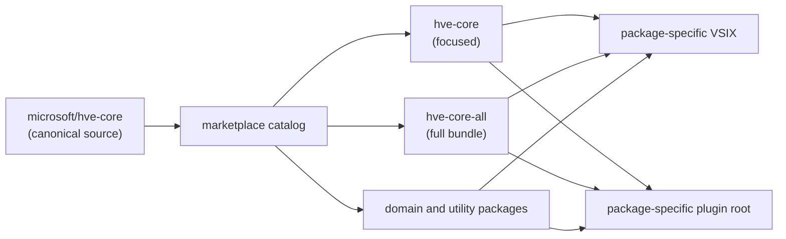

HVE Core delivers GitHub Copilot customizations through catalog-defined packages. Choose the package scope first, then select a managed extension, plugin, or repository-owned component installation.

## Package Selection

| Package choice            | Best fit                                        |
|---------------------------|-------------------------------------------------|
| `hve-core`                | RPI, HVE Builder, Git, and code review          |
| `hve-core-all`            | All active content and the starter profile      |
| Domain or utility package | A narrower capability set listed in the catalog |

> [!CAUTION]
> Do not install `hve-core` and `hve-core-all` together because their content overlaps.

## Marketplace Install

When a selected package is available through your deployment surface, install the extension identity generated for that catalog entry. `hve-core` uses the unsuffixed HVE Core identity, `ise-hve-essentials.hve-core`; other entries use deterministic package-specific identities.

Stable and PreRelease have equal active package and component projections. They differ in source ownership, cadence, and version. See [HVE Core Identity and Channels](packages) for the release contract.

## Selective Clone Adoption

Teams that need a repository-owned subset can use `hve-core-installer`.

1. Clone or pin the HVE Core version to adopt.
2. Select one exact `PackageName` from the catalog before choosing a profile or component.
3. Select the `starter` profile only from `hve-core-all`, or choose components from the selected package.
4. Review component kinds, lifecycle labels, dependency closure, and collisions before writes.
5. Choose automatic source updates or a controlled pinned version.

The installer can copy agents, prompts, instructions, and complete skill directories. It preserves repository-relative paths and records the result in `.hve-tracking.json` schema version 2. Hooks are not copied.

### Decision Matrix

| Environment               | Team | Updates    | Recommended Method                         |
|---------------------------|------|------------|--------------------------------------------|
| **Any** (simplest)        | Any  | Auto       | [VS Code Extension](methods/extension) ⭐   |
| Local (no container)      | Solo | Manual     | [Peer Directory Clone](methods/peer-clone) |
| Local (no container)      | Team | Controlled | [Submodule](methods/submodule)             |
| Local devcontainer        | Solo | Auto       | [Git-Ignored Folder](methods/git-ignored)  |
| Local devcontainer        | Team | Controlled | [Submodule](methods/submodule)             |
| Codespaces only           | Solo | Auto       | [GitHub Codespaces](methods/codespaces)    |
| Codespaces only           | Team | Controlled | [Submodule](methods/submodule)             |
| Both local + Codespaces   | Any  | Any        | [Multi-Root Workspace](methods/multi-root) |
| Advanced (shared install) | Solo | Auto       | [Mounted Directory](methods/mounted)       |
| Any (CLI preferred)       | Any  | Manual     | [CLI Plugins](methods/cli-plugins)         |

⭐ **VS Code Extension** is the recommended method for most users who don't need customization.

> [!NOTE]
> HVE Core can refer to the source repository, the catalog, or one selected package identity. The catalog defines each plugin root and extension identity; it does not define one shared extension for all content.

### Package Relationships



### Which Package Should I Install?

* **I need RPI, HVE Builder, Git, and code review** → Choose `hve-core`
* **I need all active content or the starter profile** → Choose `hve-core-all`
* **I need one domain capability** → Choose the matching domain or utility package
* **My repository needs selected components only** → Use selective clone adoption

## Distribution Identity and Channels

`main` is the ref-less development tip. PreRelease and Stable are reviewed
release branches that advance through `main` to `release/prerelease` to
`release/stable`. An exact channel tag freezes one release catalog and its
source payloads.

| Use case             | Marketplace registration                   | Catalog resolution                                          |
|----------------------|--------------------------------------------|-------------------------------------------------------------|
| Development tip      | `microsoft/hve-core`                       | Current `main` catalog; entries omit `source.ref`           |
| Moving PreRelease    | `microsoft/hve-core#release/prerelease`    | Current branch catalog; entries pin `prerelease-v<version>` |
| Moving Stable        | `microsoft/hve-core#release/stable`        | Current branch catalog; entries pin `v<version>`            |
| Immutable PreRelease | `microsoft/hve-core#prerelease-v<version>` | One exact PreRelease catalog and tag                        |
| Immutable Stable     | `microsoft/hve-core#v<version>`            | One exact Stable catalog and tag                            |

A moving release registration selects the catalog currently committed to its
reviewed branch. Every entry in that catalog points to the corresponding exact
channel tag. The branch can advance to a newer catalog, while an exact-tag
registration remains fixed.

A published channel release is the assurance boundary for its immutable tag.
The release workflow applies review and release gates, produces package assets
and SBOMs, attaches attestations, verifies provenance, and publishes through
the configured release path. The ref-less development tip intentionally does
not carry that published-release assurance.

`hve-core` and `hve-core-all` each include the telemetry hook. VS Code does not expose a declarative hook contribution point, so configure hook locations manually for extension installations.

See [HVE Core Identity and Channels](packages) for the lifecycle and source contract.

### Copilot Plugin Registration

Register the development tip without a ref:

```bash
copilot plugin marketplace add microsoft/hve-core
```

Register a moving reviewed channel:

```bash
copilot plugin marketplace add microsoft/hve-core#release/prerelease
copilot plugin marketplace add microsoft/hve-core#release/stable
```

Register an immutable channel tag:

```bash
copilot plugin marketplace add microsoft/hve-core#prerelease-v<version>
copilot plugin marketplace add microsoft/hve-core#v<version>
```

Install the selected package:

```bash
copilot plugin install hve-core@hve-core
```

### Refresh, Update, and Switching

Marketplace refresh and installed-plugin update are separate client actions.
When following a moving registration, refresh the catalog before requesting a
plugin update:

```bash
copilot plugin marketplace update hve-core
copilot plugin update hve-core@hve-core
```

Changing registrations can require removing and re-adding the marketplace in
the client. Do not rely on a particular result for duplicate same-name
registrations; confirm the behavior supported by your Copilot CLI version.

### Clone Methods

The installer resolves an exact `PackageName` before any profile or component selection. The `starter` profile exists only in `hve-core-all`. Schema version 2 stores `selection.package`; a package-less manifest emits `INSTALLED_PACKAGE=` and requires explicit package reselection before replay. File records identify components, not per-file package ownership, and hooks remain plugin-only.

## Developer Setup

Contributors and advanced users who need to modify HVE Core source code should clone the repository directly.

1. Fork and clone the repository:

   ```bash
   git clone https://github.com/<your-fork>/hve-core.git
   ```

2. Install dependencies:

   ```bash
   cd hve-core && npm ci
   ```

3. Open the workspace in VS Code. A devcontainer configuration is included for containerized development.

Detailed instructions for each clone-based approach:

* [Peer Directory Clone](methods/peer-clone.md) for side-by-side local development
* [Git Submodule](methods/submodule.md) for team version control
* [Contributing Guide](../contributing/) for pull request and development conventions

## Choosing a Method

The three paths above cover the vast majority of scenarios. If your environment has specific constraints (Codespaces-only, mounted containers, multi-root workspaces), the [Comparing Setup Methods](methods/comparison.md) page has a detailed decision matrix and decision tree. The [Setup Methods Overview](methods/) lists every available approach.

## Validation

After installing, verify the artifacts declared by the selected package:

1. Open the selected package document under `docs/plugins/<name>.md` and choose a declared agent, prompt, instruction, or skill to verify.
2. Confirm that component is available through the installed extension or plugin client.
3. If the selected package declares `RPI Agent` and RPI prompts, open Copilot Chat, type `@` to find the agent, then type `/` and verify its RPI entry points.

If a declared component is unavailable, check the [Troubleshooting](troubleshooting.md) page for common solutions.

## Post-Installation: Update Your .gitignore

Add this line to your project's `.gitignore`:

```text
.copilot-tracking/
```

> [!IMPORTANT]
> This applies to all installation methods. The `.copilot-tracking/` folder is created in your project directory, not in HVE Core itself.

The folder stores ephemeral workflow artifacts (research documents, implementation plans, PR review notes, and work item planning files) that help agents maintain context across sessions. These files are useful during your workflow but should not be committed to your repository.

## MCP Server Configuration (Optional)

Some HVE Core agents use MCP (Model Context Protocol) servers to integrate with Azure DevOps, GitHub, or documentation services. Agents work without MCP configuration; it is an optional enhancement.

See [MCP Server Configuration](mcp-configuration.md) for setup instructions covering server requirements, configuration templates, and troubleshooting.

## Next Steps

* [Your First Interaction](first-interaction.md) to confirm your setup works
* [Your First Workflow](first-workflow.md) to try HVE Core with a real task
* [RPI Workflow](../rpi/) for the Research, Plan, Implement, Review methodology

---

<!-- markdownlint-disable MD036 -->
*🤖 Crafted with precision by ✨Copilot following brilliant human instruction,
then carefully refined by our team of discerning human reviewers.*
<!-- markdownlint-enable MD036 -->
