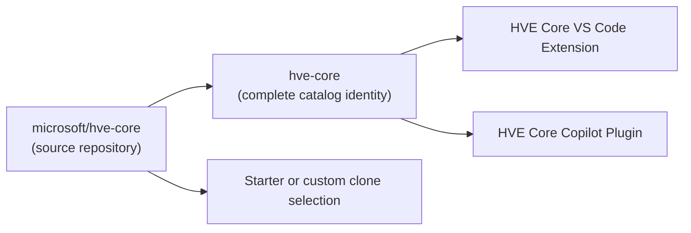

HVE Core delivers GitHub Copilot customizations (agents, instructions, prompts, and skills) that accelerate your development workflow. Pick the installation path that fits your needs.

## Marketplace Install (Recommended)

Install the **HVE Core** extension for a zero-configuration experience that works across local VS Code, devcontainers, and GitHub Codespaces.

1. Open VS Code and go to the Extensions view (`Ctrl+Shift+X`).
2. Search for **HVE Core**.
3. Click **Install** on the extension published by `ise-hve-essentials`.
4. Reload VS Code when prompted.

**Or visit:** [HVE Core on VS Code Marketplace](https://marketplace.visualstudio.com/items?itemName=ise-hve-essentials.hve-core)

The extension installs the complete `hve-core` component set. Updates arrive automatically through VS Code.

After installation, select `RPI Agent` or use `/rpi` for the full lifecycle. Use `/rpi-research`, `/rpi-plan`, `/rpi-implement`, and `/rpi-review` for individual phases.

See [Extension Installation Guide](methods/extension.md) for complete documentation.

> [!TIP]
> The marketplace extension is the fastest way to start. Read the [migration guide](package-migration) before replacing an existing clone or retired extension identity.

## Selective Clone Adoption

Teams that need a smaller repository-owned footprint can use the `hve-core-installer` skill included with HVE Core.

1. Clone or pin the HVE Core version you want to adopt.
2. Open Copilot Chat and ask an agent to use `hve-core-installer` for selective clone adoption.
3. Choose the 24-component starter profile or a custom selection.
4. Review component kinds, lifecycle labels, and dependency closure before writes.
5. Choose automatic source updates or a controlled pinned version.

The installer can copy agents, prompts, instructions, and complete skill directories. It preserves repository-relative paths and records the result in `.hve-tracking.json` schema version 2. Hooks are not copied.

### Decision Matrix

| Environment               | Team | Updates    | Recommended Method                         |
|---------------------------|------|------------|--------------------------------------------|
| **Any** (simplest)        | Any  | Auto       | [VS Code Extension](methods/extension) ⭐   |
| Local (no container)      | Solo | Manual     | [Peer Directory Clone](methods/peer-clone) |
| Local (no container)      | Team | Controlled | [Submodule](methods/submodule)             |
| Local devcontainer        | Solo | Auto       | [Git-Ignored Folder](methods/git-ignored)  |
| Local devcontainer        | Team | Controlled | [Submodule](methods/submodule)             |
| Codespaces only           | Solo | Auto       | [GitHub Codespaces](methods/codespaces)    |
| Codespaces only           | Team | Controlled | [Submodule](methods/submodule)             |
| Both local + Codespaces   | Any  | Any        | [Multi-Root Workspace](methods/multi-root) |
| Advanced (shared install) | Solo | Auto       | [Mounted Directory](methods/mounted)       |
| Any (CLI preferred)       | Any  | Manual     | [CLI Plugins](methods/cli-plugins)         |

⭐ **VS Code Extension** is the recommended method for most users who don't need customization.

> [!NOTE]
> The term "HVE Core" refers to different things depending on context:
>
> * **Repository** (`microsoft/hve-core`) - canonical source for all artifacts
> * **Extension** (`ise-hve-essentials.hve-core`) - one identity with Stable and PreRelease channels
> * **CLI plugin** (`hve-core`) - installed from one ref-qualified `hve-core` marketplace registration
>
> The extension and plugin contain the same complete active component set.

### How the Pieces Fit Together



### Which Extension Should I Install?

* **I want the managed complete experience** → Install **HVE Core**
* **I want newer approved main content** → Switch HVE Core to **PreRelease**
* **My repository needs selected components only** → Use selective clone adoption
* **I want to contribute or modify source** → Clone the repository (see [Developer Setup](#developer-setup))

## Distribution Identity and Channels

HVE Core has one complete plugin and extension identity. Stable and PreRelease contain active `stable`, `preview`, and `experimental` components; `deprecated` and `removed` components are excluded. Lifecycle labels disclose support posture and do not filter channels.

PreRelease packages directly from `main`. Stable packages after reviewed `main` content is promoted into `release/stable`, so Stable may lag newer `main` commits. Both VS Code channels use `ise-hve-essentials.hve-core` and differ by cadence and version, not component content.

See [HVE Core Identity and Channels](packages) for the lifecycle and source contract.

### Copilot Plugin Registration

Register an approved catalog ref, then install `hve-core` through `/plugin`:

```bash
copilot plugin marketplace add microsoft/hve-core#<ref>
```

The marketplace ref selects the catalog, while its `source.ref` pins matching immutable `plugins-v<version>` bytes. Stable and PreRelease catalogs share the marketplace name `hve-core`, so keep one active registration at a time.

### Clone Methods

The included installer resolves the starter profile or a custom selection from the `hve-core` recipe. It copies selected agents, prompts, instructions, and complete skill directories while preserving source-relative paths. Dependency-added components remain explicit in the confirmation, and hooks remain plugin-only.

## Developer Setup

Contributors and advanced users who need to modify HVE Core source code should clone the repository directly.

1. Fork and clone the repository:

   ```bash
   git clone https://github.com/<your-fork>/hve-core.git
   ```

2. Install dependencies:

   ```bash
   cd hve-core && npm ci
   ```

3. Open the workspace in VS Code. A devcontainer configuration is included for containerized development.

Detailed instructions for each clone-based approach:

* [Peer Directory Clone](methods/peer-clone.md) for side-by-side local development
* [Git Submodule](methods/submodule.md) for team version control
* [Contributing Guide](../contributing/) for pull request and development conventions

## Choosing a Method

The three paths above cover the vast majority of scenarios. If your environment has specific constraints (Codespaces-only, mounted containers, multi-root workspaces), the [Comparing Setup Methods](methods/comparison.md) page has a detailed decision matrix and decision tree. The [Setup Methods Overview](methods/) lists every available approach.

## Validation

After installing, verify that HVE Core is active:

1. Open Copilot Chat in VS Code.
2. Type `@` to see available agents.
3. Look for `RPI Agent`, then type `/` and verify that RPI entry points such as `/rpi`, `/rpi-research`, and `/rpi-plan` are available.

If you don't see the agents, check the [Troubleshooting](troubleshooting.md) page for common solutions.

## Post-Installation: Update Your .gitignore

Add this line to your project's `.gitignore`:

```text
.copilot-tracking/
```

> [!IMPORTANT]
> This applies to all installation methods. The `.copilot-tracking/` folder is created in your project directory, not in HVE Core itself.

The folder stores ephemeral workflow artifacts (research documents, implementation plans, PR review notes, and work item planning files) that help agents maintain context across sessions. These files are useful during your workflow but should not be committed to your repository.

## MCP Server Configuration (Optional)

Some HVE Core agents use MCP (Model Context Protocol) servers to integrate with Azure DevOps, GitHub, or documentation services. Agents work without MCP configuration; it is an optional enhancement.

See [MCP Server Configuration](mcp-configuration.md) for setup instructions covering server requirements, configuration templates, and troubleshooting.

## Next Steps

* [Your First Interaction](first-interaction.md) to confirm your setup works
* [Your First Workflow](first-workflow.md) to try HVE Core with a real task
* [RPI Workflow](../rpi/) for the Research, Plan, Implement, Review methodology

---

<!-- markdownlint-disable MD036 -->
*🤖 Crafted with precision by ✨Copilot following brilliant human instruction,
then carefully refined by our team of discerning human reviewers.*
<!-- markdownlint-enable MD036 -->
