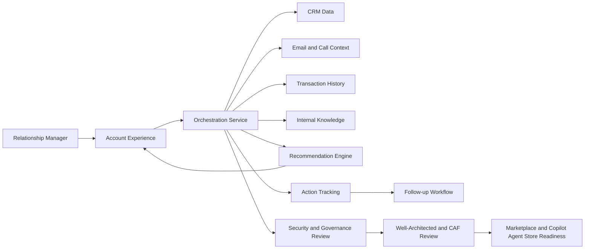

# Architecture draft: Relationship Manager for FSI

## Proposed solution approach
A lightweight first-slice experience can be built as a guided account workspace that combines approved enterprise data with an AI-assisted recommendation layer. The experience should present a single account view, highlight priority actions, and keep the user in control through explainable guidance and human review before action.

## Core services
- Experience layer: account workspace, summary view, and recommended next actions for the relationship manager.
- Orchestration service: coordinates data retrieval, grounding, recommendation generation, and response formatting.
- Insight and recommendation service: identifies risks, growth signals, and relevant follow-up actions based on evidence.
- Retrieval and grounding layer: connects approved data sources and surfaces cited evidence supporting each recommendation.
- Action tracking service: records follow-up tasks, recommended next steps, and completion status for the user workflow.
- Governance and observability layer: manages logging, auditability, permission checks, and reviewability for workshop stakeholders.

## Data sources and integration points
- CRM system: customer and account profile data, relationship history, and account ownership context.
- Email and call context: recent communications, notes, and engagement signals.
- Transaction history: account activity, product holdings, and recent financial behavior.
- Internal knowledge sources: policy documents, playbooks, internal guidance, and approved reference content.
- Identity and permissions service: ensures the right users and reviewers can access the right data.
- Workflow integration: links recommended actions to follow-up tasks, task tracking, or downstream business processes.

## Simple solution notes
- Recommended approach: start with a scenario-specific experience rather than a generalized platform. Focus on one account view, one recommendation pattern, and one follow-up action flow.
- Major tradeoffs:
  - Human-in-the-loop vs. automation: keep recommendations explainable and reviewable in the first slice rather than automating sensitive actions too early.
  - Breadth vs. depth: prioritize a concise, high-value experience over a broad multi-scenario experience.
  - Speed vs. completeness: use a small set of approved data sources first, then expand after stakeholder feedback.
- Architecture notes:
  - Keep the user experience simple and task-focused.
  - Treat recommendations as evidence-backed suggestions, not hidden automation.
  - Make the reasoning visible so risk and compliance reviewers can trust the output.
  - Design the first slice for workshop reviewability, not production scale.

## Suggested prompt for System Architecture Reviewer
> Review these requirements and experience draft and help frame a simple solution approach, major tradeoffs, and architecture notes for the first slice.

## Simple Mermaid architecture diagram

## Deployment, security, and operational considerations
- Deployment: use a lightweight hosted experience with clearly scoped data access for the workshop environment.
- Security: avoid production credentials, personal data, customer secrets, and sensitive content; enforce least-privilege access and role-based permissions.
- Operations: log recommendation activity, maintain review trails, and define clear ownership for monitoring and follow-up.
- Reliability: support graceful fallback when a data source is unavailable and keep the user experience understandable under partial failure.

## Review and governance considerations
- Review this solution draft for security risks, deployment considerations, and follow-up actions needed before implementation.
- Review this solution for well-architected design concerns, align the approach to Microsoft Cloud Adoption Framework guidance, and identify any gaps in reliability, security, operational excellence, performance efficiency, and cost optimization for the first slice.
- Provide clear product description, scenario framing, and user value proposition.
- Ensure the experience is understandable, reviewable, and aligned to enterprise governance expectations.
- Document supportability, permissions, data handling, and deployment boundaries.
- Prepare metadata and packaging that support discoverability in Microsoft Marketplace and Microsoft 365 Copilot Agent Store.
- Identify the integration and publication requirements needed to make this solution ready for Microsoft Marketplace and Microsoft 365 Copilot Agent Store, including packaging details, metadata, support expectations, and any required user experience or technical integrations.
