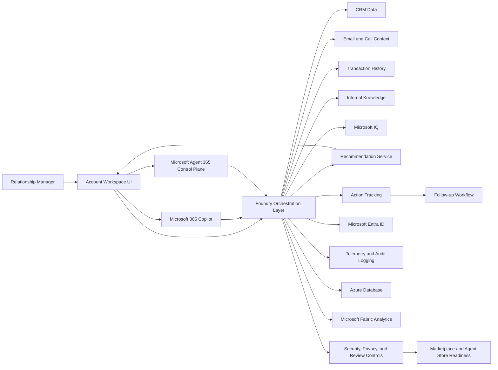

# Architecture draft: Relationship Manager for FSI

## Proposed MVP solution approach
A lightweight first-slice experience can be delivered as a scenario-specific account workspace that combines approved enterprise data with an evidence-backed recommendation layer. The experience should present a single account view, highlight priority actions, and keep the user in control through explainable guidance and human review before any action is taken.

### Recommended MVP shape
- The experience starts with one primary workflow: preparing for a customer conversation.
- The account view shows a concise summary, the most relevant signals, the evidence behind the recommendation, and a clear next action.
- Recommendations are framed as assistive suggestions rather than hidden automation.
- The first release uses a small set of approved data sources and a curated or mocked data set for workshop validation, with real connectors added later.

## Recommended Microsoft platform fit
For the first MVP, the stack should stay simple and purposeful rather than introducing every possible platform capability at once.
- Microsoft Foundry is the most natural place to host the orchestration, grounding, and prompt workflow for evidence-backed recommendations.
- Microsoft 365 Copilot can provide an optional entry point for summarization and follow-up drafting inside the user’s existing workflow.
- Microsoft Agent 365 Control Plane is appropriate if the team wants a more explicit agent control and policy layer for role-based assistance, follow-up actions, and guided task execution.
- Microsoft Entra ID should be the standard identity and access control layer for the experience and its connected services.
- Microsoft Fabric is a good fit for later analytics, reporting, and trend review, but it can remain optional in the first slice if the team wants to keep deployment lightweight.
- Microsoft IQ can be used as a signal-enrichment layer to improve account context ranking, relationship insights, and prioritization quality when available.
- Azure Databases should be used for any minimal structured state such as workflow metadata, reviewed recommendations, or task history once the solution moves beyond a purely demo-oriented setup.

## Core services
- Experience layer: account workspace, summary view, and recommended next actions for the relationship manager.
- Orchestration service: coordinates data retrieval, grounding, recommendation generation, response formatting, and confidence labeling.
- Insight and recommendation service: identifies risks, growth signals, and next-best actions based on visible evidence.
- Retrieval and grounding layer: connects approved data sources and surfaces cited evidence supporting each recommendation.
- Action tracking service: records follow-up tasks, recommended next steps, and completion status for the user workflow.
- Governance and observability layer: manages logging, auditability, permission checks, and reviewability for workshop stakeholders.

## Data sources and integration points
- CRM system: customer and account profile data, relationship history, and account ownership context.
- Email and call context: recent communications, notes, and engagement signals.
- Transaction history: account activity, product holdings, and recent financial behavior.
- Internal knowledge sources: policy documents, playbooks, internal guidance, and approved reference content.
- Identity and permissions service: ensures the right users and reviewers can access the right data.
- Workflow integration: links recommended actions to follow-up tasks, task tracking, or downstream business processes.
- Optional Microsoft 365 Copilot integration: can summarize account context and draft follow-up content when the user explicitly requests it.
- Optional Microsoft Agent 365 Control Plane integration: can enforce agent lifecycle policies, tool governance, and agent routing controls.
- Optional Microsoft Fabric integration: can be used later for reporting, insight trend review, and adoption analysis.
- Optional Microsoft IQ integration: can enrich relationship signals and improve recommendation relevance.
- Optional Azure Databases integration: can store structured workflow state, reviewed recommendations, and task history for a more production-like experience.

## Major tradeoffs
- Human-in-the-loop vs. automation: keep recommendations explainable and reviewable in the first slice rather than automating sensitive actions too early.
- Breadth vs. depth: prioritize one concise, high-value experience over a broad multi-scenario experience.
- Speed vs. completeness: use a small set of approved data sources first, then expand after stakeholder feedback.
- Custom implementation vs. managed platform services: start with a simple hosted experience and managed identity and telemetry patterns instead of overbuilding a custom distributed platform.

## Architecture notes for the first MVP
- Keep the user experience simple and task-focused.
- Treat recommendations as evidence-backed suggestions, not hidden automation.
- Make the reasoning visible so risk and compliance reviewers can trust the output.
- Design the first slice for workshop reviewability and early validation, not full production scale.
- Preserve a clear human review path for any action that could affect a customer relationship.
- Use explicit confidence labels and safe fallback behavior when data is incomplete or low quality.

## Cloud architecture notes for the first MVP
- Use a modular cloud design with clear boundaries between experience, orchestration, data retrieval, and follow-up workflows.
- Keep stateful and stateless services separate so the orchestration layer can scale independently from storage and analytics components.
- Use managed identity, managed secrets, and managed observability services to reduce operational overhead in early releases.
- Introduce Microsoft Fabric and Microsoft IQ as optional capabilities behind feature flags so the first slice remains lightweight.
- Treat Microsoft 365 Copilot and Microsoft Agent 365 Control Plane as channel and governance surfaces that consume shared orchestration APIs.

## Security review and implementation follow-up
The current draft is directionally strong, but implementation should not begin until a few controls are explicitly defined.

### Key security risks
- Data overexposure: the system could expose more customer or account detail than necessary for the task.
- Weak evidence grounding: recommendations may appear authoritative without visible sources or confidence labeling.
- Unauthorized access: the experience may allow users to view data outside their approved business context.
- Prompt or content injection risk: untrusted knowledge sources or user input could influence the recommendation logic in unsafe ways.
- Insufficient auditability: follow-up actions may not be traceable for compliance or review purposes.

### Follow-up actions before implementation
- Define a data classification and minimization policy for the workshop scenario.
- Enforce least-privilege access with Microsoft Entra ID and role-based permissions.
- Restrict the solution to approved data sources and approved fields only.
- Add a clear review and override path for users before any operational action is taken.
- Store audit data for recommendation review, user decisions, and follow-up outcomes.
- Validate that no production credentials, personal data, secrets, or customer-sensitive content are included in the sample environment.
- Add content safety and grounding checks so generated summaries or recommendations do not fabricate evidence.

## Deployment and operations considerations
- Deployment: use a lightweight hosted experience with clearly scoped data access for the workshop environment.
- Security: avoid production credentials, personal data, customer secrets, and sensitive content; enforce least-privilege access and role-based permissions.
- Operations: log recommendation activity, maintain review trails, and define clear ownership for monitoring and follow-up.
- Reliability: support graceful fallback when a data source is unavailable and keep the user experience understandable under partial failure.
- Support model: document support ownership, escalation paths, known limitations, and how the user should report issues.

## Well-architected review and Microsoft Cloud Adoption Framework alignment
The first MVP should align to Microsoft Cloud Adoption Framework guidance by focusing on a secure, governed, and easy-to-operate foundation rather than a broad platform expansion.

### Reliability
- Add graceful degradation when a connector is unavailable or returns partial data.
- Define retry and timeout behavior for data retrieval and recommendation requests.
- Keep a clear fallback experience when a recommendation cannot be produced confidently.

### Security
- Use Microsoft Entra ID for identity and access control.
- Apply least privilege to app registrations, API scopes, and data access connectors.
- Protect secrets in Key Vault or equivalent managed secret storage.
- Apply data loss prevention and content filtering where relevant.
- Ensure the agent or assistant cannot expose data outside the current user context.

### Operational excellence
- Add telemetry for page load latency, data retrieval failures, recommendation confidence, and user review outcomes.
- Define an ownership model for support, monitoring, and incident response.
- Keep deployment simple with repeatable configuration and documented rollback steps.

### Performance efficiency
- Retrieve only the data necessary for the current account view.
- Use caching for static or frequently reused context where appropriate.
- Optimize for fast response times during live customer preparation workflows.

### Cost optimization
- Keep the first MVP rules-based or lightly assisted rather than heavy-model or compute-intensive.
- Use managed services and small-scale hosting to avoid unnecessary cost at early stages.
- Avoid overprovisioning infrastructure when the scope is a workshop or pilot experience.

## Marketplace and Microsoft 365 Copilot Agent Store readiness
The solution should be treated as two related products for publication planning: an Azure-based offering and a Microsoft 365 Copilot experience.

### Packaging and distribution requirements
- Azure-based deployment: package the solution as a managed application or supported Azure deployment artifact with clear configuration, identity, and dependency documentation.
- Microsoft 365 experience: package the agent or experience with its name, description, instructions, icons, screenshots, and supported tenant settings.
- For the first MVP, a workshop or pilot package is sufficient, but the package should still be structured so it can later be submitted through Partner Center or the Microsoft 365 agent publishing path.

### Metadata and listing requirements
- Clear product title and short description that explain the scenario and value.
- Customer-facing summary, audience, key capabilities, screenshots, and support information.
- Privacy, compliance, accessibility, and Responsible AI disclosures.
- Publisher identity, versioning, support contact, and terms of use.

### Support expectations
- Publicly document support channels, response expectations, and known limitations.
- Include onboarding steps, deployment notes, and troubleshooting guidance.
- Define who owns incident escalation and update communications.

### User experience and technical integration requirements
- The experience should support single sign-on and tenant-aware access.
- The agent or experience should clearly show citations or evidence for recommendations.
- The user should be able to review, override, or reject a suggested action before it is acted on.
- The experience should include feedback capture for trust, usefulness, and recommendation quality.
- The solution should support clear human escalation for low-confidence or high-impact suggestions.
- Integration guidance should define which capabilities are required for baseline readiness (Foundry, Entra ID, and core data connectors) and which are optional for phase two (Fabric, Microsoft IQ, and advanced agent governance via Agent 365 Control Plane).

## Architecture diagram

Rendered image: [Relationship Manager for FSI Architecture.jpg](Relationship%20Manager%20for%20FSI%20Architecture.jpg)

## Summary
The proposed MVP is practical for workshop use and is well aligned to a human-review-first experience. The main gaps to resolve before implementation are access control, evidence grounding, auditability, deployment ownership, and publication packaging. If those controls are defined early, the solution can evolve from a workshop demo into a more enterprise-ready product without changing the core user experience.
