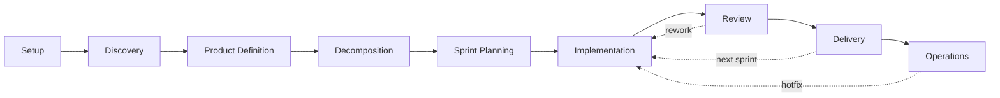

## Overview

HVE Core supports a 9-stage project lifecycle, from initial setup through ongoing operations, with AI-assisted tooling at each stage. Every stage maps to specific agents, prompts, instructions, and skills that accelerate your work and reduce friction. Use this guide to navigate the full lifecycle and find the right tools for your current project phase.

## Stage Overview

| Stage   | Name               | Key Tools                                                                                       | Guide                                       |
|---------|--------------------|-------------------------------------------------------------------------------------------------|---------------------------------------------|
| Stage 1 | Setup              | hve-core-installer (skill), git-setup                                                           | [Setup](setup.md)                           |
| Stage 2 | Discovery          | rpi-research, brd-builder, security-planner, sssc-planner, rai-planner                          | [Discovery](discovery.md)                   |
| Stage 3 | Product Definition | prd-builder, product-manager-advisor, adr-creation, security-planner, sssc-planner, rai-planner | [Product Definition](product-definition.md) |
| Stage 4 | Decomposition      | ado-prd-to-wit, github-backlog-manager                                                          | [Decomposition](decomposition.md)           |
| Stage 5 | Sprint Planning    | github-backlog-manager, agile-coach                                                             | [Sprint Planning](sprint-planning.md)       |
| Stage 6 | Implementation     | RPI Agent, rpi-plan, rpi-implement, hve-builder                                                 | [Implementation](implementation.md)         |
| Stage 7 | Review             | rpi-review, code-review, hve-builder                                                            | [Review](review.md)                         |
| Stage 8 | Delivery           | git-merge, ado-get-build-info                                                                   | [Delivery](delivery.md)                     |
| Stage 9 | Operations         | documentation, hve-builder, incident-response                                                   | [Operations](operations.md)                 |

## Where Are You?

Use this navigator to jump directly to the stage matching your current need.

| I want to...                                   | Start Here                                           |
|------------------------------------------------|------------------------------------------------------|
| Set up HVE Core for the first time             | [Stage 1: Setup](setup.md)                           |
| Understand requirements or research a topic    | [Stage 2: Discovery](discovery.md)                   |
| Create a product spec or architecture decision | [Stage 3: Product Definition](product-definition.md) |
| Break work into tasks or work items            | [Stage 4: Decomposition](decomposition.md)           |
| Plan a sprint or manage my backlog             | [Stage 5: Sprint Planning](sprint-planning.md)       |
| Write code, build features, or create content  | [Stage 6: Implementation](implementation.md)         |
| Review code or get PR feedback                 | [Stage 7: Review](review.md)                         |
| Merge, release, or deploy                      | [Stage 8: Delivery](delivery.md)                     |
| Monitor, maintain, or respond to incidents     | [Stage 9: Operations](operations.md)                 |

## Lifecycle Flow

> [!TIP]
> [Design Thinking](../../design-thinking/using-together.md) can feed into this lifecycle at three exit points. See the [DT-RPI integration guide](../../design-thinking/dt-rpi-integration.md) for details.

## Stage Transition Rules

1. Design Thinking Exit 1 to Stage 2: Problem statement complete (Methods 1-3) feeds `rpi-research` in Discovery
2. Design Thinking Exit 2 to Stage 2: Validated concept (Methods 4-6) feeds `rpi-research` in Discovery
3. Design Thinking Exit 3 to Stage 2: Implementation spec (Methods 7-9) feeds `rpi-research` in Discovery
4. Stage 1 to Stage 2: Installation complete
5. Stage 2 to Stage 3: BRD complete, handoff at `docs/project-planning/`
6. Stage 2 to Stage 4: TPMs skip PRD when BRD is sufficient
7. Stage 3 to Stage 4: PRD and ADRs finalized
8. Stage 4 to Stage 5: Work items created
9. Stage 5 to Stage 6: Sprint planned
10. Stage 6 to Stage 7: Implementation complete, `/clear` context
11. Stage 7 to Stage 8: PR approved
12. Stage 7 to Stage 6: Rework needed
13. Stage 8 to Stage 6: Next sprint
14. Stage 8 to Stage 9: Final sprint complete
15. Stage 9 to Stage 6: Hotfix needed

## Coverage Notes

Implementation has the broadest tooling surface because it combines RPI,
language standards, AI-artifact authoring, data science, and infrastructure
work. Delivery relies mainly on prompts and auto-applied instructions, while
Setup remains intentionally narrow.

Each stage page follows a consistent structure covering purpose, key
activities, AI-assisted workflow, and cross-references. This format lets you
navigate directly to the stage relevant to your current work and find both
manual checklists and current workflow entry points.

## Next Steps

> [!TIP]
> Find your role-specific guide at [Role Guides](../roles/) to see which stages matter most for your work.

<!-- markdownlint-disable MD036 -->
*🤖 Crafted with precision by ✨Copilot following brilliant human instruction,
then carefully refined by our team of discerning human reviewers.*
<!-- markdownlint-enable MD036 -->
