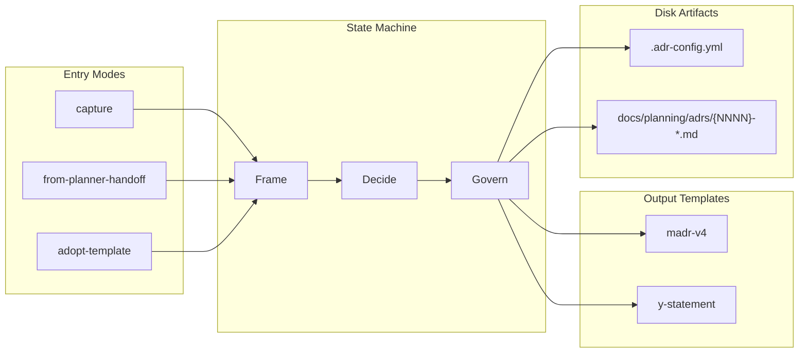

## Context

The hve-core repository ships peer planning agents (Security Planner, RAI
Planner, SSSC Planner) that share a common identity contract: a phased state
machine, a persisted `state.json`, a six-step per-turn protocol, and a
Govern-phase autonomy-tier prompt. Architecture Decision Record authoring
needed a comparable agent so contributors and downstream extension consumers
could capture decisions in a standards-aligned way without inventing a new
workflow per repository. How should the ADR Creator be shaped so it (a)
matches peer-planner ergonomics, (b) preserves verbatim upstream MADR v4.0.0
(CC0) and Y-Statement text, (c) supports both interactive authoring and
inbound handoff from other planners, and (d) lets projects bring their own
ADR templates without forking the agent?

> Source: `docs/planning/adrs/inputs.md`, peer-planner pattern alignment requirements and Frame-phase scope statement.
> Source: `scripts/linting/schemas/adr-frontmatter.schema.json`, frontmatter contract and ASR-trigger enum closure.
> Source: MADR v4.0.0 upstream template (CC0-1.0) at [adr.github.io/madr](https://adr.github.io/madr/), verbatim section fidelity requirement.

## Decision Drivers

* Standards fidelity + disclaimer
* Peer-planner consistency
* Thin-orchestrator maintainability
* BYO template support
* Coaching quality (load-before-act)
* Lateral handoff to peer planners
* Testability (validators + fuzz)
* Cross-language validator integration

## Considered Options

* Option A: Adopt three-phase ADR Creator with `capture`/`from-planner-handoff`/`adopt-template` entry modes and per-Govern autonomy tiers.
* Option B: Single-prompt, single-template ADR generator (one `.prompt.md` that emits a MADR v4 ADR in one shot).
* Option C: Per-template specialized agents (separate agents for MADR v4, Y-Statement, and adopt-template, with no shared identity).
* Option D: Defer entirely; let peer planners (Security, RAI, SSSC) emit ADR-shaped artifacts inline with no central authority.

## Decision Outcome

| Decision driver                      | Option A | Option B | Option C | Option D |
|--------------------------------------|----------|----------|----------|----------|
| Standards fidelity + disclaimer      | Yes      | No       | Partial  | No       |
| Peer-planner consistency             | Yes      | No       | No       | Trap     |
| Thin-orchestrator maintainability    | Yes      | No       | Partial  | No       |
| BYO template support                 | Yes      | No       | Partial  | No       |
| Coaching quality (load-before-act)   | Yes      | Partial  | No       | Partial  |
| Lateral handoff to peer planners     | Yes      | No       | Partial  | Partial  |
| Testability (validators + fuzz)      | Yes      | No       | Yes      | Partial  |
| Cross-language validator integration | Yes      | No       | Partial  | Partial  |

Chosen option: **"Option A: Adopt three-phase ADR Creator with `capture`/`from-planner-handoff`/`adopt-template` entry modes and per-Govern autonomy tiers"**,
because it is the only option that satisfies all eight decision drivers and all Frame-phase constraints.
Option B fails peer-planner consistency, thin-orchestrator maintainability, testability, and cross-language validator integration outright.
Option C breaks peer-planner location convention and the load-before-act coaching contract.
Option D presents false initial consistency that diverges quickly because the ADR domain (lineage, supersession, ASR triggers) is not the security domain, and copy-paste maintenance across forked planners contradicts the maintainability driver.

### Consequences

* Good, because peer-planner pattern reuse: contributors who already know Security/RAI/SSSC planners can read the ADR Creator with no new mental model.
* Good, because MADR v4 and Y-Statement text live in a single source of truth (`adr-standards.instructions.md`); standards updates touch one file.
* Good, because the lineage allocator (`scripts/update_lineage.py`) is the only writer of `last_decision_id`, so cross-project supersession is structurally impossible (HARD-FAIL rule).
* Good, because the BYO `adopt-template` mode lets downstream consumers bring existing ADR conventions without forking the agent.
* Good, because frontmatter validation (`scripts/validate_frontmatter.py`) catches enum and schema drift in CI before commit.
* Good, because ADR frontmatter and `.adr-config.yml` are validated by both the Python `adr-author` toolchain (under `validate:skills`) and the existing PowerShell linter (`npm run lint:frontmatter`) against shared JSON Schemas, so contract drift is caught regardless of which CI surface runs first.
* Good, because the registry-driven `Validate-AdrConsistency.ps1` check turns the Govern gate into a machine-checkable contract:
  standing defect classes (affected-components mirror, success-criteria source resolution, state-placeholder resolution,
  peer-planner naming, drivers and matrix cardinality, risks and consequences pairing, numeric-claim generalization,
  driver-to-trigger map completeness, affected-components citation) are detected pre-commit with stable rule IDs,
  removing reviewer drift checks for those classes.
* Bad, because the initial surface area is higher than alternatives: four instruction files, one skill, multiple scripts, multiple templates. New contributors must learn the dispatch tables before editing.
* Bad, because two validator implementations of the same JSON Schema must stay behavior-aligned; a schema change requires regression coverage on both the Python and PowerShell sides.
* Bad, because Govern is the only writer of ADR files; users cannot quickly draft an ADR file without going through Frame and Decide. Friction for trivial decisions is mitigated but not eliminated by the `y-statement` template.
* Bad, because peer-planner pattern alignment must be preserved over time: if Security/RAI/SSSC change their identity contracts, the ADR Creator must follow.
* Bad, because three entry modes increase test surface (`capture`, `from-planner-handoff`, and `adopt-template` each need integration coverage).
* Bad, because closed enums (status, ASR triggers) require an ADR-revision process to extend; this is intentional but is a real cost when a legitimate new value appears.
* Neutral, because the autonomy-tier prompt fires only at Govern entry; Frame and Decide always run interactively. Users wanting fully unattended drafting cannot get it for those phases, by design.
* Neutral, because diagram format is read-only after Frame; switching formats mid-session requires a new session.
* Neutral, because Y-Statement and MADR v4 are the only two output templates; other industry formats (e.g., Nygard's lightweight ADR) are not first-class but can be expressed via `adopt-template`.

### Confirmation

Compliance with this decision is confirmed by four mechanisms:

1. Static validation: `npm run lint:all` runs frontmatter, schema, applyTo-glob, and copyright checks across the agent body, four instruction files, the skill, templates, and scripts.
2. Skill test suite: `npm run test:py -- adr-author` runs the 40-test pytest suite covering Frame/Decide/Govern phase contracts, lineage allocation, supersession atomicity, and frontmatter validation.
3. Plugin generation: `npm run plugin:generate` regenerates the `project-planning` plugin from `collections/project-planning.collection.yml`; drift between the agent body and the collection manifest fails this step.
4. Self-validation: this ADR itself was produced by the ADR Creator under `entryMode: capture`, `outputTemplate: madr-v4`, `diagramFormat: mermaid`, and `autonomyTier: full`, exercising every Frame and Decide gate plus the Govern allocator and frontmatter validator end-to-end.

## Pros and Cons of the Options

### Option A

* Good, because matches Security/RAI/SSSC planner ergonomics: same six-step protocol, same Govern-entry autonomy prompt, same `state.json` shape.
* Good, because the four-file instruction split (`adr-identity`, `adr-standards`, `adr-byo-template`, `adr-handoff`) keeps the agent body as a thin dispatch table.
* Good, because verbatim MADR v4.0.0 and Y-Statement text are isolated to `adr-standards.instructions.md`, with hve-core extensions applied via a separate frontmatter overlay (no upstream modification).
* Good, because `adopt-template` mode supports projects with pre-existing ADR conventions through a normalize → derive-questions → fill lifecycle and a committed `.adr-config.yml`.
* Good, because the lineage allocator script is the single writer of `last_decision_id`, making same-project single-parent supersession structurally enforceable.
* Neutral, because the `from-planner-handoff` entry mode requires upstream planners to produce a compact summary in the agreed format; this is documented in `adr-handoff.instructions.md` but adds a coupling point.
* Bad, because surface area is higher than the alternatives; onboarding cost for new contributors is real.

### Option B

* Good, because trivially small surface area: one `.prompt.md`, no state file, no scripts.
* Good, because new contributors can author an ADR in one shot.
* Bad, because no enforcement of MADR v4 verbatim text: the prompt would inline it, creating drift risk.
* Bad, because no lineage authority; supersession is convention-only and easily violated.
* Bad, because no Y-Statement support, no `adopt-template` mode, no `from-planner-handoff` mode.
* Bad, because no autonomy gating: writes happen on first generation, which conflicts with the Govern-only-writes constraint.

### Option C

* Good, because each agent can optimize for its specific output shape.
* Bad, because three agents duplicate identity logic (state machine, six-step protocol, Govern autonomy prompt), exactly the maintenance trap the thin-orchestrator driver names.
* Bad, because no shared `state.json` schema; resuming a session requires knowing which agent owned it.
* Bad, because MADR v4 text and Y-Statement formula end up duplicated across agents, creating drift risk identical to Option B.
* Neutral, because contributors writing one ADR shape can ignore the others; cognitive load per session is similar to Option A.

### Option D

* Good, because zero new agent surface to maintain.
* Bad, because no central ADR authority; each peer planner reinvents lineage, frontmatter, and supersession.
* Bad, because no support for ADRs that originate outside Security/RAI/SSSC scope (e.g., pure architecture or tooling decisions).
* Bad, because contradicts the Frame scope statement, which calls for a dedicated ADR authoring agent.

## Architecture

## Risks and Mitigations

* Risk: high initial surface area (four instruction files, one skill, multiple scripts and templates) raises onboarding cost. Mitigation: agent body acts as a thin dispatch table linking to each instruction file, and the skill `SKILL.md` is anchored per phase so contributors load only what they need.
* Risk: peer-planner identity-contract drift breaks parity. Mitigation: shared reviewers cover Security, RAI, SSSC, and ADR Creator workflows; static checks compare six-step protocol and Govern autonomy-tier shapes across agents.
* Risk: upstream MADR v4 evolves and verbatim blocks fall out of date. Mitigation: pinned CC0 text lives in a single instruction file and is covered by a verbatim-fidelity test that fails on any diff.
* Risk: closed enums (status, ASR triggers) reject legitimate new values. Mitigation: extension requires a superseding ADR; friction is intentional and the path is documented in `adr-standards.instructions.md`.
* Risk: `adopt-template` mode imports a malformed template and corrupts a project's ADR space. Mitigation: normalize step rejects templates that fail schema validation before any file is written; `.adr-config.yml` is committed and reviewable.
* Risk: `lint:adr-consistency` is not yet chained from `npm run lint:all`, so the registry-driven Govern gate runs only when invoked directly. Mitigation: tracked under the adr-creator-quality-guardrails plan, Phase 6 Step 6.1; the Pester suite already covers all nine rules and runs under `npm run test:ps`.

## Rollback / Exit Strategy

If this decision is reversed, the rollback path is:

1. Restore the prior single-prompt ADR generator from git history (last commit before this ADR's `accepted_date`).
2. Remove `.github/agents/project-planning/adr-creation.agent.md`, the four `adr-*.instructions.md` files, and `.github/skills/project-planning/adr-author/`.
3. Delete `.copilot-tracking/adr-plans/` session state directories; preserve all `docs/planning/adrs/` ADR files (decisions remain valid even when the authoring agent is retired).
4. Update `collections/project-planning.collection.yml` to drop the planner artifacts and re-run `npm run plugin:generate`.
5. Document the deprecation in a superseding ADR that links back to this one and sets `superseded-by` here.

No data migration is required: ADRs are markdown files with stable frontmatter and survive removal of the authoring agent.

## Affected Components

* .github/agents/project-planning/adr-creation.agent.md
* .github/instructions/project-planning/adr-identity.instructions.md
* .github/instructions/project-planning/adr-standards.instructions.md
* .github/instructions/project-planning/adr-byo-template.instructions.md
* .github/instructions/project-planning/adr-handoff.instructions.md
* .github/instructions/shared/disclaimer-language.instructions.md
* .github/skills/project-planning/adr-author/SKILL.md
* scripts/linting/schemas/adr-frontmatter.schema.json
* scripts/linting/schemas/adr-config.schema.json
* scripts/linting/schemas/adr-consistency-rules.schema.json
* scripts/linting/schemas/schema-mapping.json
* scripts/linting/Modules/FrontmatterValidation.psm1
* scripts/linting/Validate-MarkdownFrontmatter.ps1
* scripts/linting/Validate-AdrConsistency.ps1
* scripts/linting/Modules/AdrConsistency.psm1
* scripts/linting/Modules/AdrBodyParser.psm1
* scripts/linting/rules/adr-consistency-rules.json
* scripts/tests/linting/AdrConsistency.Tests.ps1
* docs/planning/adrs/.adr-config.yml

## More Information

* Plan: `.copilot-tracking/plans/2026-05-05/adr-mode-autonomy-alignment-plan.instructions.md`
* Implementation log: `.copilot-tracking/changes/2026-05-05/adr-mode-autonomy-alignment-changes.md`
* Review log: `.copilot-tracking/reviews/2026-05-06/adr-mode-autonomy-alignment-plan-review.md`
* Agent body: `.github/agents/project-planning/adr-creation.agent.md`
* Identity contract: `.github/instructions/project-planning/adr-identity.instructions.md`
* Standards: `.github/instructions/project-planning/adr-standards.instructions.md`
* BYO template contract: `.github/instructions/project-planning/adr-byo-template.instructions.md`
* Handoff protocol: `.github/instructions/project-planning/adr-handoff.instructions.md`
* Disclaimer language: `.github/instructions/shared/disclaimer-language.instructions.md`
* Skill: `.github/skills/project-planning/adr-author/SKILL.md`
* Project ADR configuration: `docs/planning/adrs/.adr-config.yml`
* Frontmatter and consistency schemas: `scripts/linting/schemas/adr-frontmatter.schema.json`, `scripts/linting/schemas/adr-config.schema.json`, `scripts/linting/schemas/adr-consistency-rules.schema.json`, routed via `scripts/linting/schemas/schema-mapping.json`.
* PowerShell frontmatter validation: `scripts/linting/Validate-MarkdownFrontmatter.ps1` consumes the shared schemas through `scripts/linting/Modules/FrontmatterValidation.psm1`.
* Consistency validator: `scripts/linting/Validate-AdrConsistency.ps1`, driven by `scripts/linting/rules/adr-consistency-rules.json`, implemented in `scripts/linting/Modules/AdrConsistency.psm1` plus `scripts/linting/Modules/AdrBodyParser.psm1`, with Pester coverage in `scripts/tests/linting/AdrConsistency.Tests.ps1`.

This decision should be re-visited if any of the following occur: peer planners (Security, RAI, SSSC) materially change their identity contract; the MADR project releases v5 with breaking changes; OSS license terms for MADR shift away from CC0; or contributor feedback shows the four-file split is harming maintainability rather than helping it.

🤖 Crafted with precision by ✨Copilot following brilliant human instruction, then carefully refined by our team of discerning human reviewers.
