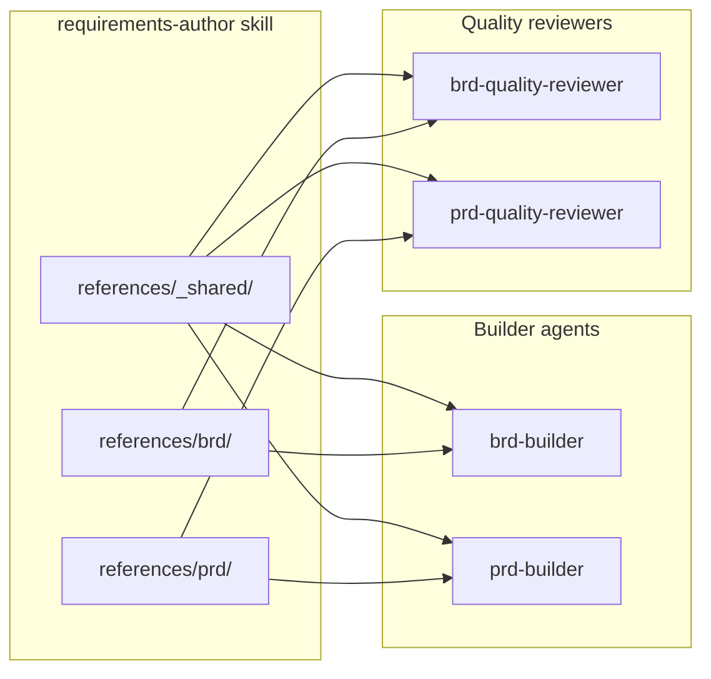

## Context

BRD and PRD authoring in hve-core is split across two builder agents
(`.github/agents/project-planning/brd-builder.agent.md` and
`.github/agents/project-planning/prd-builder.agent.md`) and two structurally
near-identical quality reviewers
(`.github/agents/project-planning/subagents/brd-quality-reviewer.agent.md` and
`.github/agents/project-planning/subagents/prd-quality-reviewer.agent.md`). The
BRD Builder already delegates its state tracking, resume/recovery, reference
integration, and question-strategy protocols to the `requirements-author` skill
(renamed from `brd-author`). The PRD Builder still inlines those same
protocols. The two quality reviewers share one 4-step algorithm and one
dual-emission contract (`*_STANDARD_FINDINGS_V1` + `*_QUALITY_REPORT_V1`),
differing only in taxonomy.

That asymmetry is a standing drift risk: a fix to a shared protocol or rubric
must today be applied in two places and kept in sync by hand, and a missed
update silently diverges BRD and PRD behavior. At the same time, BRD and PRD
are not interchangeable: they intentionally use different non-functional
requirement (NFR) taxonomies (BRD uses ISO 25010; PRD uses NIST 800-160,
recorded as DD-02), so the goal is not to merge everything into one document
model. The decision is how to single-source the genuinely shared authoring and
review rigor while keeping document-type divergence deliberate and isolated.

> Source: `docs/planning/prds/requirements-author-skill-prd.md` (DD-002, GOAL-001/002/003).
> Source: `docs/planning/prds/prd-builder-agent-prd.md` (PRD Builder inlined-protocol asymmetry).

## Decision Drivers

* Single source of truth
* Shared rigor
* Isolation
* Reduce quality-reviewer duplication
* Remove builder asymmetry

Single source of truth eliminates the PRD Builder's inline template/protocol
drift by giving both builders one authoritative skill. Shared rigor lets both
documents inherit one ID schema, traceability model, and quality rubric, and
binds the author and reviewer sides to the same producer/consumer contract.
Isolation is a hard requirement, not a preference: BRD-only and PRD-only
concerns must stay in `references/brd/` and `references/prd/`, and the shared
`references/_shared/` core must never carry document-type-specific content.
Reduce quality-reviewer duplication collapses the two structurally identical
reviewers onto one shared rubric so a protocol fix lands once. Remove builder
asymmetry brings the PRD Builder's inlined state/recovery/reference protocols
into the skill that the BRD Builder already delegates to.

## Considered Options

Three options were weighed against the five drivers. Option A generalizes the
one skill that already exists, Option B splits the surface into two skills over
a shared core library, and Option C is the pre-change baseline.

* Option A: Generalize the existing `requirements-author` skill in place (one skill with `references/_shared/` + `references/brd/` + `references/prd/`, bound by both builders and both reviewers, with per-type overrides in the type subfolders).
* Option B: Two skills with a shared core library (separate `brd-author` and `prd-author` skills, each importing a common `_shared/` package).
* Option C: Status quo (BRD delegates to the skill, PRD keeps protocols inlined, the two reviewers stay separate, and synchronization is by hand).

## Decision Outcome

The matrix scores each option against the five drivers. "Yes" means the option
satisfies the driver directly and as a first-class capability; "Partial" means
it addresses the driver only for a subset of cases or at added cost; and "No"
means the driver is unmet. Only Option A scores "Yes" across the board.

| Decision driver                     | Option A (generalize in place) | Option B (two skills + shared core)  | Option C (status quo) |
|-------------------------------------|--------------------------------|--------------------------------------|-----------------------|
| Single source of truth              | Yes                            | Partial (two skills to keep aligned) | No                    |
| Shared rigor                        | Yes                            | Partial                              | No                    |
| Isolation                           | Yes                            | Yes                                  | Partial               |
| Reduce quality-reviewer duplication | Yes                            | Partial                              | No                    |
| Remove builder asymmetry            | Yes                            | Yes                                  | No                    |

Chosen option: **"Option A: Generalize the existing `requirements-author`
skill in place"**, because it is the only option that satisfies the hard
isolation requirement while delivering single-source rigor and collapsing
reviewer duplication without standing up a cross-skill dependency mechanism the
repository does not otherwise use. Option B achieves isolation but reintroduces
the very synchronization problem this decision exists to remove (two skills
plus a shared package, all kept aligned by hand) and adds an import mechanism
with no precedent in the repo. Option C leaves the PRD Builder inlined and the
reviewers separate, which is exactly the drift surface being closed.

**Y-statement:**

> In the context of BRD and PRD authoring, facing protocol drift and
> structurally duplicated quality reviewers, we chose to **generalize the
> existing `requirements-author` skill in place** (a `references/_shared/` core
> plus per-type `references/brd/` and `references/prd/` overrides) to gain
> single-source rigor, a shared ID/traceability/quality contract, and one place
> to fix reviewer logic, accepting the cost of one larger skill and the ongoing
> discipline of enforcing BRD↔PRD isolation, instead of two-skills-with-shared-core
> (Option B) or the status quo (Option C).

### Consequences

Generalizing the skill in place trades a larger single skill and a maintained
isolation invariant for the removal of cross-builder and cross-reviewer
duplication. The good outcomes accrue to artifact authors and reviewers; the
costs land on skill navigation and on enforcing isolation; the neutral items
reflect mechanical follow-on work that this decision authorizes but does not
itself perform.

* Good, because the PRD Builder stops carrying inlined template/state/recovery protocols, resolving the builder asymmetry.
* Good, because one ID schema, traceability model, and quality rubric serve both documents, and a reviewer-logic fix lands once instead of twice.
* Good, because the intentional NFR-taxonomy divergence (ISO 25010 vs NIST 800-160) is preserved through per-type overrides, honoring DD-02.
* Bad, because the skill becomes larger and must be navigated by folder convention (`_shared/` vs `brd/` vs `prd/`).
* Bad, because isolation becomes a maintained invariant: leakage of BRD-only or PRD-only content into `references/_shared/`, or `brd/ → prd/` cross-links, must be actively prevented rather than assumed.
* Neutral, because the PRD Builder migration and the `brd-author → requirements-author` rename are mechanical follow-on work, not separate architecture decisions.

### Confirmation

Compliance with this decision is confirmed by the following checks:

1. A leakage scan confirms no BRD-only or PRD-only tokens appear in `references/_shared/` and no `references/brd/` file links into `references/prd/`. This scan is run manually today; promoting it to a `npm run lint:*` / CI gate is recommended Govern-phase follow-up so isolation is enforced rather than trusted.
2. Both builders and both quality reviewers reference only `references/_shared/` plus their own type subfolder.
3. `npm run lint:frontmatter` and `npm run lint:md-links` pass for the skill tree and the supporting PRD documents.

## Pros and Cons of the Options

### Option A: Generalize the existing skill in place

One `requirements-author` skill with a `references/_shared/` core and per-type
`references/brd/` and `references/prd/` overrides. Both builders and both
quality reviewers bind to it; document-type-specific material (for example, the
NFR taxonomy) lives only in the type subfolders.

* Good, because it gives both builders and both reviewers a single authoritative source for shared protocols and rubric.
* Good, because it preserves deliberate BRD/PRD divergence through per-type overrides instead of forcing a merge.
* Good, because it reuses the skill mechanism the repository already standardizes on, with no new cross-skill import machinery.
* Neutral, because it grows one skill and relies on folder convention for navigation.
* Bad, because isolation must be enforced as a maintained invariant rather than assumed.

### Option B: Two skills with a shared core library

Separate `brd-author` and `prd-author` skills that each import a common
`_shared/` package.

* Good, because BRD and PRD surfaces are physically separate, making isolation structurally obvious.
* Neutral, because the shared core still has to be authored once and consumed by both.
* Bad, because it reintroduces a two-place synchronization problem for everything outside the shared core, which is the drift this decision removes.
* Bad, because it requires a cross-skill import/dependency mechanism that has no precedent in the repository.

### Option C: Status quo

BRD delegates to the skill, PRD keeps its protocols inlined, and the two
reviewers remain separate, synchronized by hand.

* Good, because it requires no immediate work.
* Bad, because the PRD Builder's inlined protocols keep drifting from the BRD Builder's delegated ones.
* Bad, because reviewer fixes must be applied twice and kept in sync manually.
* Bad, because shared rigor depends entirely on author and reviewer diligence.

## Architecture

The generalized skill is organized as one shared core consumed by four
artifacts. `references/_shared/` holds cross-cutting protocols (ID schema,
traceability, quality rubric, stakeholder and prioritization methods);
`references/brd/` and `references/prd/` hold only document-type-specific
material, including the divergent NFR taxonomies. Both builder agents and both
quality reviewers bind to `_shared/` plus their own type subfolder and never to
the opposite type's subfolder.

## Risks and Mitigations

* Risk: BRD-only or PRD-only content leaks into `references/_shared/`, or a `brd/` file links into `prd/`, eroding the isolation the decision rests on. Mitigation: run the leakage scan on the skill tree and promote it to a `npm run lint:*` / CI gate as Govern follow-up so the build fails on leakage.
* Risk: a maintainer "helpfully" merges the BRD and PRD NFR taxonomies, collapsing the intentional DD-02 divergence. Mitigation: record DD-02 explicitly in the More Information section and keep the taxonomies in their type subfolders only.
* Risk: the single larger skill becomes harder to navigate. Mitigation: keep the `_shared/` vs `brd/` vs `prd/` folder convention strict so location signals scope.

## Rollback / Exit Strategy

If this decision is reversed, the rollback path is:

1. Split the `requirements-author` skill back into separate BRD and PRD skills (or re-inline the PRD Builder protocols), restoring the pre-decision layout.
2. Repoint the two builder agents and two quality reviewers at their separate sources.
3. Update any collection manifests that reference the skill and re-run `npm run plugin:generate`, `npm run extension:prepare`, and `npm run extension:prepare:prerelease`.
4. Document the reversal in a superseding ADR that links back to this one and sets `superseded-by` here.

No content migration is required beyond moving reference files; the BRD and PRD document models themselves are unchanged.

## Affected Components

* .github/skills/project-planning/requirements-author/
* .github/skills/project-planning/requirements-author/references/_shared/
* .github/skills/project-planning/requirements-author/references/brd/
* .github/skills/project-planning/requirements-author/references/prd/
* .github/agents/project-planning/brd-builder.agent.md
* .github/agents/project-planning/prd-builder.agent.md
* .github/agents/project-planning/subagents/brd-quality-reviewer.agent.md
* .github/agents/project-planning/subagents/prd-quality-reviewer.agent.md

## More Information

* Source PRD: `docs/planning/prds/requirements-author-skill-prd.md` (DD-002, GOAL-001/002/003)
* Supporting PRDs: `docs/planning/prds/prd-builder-agent-prd.md`, `docs/planning/prds/brd-builder-agent-prd.md`
* Shared core: `.github/skills/project-planning/requirements-author/references/_shared/`
* BRD NFR taxonomy: `.github/skills/project-planning/requirements-author/references/brd/iso-25010-nfr-taxonomy.md`
* PRD NFR taxonomy: `.github/skills/project-planning/requirements-author/references/prd/nist-800-160-nfr.md`

**DD-02: Intentional NFR-taxonomy divergence (do not merge).** The BRD and PRD
document types deliberately use different non-functional requirement taxonomies:
the BRD uses **ISO/IEC 25010** (product-quality model: functional suitability,
performance efficiency, compatibility, usability, reliability, security,
maintainability, portability) and the PRD uses **NIST SP 800-160**
(systems-security engineering trustworthiness characteristics). This is a
deliberate fit-for-purpose choice, not an oversight: the BRD frames quality as
business-facing product attributes for stakeholder agreement, while the PRD
frames non-functional concerns as engineering trustworthiness properties for
build planning. Because the two taxonomies serve different audiences and
lifecycle stages, they live exclusively in `references/brd/` and
`references/prd/` and must remain separate. **Future maintainers must not
consolidate, cross-reference, or "harmonize" these taxonomies into
`references/_shared/`.** Doing so would force one document type to adopt a
quality vocabulary that does not match its audience and would silently break the
isolation invariant this ADR depends on. If a genuinely shared quality concept
emerges, add it to `_shared/` only when it is correct for both document types
without taxonomy-specific framing; otherwise keep it type-local.

This decision should be re-visited if the BRD and PRD authoring surfaces
diverge enough that a single shared core no longer fits, if a cross-skill
dependency mechanism is adopted repository-wide (making Option B cheap), or if
the isolation invariant proves unenforceable in practice.

🤖 Crafted with precision by ✨Copilot following brilliant human instruction, then carefully refined by our team of discerning human reviewers.
