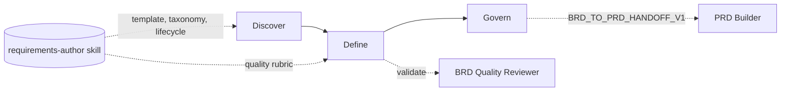

> **BRD-2026-Q2-BRD-BUILDER** | Status: approved | Version: 1.0.0 | Last Updated: 2026-06-14

## Executive Summary

The BRD Builder is an HVE-Core project-planning agent that produces high-quality Business Requirements Documents (BRDs) through a guided, multi-turn question-and-answer workflow. It transforms business needs and stakeholder intent into structured, traceable, and reviewable requirements artifacts, with state persistence that lets contributors pause and resume across conversations.

This BRD captures the business need for the BRD Builder as a product within the `project-planning` collection. The strategic driver is the `feat/brd-skills` initiative, which renames the former `brd-author` skill to the shared `requirements-author` skill and reorganizes its references into `_shared/`, `brd/`, and `prd/` groupings.
The BRD Builder already consumes this external skill for its template, taxonomy, traceability, and three-phase lifecycle (Discover → Define → Govern); the initiative makes that shared foundation the canonical home for requirements-authoring logic across both BRD and PRD agents.

The primary success metric is that the BRD Builder reliably produces standards-aligned BRDs that pass the embedded quality contracts (`BRD_STANDARD_FINDINGS_V1` and `BRD_QUALITY_REPORT_V1`) and can emit a clean `BRD_TO_PRD_HANDOFF_V1` payload to seed downstream PRD authoring. Secondary outcomes include a consistent requirement taxonomy (FR/AC/NFR/CON/BR) and traceability model shared with the PRD Builder.

Scope is limited to the BRD Builder agent, its quality and handoff contracts, and its integration with the `requirements-author` skill. It excludes downstream backlog tooling and the PRD Builder, which is covered by a sibling BRD.

---

## Business Context

HVE-Core ships AI agent customizations bundled into collections and distributed via plugins and a VS Code extension. The `project-planning` collection includes twin requirements agents (the BRD Builder and the PRD Builder) that share a guided Q&A architecture and session persistence.

The `feat/brd-skills` changeset renames `brd-author` to `requirements-author` and restructures references into `_shared/` (atomicity, MoSCoW, SMART, RACI, traceability, stakeholder analysis, and related cross-cutting guidance), `brd/` (BRD quality formats, findings/report contracts, ISO/IEC 25010 NFR taxonomy, ISO/IEC/IEEE 29148 quality attributes, ISTQB testability, and the BRD-to-PRD handoff), and `prd/` (new PRD assets).
The BRD Builder is the reference consumer of this skill: it already uses the external template and quality rubric, validates via the BRD Quality Reviewer subagent, and emits the handoff contract.

External constraints include the repository's authoring conventions (markdownlint, frontmatter schemas, collection/plugin/extension regeneration) and the CC BY 4.0 cite-only standards posture for skill content. The BRD Builder must keep its outputs and contracts aligned with the shared skill as that skill evolves to also serve the PRD Builder.

---

## Stakeholders

| Stakeholder                             | Role                                                                  | Power  | Interest | Engagement Strategy                                                       |
|-----------------------------------------|-----------------------------------------------------------------------|--------|----------|---------------------------------------------------------------------------|
| wberry (named sign-off authority)       | Accountable approver (DRI) for the Discover, Define, and Govern gates | High   | High     | Manage closely; final gate decision rests with this approver              |
| project-planning collection maintainers | Own the BRD/PRD agents and `requirements-author` skill                | High   | High     | Manage closely; collaborate on Define and Govern gate reviews             |
| Business analysts and product managers  | End users who run the BRD Builder to author BRDs                      | Medium | High     | Keep informed; validate UX continuity and quality-gate usefulness         |
| HVE-Core platform maintainers           | Own collections, plugin generation, and extension packaging           | High   | Medium   | Keep satisfied; ensure manifest/plugin/extension regeneration stays green |
| PRD Builder agent                       | Consumes `BRD_TO_PRD_HANDOFF_V1` to seed PRDs                         | Low    | High     | Keep informed; preserve handoff payload schema                            |
| BRD Quality Reviewer subagent           | Validates BRDs against the quality rubric                             | Medium | High     | Collaborate; keep findings/report contracts stable                        |

---

## Design Decisions

* `DD-001`: Treat the BRD Builder agent as the product under specification; the `requirements-author` skill is a shared dependency, not the product.
* `DD-002`: Scope this BRD to the BRD Builder only. The PRD Builder is specified in a sibling BRD to keep lineage and ownership clean.
* `DD-003`: Preserve the BRD Builder's three-phase lifecycle (Discover → Define → Govern) and its external-skill template strategy as continuity constraints.
* `DD-004`: Fully restate shared BRD/PRD requirements in this BRD (duplication) so it stands alone, accepting parallel maintenance with the sibling PRD Builder BRD in exchange for independent lineage, ownership, and review.

---

## Business Goals

BG-001: Ensure the BRD Builder produces standards-aligned BRDs that satisfy the shared quality contracts on the Define→Govern gate.
Priority: MUST
KPI: Generated BRDs pass `BRD_STANDARD_FINDINGS_V1` with no blocking findings and produce a `BRD_QUALITY_REPORT_V1` summary.

BG-002: Preserve the BRD Builder's guided three-phase user experience and resume/recovery reliability as the shared skill evolves.
Priority: MUST
KPI: Discover/Define/Govern phases and pause/resume behavior remain available with no regression.

BG-003: Maintain a consistent requirements taxonomy and a clean handoff to the PRD Builder.
Priority: SHOULD
KPI: BRDs use the FR/AC/NFR/CON/BR taxonomy and emit a valid `BRD_TO_PRD_HANDOFF_V1` payload.

**SMART Evaluation** (assessed at Define→Govern gate per `requirements-definition` skill):

* [x] **S**pecific: each goal names a concrete outcome: standards-aligned BRD output (BG-001), preserved three-phase UX and resume/recovery (BG-002), and a consistent taxonomy plus clean PRD handoff (BG-003).
* [x] **M**easurable: each goal carries a verifiable KPI: passing `BRD_STANDARD_FINDINGS_V1`/`BRD_QUALITY_REPORT_V1` with no blocking findings (BG-001), no phase or pause/resume regression (BG-002), and a valid `BRD_TO_PRD_HANDOFF_V1` payload using the FR/AC/NFR/CON/BR taxonomy (BG-003).
* [x] **A**chievable: the BRD Builder already uses the external template, quality rubric, and Quality Reviewer subagent, so the goals refine existing behavior rather than introducing new capabilities.
* [x] **R**elevant: all three goals directly serve the `feat/brd-skills` consolidation onto the shared `requirements-author` skill (DD-003 continuity window).
* [x] **T**ime-bound: target milestone 2026-06-30.

Status: graded (all five SMART criteria satisfied at the Define→Govern assessment; time-bound target 2026-06-30).

---

## Business Rules

* `BR-001`: BRD content MUST conform to repository markdown conventions and pass markdownlint and frontmatter validation. Category: operational. Rationale: all repo markdown is validated in CI. Enforceability: mandatory. Enforcing FRs: FR-004.
* `BR-002`: Shared skill content MUST remain original Microsoft content under CC BY 4.0, citing third-party standards by name only. Category: contractual/licensing. Rationale: repository licensing posture. Enforceability: mandatory. Enforcing FRs: FR-005 (the BRD Builder authors no standards prose itself; it sources template, taxonomy, and lifecycle from the CC BY 4.0 `requirements-author` skill, so the licensing posture is inherited through the sourcing requirement).
* `BR-003`: A BRD MUST pass the quality rubric before it advances to Govern and emits a handoff payload. Category: quality. Rationale: prevents low-quality requirements from seeding downstream work. Enforceability: mandatory. Enforcing FRs: FR-006, FR-007.

---

## Functional Requirements

FR-001: The BRD Builder guides users through the three-phase lifecycle (Discover → Define → Govern) to produce a complete BRD.
Actor: HVE-Core contributor authoring a BRD.
Trigger: User selects the BRD Builder agent and describes a business need.
Expected Outcome: A structured BRD is produced with all sections populated through iterative Q&A.
Acceptance Criteria: AC-001.
Business Goals: BG-002.

FR-002: The BRD Builder creates and maintains a session state file enabling pause and resume across conversations.
Actor: HVE-Core contributor.
Trigger: A BRD session begins or resumes.
Expected Outcome: State persists in `.copilot-tracking/brd-sessions/<name>.state.json`; the agent resumes from the last completed phase, including `phaseSkillsLoaded` tracking.
Acceptance Criteria: AC-002.
Business Goals: BG-002.

FR-003: The BRD Builder uses an emoji-based refinement-questions checklist with stable IDs to gather requirements without repetition.
Actor: HVE-Core contributor.
Trigger: The agent needs additional requirement detail.
Expected Outcome: Questions are tracked with ❓/✅/❌ and supporting indicators (🎯👥🔄📊⚡); answered items are not re-asked.
Acceptance Criteria: AC-003.
Business Goals: BG-002.

FR-004: The BRD Builder produces BRD documents that conform to repository markdown conventions (markdownlint-clean, no document-wide disable markers).
Actor: BRD Builder agent.
Trigger: BRD file creation or update at `docs/brds/<kebab-case-name>-brd.md`.
Expected Outcome: Output passes markdownlint and frontmatter validation.
Acceptance Criteria: AC-004.
Business Goals: BG-001.

FR-005: The BRD Builder sources its template, taxonomy, traceability model, and lifecycle from the shared `requirements-author` skill.
Actor: BRD Builder agent.
Trigger: BRD authoring and phase execution.
Expected Outcome: Template and lifecycle content load from `requirements-author/templates/brd/` and the skill's lifecycle sections.
Acceptance Criteria: AC-005.
Business Goals: BG-001.

FR-006: The BRD Builder validates BRDs against the quality rubric using the BRD Quality Reviewer subagent and surfaces findings.
Actor: BRD Builder agent.
Trigger: Define→Govern gate evaluation.
Expected Outcome: A `BRD_STANDARD_FINDINGS_V1` payload and `BRD_QUALITY_REPORT_V1` summary are produced; blocking findings prevent advancement.
Acceptance Criteria: AC-006.
Business Goals: BG-001.

FR-007: The BRD Builder emits a `BRD_TO_PRD_HANDOFF_V1` payload to seed downstream PRD authoring.
Actor: BRD Builder agent.
Trigger: Govern phase completion on an approved BRD.
Expected Outcome: A valid handoff payload carrying business goals, requirements, and traceability context is produced.
Acceptance Criteria: AC-007.
Business Goals: BG-003.

---

## Non-Functional Requirements

*Organized by ISO/IEC 25010 Quality Characteristics (per `requirements-definition` skill)*

### Functional Suitability

NFR-001: BRD output sections (goals, stakeholders, FR/AC/NFR/CON/BR, traceability) are complete with no empty mandatory sections at Govern. Verification: inspect the finalized BRD at the Govern gate for any unfilled mandatory section or residual `{{placeholder}}` token.

### Performance Efficiency

NFR-002: Across a multi-turn session, no question ID already recorded in `answeredQuestions` is re-asked, and the agent issues at most 3-5 refinement questions per turn (per the documented questioning strategy). Verification: inspect `questionsAsked`/`answeredQuestions` state across turns for zero duplicate answered IDs.

### Compatibility

NFR-003: The `BRD_TO_PRD_HANDOFF_V1` payload remains schema-compatible with what the PRD Builder consumes. Verification: validate an emitted handoff payload against the `BRD_TO_PRD_HANDOFF_V1` schema and confirm the PRD Builder ingests it without missing required fields.

### Usability

NFR-004: Each of the three phases (Discover, Define, Govern) is reachable and gated in order; the question checklist uses the documented ❓/✅/❌ state markers with stable composite IDs; and a resume renders the documented summary fields (progress %, completed sections, next steps, last session). Verification: a resumed session reproduces all four summary fields and preserves question IDs.

### Reliability

NFR-005: Pause/resume reconstructs context from the state file (including `phaseSkillsLoaded`) with no silent loss of answered questions. Verification: interrupt and resume a session, then confirm `answeredQuestions` and `phaseSkillsLoaded` are restored intact and no answered question is re-asked.

### Maintainability

NFR-006: Template, taxonomy, traceability, and lifecycle have a single source of truth in the `requirements-author` skill rather than duplicated in the agent. Verification: confirm the agent file references the shared skill sections and contains no duplicated template, taxonomy, or lifecycle prose.

### Security

NFR-007: No secrets, tokens, or credentials are written into BRD documents or session state files. Verification: scan produced BRD documents and session state files for credential, token, or secret patterns and confirm none are present.

### Portability

NFR-008: The BRD Builder operates across HVE-Core distribution contexts (repository, extension, plugin) using shared-skill path resolution. Verification: resolve the `requirements-author` skill path from repository, extension, and plugin contexts and confirm each locates the shared skill.

---

## Constraints

* `CON-001`: The BRD Builder MUST preserve its three-phase lifecycle and external-skill template strategy; lifecycle restructuring is out of scope. Imposing source: product continuity / DD-003. Affected boundary: scope. Non-negotiability: avoids breaking existing workflows. Category: organizational. Impact: design.
* `CON-002`: Changes MUST keep `collections/*.collection.yml/md`, `plugins/`, and `extension/` outputs consistent via regeneration scripts. Imposing source: repository distribution pipeline. Affected boundary: operations. Non-negotiability: generated outputs must not be hand-edited. Category: technical. Impact: delivery.
* `CON-003`: BRD documents MUST be markdownlint-clean and MUST NOT use document-wide disable markers (unlike PRDs). Imposing source: repository markdown conventions. Affected boundary: quality. Non-negotiability: CI enforcement. Category: technical. Impact: acceptance.
* `CON-004`: Specification and migration work MUST land by the 2026-06-30 milestone to align with the `feat/brd-skills` initiative. Imposing source: initiative schedule / DD-003 continuity window. Affected boundary: schedule. Non-negotiability: calendar-driven target. Category: organizational. Impact: delivery.

---

## Process Models

*Guidance*: Illustrates the BRD Builder's three phases, its dependency on the shared `requirements-author` skill, the Quality Reviewer validation loop, and the handoff to the PRD Builder.

---

## Acceptance Criteria

* `AC-001`: Given a business need, When the user completes the workflow, Then a BRD with all required sections is produced and saved under `docs/brds/`. Covers: FR-001. Status: Not Started.
* `AC-002`: Given an interrupted session, When the user resumes, Then the agent restores context from the state file (including `phaseSkillsLoaded`) and continues from the last completed phase. Covers: FR-002. Status: Not Started.
* `AC-003`: Given an ongoing session, When the agent asks refinement questions, Then question IDs remain stable and answered items are marked ✅ and not re-asked. Covers: FR-003. Status: Not Started.
* `AC-004`: Given a generated BRD, When validation runs, Then markdownlint and frontmatter checks pass with no document-wide disable markers. Covers: FR-004. Status: Not Started.
* `AC-005`: Given the agent, When a BRD is authored, Then template, taxonomy, traceability, and lifecycle content originate from the `requirements-author` skill. Covers: FR-005. Status: Not Started.
* `AC-006`: Given a draft BRD at the Define→Govern gate, When the Quality Reviewer runs, Then `BRD_STANDARD_FINDINGS_V1` and `BRD_QUALITY_REPORT_V1` are produced and blocking findings prevent advancement. Covers: FR-006. Status: Not Started.
* `AC-007`: Given an approved BRD, When Govern completes, Then a valid `BRD_TO_PRD_HANDOFF_V1` payload is emitted. Covers: FR-007. Status: Not Started.

---

## Traceability Matrix

### FR-to-AC Coverage

| FR     | Linked AC |
|--------|-----------|
| FR-001 | AC-001    |
| FR-002 | AC-002    |
| FR-003 | AC-003    |
| FR-004 | AC-004    |
| FR-005 | AC-005    |
| FR-006 | AC-006    |
| FR-007 | AC-007    |

Coverage: 7/7 = 100.0%.

### FR-to-BG Alignment

| FR     | Linked BG |
|--------|-----------|
| FR-001 | BG-002    |
| FR-002 | BG-002    |
| FR-003 | BG-002    |
| FR-004 | BG-001    |
| FR-005 | BG-001    |
| FR-006 | BG-001    |
| FR-007 | BG-003    |

Coverage: 7/7 = 100.0%.

### BR-to-FR Enforcement

| BR     | Enforcing FR   |
|--------|----------------|
| BR-001 | FR-004         |
| BR-002 | FR-005         |
| BR-003 | FR-006, FR-007 |

---

## Risks and Assumptions

### Key Assumptions

* Assumption: The `requirements-author` skill remains the canonical home for BRD templates and quality contracts. Impact if false: High. Mitigation: pin the BRD Builder to a known-good skill version during transition.
* Assumption: The PRD Builder consumes the current `BRD_TO_PRD_HANDOFF_V1` schema. Impact if false: Medium. Mitigation: version the handoff contract and validate against the PRD Builder.

### Risk Register

* Risk: Shared-skill evolution for the PRD Builder regresses BRD-specific behavior. Probability: Medium. Impact: High. Mitigation: keep `_shared/` vs `brd/` reference separation and validate via the quality rubric.
* Risk: Generated collection/plugin/extension outputs drift after edits. Probability: Medium. Impact: Medium. Mitigation: run regeneration and validation scripts as part of acceptance (CON-002).

---

## Glossary

| Term                      | Definition                                                                                                                                             |
|---------------------------|--------------------------------------------------------------------------------------------------------------------------------------------------------|
| BRD                       | Business Requirements Document: defines business need, outcomes, and constraints.                                                                      |
| PRD                       | Product Requirements Document: defines product features and measurable requirements.                                                                   |
| requirements-author skill | Shared HVE-Core skill (formerly `brd-author`) providing templates, taxonomy, traceability, quality contracts, and lifecycle for BRD and PRD authoring. |
| BRD_TO_PRD_HANDOFF_V1     | Data contract that carries an approved BRD's content forward to seed a PRD.                                                                            |
| HVE-Core                  | Hyper Velocity Engineering Core: the repository providing these agents and skills.                                                                     |

---

## Sign-Off

| Approver | Role                           | Decision | Date       | Comments                                                                                    |
|----------|--------------------------------|----------|------------|---------------------------------------------------------------------------------------------|
| wberry   | Named sign-off authority (DRI) | Approved | 2026-06-14 | Accountable approver for Discover, Define, and Govern gates; Define and Govern gates passed |

🤖 Crafted with precision by ✨Copilot following brilliant human instruction, then carefully refined by our team of discerning human reviewers.
