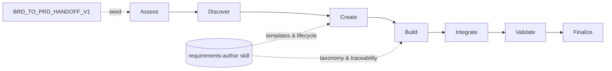

> **BRD-2026-Q2-PRD-BUILDER** | Status: approved | Version: 1.0.0 | Last Updated: 2026-06-14

## Executive Summary

The PRD Builder is an HVE-Core project-planning agent that produces high-quality Product Requirements Documents (PRDs) through a guided, multi-turn question-and-answer workflow. It converts ambiguous product ideas into structured, measurable, and testable product specifications, with state persistence that lets contributors pause and resume across conversations.

This BRD captures the business need for the PRD Builder as a product within the `project-planning` collection. The strategic driver is the `feat/brd-skills` initiative, which consolidates requirements-document authoring onto the shared `requirements-author` skill.
Today the PRD Builder embeds its template and lifecycle inline (a ~766-line agent), while the BRD Builder already consumes the external skill. The business goal is to bring the PRD Builder onto the same shared skill foundation so that both document types share one taxonomy, traceability model, quality contract, and template lineage.

The primary success metric is a measurable reduction in authoring-logic duplication between the BRD Builder and PRD Builder while preserving the PRD Builder's existing seven-phase user experience and its resume/recovery behavior. Secondary outcomes include consistent FR/AC/NFR/CON/BR requirement taxonomy across documents and a clean BRD-to-PRD handoff path so a finished BRD can seed a PRD.

Scope is limited to the PRD Builder agent, its template strategy, and its integration with the `requirements-author` skill. It excludes downstream backlog tooling (ADO/GitHub/Jira planners) and the BRD Builder itself, which is covered by a sibling BRD.

---

## Business Context

HVE-Core ships AI agent customizations (agents, prompts, instructions, and skills) bundled into collections and distributed via plugins and a VS Code extension. The `project-planning` collection includes twin requirements agents (the BRD Builder and the PRD Builder) that share a 7-phase Q&A architecture.

The `feat/brd-skills` changeset renames the `brd-author` skill to `requirements-author` and restructures its references into `_shared/`, `brd/`, and `prd/` groupings, adding `templates/prd/` for PRD assets. This signals a deliberate move from two independently maintained authoring flows toward one shared authoring skill that serves both document types.
The PRD Builder is the larger and more divergent of the two agents: it carries an inline template and extensive recovery protocols, which increases maintenance cost and risks drift from the canonical taxonomy and quality contracts used by the BRD Builder.

External constraints include the repository's authoring conventions (markdownlint, frontmatter schemas, collection/plugin/extension regeneration) and the CC BY 4.0 licensing posture for skill content. Any change to the PRD Builder must keep collection manifests, plugin outputs, and extension packaging consistent.

---

## Stakeholders

| Stakeholder                                             | Role                                                                  | Power  | Interest | Engagement Strategy                                                       |
|---------------------------------------------------------|-----------------------------------------------------------------------|--------|----------|---------------------------------------------------------------------------|
| wberry (named sign-off authority)                       | Accountable approver (DRI) for the Discover, Define, and Govern gates | High   | High     | Manage closely; final gate decision rests with this approver              |
| project-planning collection maintainers                 | Own the BRD/PRD agents and `requirements-author` skill                | High   | High     | Manage closely; collaborate on Define and Govern gate reviews             |
| HVE-Core contributors (product managers, engineers)     | End users who run the PRD Builder to author PRDs                      | Medium | High     | Keep informed; validate UX continuity and resume behavior                 |
| HVE-Core platform maintainers                           | Own collections, plugin generation, and extension packaging           | High   | Medium   | Keep satisfied; ensure manifest/plugin/extension regeneration stays green |
| Downstream planning agents (ADO/GitHub/Jira PRD-to-WIT) | Consume PRDs as inputs to work-item planning                          | Low    | High     | Keep informed; preserve PRD output shape they rely on                     |
| RPI workflow users                                      | Consume requirements artifacts in research/plan/implement loops       | Low    | Medium   | Monitor; ensure PRDs remain compatible with downstream RPI usage          |

---

## Design Decisions

* `DD-001`: Treat the PRD Builder agent as the product under specification; the `requirements-author` skill is a shared dependency, not the product.
* `DD-002`: Scope this BRD to the PRD Builder only. The BRD Builder is specified in a sibling BRD to keep supersession lineage and ownership clean.
* `DD-003`: Preserve the existing seven-phase PRD UX (Assess, Discover, Create, Build, Integrate, Validate, Finalize) as a non-negotiable continuity constraint while migrating template/lifecycle logic to the shared skill.
* `DD-004`: Fully restate shared BRD/PRD requirements in this BRD (duplication) so it stands alone, accepting parallel maintenance with the sibling BRD Builder BRD in exchange for independent lineage, ownership, and review.

---

## Business Goals

BG-001: Consolidate PRD authoring logic onto the shared `requirements-author` skill so that template and lifecycle definitions are maintained in one place rather than duplicated inline in the agent.
Priority: MUST
KPI: PRD template and lifecycle prose are sourced from the shared skill, eliminating the inline template as the source of truth.

BG-002: Preserve the PRD Builder's existing user experience and resume/recovery reliability through the migration.
Priority: MUST
KPI: All seven phases and the pause/resume + post-summarization recovery behaviors remain available with no regression.

BG-003: Establish a consistent requirements taxonomy and traceability model shared with the BRD Builder, enabling a clean BRD-to-PRD handoff.
Priority: SHOULD
KPI: PRDs use the same FR/AC/NFR/CON/BR taxonomy and can consume a `BRD_TO_PRD_HANDOFF_V1` payload as seed input.

**SMART Evaluation** (assessed at Define→Govern gate per `requirements-definition` skill):

* [x] **S**pecific: each goal names a concrete outcome: consolidating PRD authoring onto the shared skill so the template is single-sourced (BG-001), preserving the seven-phase UX and resume/recovery (BG-002), and a shared taxonomy enabling a clean BRD-to-PRD handoff (BG-003).
* [x] **M**easurable: each goal carries a verifiable KPI: template and lifecycle sourced from the shared skill with the inline template no longer the source of truth (BG-001), all seven phases and pause/resume + post-summarization recovery preserved with no regression (BG-002), and PRDs that use the FR/AC/NFR/CON/BR taxonomy and consume a `BRD_TO_PRD_HANDOFF_V1` payload (BG-003).
* [x] **A**chievable: the PRD Builder already implements the seven-phase workflow and recovery protocols, so the goals migrate existing logic onto the shared skill rather than introducing new capabilities.
* [x] **R**elevant: all three goals directly serve the `feat/brd-skills` consolidation onto the shared `requirements-author` skill (DD-003 continuity window).
* [x] **T**ime-bound: target milestone 2026-06-30.

Status: graded (all five SMART criteria satisfied at the Define→Govern assessment; time-bound target 2026-06-30).

---

## Business Rules

* `BR-001`: PRD content MUST conform to repository markdown conventions and pass markdownlint and frontmatter validation. Category: operational. Rationale: all repo markdown is validated in CI. Enforceability: mandatory. Enforcing FRs: FR-004.
* `BR-002`: Shared skill content MUST remain original Microsoft content under CC BY 4.0, citing third-party standards by name only without reproducing upstream prose. Category: contractual/licensing. Rationale: repository licensing posture. Enforceability: mandatory. Enforced by: CON-003.
* `BR-003`: Any change to agents, skills, or collections MUST be reflected in collection manifests, regenerated plugin outputs, and extension packaging. Category: operational. Rationale: distribution integrity. Enforceability: mandatory. Enforced by: CON-002.

---

## Functional Requirements

FR-001: The PRD Builder guides users through the seven-phase workflow (Assess, Discover, Create, Build, Integrate, Validate, Finalize) to produce a complete PRD.
Actor: HVE-Core contributor authoring a PRD.
Trigger: User selects the PRD Builder agent and describes a product, feature, or initiative.
Expected Outcome: A structured PRD is produced with all sections populated through iterative Q&A.
Acceptance Criteria: AC-001.
Business Goals: BG-002.

FR-002: The PRD Builder creates and maintains a session state file enabling pause and resume across conversations, including post-summarization recovery.
Actor: HVE-Core contributor.
Trigger: A PRD session begins or resumes.
Expected Outcome: State persists in `.copilot-tracking/prd-sessions/<name>.state.json`; the agent resumes from the last completed phase.
Acceptance Criteria: AC-002.
Business Goals: BG-002.

FR-003: The PRD Builder uses an emoji-based refinement-questions checklist with stable composite IDs to gather requirements without repetition.
Actor: HVE-Core contributor.
Trigger: The agent needs additional requirement detail.
Expected Outcome: Questions are tracked with ❓/✅/❌ states and never renumbered; answered items are not re-asked.
Acceptance Criteria: AC-003.
Business Goals: BG-002.

FR-004: The PRD Builder produces PRD documents that conform to repository markdown conventions and the required PRD format markers.
Actor: PRD Builder agent.
Trigger: PRD file creation or update.
Expected Outcome: Output passes markdownlint and includes required frontmatter/format markers.
Acceptance Criteria: AC-004.
Business Goals: BG-001.

FR-005: The PRD Builder sources its PRD template and lifecycle definition from the shared `requirements-author` skill rather than an inline-embedded template.
Actor: PRD Builder agent.
Trigger: PRD file creation and phase execution.
Expected Outcome: Template/lifecycle content is loaded from `requirements-author/templates/prd/` and the skill's PRD lifecycle sections.
Acceptance Criteria: AC-005.
Business Goals: BG-001.

FR-006: The PRD Builder applies a requirements taxonomy and traceability model consistent with the BRD Builder (FR/AC/NFR/CON/BR identifiers).
Actor: PRD Builder agent.
Trigger: Requirement capture during the Build phase.
Expected Outcome: Requirements carry canonical identifiers, linked objectives, and acceptance criteria.
Acceptance Criteria: AC-006.
Business Goals: BG-003.

FR-007: The PRD Builder can consume a `BRD_TO_PRD_HANDOFF_V1` payload to seed a PRD from an approved BRD.
Actor: HVE-Core contributor transitioning from a BRD to a PRD.
Trigger: A user supplies a completed BRD handoff payload.
Expected Outcome: The PRD is initialized with business goals, requirements, and traceability context from the handoff.
Acceptance Criteria: AC-007.
Business Goals: BG-003.

---

## Non-Functional Requirements

*Organized by ISO/IEC 25010 Quality Characteristics (per `requirements-definition` skill)*

### Functional Suitability

NFR-001: PRD output sections (goals, personas, requirements, acceptance criteria, metrics) are complete and measurable, with no empty mandatory sections at Finalize.

### Performance Efficiency

NFR-002: The migration to the shared skill does not increase the number of user turns required to reach a complete PRD relative to the current inline workflow. Verification: capture a pre-migration baseline turn count by running the current inline workflow against a representative PRD scenario, then confirm the post-migration turn count for the same scenario is less than or equal to that baseline.

### Compatibility

NFR-003: PRD output remains consumable by downstream PRD-to-WIT planning agents (ADO, GitHub, Jira) without changes to their expected input shape.

### Usability

NFR-004: The seven-phase experience, output modes (Full, Delta, Section, Status), and resume summaries remain available and behave as documented after migration.

### Reliability

NFR-005: Pause/resume and post-summarization recovery reconstruct context from the state file or, when missing/corrupt, from PRD content, with no silent loss of answered questions.

### Maintainability

NFR-006: PRD template and lifecycle definitions have a single source of truth in the `requirements-author` skill, removing duplicated authoring logic from the agent file.

### Security

NFR-007: No secrets, tokens, or credentials are written into PRD documents or session state files.

### Portability

NFR-008: The PRD Builder operates across HVE-Core distribution contexts (repository, extension, plugin) using the shared-skill path resolution conventions.

---

## Constraints

* `CON-001`: The PRD Builder MUST preserve its existing seven-phase workflow and naming; phase structure changes are out of scope for this BRD. Imposing source: product continuity / DD-003. Affected boundary: scope. Non-negotiability: avoids breaking existing user workflows and documentation. Category: organizational. Impact: design.
* `CON-002`: Changes MUST keep `collections/*.collection.yml/md`, `plugins/`, and `extension/` outputs consistent via the repository's regeneration scripts. Imposing source: repository distribution pipeline. Affected boundary: operations. Non-negotiability: generated outputs must not be hand-edited. Category: technical. Impact: delivery. Enforces: BR-003.
* `CON-003`: Shared skill content MUST follow the CC BY 4.0 cite-only standards posture. Imposing source: repository licensing. Affected boundary: compliance. Non-negotiability: licensing obligation. Category: contractual. Impact: acceptance. Enforces: BR-002.
* `CON-004`: Specification and migration work MUST land by the 2026-06-30 milestone to align with the `feat/brd-skills` initiative. Imposing source: initiative schedule / DD-003 continuity window. Affected boundary: schedule. Non-negotiability: calendar-driven target. Category: organizational. Impact: delivery.

---

## Process Models

*Guidance*: Illustrates the PRD Builder's seven phases and its dependency on the shared `requirements-author` skill plus the optional BRD-to-PRD seed.

---

## Acceptance Criteria

* `AC-001`: Given a product idea, When the user completes the workflow, Then a PRD with all required sections is produced and saved under `docs/prds/`. Covers: FR-001. Status: Not Started.
* `AC-002`: Given an interrupted session, When the user resumes, Then the agent restores context from the state file and continues from the last completed phase without re-asking answered questions. Covers: FR-002. Status: Not Started.
* `AC-003`: Given an ongoing session, When the agent asks refinement questions, Then question IDs remain stable and answered items are marked ✅ and not re-asked. Covers: FR-003. Status: Not Started.
* `AC-004`: Given a generated PRD, When validation runs, Then markdownlint and frontmatter checks pass and required format markers are present. Covers: FR-004. Status: Not Started.
* `AC-005`: Given the migrated agent, When a PRD is created, Then the template and lifecycle content originate from the `requirements-author` skill rather than inline agent prose. Covers: FR-005. Status: Not Started.
* `AC-006`: Given captured requirements, When they are written to the PRD, Then each carries a canonical FR/AC/NFR/CON/BR identifier with linked objectives and acceptance criteria. Covers: FR-006. Status: Not Started.
* `AC-007`: Given a `BRD_TO_PRD_HANDOFF_V1` payload, When a PRD is initialized from it, Then business goals, requirements, and traceability context are seeded into the PRD. Covers: FR-007. Status: Not Started.

---

## Traceability Matrix

### FR-to-AC Coverage

| FR     | Linked AC |
|--------|-----------|
| FR-001 | AC-001    |
| FR-002 | AC-002    |
| FR-003 | AC-003    |
| FR-004 | AC-004    |
| FR-005 | AC-005    |
| FR-006 | AC-006    |
| FR-007 | AC-007    |

Coverage: 7/7 = 100.0%.

### FR-to-BG Alignment

| FR     | Linked BG |
|--------|-----------|
| FR-001 | BG-002    |
| FR-002 | BG-002    |
| FR-003 | BG-002    |
| FR-004 | BG-001    |
| FR-005 | BG-001    |
| FR-006 | BG-003    |
| FR-007 | BG-003    |

Coverage: 7/7 = 100.0%.

### BR Enforcement

| BR     | Enforcing Control |
|--------|-------------------|
| BR-001 | FR-004            |
| BR-002 | CON-003           |
| BR-003 | CON-002           |

---

## Risks and Assumptions

### Key Assumptions

* Assumption: The `requirements-author` skill will host PRD templates (`templates/prd/`) and PRD lifecycle guidance. Impact if false: High. Mitigation: keep inline template until the shared PRD assets are complete.
* Assumption: Downstream PRD-to-WIT agents depend on the current PRD output shape. Impact if false: Medium. Mitigation: validate output against those agents before Govern.

### Risk Register

* Risk: Migrating the inline template to the shared skill regresses the PRD UX. Probability: Medium. Impact: High. Mitigation: treat the seven-phase UX as a continuity constraint (CON-001) and validate with NFR-004.
* Risk: Generated collection/plugin/extension outputs drift after agent/skill edits. Probability: Medium. Impact: Medium. Mitigation: run regeneration and validation scripts as part of acceptance (CON-002).

---

## Glossary

| Term                      | Definition                                                                                                                               |
|---------------------------|------------------------------------------------------------------------------------------------------------------------------------------|
| PRD                       | Product Requirements Document: defines product features and measurable requirements.                                                     |
| BRD                       | Business Requirements Document: defines business need, outcomes, and constraints.                                                        |
| requirements-author skill | Shared HVE-Core skill (formerly `brd-author`) providing templates, taxonomy, traceability, and lifecycle for both BRD and PRD authoring. |
| HVE-Core                  | Hyper Velocity Engineering Core: the repository providing these agents and skills.                                                       |

---

## Sign-Off

| Approver | Role                           | Decision | Date       | Comments                                                                                    |
|----------|--------------------------------|----------|------------|---------------------------------------------------------------------------------------------|
| wberry   | Named sign-off authority (DRI) | Approved | 2026-06-14 | Accountable approver for Discover, Define, and Govern gates; Define and Govern gates passed |

🤖 Crafted with precision by ✨Copilot following brilliant human instruction, then carefully refined by our team of discerning human reviewers.
