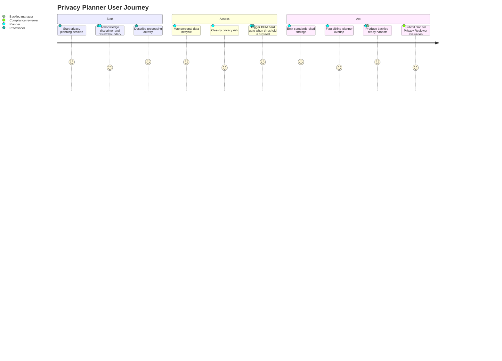
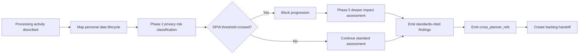
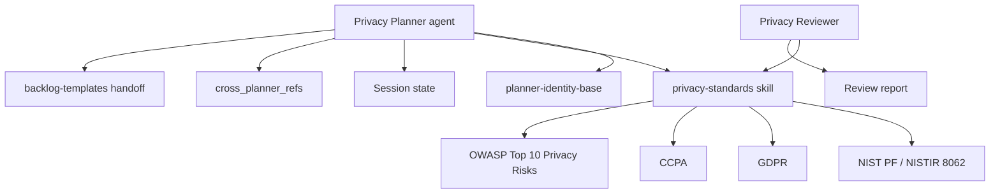

Version 0.1 approved | Status Approved for downstream handoff | Owner HVE-Core maintainers | Team HVE-Core maintainers | Target 2026-09-30 | Lifecycle Finalize / Approved

## Progress Tracker

| Phase                         | Done                                                                         | Gaps                                                       | Updated    |
|-------------------------------|------------------------------------------------------------------------------|------------------------------------------------------------|------------|
| Context                       | Seeded from approved Privacy Planner BRD                                     | Confirm target release vehicle and collection milestone    | 2026-06-21 |
| Problem & Users               | Seeded from stakeholder model and planner-family gap                         | Validate compliance/legal reviewer workflow expectations   | 2026-06-21 |
| Scope                         | Drafted for planner, privacy-standards skill, reviewer, and handoff surfaces | Confirm first-release backlog manager integration tests    | 2026-06-21 |
| Requirements                  | Functional and non-functional requirements drafted from approved BRD         | Validate quality review complete; human approvals recorded | 2026-06-22 |
| Metrics & Risks               | Drafted with traceability, cross-planner, telemetry, and review metrics      | Confirm operational dashboards after implementation design | 2026-06-21 |
| Operationalization            | Drafted with state, telemetry, handoff, and packaging expectations           | Confirm support model and standards refresh cadence        | 2026-06-21 |
| Finalization                  | Validate and Finalize quality reviews approved; human approvals recorded     | No blocking finalization gaps remain                       | 2026-06-22 |
| Unresolved Critical Questions | 0                                                                            | No blocking questions remain for PRD draft creation        | 2026-06-21 |

## 1. Executive Summary

### Context

The hve-core planner family includes accessibility, security, RAI, and SSSC planning capabilities, but it does not yet include a first-class privacy planner. Teams that handle personal data currently route privacy concerns through security and RAI assessment flows. That workaround leaves privacy-specific obligations unnamed, weakens traceability to privacy law and standards, and makes downstream backlog handoff harder to interpret.

Privacy Planner closes that family gap. It adds a six-phase Privacy Planner agent built on the shared `planner-identity-base`, a `privacy-standards` skill that owns domain knowledge, and a thin Privacy Reviewer that follows the existing reviewer pattern. The product emits `cross_planner_refs` when privacy overlaps with sibling planners, while leaving reconciliation and deduplication to backlog managers.

### Core Opportunity

The opportunity is to make privacy planning feel like a coherent member of the existing HVE-Core planner family. A data-handling practitioner should be able to describe a processing activity, classify privacy risk, cross a DPIA hard gate when required, receive standards-cited findings, and hand off backlog-ready work without confusing privacy review with legal approval.

### Product Goals

| Goal ID | Statement                                                            | Source Business Goal | Baseline                                    | Target                                                                                                                                 | Timeframe     | Priority    |
|---------|----------------------------------------------------------------------|----------------------|---------------------------------------------|----------------------------------------------------------------------------------------------------------------------------------------|---------------|-------------|
| PG-001  | Ship Privacy Planner as an isomorphic member of the planner family.  | BG-001               | No privacy planner exists                   | One Privacy Planner agent, one `privacy-standards` skill, and one Privacy Reviewer pass the same structural checks as sibling planners | By 2026-09-30 | Must have   |
| PG-002  | Guarantee verbatim standards traceability for every privacy finding. | BG-002               | No privacy finding surface exists           | 100% of findings cite a source control from GDPR, CCPA, NIST Privacy Framework / NISTIR 8062, or OWASP Top 10 Privacy Risks            | By 2026-09-30 | Must have   |
| PG-003  | Emit a clean, machine-detectable cross-planner handoff.              | BG-003               | Privacy is not a `backlog-templates` caller | Privacy is registered as the 5th caller and emits populated `cross_planner_refs` when overlap is detected                              | By 2026-09-30 | Should have |

## 2. Product Context

### Current Situation

The existing planner family already provides a reusable spine: shared identity instructions, six-phase orchestration, persistent state, question cadence, domain skills, reviewer patterns, and backlog handoff conventions. Privacy is the missing domain. Without a privacy member, maintainers and downstream adopters must infer privacy-specific behavior from adjacent planners, which creates inconsistency across classification, standards citation, DPIA gating, and handoff fields.

### Problem Statement

HVE-Core needs a first-class Privacy Planner that makes personal-data risk assessment traceable, reviewable, and handoff-ready. Without it, privacy concerns continue to leak into security and RAI workflows where they are neither clearly scoped nor tied to authoritative privacy source controls.

### Product Scope

In scope:

* Privacy Planner agent behavior and six-phase orchestration over `planner-identity-base`.
* `privacy-standards` skill content for NIST Privacy Framework / NISTIR 8062, GDPR, CCPA, and OWASP Top 10 Privacy Risks.
* Data-flow reasoning for collection, processing, retention, sharing, and deletion.
* DPIA threshold classification and hard gate from Phase 2 to Phase 5 when triggered.
* Standards-cited privacy findings.
* Privacy registration as a `backlog-templates` caller.
* Privacy augmentation fields in handoff items: `data_category`, `processing_purpose`, `dpia_ref`, `lawful_basis`, and `risk_tier`.
* `cross_planner_refs` emission for detected overlap with sibling planners.
* Thin Privacy Reviewer orchestration over `privacy-standards`.

Out of scope:

* Cross-domain backlog reconciliation, deduplication, or aggregation.
* Legal approval, privacy compliance sign-off, or product approval.
* Automatic remediation of privacy findings.
* Replacing sibling security, RAI, SSSC, or accessibility planners.
* Expanding the standards backbone beyond the locked four-standard set for the first release.

## 3. Users and Personas

| Persona                     | Goals                                                                       | Pain Points                                                              | Product Impact                                                                        |
|-----------------------------|-----------------------------------------------------------------------------|--------------------------------------------------------------------------|---------------------------------------------------------------------------------------|
| Data-handling practitioner  | Assess privacy risk for processing activities                               | Needs practical guidance without legal overclaiming                      | Primary planner interaction must be clear, gated, and traceable                       |
| Compliance / legal reviewer | Validate privacy finding fidelity                                           | Needs verbatim source-control citations and review boundaries            | Findings must expose source controls and avoid acting as approval                     |
| HVE-Core maintainer         | Ship planner assets consistently across collections and extension packaging | Needs privacy to fit the family pattern without bespoke drift            | Artifacts must follow existing planner structure and validation paths                 |
| Security Planner owner      | Understand overlap between privacy and security findings                    | Needs machine-detectable handoff without duplicated reconciliation logic | `cross_planner_refs` must flag overlap but stop at the seam                           |
| RAI Planner owner           | Coordinate AI personal-data overlap                                         | Needs compatible classification and impact-assessment shape              | DPIA gate mirrors the P2 classification to P5 impact pattern                          |
| Backlog manager             | Convert privacy findings into actionable work items                         | Needs stable augmentation fields and severity-to-priority mapping        | Handoff fields must be structured and parser-friendly                                 |
| End user / data subject     | Benefit from reduced privacy harm                                           | Needs privacy risks to be surfaced before implementation                 | Data-subject harms inform risk framing, with direct evidence tracked as an assumption |

### Primary Journey

## 4. Design Decisions

| Decision ID | Decision                                                                                                                                                                   | Product Rationale                                                                                                                                                     | Requirement Impact                                    |
|-------------|----------------------------------------------------------------------------------------------------------------------------------------------------------------------------|-----------------------------------------------------------------------------------------------------------------------------------------------------------------------|-------------------------------------------------------|
| DD-001      | Standards backbone is locked to NIST Privacy Framework / NISTIR 8062, GDPR, CCPA, and OWASP Top 10 Privacy Risks. LINDDUN and PLOT4ai are excluded from the first release. | A fixed source set keeps the first product release traceable and reviewable.                                                                                          | Drives FR-002, FR-004, NFR-001, CON-001, and CON-002. |
| DD-002      | Cross-planner overlap is detected and flagged only; reconciliation and deduplication are deferred to backlog managers.                                                     | Privacy should integrate with sibling planners without owning cross-domain portfolio decisions.                                                                       | Drives FR-007, NFR-003, and CON-003.                  |
| DD-003      | DPIA threshold is a hard gate at the Phase 2 classification to Phase 5 impact-assessment transition, triggered when any GDPR Article 35-style high-risk condition applies. | High-risk processing needs deeper impact assessment before the user can proceed, and the predicate gives implementers and reviewers a verifiable classification rule. | Drives FR-003, AC-003, and NFR-005.                   |
| DD-004      | Privacy handoff fields are `data_category`, `processing_purpose`, `dpia_ref`, `lawful_basis`, and `risk_tier`, with severity-to-priority mapping.                          | Stable fields let backlog managers consume privacy findings without bespoke parsing.                                                                                  | Drives FR-005 and AC-005.                             |

## 5. Product Goals

| Goal ID | Requirement                                                                    | Measurement                                                                                   | Acceptance Signal                                                                                                        |
|---------|--------------------------------------------------------------------------------|-----------------------------------------------------------------------------------------------|--------------------------------------------------------------------------------------------------------------------------|
| PG-001  | Privacy Planner conforms to the shared planner family architecture.            | Structural validation passes for the agent, skill, reviewer, state, and collection artifacts. | One planner, one skill, and one reviewer are packaged and validated by 2026-09-30.                                       |
| PG-002  | Every privacy finding is traceable to an authoritative privacy source control. | Citation coverage across emitted findings.                                                    | 100% of emitted findings carry `gdpr_article`, `ccpa_section`, NIST PF function/category, or OWASP entry ID.             |
| PG-003  | Cross-planner overlap is machine-detectable downstream.                        | Handoff schema coverage and caller registration.                                              | Privacy is registered as the 5th `backlog-templates` caller and emits `cross_planner_refs` whenever overlap is detected. |

## 6. Business Rules

| Rule ID | Rule                                                                                                                                              | Category    | Enforceability | Enforcing FRs  |
|---------|---------------------------------------------------------------------------------------------------------------------------------------------------|-------------|----------------|----------------|
| BR-001  | Every privacy finding must cite its source control verbatim through `gdpr_article`, `ccpa_section`, NIST PF function/category, or OWASP entry ID. | Regulatory  | Mandatory      | FR-004         |
| BR-002  | The Privacy Planner must conform to the shared planner identity base and six-phase orchestration contract.                                        | Operational | Mandatory      | FR-001, FR-006 |
| BR-003  | Reproduced and paraphrased standards content must carry upstream license attribution under the mixed-license posture.                             | Regulatory  | Mandatory      | FR-002, FR-004 |

## 7. Functional Requirements

| FR ID  | Requirement                                   | Actor                                       | Trigger                                                      | Expected Outcome                                                                                                                                                   | Goals          | Acceptance Criteria |
|--------|-----------------------------------------------|---------------------------------------------|--------------------------------------------------------------|--------------------------------------------------------------------------------------------------------------------------------------------------------------------|----------------|---------------------|
| FR-001 | Privacy Planner scaffolding                   | Data-handling practitioner                  | Practitioner starts a privacy planning session               | A Privacy Planner agent runs six-phase orchestration over `planner-identity-base` with state management and session recovery isomorphic to sibling planners.       | PG-001         | AC-001              |
| FR-002 | Data-flow reasoning super-power               | Privacy Planner through `privacy-standards` | A processing activity is described during assessment         | The skill identifies personal data and maps collection, processing, retention, sharing, and deletion, attaching lawful basis and processing purpose to each stage. | PG-001, PG-002 | AC-002              |
| FR-003 | Classification gate and DPIA threshold        | Privacy Planner                             | Phase 2 classifies processing activity by privacy risk       | When processing meets the DPIA threshold predicate, a hard gate blocks progression until Phase 5 impact assessment is completed.                                   | PG-001         | AC-003              |
| FR-004 | Standards traceability                        | Privacy Planner / Privacy Reviewer          | A finding is emitted                                         | The finding cites its source control verbatim across the four-standard backbone.                                                                                   | PG-002         | AC-004              |
| FR-005 | Backlog handoff registration                  | Privacy Planner                             | An assessment completes with backlog-eligible findings       | Privacy registers as a 5th `backlog-templates` caller and emits a privacy augmentation block on each backlog-eligible finding.                                     | PG-003         | AC-005              |
| FR-007 | Cross-planner refs and no-reconciliation seam | Privacy Planner                             | Overlap with a sibling planner is detected during assessment | The planner populates `cross_planner_refs` and stops at the handoff seam without reconciling or deduplicating.                                                     | PG-003         | AC-006              |
| FR-006 | Privacy Reviewer                              | Compliance/legal reviewer and practitioner  | A completed privacy plan is submitted for review             | A Privacy Reviewer, cloned from the existing reviewer pattern and pointed at `privacy-standards`, evaluates the plan against the privacy backbone.                 | PG-001         | AC-007              |

## 8. Non-Functional Requirements

### Functional Suitability

NFR-001: Findings are complete and correct against the locked four-standard backbone. Every classified privacy risk maps to at least one cited source control, and no uncited findings are emitted.

### Performance Efficiency

NFR-002: A privacy assessment session runs interactively within the same agent-turn responsiveness envelope as sibling planners; no batch or long-running compute is introduced.

### Compatibility

NFR-003: The planner coexists with sibling planners through the shared `backlog-templates` contract and `cross_planner_refs`, emitting references that downstream backlog managers can consume without privacy-specific parsing logic.

### Usability

NFR-004: Session structure, question cadence, and disclaimer presentation match family conventions so a practitioner familiar with another planner can operate Privacy Planner without new training.

### Reliability

NFR-005: Session state persists and recovers per `planner-identity-base`, so an interrupted privacy assessment resumes without losing phase progress, classification decisions, or DPIA gate status.

### Security and Privacy

NFR-006: Personal data described during assessment is handled as sensitive working content. The planner does not persist raw personal data beyond session artifacts required for traceability, and DPIA references are recorded by identifier rather than embedded payload.

### Maintainability

NFR-007: The Privacy Planner and Privacy Reviewer remain thin orchestration over `privacy-standards`; domain content changes are made in the skill without modifying agent orchestration.

### Portability

NFR-008: The components install and run through the same collection and extension packaging path as sibling planners with no privacy-specific runtime dependency.

### Scalability and Elasticity

NFR-009: Privacy Planner must support growth in standards mappings, handoff fields, reviewer checks, and sibling-planner overlap rules through data-driven skill content and schema extensions, without requiring planner orchestration changes for each new mapping or rule.

## 9. Constraints

| Constraint ID | Constraint                                                                                                       | Source                       | Category       | Affected Boundary  | Non-Negotiability                                                                                 | Impact                                                                                  |
|---------------|------------------------------------------------------------------------------------------------------------------|------------------------------|----------------|--------------------|---------------------------------------------------------------------------------------------------|-----------------------------------------------------------------------------------------|
| CON-001       | Standards backbone is fixed to NIST Privacy Framework / NISTIR 8062, GDPR, CCPA, and OWASP Top 10 Privacy Risks. | DD-001                       | Technical      | Scope              | Backbone was deliberately locked during discovery and cannot expand without a follow-up decision. | Requirement and acceptance scope cannot add new standards without a follow-up decision. |
| CON-002       | Mixed licensing includes OWASP CC-BY-SA-4.0, NIST public domain, and paraphrased GDPR/CCPA.                      | Upstream standards licensing | Regulatory     | Compliance         | Upstream license terms are external and must be preserved.                                        | Standards content must preserve attribution and licensing posture.                      |
| CON-003       | The planner detects and flags cross-planner overlap only; reconciliation is out of scope.                        | DD-002                       | Organizational | Scope and delivery | Reconciliation belongs to backlog managers and is not owned by Privacy Planner.                   | Product handoff must stop at `cross_planner_refs` and not merge sibling findings.       |

## 10. Process Models

### DPIA Gate Flow

### Product Surface Model

## 11. Acceptance Criteria

AC-001 (FR-001): Given a practitioner starts a privacy planning session, when the Privacy Planner initializes, then it runs the six-phase orchestration over `planner-identity-base` with state persistence and session recovery, passing the same structural validation that sibling planners pass.

AC-002 (FR-002): Given a processing activity is described, when the `privacy-standards` skill reasons over it, then it identifies personal data, maps collection, processing, retention, sharing, and deletion, and attaches a lawful basis and processing purpose to each stage.

AC-003 (FR-003): Given Phase 2 classifies a processing activity as crossing the DPIA threshold, when the practitioner attempts to advance, then the planner blocks progression as a hard gate until Phase 5 impact assessment is completed.

AC-004 (FR-004): Given a privacy finding is emitted, when it is recorded, then it carries a verbatim source-control citation from the four-standard backbone using `gdpr_article`, `ccpa_section`, NIST PF function/category, or OWASP entry ID.

AC-005 (FR-005): Given an assessment completes with backlog-eligible findings, when the handoff is produced, then privacy is registered as a `backlog-templates` caller and each item carries `data_category`, `processing_purpose`, `dpia_ref`, `lawful_basis`, and `risk_tier` with a severity-to-priority mapping.

AC-006 (FR-007): Given detected overlap with a sibling planner, when the handoff is produced, then `cross_planner_refs` is populated and the planner stops at the seam without performing reconciliation or deduplication.

AC-007 (FR-006): Given a completed privacy plan, when it is submitted for review, then the Privacy Reviewer evaluates it against the privacy backbone through `privacy-standards` and reports findings.

AC-008 (Telemetry): Given Privacy Planner emits session, handoff, or reviewer behavior telemetry, when traces, metrics, or logs are specified or implemented, then telemetry uses OpenTelemetry-aligned names and attributes, includes required resource attributes such as `service.name`, `service.version`, and `deployment.environment`, excludes raw personal data from span attributes and metric dimensions, and keeps metric cardinality bounded.

## 12. Traceability Matrix

### FR-to-AC Coverage

| FR     | Acceptance Criteria | Covered |
|--------|---------------------|---------|
| FR-001 | AC-001              | Yes     |
| FR-002 | AC-002              | Yes     |
| FR-003 | AC-003              | Yes     |
| FR-004 | AC-004              | Yes     |
| FR-005 | AC-005              | Yes     |
| FR-006 | AC-007              | Yes     |
| FR-007 | AC-006              | Yes     |

FR-to-AC coverage: 100.0% (7 of 7 FRs), meeting the 80.0% threshold.

### FR-to-Goal Alignment

| FR     | Product Goals  |
|--------|----------------|
| FR-001 | PG-001         |
| FR-002 | PG-001, PG-002 |
| FR-003 | PG-001         |
| FR-004 | PG-002         |
| FR-005 | PG-003         |
| FR-006 | PG-001         |
| FR-007 | PG-003         |

FR-to-goal coverage: 100.0% (7 of 7 FRs aligned to at least one product goal), meeting the 100.0% threshold.

### BR-to-FR Enforcement

| BR     | Enforcing FRs  |
|--------|----------------|
| BR-001 | FR-004         |
| BR-002 | FR-001, FR-006 |
| BR-003 | FR-002, FR-004 |

### Non-FR Acceptance Coverage

| Acceptance Criteria | Coverage Target                                                       | Covered |
|---------------------|-----------------------------------------------------------------------|---------|
| AC-008              | NFR-006, SM-005, SM-006, Operational Readiness telemetry expectations | Yes     |

AC-008 is telemetry-specific and intentionally outside the FR-to-AC coverage denominator. It traces to privacy-safe telemetry requirements and success metrics rather than to a functional requirement.

## 13. Success Metrics

| Metric ID | Metric                            | Baseline                 | Target                                                                                                                        | Source                             |
|-----------|-----------------------------------|--------------------------|-------------------------------------------------------------------------------------------------------------------------------|------------------------------------|
| SM-001    | Planner family conformance        | 0 privacy planners exist | Privacy Planner agent, `privacy-standards` skill, and Privacy Reviewer pass family structural validation                      | Validation results                 |
| SM-002    | Privacy finding citation coverage | Not applicable           | 100% of findings include verbatim source-control citation                                                                     | Planner/reviewer output checks     |
| SM-003    | Cross-planner handoff coverage    | Privacy not registered   | 100% of assessments with detected overlap emit populated `cross_planner_refs`                                                 | Handoff schema checks              |
| SM-004    | DPIA gate enforcement             | Not applicable           | 100% of threshold-crossing cases block Phase 2 to Phase 5 progression until impact assessment is completed                    | Scenario tests                     |
| SM-005    | Telemetry safety                  | Not applicable           | 0 raw personal data fields emitted as span attributes, metric dimensions, or log fields in defined telemetry acceptance tests | Telemetry review and test evidence |
| SM-006    | Metric cardinality control        | Not applicable           | All proposed metric attributes are bounded-cardinality or moved to logs/trace exemplars                                       | Telemetry design review            |

Telemetry success criteria must use OpenTelemetry-aligned vocabulary. Duration metrics use histogram instruments with UCUM units such as `s`; count-style measures use counters with unit `1`. Any implementation that crosses process, service, queue, or network boundaries emits trace spans with appropriate span kinds and propagates context.

## 14. MVP and Release Framing

Privacy Planner's MVP is the smallest release that closes the planner-family privacy gap without taking ownership of legal approval or downstream cross-domain reconciliation. The first release includes the planner, `privacy-standards` skill, Privacy Reviewer, and backlog handoff contract needed to satisfy PG-001 through PG-003. Deferred work is limited to follow-on product surfaces that would expand beyond the approved BRD scope.

### First Release Boundary

| Release Scope | Included Items                                                                                                                       | Linked Goals           | Rationale                                                                                                               |
|---------------|--------------------------------------------------------------------------------------------------------------------------------------|------------------------|-------------------------------------------------------------------------------------------------------------------------|
| First release | FR-001, FR-002, FR-003, FR-004, FR-005, FR-006, FR-007                                                                               | PG-001, PG-002, PG-003 | All functional requirements are required to make privacy a first-class, traceable, handoff-ready planner family member. |
| Deferred      | Cross-domain backlog reconciliation, legal approval workflow, automatic remediation, additional standards beyond the locked backbone | None                   | These items are explicitly out of scope or require separate governance decisions.                                       |

### State and Recovery

Privacy Planner must persist session state using the same state and recovery conventions as sibling planners. State must preserve phase progress, disclaimer status, classification decisions, DPIA gate status, references processed, `cross_planner_refs`, and handoff readiness. Recovery must resume without re-asking answered questions unless the saved state is missing or contradicted by the current artifact.

### Observability

Operational telemetry must follow `telemetry-foundations` vocabulary. Required resource attributes include `service.name`, `service.version`, and `deployment.environment`; implementations should also include `telemetry.sdk.name`, `telemetry.sdk.language`, and `telemetry.sdk.version` when emitted by an SDK. Trace spans are required for boundary-crossing behavior such as external standards lookups, backlog handoff writes, reviewer handoff, or queued workflow steps.

Metrics must avoid unbounded dimensions such as raw user prompts, file paths containing user identifiers, email addresses, request IDs, or free-form processing descriptions. PII-bearing values must be dropped, tokenized, or hashed before use, with raw personal data excluded from span attributes, metric dimensions, and logs.

### Packaging and Release

Privacy Planner artifacts must follow the same collection, plugin, and extension packaging path as sibling planners. The first release includes planner agent assets, `privacy-standards` skill assets, Privacy Reviewer assets, collection metadata, and validation coverage for the shared handoff contract.

### Support and Review

The planner output remains assistive. Compliance/legal reviewers validate citation fidelity and privacy conclusions before adoption. Maintainers own structural validation, packaging health, and standards refresh cadence. Backlog managers own any cross-domain reconciliation or deduplication after handoff.

## 15. Risks and Assumptions

### Key Assumptions

| Assumption ID | Assumption                                                                                                                       | Impact if False | Mitigation                                                                            |
|---------------|----------------------------------------------------------------------------------------------------------------------------------|-----------------|---------------------------------------------------------------------------------------|
| A-001         | Privacy Planner is built by isomorphism with the existing family; net-new effort concentrates in `privacy-standards`.            | High            | Validate family pattern reuse early.                                                  |
| A-002         | `backlog-templates` accepts a 5th caller with a domain augmentation block.                                                       | Medium          | Confirm the caller registration and schema during implementation.                     |
| A-003         | The reviewer pattern is thin orchestration and clones cheaply onto a new skill.                                                  | Medium          | Prototype the reviewer clone before final release.                                    |
| A-004         | Privacy augmentation fields are finalized as `data_category`, `processing_purpose`, `dpia_ref`, `lawful_basis`, and `risk_tier`. | Low             | Re-validate field set against `backlog-templates` before Govern.                      |
| A-005         | End-user / data-subject pain is not yet directly evidenced; practitioner and sibling-planner inputs are accepted for Discover.   | Medium          | Schedule lightweight data-subject validation before any GA claim of end-user benefit. |

### Risk Register

| Risk ID | Risk                                                                              | Probability | Impact | Mitigation                                                                                                | Owner                        |
|---------|-----------------------------------------------------------------------------------|-------------|--------|-----------------------------------------------------------------------------------------------------------|------------------------------|
| R-001   | Users treat Privacy Planner output as final legal/privacy approval.               | Medium      | High   | Require disclaimer display, professional-review reminders, and verbatim citations reviewers can validate. | Compliance / legal reviewers |
| R-002   | Standards backbone drifts from upstream revisions.                                | Medium      | Medium | Pin cited versions in `privacy-standards` and review on standards updates.                                | project-planning-maintainers |
| R-003   | Mixed-license content loses attribution on reproduction.                          | Low         | High   | Enforce BR-003 attribution and validate licensing posture in review.                                      | security-maintainers         |
| R-004   | Privacy/security/RAI overlap is mis-flagged, creating noisy `cross_planner_refs`. | Medium      | Medium | Detect and flag only; tune overlap heuristics; leave reconciliation downstream.                           | Backlog managers             |
| R-005   | End-user privacy harm is under-weighted because pain is not directly evidenced.   | Medium      | Medium | Record A-005 and validate data-subject perspective before GA.                                             | wberry (DRI)                 |
| R-006   | Family pattern reuse proves shallower than assumed, inflating effort.             | Low         | High   | Validate isomorphism against sibling planners early in implementation.                                    | project-planning-maintainers |

## 16. Glossary

| Term                 | Definition                                                                                                                     |
|----------------------|--------------------------------------------------------------------------------------------------------------------------------|
| DPIA                 | Data Protection Impact Assessment, a deeper privacy impact assessment triggered when processing crosses a high-risk threshold. |
| `cross_planner_refs` | Machine-detectable references emitted to flag overlap between sibling planners.                                                |
| NIST PF              | NIST Privacy Framework.                                                                                                        |
| `privacy-standards`  | The privacy domain skill that owns standards content, mappings, and classification rules.                                      |
| Source control       | A standards citation field such as `gdpr_article`, `ccpa_section`, NIST PF function/category, or OWASP entry ID.               |

## 17. Sign-Off

### Approval Checklist

| Role             | Owner                        | Status                   | Notes                                                                                                                                |
|------------------|------------------------------|--------------------------|--------------------------------------------------------------------------------------------------------------------------------------|
| Business Sponsor | wberry (DRI)                 | Approved for BRD handoff | BRD approval recorded on 2026-06-20.                                                                                                 |
| Product Owner    | project-planning-maintainers | Approved                 | User sign-off recorded on 2026-06-22 covers the pending Product Owner PRD approval role.                                             |
| Technical Lead   | project-planning-maintainers | Approved                 | User sign-off recorded on 2026-06-22 covers the pending Technical Lead PRD approval role.                                            |
| Quality Lead     | PRD Quality Reviewer         | Finalize approved        | Final quality report PRD-2026-Q2-PRIVACY-PLANNER-quality-20260622T020000Z passed and approved Finalize exit on 2026-06-22T02:00:00Z. |
| Legal/Compliance | Compliance / legal reviewers | Approved                 | User sign-off recorded on 2026-06-22 covers the pending Legal/Compliance PRD approval role.                                          |

Approval decision: Approved for downstream handoff. Human approvals were recorded on 2026-06-22T01:54:06Z by wberry (DRI / sign-off authority), covering all pending PRD approval roles. Final quality report PRD-2026-Q2-PRIVACY-PLANNER-quality-20260622T020000Z passed on 2026-06-22T02:00:00Z and authorized `gate_decisions.finalize_exit: APPROVED` with zero risks, zero cautions, and no unresolved blocking findings.

### Waivers

None.

### Handoff Readiness

Validate and Finalize quality reviews are complete and approved. Source BRD handoff is approved and ready, with 3 business goals, 7 functional requirements, 7 acceptance criteria, 8 non-functional requirements, 3 constraints, 3 business rules, 100.0% FR-to-AC coverage, and 100.0% FR-to-BG coverage. Human approval evidence is recorded, the final quality report authorizes Finalize exit, and the PRD is ready for downstream implementation planning.

## 18. PRD Requirements Planning

> [!CAUTION]
> This agent is an assistive tool only. It does not provide product management approval, technical feasibility validation, or business sign-off and does not replace product managers, engineering leads, business stakeholders, or other qualified human reviewers. The output consists of suggested requirements, acceptance criteria, and product specifications to support a user's own product planning and decision-making.
> All Product Requirements Documents, functional requirements, non-functional requirements, and constraint definitions generated by this tool must be independently reviewed and validated by appropriate product and engineering reviewers before adoption. Outputs from this tool do not constitute product approval, requirements sign-off, or engineering commitment.

## 19. Document Metadata

| Field               | Value                                                       |
|---------------------|-------------------------------------------------------------|
| Source BRD          | BRD-2026-Q2-PRIVACY-PLANNER                                 |
| Source file         | `docs/brds/privacy-planner-brd.md`                          |
| Session state       | `.copilot-tracking/prd-sessions/privacy-planner.state.json` |
| Disclaimer shown at | 2026-06-21T18:02:46Z                                        |
| Lifecycle status    | Approved for downstream handoff                             |

---

*🤖 Crafted with precision by ✨Copilot following brilliant human instruction, then carefully refined by our team of discerning human reviewers.*
