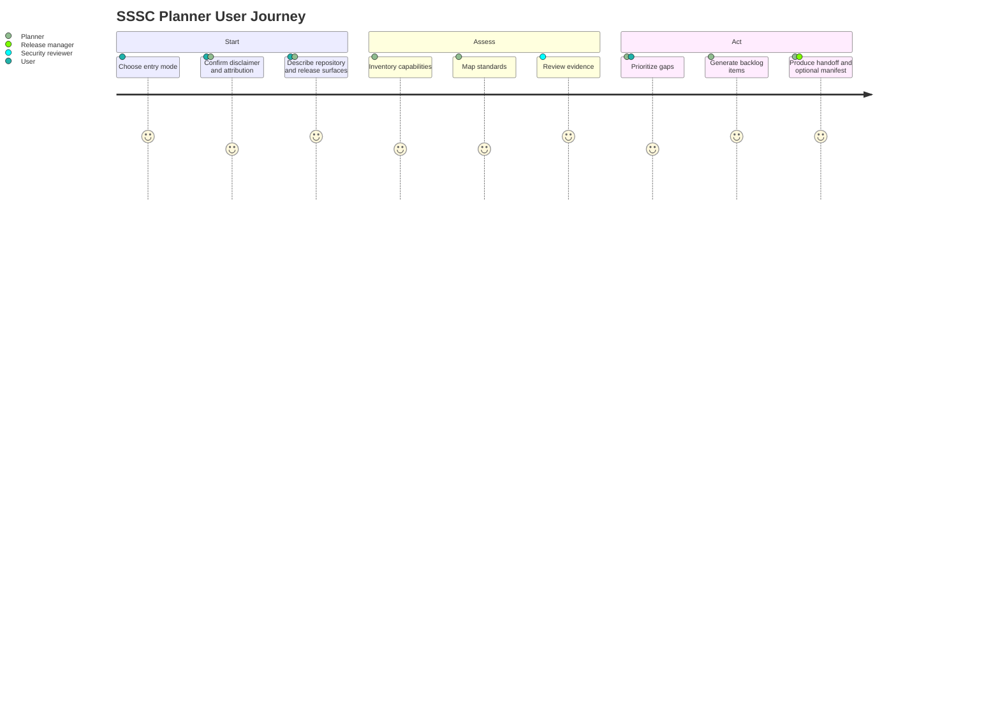
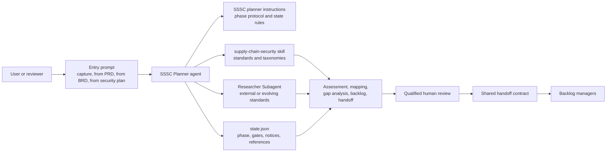
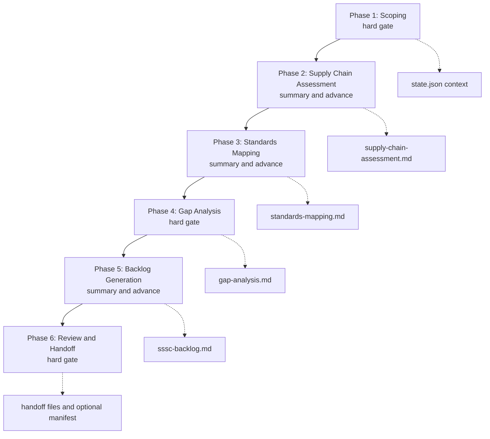
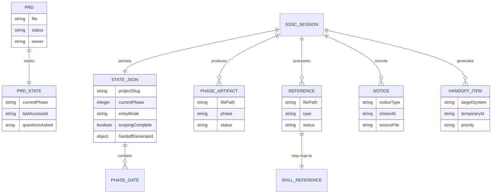
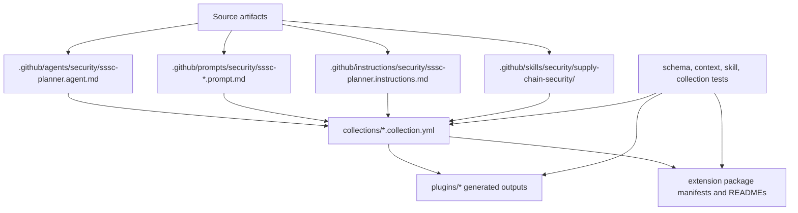

<!-- markdownlint-disable-file -->
<!-- markdown-table-prettify-ignore-start -->
# SSSC Planner - Product Requirements Document (PRD)
Version 0.1 draft | Status Draft for maintainer review | Owner HVE-Core maintainers | Team HVE-Core maintainers | Target v4.1 prerelease | Lifecycle Build and validate

## Progress Tracker

| Phase | Done | Gaps | Updated |
|-------|------|------|---------|
| Context | Seeded from BRD and current SSSC artifacts | Launch threshold posture confirmed | 2026-06-14 |
| Problem & Users | Seeded from BRD stakeholder and risk model | Confirm downstream adopter personas and governance expectations | 2026-06-13 |
| Scope | Drafted for planner, prompts, instructions, skill, validation, and packaging | Confirm what belongs in the first release versus follow-up backlog | 2026-06-13 |
| Requirements | Initial functional and non-functional requirements drafted | Validate priorities and acceptance criteria with maintainers | 2026-06-13 |
| Metrics & Risks | Drafted with measurable targets and advisory launch thresholds | Confirm downstream adoption thresholds | 2026-06-14 |
| Operationalization | Drafted with artifacts, state, handoff, and observability expectations | Confirm support model | 2026-06-14 |
| Finalization | Open questions resolved | Run final quality gate | 2026-06-14 |
| Unresolved Critical Questions | 0 | No open questions remain | 2026-06-14 |

## 1. Executive Summary

### Context

The Secure Software Supply Chain (SSSC) Planner is a phase-based conversational planning capability for HVE-Core and downstream adopters. It guides a user from supply chain scoping through capability assessment, standards mapping, gap analysis, backlog generation, and final handoff. The planner coordinates three product surfaces: the SSSC Planner agent, entry prompts and instructions, and the `supply-chain-security` skill that holds durable standards and taxonomy references.

HVE-Core distributes reusable AI-assisted engineering assets. When downstream projects adopt those assets, supply chain planning guidance can shape how other teams evaluate dependency risk, build integrity, artifact signing, SBOM readiness, and remediation backlog priorities. The SSSC Planner therefore needs product-grade behavior: explicit state, clear user gates, standards-backed references, review boundaries, and a high-quality handoff experience.

### Core Opportunity

The opportunity is to turn supply chain security planning from scattered guidance into an excellent reusable product experience. A user should be able to start from a fresh conversation, BRD, PRD, or security plan and leave with an auditable SSSC plan, evidence-backed standards mapping, prioritized work items, and clear next steps for qualified human review.

### Goals

| Goal ID | Statement | Type | Baseline | Target | Timeframe | Priority |
|---------|-----------|------|----------|--------|-----------|----------|
| G-001 | Make the generalized SSSC Planner discoverable and usable from security and project-planning workflows. | Adoption | Planner artifacts exist but need product-level PRD alignment | Target collections expose agent, prompts, instructions, and skill references consistently | Target release v4.1 prerelease | Must have |
| G-002 | Preserve SSSC planning state across sessions without losing gates, notices, references, or handoff decisions. | Quality | State schema and tests exist | 100% SSSC state schema and context preservation tests pass | Target release v4.1 prerelease | Must have |
| G-003 | Produce evidence-backed assessments against recognized supply chain security references. | Security | Supply chain skill packages durable references | Every assessment maps findings to the skill reference set or explicitly delegates research | Target release v4.1 prerelease | Must have |
| G-004 | Convert prioritized gaps into the existing shared HVE-Core backlog handoff contract for backlog managers. | Delivery | Shared backlog handoff conventions exist | Every generated item includes acceptance criteria, adoption steps, priority, evidence, standards traceability, downstream applicability context, and review boundaries | Target release v4.1 prerelease | Must have |
| G-005 | Reduce downstream misuse risk by making local context and human review boundaries visible. | Governance | BRD identifies cascading risk | Every handoff includes applicability assumptions and named local review expectations | Target release v4.1 prerelease | Must have |
| G-006 | Deliver an excellent experience with clear diagrams, progressive questioning, and high-confidence handoff artifacts. | Experience | Agent and instructions define phase flow | Users can understand flow, architecture, artifacts, and decisions from the PRD and planner output | Target release v4.1 prerelease | Should have |

## 2. Problem Definition

### Current Situation

Supply chain security planning guidance exists across the SSSC Planner agent, consolidated instructions, entry prompts, state schema, tests, collection metadata, and the `supply-chain-security` skill. The current foundation is strong, but the product intent needs a complete PRD that aligns the agent, prompts, instructions, skill, validation, diagrams, and handoff expectations around a single user experience.

### Problem Statement

HVE-Core needs an SSSC Planner that feels like a coherent product rather than a set of related artifacts. Without a product-level requirements model, maintainers can unintentionally change prompts, instructions, skill references, state schema, or generated outputs in ways that weaken the planner experience, fragment standards attribution, or create downstream supply chain risk.

### Root Causes

* Planner behavior spans multiple artifact types with different validation paths.
* Standards knowledge and orchestration behavior are intentionally split, which improves maintainability but requires a clear product contract.
* Downstream projects may copy planner outputs without adapting them to their local package ecosystem, CI/CD topology, release process, and governance requirements.
* State and handoff quality are critical, but they are easy to regress without explicit acceptance criteria.

### Impact of Inaction

If the SSSC Planner remains underspecified as a product, users may receive inconsistent questions, incomplete evidence, vague backlog items, stale framework references, or handoff artifacts that blur the line between AI-assisted planning and security approval. For downstream adopters, that inconsistency can propagate across many repositories.

## 3. Users & Personas

| Persona | Goals | Pain Points | Impact |
|---------|-------|-------------|--------|
| HVE-Core maintainer | Ship reliable planner artifacts across collections and extension packaging | Needs confidence that agent, prompts, instructions, skill, tests, and generated outputs stay aligned | Fewer regressions and clearer release readiness |
| Security reviewer | Validate assessment evidence, standards mappings, and backlog items | Needs traceable findings and explicit review boundaries | Higher confidence in remediation priorities |
| Agent and instruction author | Improve planner behavior without duplicating standards content | Needs a clear source of truth for orchestration versus domain references | Easier maintenance and lower drift risk |
| Downstream project owner | Apply HVE-Core supply chain planning to a local repository | Needs practical recommendations that fit the local stack | Safer adoption and better backlog quality |
| Release manager | Package and publish SSSC assets | Needs collection, plugin, and extension outputs to stay consistent | Cleaner releases and fewer packaging surprises |
| Governance stakeholder | Audit planning controls and evidence | Needs durable state, notices, and artifact integrity options | Better evidence posture |

### Journeys



## 4. Scope

### In Scope

* SSSC Planner agent behavior and startup contract.
* SSSC entry prompts for capture, PRD-seeded, BRD-seeded, and security-plan-seeded flows.
* Consolidated SSSC planner instructions for phase orchestration, state, questions, handoff, and recovery.
* `supply-chain-security` skill usage for standard catalogs, capabilities inventory, mappings, adoption taxonomies, and priority derivation.
* Persistent PRD-seeded product requirements for state schema, validation tests, packaging, and documentation.
* Architecture diagrams showing the planner system, phase workflow, state model, and distribution path.
* Shared HVE-Core backlog handoff contract requirements for backlog managers.
* Human-review boundaries, disclaimer recording, standards attribution, and local applicability assumptions.
* Optional artifact integrity support through session manifest generation and signing.

### Out of Scope

* Automatic remediation of supply chain issues without explicit human authorization.
* Certification that HVE-Core or a downstream repository is secure because the planner was used.
* Reproduction of full external standards catalogs inside the PRD.
* Replacing Security Planner, RAI Planner, Accessibility Planner, or backlog manager agents.
* Building a UI outside the VS Code chat and documentation surfaces.

### Assumptions

* The consolidated SSSC planner instruction file remains the source of truth for orchestration details.
* The `supply-chain-security` skill remains the source of truth for durable standards and taxonomy references.
* Qualified security review remains required before execution of generated remediation work.
* Backlog managers and users own target-system routing from the shared planner handoff contract.
* Downstream adopters have varied stacks and must confirm local applicability before execution.

### Constraints

* The planner must not invent standards mappings when the supply chain skill provides a reference.
* The planner must load required skill references before phase analysis.
* The planner must record disclaimers, phase gates, references, and handoff decisions in state.
* The PRD avoids naming new telemetry fields beyond the shared telemetry-foundations vocabulary.
* Markdown diagrams must render in Docusaurus using Mermaid.

## 5. Product Overview

### Value Proposition

The SSSC Planner helps teams create auditable, standards-aware supply chain security plans without starting from a blank page. It combines guided discovery, durable reference material, explicit review gates, and backlog handoff formats so supply chain gaps become actionable work while remaining clearly subject to qualified human review.

### Product Pillars

| Pillar | Meaning | Product Implication |
|--------|---------|---------------------|
| Guided | The planner asks focused, phase-aware questions instead of dumping a framework checklist on the user | The first phase starts with user context, then progressively probes missing surfaces |
| Evidence-backed | Findings trace to repository evidence, user references, or skill-managed standards | Phase artifacts include source paths, reference types, and assessment rationale |
| Standards-aware | The planner maps posture to OpenSSF Scorecard, SLSA, Sigstore, SBOM, and Best Practices Badge references | Standards content stays in the skill and is loaded on demand |
| Stateful | Sessions resume reliably and preserve review gates | State schema, fixtures, and tests protect required fields |
| Actionable | Gaps become backlog-ready work items | Each work item includes priority, acceptance criteria, and adoption steps |
| Bounded | AI-assisted planning does not become security approval | Disclaimers, notice logs, and handoff notes preserve review boundaries |

### System Architecture



### Phase Architecture



  ### Entry Prompt Contracts

  | Prompt | Entry mode | Primary source | Required behavior | Fallback |
  |--------|------------|----------------|-------------------|----------|
  | `sssc-capture.prompt.md` | capture | Conversation and repository pre-scan | Initialize a fresh SSSC session, preserve startup notice state, pre-populate Phase 1 where evidence exists, and ask focused scoping questions. | Ask for a project slug when one is not provided. |
  | `sssc-from-prd.prompt.md` | from-prd | PRD artifacts and supporting context | Locate PRD sources, extract product scope and supply chain-relevant constraints, and present confirmed and missing context as a checklist. | Fall back to capture mode when no PRD artifacts are found. |
  | `sssc-from-brd.prompt.md` | from-brd | BRD artifacts and supporting context | Locate BRD sources, extract business drivers, compliance expectations, stakeholder criteria, and missing technical supply chain context. | Fall back to capture mode when no BRD artifacts are found. |
  | `sssc-from-security-plan.prompt.md` | from-security-plan | Security Planner artifacts | Locate existing Security Planner state and artifacts, extract relevant technology, threat, control, and gap context, and set `securityPlannerLink`. | Fall back to capture mode when no Security Planner artifacts are found. |

  Each prompt must display the SSSC planning caution and framework attribution before analysis when required by state, scan the shared supporting context sources defined by the consolidated instructions, initialize `.copilot-tracking/sssc-plans/{project-slug}/state.json`, and avoid restating standards tables that belong in the `supply-chain-security` skill.

### State and Artifact Model



### Distribution Architecture



  ### Artifact Ownership and Process Contract

  The SSSC Planner product shall follow the existing HVE-Core artifact processes instead of defining a parallel implementation path.

  * Prompt files under `.github/prompts/security/sssc-*.prompt.md` are entry wrappers. They select capture, PRD-seeded, BRD-seeded, or Security Planner-seeded mode, initialize or resume state, and delegate conversation ownership to `agent: SSSC Planner`.
  * Prompt files shall not duplicate shared phase protocols, durable standards tables, backlog handoff contracts, or telemetry vocabulary.
  * `.github/agents/security/sssc-planner.agent.md` owns user-facing orchestration, phase progression, gate behavior, handoff sequencing, cross-planner routing, and skill-loading contracts.
  * `.github/instructions/security/sssc-planner.instructions.md` owns auto-applied behavior for SSSC plan artifacts, state expectations, phase protocols, required notices, session recovery, and opt-in artifact signing defaults.
  * `.github/skills/security/supply-chain-security/SKILL.md` owns durable supply chain security standards references, the capability inventory, mappings, taxonomies, and priority derivation rules.
  * `.github/skills/shared/telemetry-foundations/SKILL.md` owns telemetry vocabulary, while `.github/instructions/shared/telemetry-overlay.instructions.md` applies telemetry acceptance-criteria expectations to PRD sessions and SSSC planning artifacts.
  * `docs/templates/sssc-plan-template.md` owns the final SSSC plan output structure. Product requirements may reference the template but should not fork its section contract.
  * `scripts/linting/schemas/sssc-state.schema.json` owns persisted SSSC state validity. Pester tests validate schema fixtures and protect inline state-context copies from drifting across agent and instruction files.
  * `collections/security.collection.yml` and `collections/hve-core-all.collection.yml` own packaged discoverability for the SSSC prompt, instruction, agent, skill, and shared dependency surfaces.
  * Source artifacts shall be updated first. Generated plugin and extension outputs shall be regenerated through repository scripts and shall not be edited directly.
  * PRD and documentation edits shall follow the repository Markdown, Docusaurus, writing-style, and telemetry overlay instructions that apply to `docs/**` and `.copilot-tracking/prd-sessions/**`.

## 6. Functional Requirements

| FR ID | Title | Description | Goals | Personas | Priority | Acceptance | Notes |
|-------|-------|-------------|-------|----------|----------|------------|-------|
| FR-001 | Entry mode selection | The planner shall support capture, from-PRD, from-BRD, and from-security-plan entry modes. | G-001, G-006 | User, maintainer | Must | Each entry prompt initializes or pre-populates Phase 1 context, displays required startup notices, scans shared supporting context, and records processed references. | Aligns to existing prompt set |
| FR-002 | Startup disclaimer and attribution | The planner shall display required SSSC planning disclaimer and standards attribution before analysis when `disclaimerShownAt` is null. | G-002, G-005 | Security reviewer, governance stakeholder | Must | State records `disclaimerShownAt` and appends a notice entry. | Full wording remains in shared disclaimer instructions |
| FR-003 | Phase-gated workflow | The planner shall enforce the six SSSC phases with hard gates at Phases 1, 4, and 6. | G-002, G-006 | User, security reviewer | Must | Hard gates require explicit confirmation and timestamp before advancement. | Phases 2, 3, and 5 summarize and advance unless blocked |
| FR-004 | Progressive scoping interview | The planner shall begin Phase 1 with user-centered discovery before introducing standards vocabulary. | G-006 | User, downstream project owner | Should | Phase 1 asks 3 to 5 focused questions per turn and records skipped or answered items. | Supports exploration-first coaching |
| FR-005 | Skill reference loading | The planner shall load required `supply-chain-security` skill references at each phase entry before analysis. | G-003 | Agent author, security reviewer | Must | Missing references halt phase analysis with a clear error instead of improvised standards content. | Protects against stale or fabricated mappings |
| FR-006 | Capability assessment | The planner shall assess the target repository against the combined supply chain capability inventory. | G-003 | Security reviewer | Must | `supply-chain-assessment.md` records current state, evidence, uncertainty, and reviewer notes for each applicable capability. | Capability catalog remains in skill |
| FR-007 | Standards mapping | The planner shall map assessment posture against OpenSSF Scorecard, SLSA, Best Practices Badge, Sigstore, and SBOM references. | G-003 | Security reviewer, governance stakeholder | Must | `standards-mapping.md` includes current and target posture with source references. | External research is delegated when embedded references are insufficient |
| FR-008 | Gap analysis | The planner shall compare current and target posture, then categorize and size gaps. | G-003, G-004 | Security reviewer, maintainer | Must | `gap-analysis.md` sorts gaps by derived risk and includes adoption category, effort, rationale, and dependencies. | Phase 4 is a hard gate |
| FR-009 | Backlog generation | The planner shall convert accepted gaps into the existing shared HVE-Core backlog handoff contract. | G-004 | Maintainer, release manager | Must | Each item has priority, acceptance criteria, standards traceability, evidence, adoption steps, affected files, dependencies, downstream applicability context, and review boundaries. | Target backlog systems are selected by users and backlog managers |
| FR-010 | Handoff finalization | The planner shall produce a final consolidated SSSC plan and shared-format handoff for backlog managers. | G-004, G-005 | User, backlog manager | Must | Phase 6 output lists every produced artifact, review status, posture recap, and backlog-manager next steps. | `ssscPlanFile` is primary durable deliverable |
| FR-011 | Artifact integrity option | The planner shall offer optional SHA-256 manifest generation and signing for final session artifacts. | G-002, G-005 | Release manager, governance stakeholder | Should | State records `signingRequested` and `signingManifestPath` when selected. | Signing is always opt-in and must not block Phase 6 handoff completion |
| FR-012 | Downstream applicability capture | The planner shall capture downstream context before generating project-specific recommendations outside HVE-Core. | G-005 | Downstream project owner, security reviewer | Must | Handoff includes the current required SSSC state context fields: tech stack, package managers, CI platform, release strategy, and compliance targets. Local security ownership is captured when provided and remains advisory for v4.1 prerelease. | Prevents unsafe copy-paste adoption |
| FR-013 | Resume and recovery | The planner shall resume from existing state and recover after context summarization. | G-002, G-006 | User, maintainer | Must | Resume flow reads state, validates required fields, summarizes progress, and continues from next incomplete action. | Missing state is reconstructed when feasible |
| FR-014 | Cross-agent integration | The planner shall cross-link relevant Security Planner and RAI Planner artifacts without duplicating their analysis. | G-001, G-005 | Security reviewer, maintainer | Should | State records `securityPlannerLink` and `raiPlannerLink` when artifacts exist. | Security Planner can dispatch to SSSC |
| FR-015 | Collection and packaging alignment | The product shall keep agent, prompt, instruction, and skill artifacts registered in the intended collections and generated outputs. | G-001 | Maintainer, release manager | Must | Collection validation passes and generated plugin or extension outputs reflect the same planner surface. | Generated files are not edited directly |

### Feature Hierarchy

```text
SSSC Planner Product
  Entry Surfaces
    sssc-capture prompt
    sssc-from-prd prompt
    sssc-from-brd prompt
    sssc-from-security-plan prompt
  Planner Orchestration
    startup notices
    six-phase workflow
    state protocol
    resume and recovery
    cross-agent links
  Domain Reference Layer
    supply-chain-security skill index
    capabilities inventory
    standards references
    adoption and priority taxonomies
  Outputs
    state.json
    supply-chain-assessment.md
    standards-mapping.md
    gap-analysis.md
    sssc-backlog.md
    handoff files
    optional manifest
  Quality System
    schema validation
    context preservation tests
    collection validation
    skill validation
    markdown and frontmatter validation where applicable
```

## 7. Non-Functional Requirements

| NFR ID | Category | Requirement | Metric/Target | Priority | Validation | Notes |
|--------|----------|-------------|---------------|----------|------------|-------|
| NFR-001 | Reliability | Planner sessions shall preserve required state across resume and context summarization. | 100% pass rate for SSSC state schema and context preservation tests | Must | `npm run test:ps -- -TestPath scripts/tests/linting/` or narrower approved test path | Uses canonical schema |
| NFR-002 | Maintainability | Standards catalogs and taxonomies shall remain in the `supply-chain-security` skill, not duplicated in agent or PRD content. | No duplicated full framework tables in agent, prompts, or PRD | Must | Review and skill validation | Keeps content durable and centralized |
| NFR-003 | Usability | The planner shall ask focused questions in small groups and track status visibly. | 3 to 5 questions per turn except when user context calls for fewer | Should | Prompt review and manual scenario testing | Reduces cognitive load |
| NFR-004 | Security | Planner output shall not include secrets, credentials, internal URLs, or PII in backlog handoff content. | 0 known sensitive data leaks in generated handoff artifacts | Must | Content sanitization review | Applies to shared handoff content and downstream backlog-manager transformations |
| NFR-005 | Privacy | Telemetry and audit guidance shall follow default-deny PII handling. | Any proposed telemetry field that could contain PII has redaction strategy before emission | Must | Telemetry-foundations review | Use `user.id` only as opaque hash when needed |
| NFR-006 | Observability | Operational success metrics shall use OpenTelemetry-aligned vocabulary where service telemetry is required. | Metrics use existing semantic conventions or approved proposed additions | Should | Telemetry-foundations review | Avoid ad hoc telemetry names |
| NFR-007 | Accessibility | Diagrams and tables shall have surrounding prose that explains their meaning. | Every major concept has diagram, table, or concrete example | Should | Documentation review | Supports Docusaurus readability |
| NFR-008 | Compatibility | Documentation diagrams shall render in Docusaurus using Mermaid. | No Mermaid syntax errors in PRD diagrams | Should | Docusaurus build or markdown preview | Avoid hardcoded theme colors |
| NFR-009 | Auditability | Notices, references, gates, and handoff decisions shall be recorded in state or final artifacts. | Required audit fields present for completed sessions | Must | State schema and fixture review | Supports governance stakeholders |
| NFR-010 | Packaging Quality | Collection and generated output validation shall pass before release. | `npm run plugin:validate` returns 0 errors | Must | Release validation | Generated plugin and extension outputs stay in sync |

## 8. Data & Analytics

### Inputs

| Input | Source | Purpose |
|-------|--------|---------|
| User scoping answers | Conversation | Identify repository, release, package, CI/CD, deployment, and governance context |
| BRD seed | `docs/planning/brds/sssc-planner-security-brd.md` | Business goals, stakeholder needs, risks, and approval criteria |
| PRD seed | `docs/prds/sssc-planner.md` | Product requirements and acceptance criteria |
| Security plan seed | `.copilot-tracking/security-plans/` when present | Existing security findings and controls |
| Supply chain skill references | `.github/skills/security/supply-chain-security/` | Standards and taxonomy source of truth |
| Repository files | Package manifests, workflows, release configs, security configs | Current-state evidence |

### Outputs / Events

| Output | Location | Purpose |
|--------|----------|---------|
| PRD state | `.copilot-tracking/prd-sessions/sssc-planner.state.json` | Track PRD creation progress and questions |
| SSSC state | `.copilot-tracking/sssc-plans/{project-slug}/state.json` | Track planner session state |
| Assessment artifact | `.copilot-tracking/sssc-plans/{project-slug}/supply-chain-assessment.md` | Record capability coverage |
| Standards mapping | `.copilot-tracking/sssc-plans/{project-slug}/standards-mapping.md` | Record framework posture |
| Gap analysis | `.copilot-tracking/sssc-plans/{project-slug}/gap-analysis.md` | Prioritize remediation needs |
| Backlog | `.copilot-tracking/sssc-plans/{project-slug}/sssc-backlog.md` | Store neutral work item set |
| Handoff files | `.copilot-tracking/sssc-plans/{project-slug}/` | Feed backlog managers through the shared planner handoff contract |
| Optional manifest | `.copilot-tracking/sssc-plans/{project-slug}/sssc-manifest.json` | Support artifact integrity |

### Instrumentation Plan

| Event | Trigger | Payload | Purpose | Owner |
|-------|---------|---------|---------|-------|
| Planning session state update | State file write completes | Resource attributes such as `service.name`, `service.version`, `deployment.environment`; bounded phase and status attributes | Support auditability and failure analysis | Maintainers |
| Handoff generation completed | Phase 6 handoff files are written | Bounded target system, artifact count, result status, and trace correlation identifiers | Track handoff reliability | Maintainers |
| Validation command completed | Release validation runs | Command name, result status, duration in seconds, and bounded failure category | Monitor release readiness | Release manager |

### Metrics & Success Criteria

| Metric | Type | Baseline | Target | Window | Source |
|--------|------|----------|--------|--------|--------|
| State schema pass rate | Quality | Tests exist | 100% pass | Per PR and release | Pester summary |
| Context preservation pass rate | Quality | Tests exist | 100% pass | Per PR and release | Pester summary |
| Collection validation errors | Packaging | TBD | 0 errors | Per release | `plugin:validate` output |
| Handoff completeness | Product quality | TBD | 100% of generated items include acceptance criteria, priority, standards trace, and review note | Per SSSC session | Handoff review |
| Advisory threshold behavior | Product quality | Open threshold posture | Planner reports posture and creates handoff items without blocking Phase 6 on minimum Scorecard, SLSA, SBOM, dependency pinning, or signing posture | Per SSSC session | Session state and handoff review |
| Downstream applicability coverage | Governance | TBD | 100% of downstream handoffs include local context assumptions and local reviewer owner | Per downstream session | Handoff review |
| User completion rate | Experience | TBD | TBD after first usage baseline | Monthly | Session state summaries |

## 9. Dependencies

| Dependency | Type | Criticality | Owner | Risk | Mitigation |
|------------|------|-------------|-------|------|------------|
| `supply-chain-security` skill | Domain reference | High | Security maintainers | Standards references drift or are not loaded | Phase-entry read contract and skill validation |
| SSSC planner instructions | Orchestration | High | Agent authors | Phase behavior drifts from product requirements | Review against PRD and schema tests |
| SSSC prompts | Entry surface | Medium | Agent authors | Seeded modes miss required context | Prompt tests and manual walkthroughs |
| State schema | Validation | High | Maintainers | Resume breaks or audit fields disappear | Schema tests and fixtures |
| Collection manifests | Packaging | High | Release managers | Users cannot discover planner assets | Collection validation and generated output checks |
| Backlog manager conventions | Handoff | Medium | Backlog workflow owners | Generated work items are rejected or ambiguous | Shared templates and target-system validation |
| Researcher Subagent | External research | Medium | Agent authors | Emerging standards needs exceed embedded references | Delegate external lookups with documented source paths |

## 10. Risks & Mitigations

| Risk ID | Description | Severity | Likelihood | Mitigation | Owner | Status |
|---------|-------------|----------|------------|------------|-------|--------|
| R-001 | Standards content is duplicated across PRD, agent, instructions, and skill, causing drift. | High | Medium | Keep PRD at requirements level and require skill loading for framework details. | Agent authors | Open |
| R-002 | Users treat generated SSSC output as final security approval. | High | Medium | Preserve disclaimer, notice log, hard gates, and final human-review reminders. | Security reviewers | Open |
| R-003 | Downstream users apply HVE-Core recommendations without local adaptation. | High | Medium | Require downstream context capture and local reviewer ownership before handoff. | Downstream security reviewers | Open |
| R-004 | State schema and fixtures drift from actual planner behavior. | High | Medium | Keep schema tests, context preservation tests, and state fixtures in release validation. | Maintainers | Open |
| R-005 | Backlog items are technically correct but too generic to execute. | Medium | Medium | Require adoption steps, acceptance criteria, affected files, dependencies, evidence, shared handoff fields, and review boundaries. | Agent authors | Open |
| R-006 | Collection or generated package outputs omit one of the planner surfaces. | Medium | Medium | Validate collections and regenerate plugin and extension outputs after manifest changes. | Release managers | Open |
| R-007 | Artifact integrity preference is not recorded for high-governance handoffs. | Medium | Medium | Offer signing during Phase 6 and record accepted or skipped decisions in state. | Release managers | Open |
| R-008 | Mermaid diagrams or PRD content fail documentation validation. | Medium | Low | Use Docusaurus Mermaid syntax and run markdown validation. | Maintainers | Open |

## 11. Privacy, Security & Compliance

### Data Classification

The planner handles planning metadata, repository file paths, build and release context, package manager details, backlog draft content, and user-provided references. It should treat secrets, credentials, internal endpoints, personal data, and proprietary incident details as sensitive and exclude them from backlog handoff content unless a user explicitly provides a sanitized summary.

### PII Handling

The planner should avoid collecting PII. If telemetry or audit events need user correlation, use the telemetry-foundations convention of `user.id` populated with an opaque hash of the canonical user identifier. Do not emit raw email addresses, phone numbers, external account IDs, access tokens, or free-form sensitive strings as span attributes, metric dimensions, logs, state fields, or backlog content.

### Threat Considerations

| Threat | Product Concern | Control |
|--------|-----------------|---------|
| Prompt overreach | Planner invents standards mappings or remediation guidance | Mandatory skill-reference loading and subagent delegation for unsupported external research |
| Sensitive data leakage | User-provided secrets or internal URLs appear in backlog items | Content sanitization guardrails and review before handoff |
| State tampering | Planning state is edited or corrupted between sessions | Schema validation, resume checks, and optional manifest signing |
| Misapplied downstream guidance | Recommendations do not fit local stack or governance | Downstream applicability capture and local reviewer sign-off |
| Supply chain blind spots | Assessment misses build, dependency, release, or artifact surfaces | Phase 1 scoping checklist and capability inventory assessment |

### Regulatory / Compliance

| Regulation or Standard | Applicability | Action | Owner | Status |
|------------------------|---------------|--------|-------|--------|
| OpenSSF Scorecard | Supply chain posture assessment | Map checks through skill reference and derive risk-informed gaps | Security reviewer | Draft |
| SLSA Build Levels | Build provenance and integrity posture | Record current and target build level | Security reviewer | Draft |
| Sigstore | Artifact signing and provenance | Assess signing maturity and optional handoff artifact signing | Release manager | Draft |
| SPDX and CycloneDX | SBOM generation and interchange | Assess SBOM generation and minimum element coverage | Security reviewer | Draft |
| OpenSSF Best Practices Badge | Project security practice maturity | Assess readiness and target tier | Maintainer | Draft |

## 12. Operational Considerations

| Aspect | Requirement | Notes |
|--------|-------------|-------|
| Deployment | Planner artifacts ship through HVE-Core collections, plugins, and VS Code extension packages. | Generated outputs must be regenerated through npm scripts, not edited directly. |
| Rollback | Revert collection and source artifact changes together if release validation fails. | Avoid partial rollback that leaves plugin or extension outputs stale. |
| Monitoring | Track validation command outcomes and state-session quality using bounded telemetry vocabulary. | Use OpenTelemetry-aligned resource attributes where telemetry is emitted. |
| Alerting | Release validation failures should block or flag packaging workflows. | Focus on schema, collection, skill, markdown, and generated output validation. |
| Support | Maintainers triage user reports about missing assets, state resume failures, and handoff formatting issues. | Link issues to affected artifact surface. |
| Capacity Planning | The planner runs locally in VS Code chat; no dedicated service capacity is expected. | Large repository scans may require scoped searches and staged analysis. |
| Data Retention | `.copilot-tracking/` artifacts are local planning outputs and should be reviewed before sharing. | Avoid storing secrets or raw PII. |

## 13. Rollout & Launch Plan

### Phases / Milestones

| Phase | Date | Gate Criteria | Owner |
|-------|------|---------------|-------|
| PRD draft | 2026-06-13 | PRD and state file created, diagrams included, first refinement questions issued | GitHub Copilot and user |
| Maintainer review | v4.1 prerelease | Shared handoff contract confirmed and advisory launch thresholds recorded | HVE-Core maintainer |
| Requirements hardening | TBD | FRs and NFRs updated from maintainer feedback | Agent author |
| Validation pass | TBD | Relevant tests and validation commands pass or unrelated failures are documented | Release manager |
| Release readiness | TBD | Collections, generated outputs, documentation, and handoff samples are aligned | Maintainers |

### Feature Flags

| Flag | Purpose | Default | Sunset Criteria |
|------|---------|---------|-----------------|
| `includeOptionalArtifacts.sbom` | Include optional SBOM-related outputs in session planning | false | Retain as user preference |
| `includeOptionalArtifacts.scorecardProjection` | Include Scorecard improvement projection in final handoff | false | Retain as user preference |
| `includeOptionalArtifacts.artifactSigning` | Offer artifact manifest and signing flow | false | Retain as a user preference; never require for Phase 6 handoffs |

### Communication Plan

* Announce the SSSC Planner as a reusable security planning capability for HVE-Core and downstream adopters.
* Explain that the planner supports assessment and backlog planning, not automatic security approval.
* Link to the PRD, BRD, planner agent, consolidated instructions, and supply chain skill for maintainers.
* Include a short scenario showing a repository moving from scoping to handoff.

## 14. Open Questions

| Q ID | Question | Owner | Deadline | Status |
|------|----------|-------|----------|--------|
| OQ-001 | Who is the named product or business owner for the SSSC Planner PRD? | User | 2026-06-14 | Resolved: HVE-Core maintainers |
| OQ-002 | Which release milestone should include the generalized SSSC Planner capability? | User | 2026-06-14 | Resolved: v4.1 prerelease |
| OQ-003 | Should the SSSC Planner choose a default backlog system? | User | 2026-06-14 | Resolved: No. Emit the existing shared backlog-manager-readable handoff format; users and backlog managers choose target systems. |
| OQ-004 | Should artifact signing remain opt-in or become required for Phase 6 handoffs? | User | 2026-06-14 | Resolved: Artifact signing will always be opt-in and Phase 6 handoffs must not require it. |
| OQ-005 | What minimum OpenSSF Scorecard score or SLSA target should HVE-Core use as an initial quality threshold? | User | 2026-06-14 | Resolved: Use advisory targets only for v4.1 prerelease. Do not block Phase 6 on a minimum Scorecard score, SLSA level, SBOM state, dependency pinning state, or signing posture. |
| OQ-006 | What downstream context fields are mandatory before generating project-specific backlog items? | Security reviewer | 2026-06-14 | Resolved: Use the current SSSC state schema required context fields: tech stack, package managers, CI platform, release strategy, and compliance targets. Additional fields remain advisory unless added to the canonical schema and tests. |
| OQ-007 | Should downstream adoption handoffs require a named local security owner before Phase 6 completion? | User | 2026-06-14 | Resolved: Advisory for v4.1 prerelease. The planner should ask for local ownership when useful and record missing ownership as a review note, but Phase 6 completion must not require a named local security owner. |

## 15. Changelog

| Version | Date | Author | Summary | Type |
|---------|------|--------|---------|------|
| 0.3 | 2026-06-14 | GitHub Copilot | Resolved downstream context and local security owner advisory decisions. | Refinement |
| 0.2 | 2026-06-14 | GitHub Copilot | Added explicit artifact ownership and repository process-alignment contract. | Refinement |
| 0.1 | 2026-06-13 | GitHub Copilot | Created initial PRD from SSSC BRD, planner agent, consolidated instructions, and supply chain skill context. | Draft |

## 16. References & Provenance

| Ref ID | Type | Source | Summary | Conflict Resolution |
|--------|------|--------|---------|---------------------|
| REF-001 | BRD | `docs/planning/brds/sssc-planner-security-brd.md` | Business goals, stakeholders, risks, and approval criteria for the SSSC Planner | Used as primary business source |
| REF-002 | Agent | `.github/agents/security/sssc-planner.agent.md` | Runtime planner identity, phases, tools, handoff model, and skill reference contract | Used for product behavior requirements |
| REF-003 | Instructions | `.github/instructions/security/sssc-planner.instructions.md` | Detailed orchestration, state schema, phase protocols, and handoff behavior | Used for state and phase requirements |
| REF-004 | Skill | `.github/skills/security/supply-chain-security/SKILL.md` | Supply chain standard reference layout and usage guidance | Used for standards source-of-truth requirements |
| REF-005 | Telemetry skill | `.github/skills/shared/telemetry-foundations/SKILL.md` | OpenTelemetry-aligned vocabulary and PII handling guidance | Used for analytics and operational telemetry requirements |
| REF-006 | Prompts | `.github/prompts/security/sssc-*.prompt.md` | Capture, PRD-seeded, BRD-seeded, and Security Planner-seeded entry contracts | Used for prompt-surface requirements and entry-mode behavior |
| REF-007 | Template | `docs/templates/sssc-plan-template.md` | Canonical final SSSC plan output structure | Used for output ownership requirements |
| REF-008 | Schema | `scripts/linting/schemas/sssc-state.schema.json` | Persisted state schema for SSSC planning sessions | Used for state validation requirements |
| REF-009 | Test | `scripts/tests/linting/Test-SsscStateSchema.Tests.ps1` | Pester tests for valid and invalid SSSC state fixtures | Used for validation requirements |
| REF-010 | Test | `scripts/tests/linting/Test-SsscContextPreservation.Tests.ps1` | Pester tests protecting inline SSSC context and phase-gate drift | Used for maintainability requirements |
| REF-011 | Collection | `collections/security.collection.yml` | Security collection packaging surface for SSSC artifacts and shared dependencies | Used for discoverability requirements |
| REF-012 | Collection | `collections/hve-core-all.collection.yml` | Aggregate collection packaging surface for HVE-Core artifacts | Used for release alignment requirements |
| REF-013 | Instructions | `.github/instructions/docusaurus-edits.instructions.md` | Documentation authoring conventions for `docs/**` | Used for PRD editing constraints |
| REF-014 | Instructions | `.github/instructions/hve-core/markdown.instructions.md` | Markdown authoring conventions | Used for PRD editing constraints |
| REF-015 | Instructions | `.github/instructions/hve-core/writing-style.instructions.md` | HVE-Core writing style conventions | Used for PRD editing constraints |
| REF-016 | Instructions | `.github/instructions/shared/telemetry-overlay.instructions.md` | Telemetry acceptance-criteria expectations for PRD sessions and planner artifacts | Used for telemetry process requirements |

### Citation Usage

The PRD summarizes source artifacts and intentionally avoids copying full external standards catalogs. Detailed standards content remains in the `supply-chain-security` skill references and should be loaded by the planner at phase entry.

## 17. Appendices

### Glossary

| Term | Definition |
|------|------------|
| SSSC | Secure Software Supply Chain |
| SLSA | Supply-chain Levels for Software Artifacts |
| SBOM | Software Bill of Materials |
| ADO | Azure DevOps |
| Handoff | Planner output prepared for a backlog manager or human reviewer |
| Phase gate | Required transition checkpoint before the planner advances |
| Applicability notes | Context that explains where a recommendation does or does not fit a target project |

### Quality Gate Checklist

| Gate | Status | Evidence |
|------|--------|----------|
| Required PRD sections present | Draft complete | Sections 1 through 17 |
| Functional requirements linked to goals | Draft complete | FR table includes goal links |
| Non-functional requirements measurable | Draft complete | NFR table includes targets and validation |
| Architecture diagrams included | Draft complete | System, phase, state, and distribution diagrams |
| Source references recorded | Draft complete | References & Provenance section |
| Open questions captured | Draft complete | Section 14 |
| Validation run | Pending | Run markdown or docs validation after review |

Generated 2026-06-13 by GitHub Copilot (mode: PRD Builder)
<!-- markdown-table-prettify-ignore-end -->

*🤖 Crafted with precision by ✨Copilot following brilliant human instruction, then carefully refined by our team of discerning human reviewers.*
