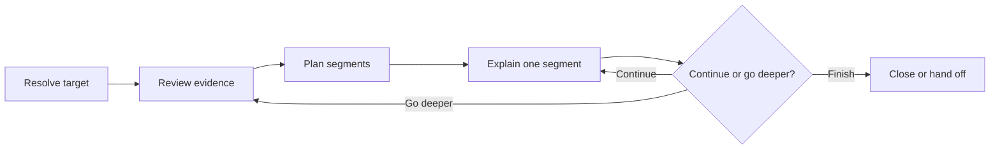

Use `/rpi-walkthrough` when you want to understand code or an artifact before
deciding what to change. The walkthrough traces the target first, divides it
into coherent segments, and explains one segment at a time with links to the
relevant evidence.

The skill is read-only by default. It records a decisions-and-changes ledger
only when you make a material decision or request a change during the
conversation.

## Start a Walkthrough

Invoke the skill with a target and optional detail level:

```text
/rpi-walkthrough target=README.md detail=deep
```

You can also use an open or attached file as the target:

```text
/rpi-walkthrough detail=normal chat
```

The available inputs are:

| Input           | Purpose                                                                          |
|-----------------|----------------------------------------------------------------------------------|
| `target=...`    | Select a file, feature, UI or UX area, library, or `.copilot-tracking` artifact  |
| `detail=brief`  | Focus on purpose, structure, and the main flow                                   |
| `detail=normal` | Balance the main flow with important implementation details; this is the default |
| `detail=deep`   | Trace detailed behavior, dependencies, and design rationale                      |
| `chat`          | Use the current conversation to refine the target and starting point             |

When no target can be inferred, the skill asks what you want to explore. When
several unrelated targets match, it asks you to choose one before continuing.

## Follow the Segment Loop

Before the explanation begins, the walkthrough reviews the target and plans a
sequence that follows its real structure. A code walkthrough might move from
an entry point through control flow and key dependencies. An artifact
walkthrough usually follows its sections in reading order.



Each segment includes:

* A heading that shows your current position
* An explanation of what the segment does, how it connects, and why it exists
* Inline links and a reference table pointing to the relevant files and lines
* One or two questions that let you continue or request more depth

Before the first segment, the walkthrough includes an overview diagram when the
target has meaningful structure or flow. A later segment includes a focused
diagram only when it clarifies relationships not already clear from the overview
and prose.

The skill pauses at each segment boundary. You control the pace and can change
the detail level during the walkthrough.

## Capture Decisions and Requested Changes

An explanation alone does not create an artifact. When you make a material
decision or request a change, the skill creates a dated ledger at:

```text
.copilot-tracking/walkthroughs/{{YYYY-MM-DD}}/{{task_slug}}-decisions.md
```

The ledger keeps the request connected to the evidence that prompted it. Each
entry is reconciled as applied now, handed off to RPI work, deferred, or
declined. The walkthrough does not modify source files unless you explicitly
ask it to apply the requested change now and the change is safely scoped.

For example, after learning how an authentication path handles expired tokens,
you might request consistent audit logging. The walkthrough records that
request and its disposition without interrupting the remaining explanation.

## Continue into RPI Work

A walkthrough may use `/rpi-research` to gather external evidence needed for an
accurate explanation. In a standalone walkthrough, it does not automatically
continue into downstream RPI work. At closeout, it recommends the smallest
applicable RPI command when a ledger entry was handed off or still needs further
work:

| Need                                                       | Recommended command |
|------------------------------------------------------------|---------------------|
| A decision depends on missing evidence                     | `/rpi-research`     |
| A requested change needs a durable implementation strategy | `/rpi-plan`         |
| A scoped, approved change is ready to apply                | `/rpi-implement`    |
| Completed work needs acceptance review                     | `/rpi-review`       |
| Several lifecycle stages need coordination                 | `/rpi-quick`        |

When an active RPI parent workflow owns continuation, the walkthrough returns
the ledger and evidence to that parent instead of selecting the next command.
When no decision or requested change needs follow-up, it closes without an RPI
handoff.

## Next Steps

* [Understanding the RPI Workflow](./) - Choose the RPI entry surface that owns your next action
* [Using RPI Together](using-together) - See how RPI lifecycle concepts connect through durable evidence
* [Context Engineering](context-engineering) - Manage conversation context across longer workflows

---

<!-- markdownlint-disable MD036 -->
*🤖 Crafted with precision by ✨Copilot following brilliant human instruction,
then carefully refined by our team of discerning human reviewers.*
<!-- markdownlint-enable MD036 -->
