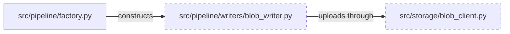
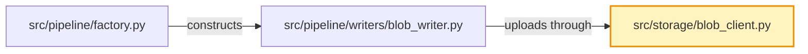

This guide walks through an evidence-led RPI lifecycle for a complex task. `RPI Agent` is a user-selected lifecycle wrapper, and `/rpi-quick` is a skill-based full-flow entry point. They activate the same phase skills, use one task identity, and do not require an autonomous pipeline of specialized task workers.

## The Complete Workflow

```text
┌────────────────────┐     ┌─────────────────────┐     ┌────────────────────┐     ┌────────────────────┐
│ Research readiness │ ──→ │ Plan                │ ──→ │ Implement          │ ──→ │ Review             │
│                    │     │ rpi-plan            │     │ rpi-implement      │     │ rpi-review         │
│ Reuse evidence or  │     │ Goals, task context,│     │ Direct execution,  │     │ One reconciliation │
│ research a gap     │     │ critique            │     │ changes, validation│     │ record and routing │
└────────────────────┘     └─────────────────────┘     └────────────────────┘     └────────────────────┘
     │                                                                    │
     │ demonstrated gap                                                   │ routes open work
     ▼                                                                    ▼
   rpi-research                                                         Follow-up
   research/{{YYYY-MM-DD}}/{{task_slug}}-research.md                    earliest stage or next item
```

## Critical Rule: Manage Context Deliberately

Use `/clear` or start a new chat when a long lifecycle has accumulated context, when switching tasks, or when a fresh context will improve the next responsible action. A reset does not require new research or a full lifecycle restart.

Why this matters:

* Accumulated context can obscure evidence, decisions, and the next owner.
* Durable task artifacts carry context through a reset or a later session.
* Stable IDs and markers locate the relevant scope when surrounding prose changes.

For the deeper explanation of how LLM context affects agent behavior, see [Context Engineering](context-engineering).

## Walkthrough: Adding Azure Blob Storage

Let's walk through adding Azure Blob Storage to a Python data pipeline.

### Research Readiness

1. Assess the available task context, acceptance criteria, decisions, dependencies, and completed research. For this Azure Blob Storage example, external SDK choices, authentication, and large-file streaming demonstrate a research gap.

2. Use `/rpi-research` for that bounded gap:

```text
/rpi-research Azure Blob Storage integration for Python data pipeline
```

1. Provide additional context in your message:

```text
I need to add Azure Blob Storage integration to our Python data pipeline.
The pipeline currently writes to local disk in src/pipeline/writers/.

Research:
- Azure SDK for Python blob storage options
- Authentication approaches (managed identity vs connection string)
- Streaming uploads for files > 1GB
- Error handling and retry patterns

Focus on approaches that match our existing patterns in the codebase.
```

1. `/rpi-research` will:

   * Search your codebase for existing patterns
   * Research Azure SDK documentation
   * Evaluate authentication options
   * Create a research document with recommendations

2. Review the output:

```text
## 🔬 Research: Azure Blob Storage Integration

✅ Research document created at:
.copilot-tracking/research/2025-01-28/blob-storage-research.md

Key findings:
- Recommended: azure-storage-blob SDK with async streaming
- Authentication: Managed identity for production, connection string for dev
- Existing pattern: WriterBase class in src/pipeline/writers/base.py
```

### Plan

1. Open or reference the research artifact. If the conversation has accumulated unrelated detail, begin a fresh context.
2. Use `/rpi-plan` with the available evidence:

   ```text
   /rpi-plan
   ```

3. Provide additional planning guidance:

   ```text
   /rpi-plan
   Focus on:
   - The streaming upload approach recommended in the research
   - Phased rollout: storage client first, then writer class, then integration
   - Include error handling and retry logic
   ```

4. Review the output. `/rpi-plan` creates one task-centered plan and an independent critique:

   ```text
   .copilot-tracking/plans/2025-01-28/blob-storage-plan.md
   .copilot-tracking/reviews/plans/2025-01-28/blob-storage-plan-critique.md
   ```

5. Verify the plan structure. The plan opens with an executive summary and a diagrammed `## Phase Checklist`; supporting sections such as decisions, readiness, requirements, and sources follow it:

````markdown
## Phase Checklist



<!-- rpi:phase id=P01 -->
### [ ] P01: Storage Client Setup

Goals:
* Establish a storage boundary that can upload pipeline output through the supported Azure Blob interface.

Dependencies:
* None



<!-- rpi:task id=P01-T01 -->
#### [ ] P01-T01: Create BlobStorageClient class

Goals:
* Pipeline code can stream content to Azure Blob Storage without depending directly on SDK client construction.

Requirements:
* FR-001, NFR-002
* Upload failures surface as the pipeline's existing error types, not raw SDK exceptions.
* A caller can upload a stream through the storage boundary and receive a clear success or failure result.

Details:
* Research found no existing storage abstraction; `WriterBase` is the only contract writers share today.
* Follow the async client pattern already used by the queue integration rather than introducing a second style.
* Add unit tests for successful upload and SDK error translation alongside the existing writer tests.

References:
* [src/pipeline/writers/base.py](../../../src/pipeline/writers/base.py): existing writer contract
* [.copilot-tracking/research/2025-01-28/blob-storage-research.md](../../research/2025-01-28/blob-storage-research.md):
  * Q1 under `## Findings` recommends `azure.storage.blob.aio.BlobClient.upload_blob` for streaming uploads.

Dependencies:
* None

<!-- rpi:phase id=P02 -->
### [ ] P02: Writer Implementation

<!-- rpi:task id=P02-T01 -->
#### [ ] P02-T01: Create BlobWriter extending WriterBase

<!-- rpi:phase id=P03 -->
### [ ] P03: Integration
````

Use `Pxx` and `Pxx-Txx` IDs, headings, and markers to navigate the plan. They remain stable when surrounding text changes. Code, commands, and symbols use backticks, and existing files are Markdown links relative to the plan so you can open them from the editor.

`/rpi-plan` owns the complete plan. Planning subagents default to `adaptive`: they are preferred for large, relatively independent phases. Set `delegation=never` to keep planning inline or `delegation=always` to require a bounded subagent assignment for every phase. `rpi-plan-critique` independently assesses the complete plan once.

### Implement

1. Open or reference the plan and critique artifacts. Use a fresh context only when accumulated conversation detail would impede the approved work.
2. Use `/rpi-implement` to execute directly and flexibly within the approved scope:

   ```text
   /rpi-implement plan=.copilot-tracking/plans/2025-01-28/blob-storage-plan.md task=P01-T01
   ```

3. Review change evidence as each approved task completes. The changes record uses descriptive headings tied to plan markers rather than per-entry IDs. After `P01` completes:

```text
### Add BlobStorageClient behind the writer contract

* Related phase or task: P01-T01
* Files: src/storage/blob_client.py
* Validation: Passed

P01-T01 and P01-T02 have completion evidence; P01 is checked.
```

Check the code and validation evidence, then continue to the next approved `Pxx` or `Pxx-Txx` item.

If implementation requires a significant departure from the approved plan, record the discovery in the changes record, obtain any required decision, and update the affected plan tasks before dependent work resumes. Preserve the existing critique as historical evidence; do not run it again. Ordinary local judgment and non-material updates remain in Implement.

When a completed task creates something a later task needs, such as a new class or contract path the plan did not name, implementation adds a `Guidance:` block to that later task so the next agent does not have to rediscover it.

1. When the in-scope implementation is ready for review, hand off the plan, critique disposition, and changes record:

```text
Implementation complete!

Changes record: .copilot-tracking/changes/2025-01-28/blob-storage-changes.md

Files created (3):
- src/storage/blob_client.py
- src/pipeline/writers/blob_writer.py
- tests/integration/test_blob_writer.py

Files modified (2):
- src/config/schema.py
- src/pipeline/factory.py

Ready for review.
```

### Review

1. Open or reference the complete evidence set. Begin a fresh context only when it will help evidence reconciliation.
2. Use `/rpi-review` to reconcile the implementation:

   ```text
   /rpi-review task=blob-storage
   ```

3. `/rpi-review` creates or updates one review record:

   * Locates research, the task-centered plan, plan critique, changes, and validation evidence
   * Dispatches one selected review worker (a phase-matched subagent such as `RPI Review Builder`, or a general-purpose subagent) to compare each `Pxx` and `Pxx-Txx` item with completion and change evidence
   * Assesses implementation-time plan updates, critique dispositions, and plan follow-up items
   * Records severity-graded `RV-xxx` findings, separate execution status and outcome, validation evidence or `Unavailable`, and proposed routing
   * Keeps final outcome and route decisions with the review parent in `## Parent Decision Record`; in a standalone review you walk through each actionable finding and choose its route

4. Review the findings:

```text
## ✅ Review: Blob Storage Integration

| Summary           |                                                                  |
|-------------------|------------------------------------------------------------------|
| Review Record     | .copilot-tracking/reviews/logs/2025-01-28/blob-storage-review.md |
| Execution Status  | Complete                                                         |
| Outcome           | Defects found                                                    |
| Critical Findings | 0                                                                |
| Medium Findings   | 1                                                                |
| Low Findings      | 1                                                                |
| Residual Work     | 1                                                                |

RV-001 [Medium]: Missing docstring on BlobStorageClient.upload_stream().
Destination: rpi-implement

RV-002 [Low]: Consider adding retry count to configuration schema.
Destination: distinct follow-up

Follow-up item:
- Add performance benchmarks for large file uploads (deferred from research)

Return RV-001 to a later `rpi-implement` invocation.
```

1. Address findings through their recorded next owner:

   * Address each `RV-xxx` finding through its recorded next owner
   * Return the implementation defect in `RV-001` to a later `rpi-implement` invocation
   * Resolve or explicitly accept material findings before committing
   * Track residual work as a distinct follow-up item

### Follow-up

Review routes work rather than silently looping it through a generic worker chain:

* Defects return to `rpi-implement`.
* Decision gaps return to `rpi-plan`.
* Evidence gaps return to `rpi-research`.
* Residual work becomes a distinct next item.

## Artifact Summary

After completing RPI, you have:

| Artifact               | Location                                                                        | Purpose                                                  |
|------------------------|---------------------------------------------------------------------------------|----------------------------------------------------------|
| Research, when it runs | `.copilot-tracking/research/{{YYYY-MM-DD}}/{{task_slug}}-research.md`           | Evidence and recommendations                             |
| Plan                   | `.copilot-tracking/plans/{{YYYY-MM-DD}}/{{task_slug}}-plan.md`                  | Goals, task context, requirements, decisions, and status |
| Plan critique          | `.copilot-tracking/reviews/plans/{{YYYY-MM-DD}}/{{task_slug}}-plan-critique.md` | Independent planning credibility assessment              |
| Changes                | `.copilot-tracking/changes/{{YYYY-MM-DD}}/{{task_slug}}-changes.md`             | Implementation, validation, and handoff evidence         |
| Review                 | `.copilot-tracking/reviews/logs/{{YYYY-MM-DD}}/{{task_slug}}-review.md`         | Reconciliation, `RV-xxx` findings, outcome, and routing  |
| Code                   | Your source directories                                                         | Working implementation                                   |

## Common Patterns

### Returning to Research

If implementation or review reveals a demonstrated evidence gap:

1. Record the gap and its affected task scope.
2. Return to `/rpi-research` for the bounded investigation.
3. Update planning only when the evidence changes the approved scope, decision, or acceptance criteria.
4. Resume the earliest affected lifecycle concept from the durable artifacts.

### Handling Complex Tasks

For very large tasks:

1. Break work into distinct task identities where the outcomes are independently reviewable.
2. Reuse adequate research from prior work rather than repeat it.
3. Keep each plan, critique, changes, and review artifact set dated and task-specific.
4. Build incrementally.

### Team Handoffs

RPI artifacts support handoffs:

* Research doc explains decisions
* The task-centered plan shows remaining `Pxx` and `Pxx-Txx` work and the context needed to implement it
* Changes record shows completed work, validation, and implementation-time plan updates with their rationale
* Review record shows separate execution status, outcome, findings, and routing

## Review Routing

The Review concept routes findings to the earliest responsible lifecycle concept or a distinct Follow-up item.

### Iteration Paths

| Review result        | Action                             | Target phase or owner |
|----------------------|------------------------------------|-----------------------|
| Conformant           | Commit changes                     | Done                  |
| Defects found        | Fix implementation issues          | Implement             |
| Research-gap finding | Investigate missing context        | Research              |
| Decision-gap finding | Revise supported scope or decision | Plan                  |
| Residual work        | Create distinct follow-up work     | Follow-up owner       |

### Defect Flow

When `/rpi-review` identifies Critical or High findings:

1. Open the review log in your editor.
2. Use `/rpi-implement` to address implementation findings.
3. Preserve the relevant changes and validation evidence.
4. Preserve the implementation and validation evidence; the original Review remains the task's review record.

### Research and Planning Flow

When `/rpi-review` identifies research or planning gaps:

1. Open the review log and the referenced task artifacts.
2. Choose the appropriate direct phase skill:
   * `/rpi-research` for a demonstrated missing-evidence gap.
   * `/rpi-plan` for a decision gap or unsupported plan assumption.
3. Resume from the earliest affected lifecycle concept.

## Quick Reference

| Lifecycle concept     | Direct skill       | Output                                                                |
|-----------------------|--------------------|-----------------------------------------------------------------------|
| Research, when needed | `/rpi-research`    | `.copilot-tracking/research/{{YYYY-MM-DD}}/{{task_slug}}-research.md` |
| Plan                  | `/rpi-plan`        | Task-centered plan and critique                                       |
| Implement             | `/rpi-implement`   | Source changes and changes evidence                                   |
| Review                | `/rpi-review`      | One review record with status, outcome, and routing                   |
| Follow-up             | Routed from review | Earliest responsible stage or a distinct next item                    |

> [!TIP]
> `RPI Agent` and `/rpi-quick` are alternative lifecycle entry surfaces for the same phase skills. They use research readiness and do not require fresh research or every lifecycle concept in one conversation.

For a long lifecycle, resume with the stable task ID, `Pxx`, `Pxx-Txx`, headings, and `<!-- rpi:... -->` markers in the durable artifacts.

## RPI Entry Surfaces

Choose the entry surface that best fits the task. Both `RPI Agent` and `/rpi-quick` activate the same phase skills.

| Entry surface       | Use it when                                  | Contract                                                                     |
|---------------------|----------------------------------------------|------------------------------------------------------------------------------|
| `RPI Agent`         | You want a user-selected lifecycle wrapper   | Activates applicable phase skills from research readiness; manual by default |
| `/rpi-quick`        | You want a skill-based full-flow entry point | Same lifecycle contract and one task identity                                |
| Direct phase skills | The next responsible action is already known | Bounded Research, Plan, Implement, or Review work                            |

### Manual and Automatic Mode in RPI Agent

`RPI Agent` starts in manual mode: it stays in the active phase until you invoke the next `/rpi-*` command or select a phase handoff. Choose **Full Auto** to request an automatic session. The agent asks whether it should resolve ordinary Research and Plan decisions itself or pause for you to retain decisions in either phase, then continues through Review without routine approval prompts. It still stops for blockers, required human review, and any destructive or externally visible action.

After Review, an automatic session presents ranked follow-up choices alongside **Stop automatic session** and **Switch to manual mode**. Selecting a follow-up starts a child task from Research with the completed task recorded as its parent. Review-item decisions are agent-owned in automatic mode unless you explicitly retain them.

Both modes persist one JSON state record with the task identity, mode, active phase, artifact pointers, decisions, blockers, and ranked follow-ups, so a later conversation can resume from the recorded phase.

## Resuming a Long Lifecycle

A long lifecycle can accumulate context. Resume from the durable RPI artifact set rather than relying on a conversation transcript:

1. Open or reference the dated artifact that establishes the next action.
2. Use the stable task ID, `Pxx`, `Pxx-Txx`, headings, and `<!-- rpi:... -->` markers to find the affected scope.
3. Start a fresh chat or use `/compact` only when it will improve the next responsible action.
4. Treat the durable artifact set, rather than the conversation transcript, as the source of truth.

> [!TIP]
> For the full explanation of how context affects the lifecycle, see [Context Engineering](context-engineering).

See the [RPI Agent reference](../reference/agents/hve-core/rpi-agent) for the agent's state contract and handoffs.

## Related Guides

* [RPI Overview](./) - Understand the workflow
* [Why the RPI Workflow Works](why-rpi) - Understand the rationale for phase separation
* [Context Engineering](context-engineering) - Why context management matters

---

<!-- markdownlint-disable MD036 -->
*🤖 Crafted with precision by ✨Copilot following brilliant human instruction,
then carefully refined by our team of discerning human reviewers.*
<!-- markdownlint-enable MD036 -->
