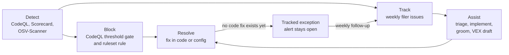

## Policy

Every code-scanning alert on `microsoft/hve-core` is resolved in code or configuration. Nobody dismisses an alert in the GitHub UI, for any reason, including "false positive", "won't fix", or "used in tests". A dismissed alert disappears from the default alert list, from the weekly issue filer, and from anyone triaging the Security tab, while the code that produced it stays in place.

When a finding truly cannot be fixed yet, it goes through a [tracked exception](#tracked-exceptions). The alert stays open, the CI gate lists it, and an issue with an owner and an expiry date tracks the real fix.

> [!IMPORTANT]
> If you find a dismissed alert, reopen it and treat it as an open finding. The weekly filer reopens the conversation automatically by filing an issue for any dismissed alert that is still detected.

## Lifecycle at a Glance



## Detection

| Source                   | What it finds                                                                                                            | When it runs                                                                            |
|--------------------------|--------------------------------------------------------------------------------------------------------------------------|-----------------------------------------------------------------------------------------|
| CodeQL                   | Security and quality findings in `actions`, `python`, and `javascript-typescript` source, plus the delivered slide decks | Pull requests, pushes to `main`, Sundays at 2 AM and 4 AM UTC                           |
| OpenSSF Scorecard        | Repository posture, including branch protection and known-vulnerable dependencies                                        | Sundays at 3 AM UTC and on pushes to `main`                                             |
| OSV-Scanner (VEX)        | Dependency advisories not yet triaged in `security/vex/hve-core.openvex.json`                                            | Tuesdays at 8 AM UTC                                                                    |
| zizmor                   | GitHub Actions security audits at the `pedantic` persona, with `--no-ignores`                                            | Pull requests, pushes to `main` that touch workflows or actions, Mondays at 4:30 AM UTC |
| Workflow validator       | GitHub workflow-parser errors, custom workflow checks, and ShellCheck results in `run:` scripts                          | Pull requests                                                                           |
| Tool version consistency | Hard-coded tool versions, digests, and runtimes that differ from `scripts/security/tool-checksums.json`                  | Pull requests                                                                           |
| Action pin provenance    | Action pins whose commit is not on an upstream tag or default branch, or whose comment names the wrong tag               | Pull requests                                                                           |
| Dependency pinning       | Unpinned dependencies, one rule per dependency type                                                                      | Pull requests and the weekly security maintenance run                                   |
| Poutine                  | Supply-chain risks in GitHub Actions workflows; advisory, not gated                                                      | Pull requests and the weekly security maintenance run                                   |

The scanners that run only from pull requests have no analysis on `main`, so their alerts appear on pull-request branches, and the weekly exception status reports their tracked exceptions as not observed rather than closed.

CodeQL runs the `security-extended` and `security-and-quality` suites. Generated slide decks have their own category because they inline third-party Reveal.js; fix their findings in the deck source or the slide bundler, never in the generated HTML.

## Blocking New Findings

Two controls keep a new finding from reaching `main`.

### CodeQL threshold gate

After each CodeQL analysis uploads its results, `scripts/security/Test-CodeQLSarifThreshold.ps1` reads the SARIF output and fails the job when a result meets the threshold:

* a security result with `security-severity` of 4.0 or higher (medium, high, or critical), or
* a result from a rule without a security severity whose level is `error` or `warning`.

Note-level quality results pass the gate but still appear as alerts, and you still resolve them. Inline SARIF suppressions do not exempt a result, and a missing or unreadable SARIF file fails the job.

The gate accepts SARIF from any code-scanning tool and attributes each result to its tool name. Scanners gated at zero findings run it with `-Threshold All`, which fails every result regardless of level or severity: zizmor, the workflow validator, the tool version and action pin provenance checks, and dependency pinning. Each scanner writes its SARIF first, so a tracked exception applies to its results the same way.

A newly adopted scanner's gate becomes blocking only once each of its findings is fixed or registered as a tracked exception with its upstream report. Until then its findings still upload and appear as alerts; nothing is suppressed while the gate waits.

The gate runs inside the CodeQL job, which feeds `PR Validation Success`. That matters for the merge queue: GitHub's ruleset code-scanning protection does not evaluate merge-queue groups, but the gate does, because the queue runs the same validation. The gate counts every finding at the threshold, not only new ones, so a red gate on `main` means the baseline is no longer clean.

To reproduce a gate result locally, download the analysis SARIF and run:

```powershell
npm run security:codeql-gate -- -SarifPath ./python.sarif
```

### Ruleset code-scanning rule

Administrators configure a CodeQL code-scanning rule on the `main` ruleset that blocks a pull request introducing an alert at the same threshold; [Branch Protection](branch-protection.md) records the current ruleset settings.
The rule has no exception concept. If a [tracked exception](#tracked-exceptions) covers a finding on lines a pull request changes, that pull request needs an administrator to merge past the rule. The ruleset audit trail records the bypass, and the exception entry and its issue are the justification for it.

## Tracking

The [Weekly GitHub Code Scanning](https://github.com/microsoft/hve-core/blob/main/.github/workflows/weekly-gh-code-scanning.yml) workflow runs Mondays at 3 AM UTC and files or updates one issue per rule. Every issue it files is labeled `security`, `automated`, and `code-scanning`, so no automated issue waits on a triage pass. A hidden body marker identifies the kind of issue and keeps reruns updating the same issue instead of filing duplicates.

| Issue kind                   | Marker                                                    | What it asks for                                                                                          |
|------------------------------|-----------------------------------------------------------|-----------------------------------------------------------------------------------------------------------|
| Open alert                   | `automation:security-scan:<rule>`                         | Find the root cause and resolve it in code or configuration                                               |
| Dismissed but still detected | `automation:security-scan-dismissed:<rule>`               | Reopen the alert, then resolve it; the earlier dismissal does not count as a resolution                   |
| Tracked exception follow-up  | `automation:code-scanning-exception:<tool>:<rule>:<path>` | The exception's issue was closed while the finding persists; fix it or renew the exception through review |
| Upstream watch triggered     | `automation:upstream-watch:<id>`                          | An upstream condition a workaround waits on is met; retire the workaround and remove the watch            |

For each tracked exception, the same run also keeps one status comment current on the exception's issue, showing the tool, rule, path, kind, pinned count, upstream report and whether it is still open, expiry, days left, and the alert state.
The alert state is open (with the open count), closed when the tool analyzed `main` and the alert is gone, or not observed when the tool has no analysis on `main`. Only a closed alert prompts removing the exception. A closed upstream report is the cue to check whether the fix has shipped and retire the exception.

### Upstream watches

[`security/upstream-watches.yml`](https://github.com/microsoft/hve-core/blob/main/security/upstream-watches.yml) lists the upstream conditions that let a workaround or tracked exception retire: an upstream issue closing, a newer upstream release, a runner label reaching a minimum runner version, or a capability probe changing outcome.
Add a watch in the same change that adds the workaround. The weekly run evaluates every watch and opens one issue per triggered watch. Issue and release watches query GitHub.
Probe-outcome watches read the capability probes that `gh-code-scanning.yml` runs against the newest `@actions/workflow-parser` release; when the probe job fails, those watches report unknown.
A `runner-version` watch needs a matching static `Runner probe (<label>)` job in `gh-code-scanning.yml`; none is configured today. A watch it cannot evaluate is reported as a warning, never as triggered.

## Agentic Workflows

The repository's agentic workflows follow the same policy:

* Issue triage recognizes human-filed issues about a code-scanning alert, a Scorecard finding, or an exception, labels them `security`, links this page, and flags any request to dismiss an alert as contrary to policy. It skips bot-filed issues because the filer labels them completely.
* Issue implementation fixes the code. It never dismisses an alert, adds a CodeQL exclusion, query filter, inline suppression, `__all__` export, or allowlist entry, and never adds an exception. When no code fix exists, it comments with its evidence and stops so a maintainer can decide.
* Backlog grooming never recommends closing an issue whose alert, exception, or advisory is still open, and lists exceptions that expire within 14 days.
* VEX drafting links the upstream-bump issue for an advisory with no patched release, or asks the reviewer to file one.

## Resolving a Finding

1. Open the alert and read the rule's documentation to understand what the query detects.
2. Find the root cause. A finding in a test, a generated file, or vendored code is still a finding; change the test, the generator, or the bundler rather than the alert.
3. Fix it in code or configuration, with a test that would fail if the problem came back.
4. Open a pull request. Its CodeQL run must report no result for the rule, and the threshold gate must pass.
5. After the change merges, confirm the alert shows **Fixed** on `main`, then close the tracking issue.

Do not add paths to `.github/codeql/` ignore lists, add query filters, or restructure code only to hide a pattern from a query. Those approaches remove the evidence without removing the problem.

## Tracked Exceptions

An exception is the only way to let the gate pass while a finding remains. It applies to any tool the gate evaluates, and only to one of these kinds, after the problem is reported upstream:

* `false-positive`: the analyzer is demonstrably wrong.
* `generated-code`: the finding is in output of a generator this repository does not author.
* `third-party`: code or behavior this repository cannot patch.
* `platform-limitation`: the platform cannot yet support the fix.

1. File the upstream report, then open an issue that explains the evidence and links it.
2. Add an entry to [`security/code-scanning-exceptions.yml`](https://github.com/microsoft/hve-core/blob/main/security/code-scanning-exceptions.yml) with the exact SARIF tool name, the exact rule ID, the exact repository-relative path, the exact number of matching results (`count`), the `kind`, the `upstream` report URL, the issue number, an owner, a one-line reason, and an `expires` date no more than 90 days out.
3. Get the change reviewed like any other pull request.

While the exception is active:

* the alert stays open on GitHub;
* the gate lists each result as excepted, with its kind, issue, upstream report, and expiry;
* the weekly workflow keeps a status comment current on the issue, and files a new issue if the linked one is closed while the finding persists.

The gate fails when an entry has expired, expires more than 90 days out, is missing a field, has an unknown field or kind, matches a different number of results than its `count` in either direction, or no longer matches a result. Pinning the count means a new finding cannot hide under an existing entry. Renewing an exception is a new review, not an edit to the date alone; restate why the fix is still blocked.

## Unpatched Dependency Advisories

A dependency advisory with no patched release cannot be fixed by an upgrade. It is handled in two places:

* A VEX statement in [`security/vex/hve-core.openvex.json`](https://github.com/microsoft/hve-core/blob/main/security/vex/hve-core.openvex.json) records whether this repository is affected, with code evidence for the status. See [VEX Verification](vex-verification.md) for how the document is published.
* An assigned upstream-bump issue tracks the upgrade once a patched release ships. The related Scorecard alert stays open until then.

Neither step adds an `audit-ci.json` allowlist entry or an allowed-advisory entry in the dependency-review workflow. If an advisory starts failing pull requests before a fix exists, raise it with the maintainers instead of adding an allowlist entry.

## Roles

| Role                   | Responsibilities                                                                                                                                  |
|------------------------|---------------------------------------------------------------------------------------------------------------------------------------------------|
| Contributors           | Fix findings your change introduces; resolve auto-filed issues you pick up; propose an exception only with an issue and upstream report           |
| Reviewers              | Confirm a fix removes the root cause; reject dismissals, ignore-list additions, and suppressions; review exception entries and their expiry dates |
| Maintainers and admins | Keep the ruleset's code-scanning rule in place; perform and justify any bypass merge for an excepted finding; reopen any alert found dismissed    |

## Related Resources

* [Branch Protection](branch-protection.md): ruleset configuration for `main`
* [Security Model](security-model.md): threats and the controls that address them
* [VEX Verification](vex-verification.md): the published OpenVEX document
* [Security Scripts](https://github.com/microsoft/hve-core/blob/main/scripts/security/README.md): the threshold gate script and its parameters

---

🤖 *Crafted with precision by ✨Copilot following brilliant human instruction, then carefully refined by our team of discerning human reviewers.*
