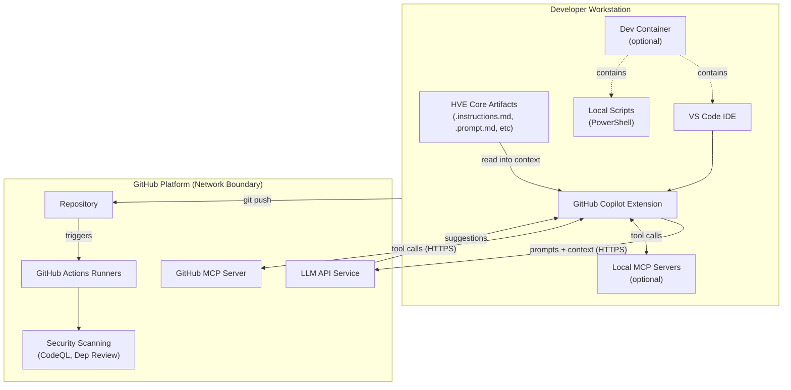

## Executive Summary

HVE Core is an enterprise prompt engineering framework for GitHub Copilot consisting of:

* Markdown-based prompt artifacts (instructions, prompts, agents, skills)
* PowerShell automation scripts for linting and validation
* GitHub Actions CI/CD workflows
* VS Code extension packaging utilities
* The Mural skill runtime: a Python CLI with an OAuth client, local token store, and outbound HTTP egress to Mural and Azure Blob endpoints
* The GitLab skill runtime: a Python REST CLI with public-client OAuth, a fixed loopback callback, a local profile store, and explicit legacy PAT support
* The Jira skill runtime: a Python REST CLI with environment credentials and scoped routing to Atlassian's resource API

Most of the repository contains no runtime services, databases, or user data storage and is targeted primarily by supply chain and developer workflow threats.
The Mural, GitLab, and Jira skills are runtime exceptions. Mural holds OAuth tokens in the OS keyring or a mode-`0600` plaintext file fallback. GitLab holds profile-bound OAuth access and refresh tokens in an owner-only POSIX local store and fails closed for OAuth persistence on Windows. Jira reads expiring Cloud API tokens or Data Center PATs from the environment without persistence.
Threats specific to these runtimes are analyzed in the [OAuth Authentication Threats](#oauth-authentication-threats), [Jira Credential Threats](#jira-credential-threats), [GitLab Credential Threats](#gitlab-credential-threats), and [Mural Skill Runtime Hardening](#mural-skill-runtime-hardening) sections.
Security relies on defense-in-depth with 25+ automated controls validated through CI/CD pipelines.

### Security Posture Overview

| Category                 | Status  | Control Count | Automated |
|--------------------------|---------|---------------|-----------|
| Supply Chain Security    | Strong  | 9 controls    | 100%      |
| Code Quality             | Strong  | 9 controls    | 100%      |
| Access Control           | Strong  | 4 controls    | 100%      |
| Vulnerability Management | Strong  | 3 controls    | 100%      |
| Total                    | **25+** | **25**        | **100%**  |

## Contents

* [System Description](#system-description)
* [Trust Boundaries](#trust-boundaries)
* [Security Model](#security-model)
  * [STRIDE Threats](#stride-threats)
  * [Dev Container Threats](#dev-container-threats)
  * [AI-Specific Threats](#ai-specific-threats)
  * [Responsible AI Threats](#responsible-ai-threats)
  * [OAuth Authentication Threats](#oauth-authentication-threats)
  * [Jira Credential Threats](#jira-credential-threats)
  * [GitLab Credential Threats](#gitlab-credential-threats)
  * [TTS Voice-Over Threats](#tts-voice-over-threats)
* [Security Controls](#security-controls)
* [Assurance Argument](#assurance-argument)
* [MCP Server Trust Analysis](#mcp-server-trust-analysis)
* [Mural Skill Runtime Hardening](#mural-skill-runtime-hardening)
* [Skill Security Models](#skill-security-models)
* [Quantitative Security Metrics](#quantitative-security-metrics)
* [References](#references)

## System Description

### Components

HVE Core contains seven primary component categories:

1. **Prompt Engineering Artifacts** (`.github/instructions/`, `.github/prompts/`, `.github/agents/`, `.github/skills/`)
   * Markdown files with YAML frontmatter
   * Consumed by GitHub Copilot during development sessions
   * No executable code execution within prompts

2. **PowerShell Scripts** (`scripts/`)
   * Linting and validation utilities
   * CI/CD automation support
   * No external network connections except documented tool downloads

3. **GitHub Actions Workflows** (`.github/workflows/`)
   * PR validation pipeline
   * Security scanning (CodeQL, dependency review)
   * Release automation

4. **VS Code Extension** (`extension/`)
   * Packaging configuration
   * Extension manifest
   * No telemetry or data collection

5. **Mural Skill Runtime** (`.github/skills/experimental/mural/`)
   * Python CLI dispatched through `argparse`; an agent caller invokes it through a terminal tool, so stdout and stderr are captured into agent context
   * OAuth 2.0 Authorization Code + PKCE client with per-user on-disk token cache (mode `0600`)
   * Outbound HTTPS to the Mural REST API; trust posture detailed in [Mural Skill Runtime Hardening](#mural-skill-runtime-hardening) and [OAuth Authentication Threats](#oauth-authentication-threats)

6. **GitLab Skill Runtime** (`.github/skills/project-planning/gitlab/`)
   * Public-client PKCE and human-assisted device authorization
   * Fixed loopback callback, owner-only OAuth profile store, and HTTPS no-redirect API egress

7. **Jira Skill Runtime** (`.github/skills/project-planning/jira/`)
   * Environment-only Cloud API token or Data Center PAT
   * HTTPS no-redirect routing to a validated Jira origin or the fixed Atlassian resource origin

### Data Flow



### Security Inheritance from GitHub Copilot

HVE Core artifacts are consumed by GitHub Copilot, which provides foundational security:

| Inherited Control               | Provider       | HVE Core Responsibility                 |
|---------------------------------|----------------|-----------------------------------------|
| LLM input/output filtering      | GitHub Copilot | None; artifacts are Copilot inputs      |
| Token encryption in transit     | GitHub Copilot | None; handled by Copilot infrastructure |
| Organization policy enforcement | GitHub Copilot | Document compatible policy options      |
| Audit logging                   | GitHub Copilot | None; uses Copilot audit streams        |
| SOC 2 Type II compliance        | GitHub         | None; infrastructure control            |

## Trust Boundaries

### Boundary Diagram

```text
┌──────────────────────────────────────────────────────────────────────────────┐
│                    TRUST BOUNDARY: Repository Contents                       │
│  ┌────────────────────────────────────────────────────────────────────────┐  │
│  │                         Controlled Artifacts                           │  │
│  │  ┌────────────┐  ┌────────────┐  ┌────────────┐  ┌────────────────┐   │  │
│  │  │ Prompts    │  │ Scripts    │  │ Workflows  │  │ Documentation  │   │  │
│  │  │ .md files  │  │ .ps1 files │  │ .yml files │  │ .md files      │   │  │
│  │  └────────────┘  └────────────┘  └────────────┘  └────────────────┘   │  │
│  └────────────────────────────────────────────────────────────────────────┘  │
│                                      │                                       │
│  ┌───────────────────────────────────▼────────────────────────────────────┐  │
│  │                   TRUST BOUNDARY: CI/CD Pipeline                       │  │
│  │  ┌────────────┐  ┌────────────┐  ┌────────────┐  ┌────────────────┐   │  │
│  │  │ PR Valid.  │  │ CodeQL     │  │ Dep Review │  │ Release        │   │  │
│  │  │ Workflow   │  │ Analysis   │  │ Workflow   │  │ Workflow       │   │  │
│  │  └────────────┘  └────────────┘  └────────────┘  └────────────────┘   │  │
│  └────────────────────────────────────────────────────────────────────────┘  │
└──────────────────────────────────────────────────────────────────────────────┘
                                       │
     ┌─────────────────────────────────┼──────────────────────────────────┐
     │                                 ▼                                  │
     │            TRUST BOUNDARY: External Dependencies                   │
     │  ┌────────────┐  ┌────────────┐  ┌────────────┐  ┌──────────────┐ │
     │  │ npm        │  │ GitHub     │  │ PowerShell │  │ Third-party  │ │
     │  │ Packages   │  │ Actions    │  │ Gallery    │  │ MCP Servers  │ │
     │  └────────────┘  └────────────┘  └────────────┘  └──────────────┘ │
     └────────────────────────────────────────────────────────────────────┘
```

### Boundary Descriptions

| Boundary              | Assets Protected                       | Controls Enforced                                                     |
|-----------------------|----------------------------------------|-----------------------------------------------------------------------|
| Repository Contents   | Source code, prompts, scripts          | CODEOWNERS, branch protection, PR review                              |
| CI/CD Pipeline        | Build artifacts, security scan results | Minimal permissions, dependency pinning                               |
| External Dependencies | npm packages, Actions, MCP servers     | Dependency review, staleness monitoring                               |
| Dev Container         | Development environment, tooling       | SHA256 verification, first-party features                             |
| Mural Skill Runtime   | OAuth tokens, Mural API egress         | OS keyring / `0600` token cache, PKCE, loopback redirect URI          |
| GitLab Skill Runtime  | OAuth/PAT credentials, GitLab egress   | PKCE/device flow, fixed callback, owner-only store, no-redirect       |
| Jira Skill Runtime    | API token/PAT, Jira egress             | Environment-only credentials, scoped destination binding, no-redirect |

## Security Model

This section documents threats using [STRIDE](https://learn.microsoft.com/azure/security/develop/threat-modeling-tool-threats) methodology (Spoofing, Tampering, Repudiation, Information Disclosure, Denial of Service, Elevation of Privilege), supplemented with AI-specific and Responsible AI threat categories.

### STRIDE Threats

#### S-1: Compromised GitHub Action via Tag Substitution

| Field             | Value                                                                                |
|-------------------|--------------------------------------------------------------------------------------|
| **Category**      | Spoofing                                                                             |
| **Asset**         | CI/CD pipeline integrity                                                             |
| **Threat**        | Attacker compromises upstream Action repository and replaces tag with malicious code |
| **Likelihood**    | Medium (documented supply chain attacks exist)                                       |
| **Impact**        | High (full CI/CD compromise, secret exfiltration)                                    |
| **Mitigations**   | Dependency pinning for all Actions, staleness monitoring, CodeQL scanning            |
| **Residual Risk** | Low (SHA immutable; requires GitHub infrastructure compromise)                       |
| **Status**        | Mitigated                                                                            |

#### S-2: npm Package Substitution Attack

| Field             | Value                                                       |
|-------------------|-------------------------------------------------------------|
| **Category**      | Spoofing                                                    |
| **Asset**         | Build dependencies                                          |
| **Threat**        | Malicious package published with same name or typosquatting |
| **Likelihood**    | Medium (common attack vector)                               |
| **Impact**        | Medium (limited runtime exposure; primarily build-time)     |
| **Mitigations**   | Package-lock.json integrity, npm audit, dependency review   |
| **Residual Risk** | Low                                                         |
| **Status**        | Mitigated                                                   |

#### T-1: Unauthorized Modification of Security Controls

| Field             | Value                                                             |
|-------------------|-------------------------------------------------------------------|
| **Category**      | Tampering                                                         |
| **Asset**         | Workflow files, security scripts                                  |
| **Threat**        | Attacker with write access disables security checks               |
| **Likelihood**    | Low (requires compromised maintainer account)                     |
| **Impact**        | High (security controls bypassed)                                 |
| **Mitigations**   | CODEOWNERS enforcement, branch protection, PR review requirements |
| **Residual Risk** | Low                                                               |
| **Status**        | Mitigated                                                         |

#### T-2: Malicious Prompt Injection via PR

| Field             | Value                                                         |
|-------------------|---------------------------------------------------------------|
| **Category**      | Tampering                                                     |
| **Asset**         | Prompt artifacts                                              |
| **Threat**        | Contributor submits prompt with hidden malicious instructions |
| **Likelihood**    | Medium (social engineering possible)                          |
| **Impact**        | Medium (affects Copilot behavior for consumers)               |
| **Mitigations**   | PR review, CODEOWNERS, frontmatter validation                 |
| **Residual Risk** | Medium (semantic analysis not automated)                      |
| **Status**        | Partially Mitigated                                           |

#### T-3: Script Injection via Workflow Inputs

| Field                      | Value                                                                                                                                                                                                                                                                        |
|----------------------------|------------------------------------------------------------------------------------------------------------------------------------------------------------------------------------------------------------------------------------------------------------------------------|
| **Category**               | Tampering / Elevation of Privilege                                                                                                                                                                                                                                           |
| **Asset**                  | GitHub Actions `run:` and `github-script` steps                                                                                                                                                                                                                              |
| **Threat**                 | A workflow input interpolated directly into a shell command can alter command structure and execute unintended instructions on the workflow runner                                                                                                                           |
| **Likelihood**             | Low (fork execution requires maintainer approval; the reachable payload is a directory name rather than reviewable code)                                                                                                                                                     |
| **Impact**                 | Low (the reachable jobs already execute the pull request's own code under `contents: read` with no secrets, so injection grants no privilege the actor lacks)                                                                                                                |
| **Mitigations**            | Environment-variable isolation of every input not declared `type: boolean` (CQ-6); repository-derived project-path validation at all three project-discovery steps (CQ-7); deviation detection in the blocking dangerous-workflow gate (CQ-8); fork workflow approval (CQ-9) |
| **Residual Risk**          | Low                                                                                                                                                                                                                                                                          |
| **Status**                 | Mitigated                                                                                                                                                                                                                                                                    |
| **Source**                 | NIST SP 800-53 SI-10, SA-15; [CWE-94](https://cwe.mitre.org/data/definitions/94.html); [GitHub Actions secure use reference](https://docs.github.com/en/actions/reference/security/secure-use)                                                                               |
| **Trust Boundary Crossed** | Repository Contents ↔ GitHub Actions Runner                                                                                                                                                                                                                                  |
| **Detection**              | `dangerous-workflow/direct-input-interpolation` findings in PR validation and the Security tab                                                                                                                                                                               |

##### Traced path

The reachable instance of this threat ran from repository content to a shell context in three
hops. A project discovery step enumerated directories containing `pyproject.toml` from the
checked-out pull-request head and published the directory names as a JSON matrix through
`GITHUB_OUTPUT`. `fromJson` decoded that output into `matrix.directory`, which was forwarded
as the `working-directory` input to five reusable workflows. Those workflows interpolated the
input inside `run:` blocks, including single-quoted PowerShell assignments and a Bash command
substitution writing to `GITHUB_OUTPUT`. A contributor therefore controlled the value by
adding a directory whose *name* contained a shell metacharacter. JSON encoding protected the
output write but decoded before the downstream interpolation, so it did not protect the
consuming step.

##### Control layering and its boundaries

CQ-6 is the control that holds on the pull-request path, because an input read from a step-level
environment variable reaches the shell as data and is never parsed as command structure. CQ-7
rejects the hostile value earlier and is authoritative on merged-content paths, but on a pull
request the guard is part of the contributor's own checkout and is therefore a fail-fast signal
and a review artifact rather than a boundary against that contributor. CODEOWNERS review of
`/scripts/` and `/.github/` (AC-2) prevents a weakened guard from reaching the default branch.
CQ-9 prevents an unapproved fork pull request from executing at all, but it binds outside
contributors only and reviews a code diff, which is a weak signal against a payload carried in
a directory name.

##### Detection boundary

CodeQL's `actions/code-injection` query models untrusted sources as `github.event.*` values and
did not report this pattern, so CQ-1 is not credited with T-3 coverage. CQ-8 closes that gap for
direct input interpolation. Neither control performs general taint analysis, so an indirect
derivation through `matrix`, `needs`, `steps`, or `env` remains undetected by design.

##### Latent surface (sub-case)

`footer-exclude-paths`, `dependency-types`, and the numeric `fuzz-runs` are declared and
interpolated but are supplied by no current caller. They were unreachable by wiring rather than
by control, and a future caller passing a tainted value would have activated them. All three are
now covered by CQ-6 and CQ-8: the gate exempts only an input declared `type: boolean`, so a
`number` declaration is reported like any other non-boolean type rather than trusted.

#### R-1: Untraceable Configuration Changes

| Field             | Value                                                      |
|-------------------|------------------------------------------------------------|
| **Category**      | Repudiation                                                |
| **Asset**         | Repository configuration                                   |
| **Threat**        | Admin makes security-impacting changes without audit trail |
| **Likelihood**    | Low (GitHub provides audit logs)                           |
| **Impact**        | Medium (accountability gap)                                |
| **Mitigations**   | GitHub audit log, branch protection audit events           |
| **Residual Risk** | Low                                                        |
| **Status**        | Mitigated                                                  |

#### I-1: Secret Exposure in Logs or Artifacts

| Field             | Value                                                               |
|-------------------|---------------------------------------------------------------------|
| **Category**      | Information Disclosure                                              |
| **Asset**         | Repository secrets, tokens                                          |
| **Threat**        | Secrets accidentally logged or included in build artifacts          |
| **Likelihood**    | Low (minimal secret usage)                                          |
| **Impact**        | High (credential compromise)                                        |
| **Mitigations**   | GitHub secret masking, GitHub secret scanning, minimal secret usage |
| **Residual Risk** | Low                                                                 |
| **Status**        | Mitigated                                                           |

#### I-2: Sensitive Information in Prompt Artifacts

| Field             | Value                                                               |
|-------------------|---------------------------------------------------------------------|
| **Category**      | Information Disclosure                                              |
| **Asset**         | Prompt files, documentation                                         |
| **Threat**        | Internal URLs, API keys, or proprietary patterns exposed in prompts |
| **Likelihood**    | Low (review process catches obvious cases)                          |
| **Impact**        | Medium (information leakage)                                        |
| **Mitigations**   | PR review, GitHub secret scanning, documentation guidelines         |
| **Residual Risk** | Low                                                                 |
| **Status**        | Mitigated                                                           |

#### D-1: CI/CD Resource Exhaustion

| Field             | Value                                                             |
|-------------------|-------------------------------------------------------------------|
| **Category**      | Denial of Service                                                 |
| **Asset**         | GitHub Actions minutes, runner availability                       |
| **Threat**        | Malicious PR triggers expensive workflows repeatedly              |
| **Likelihood**    | Low (requires PR creation privileges)                             |
| **Impact**        | Low (billing impact, temporary delays)                            |
| **Mitigations**   | Workflow approval for first-time contributors, concurrency limits |
| **Residual Risk** | Low                                                               |
| **Status**        | Mitigated                                                         |

#### D-2: Dependency Confusion Blocking Builds

| Field             | Value                                                          |
|-------------------|----------------------------------------------------------------|
| **Category**      | Denial of Service                                              |
| **Asset**         | Build pipeline                                                 |
| **Threat**        | Attacker publishes conflicting package preventing clean builds |
| **Likelihood**    | Low                                                            |
| **Impact**        | Medium (build failures)                                        |
| **Mitigations**   | Package-lock.json, scoped packages                             |
| **Residual Risk** | Low                                                            |
| **Status**        | Mitigated                                                      |

#### E-1: Workflow Token Abuse

| Field             | Value                                                                                            |
|-------------------|--------------------------------------------------------------------------------------------------|
| **Category**      | Elevation of Privilege                                                                           |
| **Asset**         | GitHub Actions tokens                                                                            |
| **Threat**        | Compromised workflow step uses GITHUB_TOKEN beyond intended scope                                |
| **Likelihood**    | Low (minimal permissions declared)                                                               |
| **Impact**        | Medium (depends on token permissions)                                                            |
| **Mitigations**   | Minimal permissions pattern, persist-credentials: false, inline comments on elevated permissions |
| **Residual Risk** | Low                                                                                              |
| **Status**        | Mitigated with Documentation                                                                     |

##### Accepted Risk: Token-Permissions Alerts

The `Mitigated with Documentation` status above carries this documented acceptance. The threat-model spec uses the same term because the Microsoft Threat Modeling Tool recognizes a fixed state vocabulary that has no "accepted risk" value; see the state-mapping table in the [threat-models README](../planning/threat-models/README.md).

OpenSSF Scorecard Token-Permissions flags `security-events: write` as overly broad across workflow files. This permission is required for `github/codeql-action/upload-sarif` and `github/codeql-action/analyze` to upload SARIF results to the repository Security tab. The `security-events` scope grants access only to code scanning alert data and cannot modify repository content, settings, or secrets.

Scorecard's own `scorecard.yml` requires the same permission to publish results, creating a circular dependency in the token-permissions check.

Affected workflow jobs:

| Workflow                          | Job                          |
|-----------------------------------|------------------------------|
| `release-stable.yml`              | `dependency-pinning-scan`    |
| `release-stable.yml`              | `gitleaks-scan`              |
| `pr-validation.yml`               | `dependency-pinning-check`   |
| `pr-validation.yml`               | `workflow-permissions-check` |
| `pr-validation.yml`               | `gitleaks-scan`              |
| `pr-validation.yml`               | `codeql`                     |
| `security-scan.yml`               | `codeql`                     |
| `weekly-security-maintenance.yml` | `validate-pinning`           |
| `weekly-security-maintenance.yml` | `codeql-analysis`            |

Defense-in-depth controls:

* Workflows declare a top-level `permissions:` block, and every job under a populated block declares its own permissions rather than inheriting implicitly; `Test-WorkflowPermissions.ps1` enforces both
* `persist-credentials: false` set on all checkout steps
* Inline YAML comments document each `security-events: write` declaration
* SARIF upload is the only write operation performed under this permission

#### E-2: Branch Protection Bypass

| Field             | Value                                                            |
|-------------------|------------------------------------------------------------------|
| **Category**      | Elevation of Privilege                                           |
| **Asset**         | Protected branches                                               |
| **Threat**        | Admin bypasses branch protection to merge unauthorized changes   |
| **Likelihood**    | Low (requires admin access and intentional bypass)               |
| **Impact**        | High (security controls circumvented)                            |
| **Mitigations**   | Branch protection rules, audit logging, "Do not allow bypassing" |
| **Residual Risk** | Low                                                              |
| **Status**        | Mitigated                                                        |

### Dev Container Threats

These threats address risks in the development container configuration used for Codespaces and local container development.

#### DC-1: Feature Tag Substitution Attack

| Field             | Value                                                                    |
|-------------------|--------------------------------------------------------------------------|
| **Category**      | Spoofing                                                                 |
| **Asset**         | Dev container configuration                                              |
| **Threat**        | Malicious update to a feature version tag introduces compromised tooling |
| **Likelihood**    | Low (first-party Microsoft features only)                                |
| **Impact**        | Medium (development environment compromise)                              |
| **Mitigations**   | First-party features only, PR review of devcontainer.json changes        |
| **Residual Risk** | Low (Microsoft-maintained features with release controls)                |
| **Status**        | Mitigated                                                                |

#### DC-2: Lifecycle Script Tampering

| Field             | Value                                                           |
|-------------------|-----------------------------------------------------------------|
| **Category**      | Tampering                                                       |
| **Asset**         | Container initialization scripts                                |
| **Threat**        | Attacker modifies on-create.sh or post-create.sh to inject code |
| **Likelihood**    | Low (requires PR approval, CODEOWNERS protection)               |
| **Impact**        | High (arbitrary code execution in dev environment)              |
| **Mitigations**   | CODEOWNERS, PR review, branch protection                        |
| **Residual Risk** | Low                                                             |
| **Status**        | Mitigated                                                       |

#### DC-3: External Binary Download Compromise

| Field             | Value                                                       |
|-------------------|-------------------------------------------------------------|
| **Category**      | Spoofing                                                    |
| **Asset**         | External tools (gitleaks, shellcheck)                       |
| **Threat**        | Compromised download source serves malicious binary         |
| **Likelihood**    | Very Low (SHA256 verification enforced)                     |
| **Impact**        | High (malicious tooling in dev environment)                 |
| **Mitigations**   | SHA256 checksum verification in on-create.sh                |
| **Residual Risk** | Very Low (cryptographic verification prevents substitution) |
| **Status**        | Mitigated                                                   |

### AI-Specific Threats

These threats address risks specific to AI/ML systems as documented by [OWASP LLM Top 10](https://owasp.org/www-project-top-10-for-large-language-model-applications/) and [MITRE ATLAS](https://atlas.mitre.org/).

#### AI-1: Prompt Injection via Artifact Content

| Field             | Value                                                                  |
|-------------------|------------------------------------------------------------------------|
| **Category**      | LLM01: Prompt Injection (OWASP)                                        |
| **Asset**         | Copilot behavior, downstream code generation                           |
| **Threat**        | Malicious instructions embedded in prompt artifacts manipulate Copilot |
| **Likelihood**    | Medium                                                                 |
| **Impact**        | Medium (affects code generation quality and safety)                    |
| **Mitigations**   | PR review, CODEOWNERS, clear artifact structure guidelines             |
| **Residual Risk** | Medium (inherent to prompt-based systems)                              |
| **Status**        | Partially Mitigated                                                    |

#### AI-2: Insecure Output Handling

| Field             | Value                                                             |
|-------------------|-------------------------------------------------------------------|
| **Category**      | LLM02: Insecure Output Handling (OWASP)                           |
| **Asset**         | Generated code                                                    |
| **Threat**        | Copilot generates insecure code patterns based on prompt guidance |
| **Likelihood**    | Medium                                                            |
| **Impact**        | Variable (depends on consumer's review practices)                 |
| **Mitigations**   | Security-focused prompts, consumer code review responsibility     |
| **Residual Risk** | Medium (HVE Core provides guidance, not enforcement)              |
| **Status**        | Accepted with Documentation                                       |

#### AI-3: Training Data Poisoning (Indirect)

| Field             | Value                                                     |
|-------------------|-----------------------------------------------------------|
| **Category**      | LLM03: Training Data Poisoning (OWASP)                    |
| **Asset**         | Copilot model behavior                                    |
| **Threat**        | Malicious patterns in HVE Core influence Copilot training |
| **Likelihood**    | Very Low (Copilot training controlled by GitHub)          |
| **Impact**        | Low (HVE Core is small input to large training corpus)    |
| **Mitigations**   | Out of scope; GitHub controls training pipeline           |
| **Residual Risk** | Very Low                                                  |
| **Status**        | Accepted (Outside Control)                                |

#### AI-4: Model Denial of Service

| Field             | Value                                                           |
|-------------------|-----------------------------------------------------------------|
| **Category**      | LLM04: Model Denial of Service (OWASP)                          |
| **Asset**         | Copilot availability                                            |
| **Threat**        | Crafted prompts cause excessive resource consumption in Copilot |
| **Likelihood**    | Very Low                                                        |
| **Impact**        | Low (Copilot has rate limiting)                                 |
| **Mitigations**   | Copilot's built-in rate limiting and resource management        |
| **Residual Risk** | Very Low                                                        |
| **Status**        | Accepted (Outside Control)                                      |

#### AI-5: Supply Chain Vulnerabilities (LLM-Specific)

| Field             | Value                                                        |
|-------------------|--------------------------------------------------------------|
| **Category**      | LLM05: Supply-Chain Vulnerabilities (OWASP)                  |
| **Asset**         | MCP server integrations                                      |
| **Threat**        | Compromised MCP server provides malicious context to Copilot |
| **Likelihood**    | Low (first-party servers) to Medium (third-party)            |
| **Impact**        | Medium (affects code generation context)                     |
| **Mitigations**   | MCP server trust analysis, documentation of trust levels     |
| **Residual Risk** | Low to Medium depending on server                            |
| **Status**        | Mitigated with Documentation                                 |

See [Mural Skill Runtime Hardening](#mural-skill-runtime-hardening) for Mural-skill-specific OAuth credential and token-cache leakage controls.

#### AI-6: Sensitive Information Disclosure

| Field             | Value                                                                                                                                                                                                                                           |
|-------------------|-------------------------------------------------------------------------------------------------------------------------------------------------------------------------------------------------------------------------------------------------|
| **Category**      | LLM06: Sensitive Information Disclosure (OWASP)                                                                                                                                                                                                 |
| **Asset**         | User context, code patterns                                                                                                                                                                                                                     |
| **Threat**        | Prompt artifacts cause Copilot to expose sensitive patterns                                                                                                                                                                                     |
| **Likelihood**    | Low                                                                                                                                                                                                                                             |
| **Impact**        | Medium                                                                                                                                                                                                                                          |
| **Mitigations**   | None enforced by this repository. Prompt authoring guidance discourages embedding sensitive data, and the consumer organization owns the decision about what enters a prompt. This is a risk transfer supported by documentation, not a control |
| **Residual Risk** | Medium (no enforced control; the outcome depends on consumer practice)                                                                                                                                                                          |
| **Status**        | Mitigated with Documentation                                                                                                                                                                                                                    |

#### AI-7: Insecure Plugin Design

| Field             | Value                                                                                                                                                                                    |
|-------------------|------------------------------------------------------------------------------------------------------------------------------------------------------------------------------------------|
| **Category**      | LLM07: Insecure Plugin Design (OWASP)                                                                                                                                                    |
| **Asset**         | MCP server integrations, VS Code extension                                                                                                                                               |
| **Threat**        | Extension or MCP server allows unauthorized operations                                                                                                                                   |
| **Likelihood**    | Low (extension has no sensitive operations)                                                                                                                                              |
| **Impact**        | Low to Medium                                                                                                                                                                            |
| **Mitigations**   | None enforced. The extension ships minimal functionality by design and MCP server trust is documented in the MCP Server Trust Analysis, but nothing verifies or enforces that minimality |
| **Residual Risk** | Low (bounded by the extension's actual capability rather than by a control)                                                                                                              |
| **Status**        | Mitigated with Documentation                                                                                                                                                             |

#### AI-8: Excessive Agency

| Field             | Value                                                                                                                                                                                                                                      |
|-------------------|--------------------------------------------------------------------------------------------------------------------------------------------------------------------------------------------------------------------------------------------|
| **Category**      | LLM08: Excessive Agency (OWASP)                                                                                                                                                                                                            |
| **Asset**         | Autonomous Copilot operations                                                                                                                                                                                                              |
| **Threat**        | Prompts grant Copilot excessive autonomous capabilities                                                                                                                                                                                    |
| **Likelihood**    | Low (prompts are guidance, not permissions)                                                                                                                                                                                                |
| **Impact**        | Variable                                                                                                                                                                                                                                   |
| **Mitigations**   | Copilot's built-in guardrails and tool confirmation dialogs. **This control is owned and operated by GitHub and Microsoft, not by this repository.** HVE Core neither implements nor enforces it, and cannot verify its continued presence |
| **Residual Risk** | Low (the control is effective but external; this repository has no means to assure it)                                                                                                                                                     |
| **Status**        | Mitigated (Copilot Controls)                                                                                                                                                                                                               |

#### AI-9: Overreliance

| Field             | Value                                                      |
|-------------------|------------------------------------------------------------|
| **Category**      | LLM09: Overreliance (OWASP)                                |
| **Asset**         | Code quality, developer decision-making                    |
| **Threat**        | Developers accept Copilot output without verification      |
| **Likelihood**    | Medium                                                     |
| **Impact**        | Variable (depends on context)                              |
| **Mitigations**   | Documentation emphasizing review, security-focused prompts |
| **Residual Risk** | Medium (behavioral, not technical)                         |
| **Status**        | Accepted with Documentation                                |

#### AI-10: Model Theft (N/A)

| Field             | Value                                       |
|-------------------|---------------------------------------------|
| **Category**      | LLM10: Model Theft (OWASP)                  |
| **Asset**         | N/A                                         |
| **Threat**        | HVE Core does not host or distribute models |
| **Likelihood**    | N/A                                         |
| **Impact**        | N/A                                         |
| **Mitigations**   | N/A                                         |
| **Residual Risk** | N/A                                         |
| **Status**        | Not Applicable                              |

#### AI-11: AML.T0043 Craft Adversarial Data (MITRE ATLAS)

| Field             | Value                                                        |
|-------------------|--------------------------------------------------------------|
| **Category**      | MITRE ATLAS AML.T0043                                        |
| **Asset**         | Prompt artifacts                                             |
| **Threat**        | Adversary crafts prompt content to cause model misbehavior   |
| **Likelihood**    | Medium                                                       |
| **Impact**        | Medium                                                       |
| **Mitigations**   | PR review process, CODEOWNERS, artifact structure validation |
| **Residual Risk** | Medium                                                       |
| **Status**        | Partially Mitigated                                          |

#### AI-12: AML.T0048 Evade ML Model (MITRE ATLAS)

| Field             | Value                                                                                                                                                                                                                                                                             |
|-------------------|-----------------------------------------------------------------------------------------------------------------------------------------------------------------------------------------------------------------------------------------------------------------------------------|
| **Category**      | MITRE ATLAS AML.T0048                                                                                                                                                                                                                                                             |
| **Asset**         | Security recommendations in prompts                                                                                                                                                                                                                                               |
| **Threat**        | Prompts designed to cause Copilot to bypass security guidance                                                                                                                                                                                                                     |
| **Likelihood**    | Low                                                                                                                                                                                                                                                                               |
| **Impact**        | Medium                                                                                                                                                                                                                                                                            |
| **Mitigations**   | Partially enforced. Branch-protection-required pull-request review (AC-3) and CODEOWNERS ownership of protected paths (AC-2) place a human between an authored prompt and its merge. Security-first prompt design principles are authoring guidance with no automated enforcement |
| **Residual Risk** | Medium (review catches what a reviewer notices; no automated detection of security-guidance evasion exists)                                                                                                                                                                       |
| **Status**        | Partially Mitigated                                                                                                                                                                                                                                                               |

For runtime supply-chain posture of locally executed MCP servers, see the [MCP Server Trust Analysis](#mcp-server-trust-analysis) runtime trust table.

### Responsible AI Threats

These threats address ethical and responsible AI considerations aligned with Microsoft's Responsible AI principles.

> **Representation in the machine-readable spec.**
> `docs/planning/threat-models/hve-core-comprehensive.yaml` encodes this model for the
> Microsoft Threat Modeling Tool, and that schema requires every threat to name a
> component (`target_ref`) and a data flow (`interaction_ref`).
>
> Five entries in this section meet that requirement and are encoded: RAI-1, RAI-3,
> RAI-3a, RAI-4, and RAI-13.
>
> Nine do not and are deliberately absent: RAI-2, RAI-5, RAI-6, RAI-7, RAI-8, RAI-9,
> RAI-10, RAI-11, and RAI-12. Their assets are organizational or societal conditions
> such as developer autonomy, user agency, organizational trust, developer skill
> development, and compute resources; none names a trust boundary or an adversary
> acting on a modeled connector. Assigning them a component and a flow would fabricate
> traceability rather than record it.
>
> AI-10 is excluded for a different reason: it is an explicit not-applicable placeholder
> recording that HVE Core neither hosts nor distributes models, and encoding a documented
> non-applicability as a threat would misrepresent it.
>
> The exclusion is by kind, not by oversight. This section remains the authoritative
> record for all fourteen Responsible AI entries.

#### RAI-1: Fairness - Biased Code Generation Patterns

| Field             | Value                                                                      |
|-------------------|----------------------------------------------------------------------------|
| **Category**      | Fairness (Responsible AI)                                                  |
| **Asset**         | Generated code quality across contexts                                     |
| **Threat**        | Prompts inadvertently favor certain coding styles or exclude accessibility |
| **Likelihood**    | Medium                                                                     |
| **Impact**        | Medium (affects inclusivity of generated code)                             |
| **Mitigations**   | Inclusive language guidelines, accessibility-aware prompts                 |
| **Residual Risk** | Medium                                                                     |
| **Status**        | Partially Mitigated                                                        |

#### RAI-2: Reliability - Inconsistent Prompt Behavior

| Field             | Value                                                       |
|-------------------|-------------------------------------------------------------|
| **Category**      | Reliability & Safety (Responsible AI)                       |
| **Asset**         | Prompt consistency                                          |
| **Threat**        | Same prompt produces significantly different outputs        |
| **Likelihood**    | Medium (inherent to LLMs)                                   |
| **Impact**        | Low to Medium                                               |
| **Mitigations**   | Structured prompts, explicit instructions, testing guidance |
| **Residual Risk** | Medium (LLM behavior inherently variable)                   |
| **Status**        | Accepted with Documentation                                 |

#### RAI-3: Privacy - Context Leakage via Prompts

| Field             | Value                                                                                                                                                                    |
|-------------------|--------------------------------------------------------------------------------------------------------------------------------------------------------------------------|
| **Category**      | Privacy & Security (Responsible AI)                                                                                                                                      |
| **Asset**         | Developer context, code patterns                                                                                                                                         |
| **Threat**        | Prompts cause Copilot to surface or infer private information                                                                                                            |
| **Likelihood**    | Low                                                                                                                                                                      |
| **Impact**        | Medium                                                                                                                                                                   |
| **Mitigations**   | None enforced by this repository. Privacy-conscious prompt design and consumer guidelines are documentation; no control prevents a prompt from eliciting private context |
| **Residual Risk** | Medium (no enforced control; depends on prompt authoring practice)                                                                                                       |
| **Status**        | Mitigated with Documentation                                                                                                                                             |

#### RAI-3a: Privacy - M365 Transcript Data Materialization

| Field             | Value                                                                                                                                                                                                                                                                                        |
|-------------------|----------------------------------------------------------------------------------------------------------------------------------------------------------------------------------------------------------------------------------------------------------------------------------------------|
| **Category**      | Privacy & Security (Responsible AI)                                                                                                                                                                                                                                                          |
| **Asset**         | Meeting transcripts, customer confidential data, PII                                                                                                                                                                                                                                         |
| **Threat**        | The meeting-analyst agent retrieves M365 transcripts containing sensitive data and writes them to local files in `.copilot-tracking/`. Data may be exposed through accidental commits (`git add -f`), gitignore misconfiguration, shared Codespaces, CI/CD logs, or unencrypted disk access. |
| **Likelihood**    | Medium (users may not recognize transcript sensitivity; gitignore is the only barrier)                                                                                                                                                                                                       |
| **Impact**        | High (customer confidential data, PII, trade secrets)                                                                                                                                                                                                                                        |
| **Mitigations**   | Gitignore for `.copilot-tracking/`, agent-level data sensitivity notice and pre-flight classification prompt, anonymization guidance in agent instructions, data retention cleanup at handoff, documentation in threat model and agent catalog                                               |
| **Residual Risk** | Medium (gitignore is not a security control; user awareness is behavioral)                                                                                                                                                                                                                   |
| **Status**        | Partially Mitigated with Documentation                                                                                                                                                                                                                                                       |

#### RAI-4: Inclusiveness - Exclusionary Language in Artifacts

| Field             | Value                                                    |
|-------------------|----------------------------------------------------------|
| **Category**      | Inclusiveness (Responsible AI)                           |
| **Asset**         | Prompt artifacts, documentation                          |
| **Threat**        | Language in prompts excludes or marginalizes user groups |
| **Likelihood**    | Low (writing style guidelines address this)              |
| **Impact**        | Medium (affects adoption and trust)                      |
| **Mitigations**   | Inclusive writing guidelines, spell check, PR review     |
| **Residual Risk** | Low                                                      |
| **Status**        | Mitigated                                                |

#### RAI-5: Transparency - Undocumented Prompt Behavior

| Field             | Value                                                            |
|-------------------|------------------------------------------------------------------|
| **Category**      | Transparency (Responsible AI)                                    |
| **Asset**         | User understanding of system behavior                            |
| **Threat**        | Prompts cause unexpected Copilot behavior not explained to users |
| **Likelihood**    | Medium                                                           |
| **Impact**        | Low to Medium                                                    |
| **Mitigations**   | Clear documentation, explicit prompt descriptions in frontmatter |
| **Residual Risk** | Low                                                              |
| **Status**        | Mitigated                                                        |

#### RAI-6: Accountability - Unclear Responsibility for Generated Code

| Field             | Value                                                                |
|-------------------|----------------------------------------------------------------------|
| **Category**      | Accountability (Responsible AI)                                      |
| **Asset**         | Liability and responsibility clarity                                 |
| **Threat**        | Ambiguity about who is responsible for Copilot-generated code issues |
| **Likelihood**    | Medium (common confusion)                                            |
| **Impact**        | Medium                                                               |
| **Mitigations**   | Documentation clarifying HVE Core provides guidance only             |
| **Residual Risk** | Low                                                                  |
| **Status**        | Mitigated with Documentation                                         |

#### RAI-7: Human Oversight - Automated Changes Without Review

| Field             | Value                                                          |
|-------------------|----------------------------------------------------------------|
| **Category**      | Human Oversight (Responsible AI)                               |
| **Asset**         | Code quality, security                                         |
| **Threat**        | Prompts encourage accepting Copilot suggestions without review |
| **Likelihood**    | Low (prompts emphasize review)                                 |
| **Impact**        | Variable                                                       |
| **Mitigations**   | Prompts include review reminders, security-conscious patterns  |
| **Residual Risk** | Low                                                            |
| **Status**        | Mitigated                                                      |

#### RAI-8: Value Alignment - Prompts Conflicting with Organizational Values

| Field             | Value                                                         |
|-------------------|---------------------------------------------------------------|
| **Category**      | Value Alignment (Responsible AI)                              |
| **Asset**         | Organizational trust                                          |
| **Threat**        | Prompt artifacts conflict with consumer organization's values |
| **Likelihood**    | Low                                                           |
| **Impact**        | Medium (reputational)                                         |
| **Mitigations**   | General-purpose prompts, customization guidance for consumers |
| **Residual Risk** | Low                                                           |
| **Status**        | Mitigated with Documentation                                  |

#### RAI-9: Proportionality - Overly Aggressive Automation

| Field             | Value                                                                    |
|-------------------|--------------------------------------------------------------------------|
| **Category**      | Proportionality (Responsible AI)                                         |
| **Asset**         | Developer autonomy                                                       |
| **Threat**        | Prompts push Copilot toward excessive automation reducing human judgment |
| **Likelihood**    | Low                                                                      |
| **Impact**        | Medium                                                                   |
| **Mitigations**   | Human-in-the-loop design patterns in prompts                             |
| **Residual Risk** | Low                                                                      |
| **Status**        | Mitigated                                                                |

#### RAI-10: Contestability - No Mechanism to Challenge AI Decisions

| Field             | Value                                                                    |
|-------------------|--------------------------------------------------------------------------|
| **Category**      | Contestability (Responsible AI)                                          |
| **Asset**         | User agency                                                              |
| **Threat**        | Users cannot override or question Copilot behavior influenced by prompts |
| **Likelihood**    | Low (Copilot suggestions are optional)                                   |
| **Impact**        | Low                                                                      |
| **Mitigations**   | Copilot's non-mandatory nature, edit/reject options built-in             |
| **Residual Risk** | Very Low                                                                 |
| **Status**        | Mitigated (Copilot Controls)                                             |

#### RAI-11: Societal Impact - Deskilling Developers

| Field             | Value                                                         |
|-------------------|---------------------------------------------------------------|
| **Category**      | Societal Impact (Responsible AI)                              |
| **Asset**         | Developer skill development                                   |
| **Threat**        | Over-reliance on AI-assisted coding reduces skill development |
| **Likelihood**    | Medium (industry-wide concern)                                |
| **Impact**        | Low for HVE Core specifically                                 |
| **Mitigations**   | Prompts emphasize learning and understanding, not just output |
| **Residual Risk** | Medium (societal, not technical)                              |
| **Status**        | Accepted with Documentation                                   |

#### RAI-12: Environmental Impact - Compute Resource Awareness

| Field             | Value                                                   |
|-------------------|---------------------------------------------------------|
| **Category**      | Environmental Impact (Responsible AI)                   |
| **Asset**         | Compute resources                                       |
| **Threat**        | Inefficient prompts cause unnecessary model computation |
| **Likelihood**    | Low                                                     |
| **Impact**        | Low (marginal compute impact)                           |
| **Mitigations**   | Efficient prompt design guidelines                      |
| **Residual Risk** | Very Low                                                |
| **Status**        | Accepted                                                |

#### RAI-13: Misinformation - Prompts Generating Incorrect Information

| Field             | Value                                                             |
|-------------------|-------------------------------------------------------------------|
| **Category**      | Misinformation (Responsible AI)                                   |
| **Asset**         | Documentation and code accuracy                                   |
| **Threat**        | Prompts cause Copilot to generate plausible but incorrect content |
| **Likelihood**    | Medium (LLM hallucination is known issue)                         |
| **Impact**        | Medium                                                            |
| **Mitigations**   | Verification prompts, citation requirements in prompt guidelines  |
| **Residual Risk** | Medium (inherent LLM limitation)                                  |
| **Status**        | Partially Mitigated                                               |

### OAuth Authentication Threats

These threats address risks specific to the OAuth 2.0 Authorization Code + PKCE flow used by the [Mural skill](https://github.com/microsoft/hve-core/blob/main/.github/skills/experimental/mural/SKILL.md) and apply to any future skill that authenticates against a third-party authorization server using a loopback redirect URI on the developer workstation.

Authenticated Mural API egress is additionally restricted to the canonical
public API base, rejects absolute operation URLs, and uses dedicated
no-redirect openers for API, token, and Azure SAS upload requests. This closes
the cross-origin bearer-header replay behavior of Python's default redirect
handler. HTTP API overrides are limited to explicit loopback development mode.

The catalog uses an extended 11-row format that adds **Source** (verbatim citation), **Trust Boundary Crossed**, and **Detection** to the standard STRIDE row template.

Mural-specific facts are sourced from `https://developers.mural.co/public/docs/oauth` (fetched 2026-05-10).

The verbatim quotes and validation log are recorded in [`.copilot-tracking/research/2026-05-10/oauth-stride-threat-model-validation-research.md`](https://github.com/microsoft/hve-core/blob/main/.copilot-tracking/research/2026-05-10/oauth-stride-threat-model-validation-research.md).

External standards are cited inline.

> **Mural documentation contradiction:** Mural's OAuth doc narrative claims refresh tokens are rotated, but the documented JSON response schema and reference paragraph confirm they are NOT (`{ "access_token": ..., "expires_in": ... }` only; "You can reuse your refresh_token as many times as you need"). The schema and reference paragraph are authoritative. OA-11 below is built on the verified non-rotation behavior; do not be misled by Mural's narrative.

#### OA-1: Authorization Server Phishing / Spoofed Consent Page

| Field                      | Value                                                                                                                                                                                                                                                                       |
|----------------------------|-----------------------------------------------------------------------------------------------------------------------------------------------------------------------------------------------------------------------------------------------------------------------------|
| **Category**               | Spoofing                                                                                                                                                                                                                                                                    |
| **Asset**                  | User credentials, OAuth grant decision                                                                                                                                                                                                                                      |
| **Threat**                 | Attacker directs the user to a look-alike Mural consent page (typosquatted domain or DNS hijack) and harvests credentials or coerces an OAuth grant for an attacker-controlled client                                                                                       |
| **Likelihood**             | Low (requires user-side browser deception or DNS attack)                                                                                                                                                                                                                    |
| **Impact**                 | High (account takeover; attacker-issued tokens with full delegated scope)                                                                                                                                                                                                   |
| **Mitigations**            | Skill constructs the authorization URL from a hardcoded constant (`https://app.mural.co/api/public/v1/authorization/oauth2/`); HTTPS enforced; user instructed to verify URL bar before consenting; client_id is non-secret                                                 |
| **Residual Risk**          | Low (deception happens outside the skill's trust boundary; relies on user vigilance and OS DNS integrity)                                                                                                                                                                   |
| **Status**                 | Mitigated with Documentation                                                                                                                                                                                                                                                |
| **Source**                 | RFC 6819 §4.1.4 (Threat: End-User Credentials Phished); MITRE ATT&CK [T1539](https://attack.mitre.org/techniques/T1539/) (Steal Web Session Cookie); Mural authorization endpoint verbatim: "Authorization URL: `https://app.mural.co/api/public/v1/authorization/oauth2/`" |
| **Trust Boundary Crossed** | Browser ↔ Mural Authorization Server                                                                                                                                                                                                                                        |
| **Detection**              | Out of band (Mural account-side anomaly review at [https://app.mural.co/account/api](https://app.mural.co/account/api)); the local skill cannot detect this                                                                                                                 |

#### OA-2: Authorization Server Mix-Up via Missing `iss` Parameter

| Field                      | Value                                                                                                                                                                                                                                                                                                                                                           |
|----------------------------|-----------------------------------------------------------------------------------------------------------------------------------------------------------------------------------------------------------------------------------------------------------------------------------------------------------------------------------------------------------------|
| **Category**               | Spoofing                                                                                                                                                                                                                                                                                                                                                        |
| **Asset**                  | Authorization-code-to-token exchange integrity                                                                                                                                                                                                                                                                                                                  |
| **Threat**                 | If the skill ever supports more than one authorization server, an attacker AS that the user has previously authorized could redirect a code from itself to Mural's token endpoint (or vice versa) and the client cannot distinguish the issuer because Mural does not return RFC 9207 `iss`                                                                     |
| **Likelihood**             | Very Low for current single-AS skill design; Medium if multi-AS support is added                                                                                                                                                                                                                                                                                |
| **Impact**                 | High (cross-AS token confusion; attacker-controlled token usable against legitimate AS)                                                                                                                                                                                                                                                                         |
| **Mitigations**            | Skill is single-AS by design; per-request `state` enforcement (skill `_run_login` L2200, L2237) binds callback to issuing request; PKCE `code_verifier` (RFC 7636) cryptographically binds the code to this client and authorization request; do not add a second AS without first implementing RFC 9207 issuer validation or equivalent per-AS state-namespace |
| **Residual Risk**          | Low for current design; would become Medium if multi-AS is added before mitigation                                                                                                                                                                                                                                                                              |
| **Status**                 | Mitigated by Design (single-AS skill)                                                                                                                                                                                                                                                                                                                           |
| **Source**                 | RFC 9207 §1 (OAuth 2.0 Authorization Server Issuer Identification); RFC 9700 §4.4 (AS Mix-Up); Mural callback verified to expose `code` + `state` only (no `iss`): "[https://cleverexample.com/oauth/callback?code=:code&state=:state](https://cleverexample.com/oauth/callback?code=:code&state=:state)"                                                       |
| **Trust Boundary Crossed** | Browser ↔ Mural Authorization Server; Skill Process ↔ Mural Token Endpoint                                                                                                                                                                                                                                                                                      |
| **Detection**              | Cross-AS code rejection logged at the wrong AS's token endpoint (`invalid_grant` or `invalid_client`); audit AS-side for unexpected token requests                                                                                                                                                                                                              |

#### OA-3: Loopback Redirect URI Hijack

| Field                      | Value                                                                                                                                                                                                                                                                                                                                              |
|----------------------------|----------------------------------------------------------------------------------------------------------------------------------------------------------------------------------------------------------------------------------------------------------------------------------------------------------------------------------------------------|
| **Category**               | Spoofing                                                                                                                                                                                                                                                                                                                                           |
| **Asset**                  | Authorization code in transit from browser to skill loopback handler                                                                                                                                                                                                                                                                               |
| **Threat**                 | A co-resident process on the developer workstation binds the loopback port before the skill or races the bind, intercepting the authorization code delivered to `http://127.0.0.1:<port>/callback`                                                                                                                                                 |
| **Likelihood**             | Low on single-user workstations; Medium on shared dev hosts and Codespaces with port forwarding                                                                                                                                                                                                                                                    |
| **Impact**                 | High (intercepted code can be exchanged for tokens until single-use enforcement triggers; PKCE prevents exchange but only if the attacker lacks the verifier)                                                                                                                                                                                      |
| **Mitigations**            | Loopback handler binds before authorization request is opened (`_start_loopback_server` L2087); ephemeral port; PKCE binds the code to this client's `code_verifier` so an interceptor without the verifier cannot exchange the code; redirect URI validated against an allow-list (`_validate_redirect_uri` L2110, `_resolve_redirect_uri` L2148) |
| **Residual Risk**          | Low (PKCE is the load-bearing control; the verifier is held only in-process and never logged via `_REDACT_KEYS`)                                                                                                                                                                                                                                   |
| **Status**                 | Mitigated                                                                                                                                                                                                                                                                                                                                          |
| **Source**                 | RFC 8252 §7.3 (Loopback Interface Redirection); RFC 7636 §1 (PKCE motivation: authorization code interception attack); CAPEC-21 (Exploitation of Trusted Identifiers)                                                                                                                                                                              |
| **Trust Boundary Crossed** | Browser ↔ Skill Process (loopback)                                                                                                                                                                                                                                                                                                                 |
| **Detection**              | `EADDRINUSE` on bind; loopback handler logs unexpected callbacks; second `invalid_grant` ("already used") on token exchange attempt                                                                                                                                                                                                                |

#### OA-4: Client Impersonation via Leaked `client_secret`

| Field                      | Value                                                                                                                                                                                                                                                                                                                                                                      |
|----------------------------|----------------------------------------------------------------------------------------------------------------------------------------------------------------------------------------------------------------------------------------------------------------------------------------------------------------------------------------------------------------------------|
| **Category**               | Spoofing                                                                                                                                                                                                                                                                                                                                                                   |
| **Asset**                  | Mural-issued `client_secret` for the registered OAuth application                                                                                                                                                                                                                                                                                                          |
| **Threat**                 | Mural documents only the confidential-client OAuth flow (no public-client / PKCE-only path), so the skill must hold a `client_secret`. If that secret leaks (env-var dump, log capture, file-permission downgrade, accidental commit, screen share), an attacker can impersonate the registered client and complete token exchanges for any user-issued authorization code |
| **Likelihood**             | Low (skill enforces 0600 file permissions and redacts secrets from logs)                                                                                                                                                                                                                                                                                                   |
| **Impact**                 | Critical (full client impersonation; attacker can mint tokens for any user who completes the OAuth dance against the legitimate AS)                                                                                                                                                                                                                                        |
| **Mitigations**            | `_check_credential_file_perms` L530 enforces 0600 mode on the credential file; `_REDACT_KEYS` L140 includes `client_secret` and is exercised by `_redact()` L1332 across all log-emission paths; secret never written to stdout; documented rotation runbook in skill `SECURITY.md` G-EOP-1; lint rule prohibits hardcoded credentials                                     |
| **Residual Risk**          | Low (depends on `_REDACT_KEYS` test coverage; Q3=a parallel work item adds the missing `test_redaction.py` to lock the contract)                                                                                                                                                                                                                                           |
| **Status**                 | Mitigated                                                                                                                                                                                                                                                                                                                                                                  |
| **Source**                 | RFC 6749 §2.3.1 (Client Password); RFC 6819 §4.1.1 (Threat: Obtaining Client Secrets); Mural verbatim: "client_secret: The secret key you copied when you created your app in Mural."                                                                                                                                                                                      |
| **Trust Boundary Crossed** | Skill Process ↔ Token Cache File; Skill Process ↔ Log Sinks                                                                                                                                                                                                                                                                                                                |
| **Detection**              | File-mode audit (`_check_credential_file_perms`); gitleaks pre-commit; CodeQL secret-pattern scanning; Mural-side anomaly detection on token-request volume                                                                                                                                                                                                                |

#### OA-5: Authorization Request Tampering / CSRF (Missing `state`)

| Field                      | Value                                                                                                                                                                                                                                                                                              |
|----------------------------|----------------------------------------------------------------------------------------------------------------------------------------------------------------------------------------------------------------------------------------------------------------------------------------------------|
| **Category**               | Tampering                                                                                                                                                                                                                                                                                          |
| **Asset**                  | Authorization-request integrity; binding of callback to legitimate user session                                                                                                                                                                                                                    |
| **Threat**                 | Attacker tricks the user's browser into issuing a forged callback containing an attacker-issued authorization code, causing the skill to bind the user's local session to an attacker's Mural account (cross-account login CSRF) or to honor an attacker-tampered `redirect_uri` / `scope`         |
| **Likelihood**             | Low when skill enforces `state`; Medium if `state` enforcement is dropped because Mural marks `state` optional                                                                                                                                                                                     |
| **Impact**                 | High (cross-account binding; data exfiltration to attacker's Mural workspace; or scope upgrade)                                                                                                                                                                                                    |
| **Mitigations**            | Skill MUST enforce `state` regardless of Mural's "optional" classification; `_run_login` generates and verifies `state` at L2200 and L2237; `redirect_uri` is allow-listed via `_validate_redirect_uri` L2110; `scope` is constructed from a hardcoded constant; PKCE binds the code to the client |
| **Residual Risk**          | Low (assuming `state` enforcement remains; regression test recommended; see Phase 5 follow-on work)                                                                                                                                                                                                |
| **Status**                 | Mitigated                                                                                                                                                                                                                                                                                          |
| **Source**                 | RFC 6749 §10.12 (Cross-Site Request Forgery); OAuth 2.1 §4.1.1 (state REQUIRED); RFC 9700 §4.7 (CSRF on Redirect URI); Mural verbatim (note marks state as optional, contradicting OAuth 2.1): "state: A value that you randomly generate and store. (This is optional, but recommended.)"         |
| **Trust Boundary Crossed** | Browser ↔ Skill Process (loopback)                                                                                                                                                                                                                                                                 |
| **Detection**              | `state` mismatch in `_LoopbackHandler` callback; logged as security event (state value itself is not logged; only the mismatch fact)                                                                                                                                                               |

#### OA-6: Authorization Code Replay

| Field                      | Value                                                                                                                                                                                                                                                                                                                                                                |
|----------------------------|----------------------------------------------------------------------------------------------------------------------------------------------------------------------------------------------------------------------------------------------------------------------------------------------------------------------------------------------------------------------|
| **Category**               | Tampering                                                                                                                                                                                                                                                                                                                                                            |
| **Asset**                  | One-time-use guarantee on the authorization code                                                                                                                                                                                                                                                                                                                     |
| **Threat**                 | Attacker who observes an authorization code (in browser history, referer header, log scrape, or screen capture) attempts to exchange it a second time at the token endpoint                                                                                                                                                                                          |
| **Likelihood**             | Low (Mural enforces single-use server-side; PKCE additionally requires the verifier)                                                                                                                                                                                                                                                                                 |
| **Impact**                 | High if replay succeeds (attacker tokens issued to attacker client)                                                                                                                                                                                                                                                                                                  |
| **Mitigations**            | Mural enforces single-use codes; PKCE `code_verifier` binds the exchange to this client; skill exchanges the code immediately on receipt and never retains it; code is in `_REDACT_KEYS` so it is never logged; authorization-code TTL (V8) is undocumented but bounded by single-use and the prompt-revoke runbook                                                  |
| **Residual Risk**          | Very Low                                                                                                                                                                                                                                                                                                                                                             |
| **Status**                 | Mitigated                                                                                                                                                                                                                                                                                                                                                            |
| **Source**                 | RFC 6819 §4.4.1.1 (Threat: Eavesdropping or Leaking Authorization Codes); RFC 7636 §1 (PKCE); Mural verbatim: "If the provided authorization grant (code) or refresh token is invalid, **already used**, expired, revoked, does not match the redirect_uri used in the authorization request, or was issued to another client, you will receive ... `invalid_grant`" |
| **Trust Boundary Crossed** | Skill Process ↔ Mural Token Endpoint                                                                                                                                                                                                                                                                                                                                 |
| **Detection**              | `invalid_grant` with "already used" semantics on second exchange; monitor token-endpoint error rate                                                                                                                                                                                                                                                                  |

#### OA-7: OAuth Audit Trail Gaps (Repudiation)

| Field                      | Value                                                                                                                                                                                                                                                                                                      |
|----------------------------|------------------------------------------------------------------------------------------------------------------------------------------------------------------------------------------------------------------------------------------------------------------------------------------------------------|
| **Category**               | Repudiation                                                                                                                                                                                                                                                                                                |
| **Asset**                  | OAuth event audit log (login, refresh, revoke, scope grant)                                                                                                                                                                                                                                                |
| **Threat**                 | A user repudiates an OAuth grant or token-issued action because the skill emits no client-side audit record, and the Mural-side audit trail is the only source of truth                                                                                                                                    |
| **Likelihood**             | Medium (the skill writes operational logs but does not emit a structured audit event for OAuth lifecycle transitions)                                                                                                                                                                                      |
| **Impact**                 | Medium (forensic investigation must rely entirely on Mural-side logs; correlation with local client activity is impossible)                                                                                                                                                                                |
| **Mitigations**            | Skill emits structured logger events for `login_completed`, `token_refreshed`, `token_revoked`; Mural-side audit log retrieved via account-side review at [https://app.mural.co/account/api](https://app.mural.co/account/api); correlation via per-request `state` value (logged as opaque ID, not value) |
| **Residual Risk**          | Medium (client-side audit log is operator-managed and not centralized; recommend SIEM forwarding for high-assurance deployments; see Phase 5 follow-on)                                                                                                                                                    |
| **Status**                 | Partially Mitigated                                                                                                                                                                                                                                                                                        |
| **Source**                 | RFC 6819 §5.1.4 (Audit and Trail Threats); NIST SP 800-92 (Guide to Computer Security Log Management); OWASP ASVS V8.3 (Logging and Monitoring)                                                                                                                                                            |
| **Trust Boundary Crossed** | Skill Process ↔ Log Sinks; Skill Process ↔ Mural API                                                                                                                                                                                                                                                       |
| **Detection**              | Out-of-band review of Mural API audit log; gap analysis between client-side log timestamps and Mural-side events                                                                                                                                                                                           |

#### OA-8: Token / Secret Leakage via Application Logs

| Field                      | Value                                                                                                                                                                                                                                                                                                                                                                                                                                                                            |
|----------------------------|----------------------------------------------------------------------------------------------------------------------------------------------------------------------------------------------------------------------------------------------------------------------------------------------------------------------------------------------------------------------------------------------------------------------------------------------------------------------------------|
| **Category**               | Information Disclosure                                                                                                                                                                                                                                                                                                                                                                                                                                                           |
| **Asset**                  | `access_token`, `refresh_token`, `client_secret`, `code`, `code_verifier`, future `id_token` / `assertion` / `client_assertion` / `device_code` / `password`                                                                                                                                                                                                                                                                                                                     |
| **Threat**                 | A high-severity log line emits a request body, response body, header dictionary, exception traceback, or URL containing one of the sensitive fields above; the value lands in operator log files, CI logs, or remote log aggregators                                                                                                                                                                                                                                             |
| **Likelihood**             | Medium (Python developers commonly `LOGGER.error("Request failed: %s", response.text)` without thinking about token contents)                                                                                                                                                                                                                                                                                                                                                    |
| **Impact**                 | Critical (token reuse against Mural API for the lifetime of the token; refresh tokens are non-rotated per OA-11 and remain valid until manual revocation)                                                                                                                                                                                                                                                                                                                        |
| **Mitigations**            | Centralized `_redact()` L1332 pipes all loggable structures through `_REDACT_KEYS` L140; skill convention forbids direct `LOGGER.*` calls on response bodies / request bodies / URLs; `_REDACT_KEYS` test (`test_redaction.py`) locks the key list; instructions file [`mural-log-hygiene.instructions.md`](https://github.com/microsoft/hve-core/blob/main/.github/instructions/experimental/mural/mural-log-hygiene.instructions.md) is mandatory reading for any skill change |
| **Residual Risk**          | Medium pending `_REDACT_KEYS` expansion (Q3=a) and audit of remaining direct `LOGGER` call sites (`mural.py` L1509, L1746, L4128, L4143, L5064, L5071, L9271; `print(authorize_url)` L2228; lowercase loggers L95, L103, L110)                                                                                                                                                                                                                                                   |
| **Status**                 | Partially Mitigated (active remediation tracked under Phase 5 follow-on work)                                                                                                                                                                                                                                                                                                                                                                                                    |
| **Source**                 | RFC 6819 §5.1.6 (Threat: Information Leakage); RFC 9700 §2.6 (Token Storage and Handling); OWASP ASVS V7.1 (Log Content Requirements); MITRE ATT&CK [T1552.001](https://attack.mitre.org/techniques/T1552/001/) (Credentials in Files)                                                                                                                                                                                                                                           |
| **Trust Boundary Crossed** | Skill Process ↔ Log Sinks                                                                                                                                                                                                                                                                                                                                                                                                                                                        |
| **Detection**              | Pre-merge gitleaks scan; static-analysis rule for `LOGGER\.(debug\|info\|warning\|error\|exception)\(.*\\b(response\|request\|url\|body\|headers\|token\|secret\|code)\\b` patterns; SIEM alert on Mural-token regex in log streams                                                                                                                                                                                                                                              |

#### OA-9: Token Leakage via Browser Referer / History

| Field                      | Value                                                                                                                                                                                                                                                                               |
|----------------------------|-------------------------------------------------------------------------------------------------------------------------------------------------------------------------------------------------------------------------------------------------------------------------------------|
| **Category**               | Information Disclosure                                                                                                                                                                                                                                                              |
| **Asset**                  | Authorization code; tokens (if ever placed in URL fragment)                                                                                                                                                                                                                         |
| **Threat**                 | Authorization code in the redirect URL leaks via Referer header on subsequent navigation, browser history, screen-share, browser-sync, or third-party browser extension exfiltration                                                                                                |
| **Likelihood**             | Medium (codes appear in the loopback URL by design)                                                                                                                                                                                                                                 |
| **Impact**                 | Low for authorization code (single-use, PKCE-protected, immediately exchanged); Critical if access tokens were ever placed in URL                                                                                                                                                   |
| **Mitigations**            | Skill never uses implicit grant or fragment-encoded tokens (Authorization Code only); loopback handler closes the browser tab via auto-redirect to a static "you may close this window" page after callback receipt, breaking the Referer chain; PKCE neutralizes leaked code value |
| **Residual Risk**          | Low                                                                                                                                                                                                                                                                                 |
| **Status**                 | Mitigated                                                                                                                                                                                                                                                                           |
| **Source**                 | RFC 6819 §4.4.2.5 (Threat: Authorization Code Leakage through Counterfeit Web Site); RFC 9700 §2.1.2 (avoid implicit grant); OWASP ASVS V51.4                                                                                                                                       |
| **Trust Boundary Crossed** | Browser ↔ Skill Process (loopback)                                                                                                                                                                                                                                                  |
| **Detection**              | Out of band (browser-history forensics); not directly detectable by the skill                                                                                                                                                                                                       |

#### OA-10: Token Cache File Disclosure

| Field                      | Value                                                                                                                                                                                                                                                                                                  |
|----------------------------|--------------------------------------------------------------------------------------------------------------------------------------------------------------------------------------------------------------------------------------------------------------------------------------------------------|
| **Category**               | Information Disclosure                                                                                                                                                                                                                                                                                 |
| **Asset**                  | Persisted `access_token`, `refresh_token`, `client_secret` in the on-disk credential cache                                                                                                                                                                                                             |
| **Threat**                 | Another local user, container co-tenant, backup process, dotfile-syncer, or accidental `git add` reads the credential cache file from the user's home directory                                                                                                                                        |
| **Likelihood**             | Low on properly configured single-user workstations; Medium in shared dev hosts, Codespaces, and dotfile repositories                                                                                                                                                                                  |
| **Impact**                 | Critical (refresh token grants tokens until manual revocation; non-rotated per OA-11)                                                                                                                                                                                                                  |
| **Mitigations**            | `_check_credential_file_perms` L530 enforces 0600 mode and refuses to load on permission widening; cache lock via `_acquire_cache_lock` L1121 prevents partial writes; cache path documented in skill `SECURITY.md`; `.gitignore` covers default cache locations; documented backup-exclusion guidance |
| **Residual Risk**          | Low (file-system-level controls; OS account compromise defeats this mitigation)                                                                                                                                                                                                                        |
| **Status**                 | Mitigated                                                                                                                                                                                                                                                                                              |
| **Source**                 | RFC 9700 §2.6 (Token Storage and Handling); OWASP ASVS V8.2 (Client-Side Data Protection); MITRE ATT&CK [T1555.003](https://attack.mitre.org/techniques/T1555/003/) (Credentials from Web Browsers: analog for cached tokens); CAPEC-509 (Kerberoasting: analog for cached credential theft)           |
| **Trust Boundary Crossed** | Skill Process ↔ Token Cache File                                                                                                                                                                                                                                                                       |
| **Detection**              | Permission-mode self-check on every read (`_check_credential_file_perms`); audit-log file access via OS auditd / fs_usage if enabled                                                                                                                                                                   |

#### OA-11: Refresh Token Theft (Long-Lived, Non-Rotated)

| Field                      | Value                                                                                                                                                                                                                                                                                                                                                                                                                                   |
|----------------------------|-----------------------------------------------------------------------------------------------------------------------------------------------------------------------------------------------------------------------------------------------------------------------------------------------------------------------------------------------------------------------------------------------------------------------------------------|
| **Category**               | Information Disclosure                                                                                                                                                                                                                                                                                                                                                                                                                  |
| **Asset**                  | `refresh_token` issued by Mural                                                                                                                                                                                                                                                                                                                                                                                                         |
| **Threat**                 | An attacker who exfiltrates the `refresh_token` (via OA-8 log leak, OA-10 file disclosure, OA-4 client_secret combined with stolen code, or out-of-band shoulder-surf) can obtain access tokens **indefinitely** until the user manually revokes the grant. Mural does NOT rotate refresh tokens despite their narrative documentation suggesting otherwise; verified via the response schema and the explicit "reuse" statement        |
| **Likelihood**             | Low (depends on a prior exfiltration vector landing successfully)                                                                                                                                                                                                                                                                                                                                                                       |
| **Impact**                 | Critical (long-lived persistence; full delegated scope until manual revocation)                                                                                                                                                                                                                                                                                                                                                         |
| **Mitigations**            | Refresh token covered by `_REDACT_KEYS` (OA-8 control); persisted only with 0600 mode (OA-10 control); skill `SECURITY.md` G-EOP-1 documents the Mural-account revocation runbook ([https://app.mural.co/account/api](https://app.mural.co/account/api)); refresh code path `_apply_refresh` L1597 does not log the token value; consumers warned that refresh tokens are non-rotated and that revocation is the only invalidation path |
| **Residual Risk**          | Medium (residual depends on user adherence to revocation runbook on suspected compromise; non-rotation is an upstream design decision the skill cannot change)                                                                                                                                                                                                                                                                          |
| **Status**                 | Partially Mitigated (Mural-side limitation documented; client-side controls maximized)                                                                                                                                                                                                                                                                                                                                                  |
| **Source**                 | RFC 9700 §2.2.2 (Refresh Token Protection); RFC 6819 §5.2.2.3 (Refresh Token Rotation); Mural verbatim refresh-response schema: `{ "access_token": <TOKEN>, "expires_in": <EXPIRATION (in seconds)> }` (no `refresh_token` field); Mural verbatim reference paragraph: "You can reuse your refresh_token as many times as you need to get a new access_token."                                                                          |
| **Trust Boundary Crossed** | Skill Process ↔ Token Cache File; Skill Process ↔ Mural Token Endpoint                                                                                                                                                                                                                                                                                                                                                                  |
| **Detection**              | Mural-side anomaly detection on token-endpoint request frequency or geographic distribution; out-of-band review at [https://app.mural.co/account/api](https://app.mural.co/account/api)                                                                                                                                                                                                                                                 |

#### OA-12: PKCE Verifier Leakage or Weak Entropy

| Field                      | Value                                                                                                                                                                                                                                                                                                                                                                                           |
|----------------------------|-------------------------------------------------------------------------------------------------------------------------------------------------------------------------------------------------------------------------------------------------------------------------------------------------------------------------------------------------------------------------------------------------|
| **Category**               | Information Disclosure                                                                                                                                                                                                                                                                                                                                                                          |
| **Asset**                  | PKCE `code_verifier` (must remain secret to bind the code exchange)                                                                                                                                                                                                                                                                                                                             |
| **Threat**                 | Verifier leaks via log emission, weak entropy (predictable RNG), or insufficient length (fewer than 43 chars), allowing an attacker who also captured the `code` (OA-3 / OA-9) to exchange it                                                                                                                                                                                                   |
| **Likelihood**             | Low (skill uses `secrets.token_urlsafe`)                                                                                                                                                                                                                                                                                                                                                        |
| **Impact**                 | High if combined with a code interception                                                                                                                                                                                                                                                                                                                                                       |
| **Mitigations**            | `_generate_pkce_pair` L1307 uses `secrets.token_urlsafe(64)` yielding 86 URL-safe characters (well above the RFC 7636 minimum of 43); `_verify_pkce` L1314 enforces S256 method (the only modern method, since Mural does not document PKCE method parameters the skill assumes S256 per RFC 7636 §4.2); verifier never logged (not in any log call site) and never persisted (in-process only) |
| **Residual Risk**          | Very Low                                                                                                                                                                                                                                                                                                                                                                                        |
| **Status**                 | Mitigated                                                                                                                                                                                                                                                                                                                                                                                       |
| **Source**                 | RFC 7636 §4.1 (Code Verifier minimum entropy 256 bits, length 43–128); RFC 7636 §7.1 (Entropy of code_verifier); RFC 9700 §2.1.1 (PKCE for all OAuth clients); Mural verbatim PKCE acknowledgment: "we support PKCE (Proof Key for Code Exchange)"; note PKCE request/response parameters are NOT documented in Mural's parameter tables, so the skill implements per RFC 7636                  |
| **Trust Boundary Crossed** | In-process (verifier never crosses boundary except via TLS to token endpoint)                                                                                                                                                                                                                                                                                                                   |
| **Detection**              | Token-exchange `invalid_grant` indicates verifier mismatch; entropy regression detected by unit test on `_generate_pkce_pair`                                                                                                                                                                                                                                                                   |

#### OA-13: Authorization Endpoint Denial of Service

| Field                      | Value                                                                                                                                                                                                                         |
|----------------------------|-------------------------------------------------------------------------------------------------------------------------------------------------------------------------------------------------------------------------------|
| **Category**               | Denial of Service                                                                                                                                                                                                             |
| **Asset**                  | Mural authorization endpoint availability for this client / user                                                                                                                                                              |
| **Threat**                 | Buggy automation or attacker triggers repeated authorization requests (loopback handler crashes mid-flow, retried in a tight loop, or login storm), consuming Mural-side rate-limit budget and locking the user out           |
| **Likelihood**             | Low                                                                                                                                                                                                                           |
| **Impact**                 | Medium (skill unavailable until rate-limit window resets; user may need account-side intervention)                                                                                                                            |
| **Mitigations**            | Single in-flight `_run_login` enforced by cache lock (`_acquire_cache_lock` L1121); exponential backoff on retryable errors; user-initiated only (no automatic re-login on every API call); documented login cadence guidance |
| **Residual Risk**          | Low                                                                                                                                                                                                                           |
| **Status**                 | Mitigated                                                                                                                                                                                                                     |
| **Source**                 | RFC 6819 §5.1.5.2 (Threat: Denial of Service Attacks); OWASP ASVS V11 (Business Logic Verification)                                                                                                                           |
| **Trust Boundary Crossed** | Skill Process ↔ Mural Authorization Server                                                                                                                                                                                    |
| **Detection**              | HTTP 429 from Mural; cache-lock contention metric                                                                                                                                                                             |

#### OA-14: Token Endpoint Refresh Storm

| Field                      | Value                                                                                                                                                                                                                                                                                                          |
|----------------------------|----------------------------------------------------------------------------------------------------------------------------------------------------------------------------------------------------------------------------------------------------------------------------------------------------------------|
| **Category**               | Denial of Service                                                                                                                                                                                                                                                                                              |
| **Asset**                  | Mural token endpoint availability; cached token consistency across concurrent skill invocations                                                                                                                                                                                                                |
| **Threat**                 | Concurrent skill processes each detect the access token is expired and race to refresh; the resulting refresh storm hammers Mural's token endpoint and may produce inconsistent cached state                                                                                                                   |
| **Likelihood**             | Low for single-user usage; Medium when the skill is invoked from multiple terminals or automation contexts simultaneously                                                                                                                                                                                      |
| **Impact**                 | Low to Medium (rate-limit penalty; brief unavailability)                                                                                                                                                                                                                                                       |
| **Mitigations**            | Cache lock (`_acquire_cache_lock` L1121) serializes refresh; refresh attempt re-reads the cache after acquiring the lock to avoid duplicate refresh; access-token TTL of 900s (Mural verbatim "OAuth tokens expire after 15 minutes") sets refresh cadence; documented "do not script-loop the skill" guidance |
| **Residual Risk**          | Low                                                                                                                                                                                                                                                                                                            |
| **Status**                 | Mitigated                                                                                                                                                                                                                                                                                                      |
| **Source**                 | RFC 9700 §2.2.2; Mural verbatim: "By default, OAuth tokens expire after 15 minutes"                                                                                                                                                                                                                            |
| **Trust Boundary Crossed** | Skill Process ↔ Mural Token Endpoint                                                                                                                                                                                                                                                                           |
| **Detection**              | HTTP 429 from token endpoint; cache-lock wait-time metric                                                                                                                                                                                                                                                      |

#### OA-15: Scope Upgrade / Consent Phishing

| Field                      | Value                                                                                                                                                                                                                                                                                                                                                                    |
|----------------------------|--------------------------------------------------------------------------------------------------------------------------------------------------------------------------------------------------------------------------------------------------------------------------------------------------------------------------------------------------------------------------|
| **Category**               | Elevation of Privilege                                                                                                                                                                                                                                                                                                                                                   |
| **Asset**                  | Granted OAuth scope set                                                                                                                                                                                                                                                                                                                                                  |
| **Threat**                 | Skill (or a future variant) requests broader scopes than required for the task at hand, or an attacker tampers with the scope parameter mid-flow to escalate; consent-phishing pattern is a recognized MITRE ATT&CK technique                                                                                                                                            |
| **Likelihood**             | Low (skill scope set is hardcoded and minimal)                                                                                                                                                                                                                                                                                                                           |
| **Impact**                 | High (excessive scope grants enable destructive operations or data exfiltration beyond the user's expected approval)                                                                                                                                                                                                                                                     |
| **Mitigations**            | Scope is constructed from a hardcoded constant (not user-influenced); destructive operations require an explicit dispatch-time scope re-check (mural-skill-discipline `/memories/repo/`); least-privilege scope set documented in skill `SECURITY.md`; tag-level scopes (`room:read`, `room:write`) are space-delimited and case-sensitive per Mural's documented format |
| **Residual Risk**          | Low                                                                                                                                                                                                                                                                                                                                                                      |
| **Status**                 | Mitigated                                                                                                                                                                                                                                                                                                                                                                |
| **Source**                 | MITRE ATT&CK [T1528](https://attack.mitre.org/techniques/T1528/) (Steal Application Access Token); CAPEC-593 (Session Hijacking); RFC 6819 §5.1.5.1 (Threat: Obtaining Tokens with Wrong Scope); OWASP ASVS V51.2.1 (least-privilege scope)                                                                                                                              |
| **Trust Boundary Crossed** | Browser ↔ Mural Authorization Server                                                                                                                                                                                                                                                                                                                                     |
| **Detection**              | Scope diff between requested and granted (if Mural ever emits granted scope in token response); periodic Mural-side scope audit at [https://app.mural.co/account/api](https://app.mural.co/account/api)                                                                                                                                                                  |

#### OA-16: Bearer Token Theft Enabling Cross-Resource Replay

| Field                      | Value                                                                                                                                                                                                                                                                                                                                                   |
|----------------------------|---------------------------------------------------------------------------------------------------------------------------------------------------------------------------------------------------------------------------------------------------------------------------------------------------------------------------------------------------------|
| **Category**               | Elevation of Privilege                                                                                                                                                                                                                                                                                                                                  |
| **Asset**                  | Bearer `access_token` issued by Mural                                                                                                                                                                                                                                                                                                                   |
| **Threat**                 | A bearer token (no client-binding) stolen via OA-8 / OA-10 / OA-11 can be replayed against any Mural API endpoint by any actor who possesses the token, with no cryptographic proof-of-possession required. RFC 9449 (DPoP) and FAPI 2.0 sender-constrained token profiles would mitigate this but Mural does not currently document support for either |
| **Likelihood**             | Low (depends on a prior exfiltration vector)                                                                                                                                                                                                                                                                                                            |
| **Impact**                 | High (full delegated scope until token expires; refresh token compounds the window per OA-11)                                                                                                                                                                                                                                                           |
| **Mitigations**            | Defense in depth via OA-4 (client_secret protection), OA-8 (log redaction), OA-10 (file mode), OA-11 (revocation runbook); access-token TTL of 900s caps the post-theft replay window for the access token specifically; track Mural's roadmap for sender-constrained token support and adopt RFC 9449 DPoP if/when offered                             |
| **Residual Risk**          | Medium (cannot be fully mitigated without upstream Mural support for sender-constrained tokens; this is an architectural limitation of bearer-token OAuth)                                                                                                                                                                                              |
| **Status**                 | Partially Mitigated (architectural limitation documented)                                                                                                                                                                                                                                                                                               |
| **Source**                 | RFC 9449 (OAuth 2.0 Demonstrating Proof of Possession (DPoP)); FAPI 2.0 Security Profile §5.3 (sender-constrained access tokens); RFC 9700 §2.2.1 (Token Replay Prevention); MITRE ATT&CK [T1550.001](https://attack.mitre.org/techniques/T1550/001/) (Application Access Token); CAPEC-593                                                             |
| **Trust Boundary Crossed** | Skill Process ↔ Mural API                                                                                                                                                                                                                                                                                                                               |
| **Detection**              | Mural-side anomaly detection on user-agent, IP, or request-pattern divergence                                                                                                                                                                                                                                                                           |

#### OA-17: Stolen-Token Abuse Window via Missing Rotation + Long Refresh TTL

| Field                      | Value                                                                                                                                                                                                                                                                                                                                                                                                                                                                                                              |
|----------------------------|--------------------------------------------------------------------------------------------------------------------------------------------------------------------------------------------------------------------------------------------------------------------------------------------------------------------------------------------------------------------------------------------------------------------------------------------------------------------------------------------------------------------|
| **Category**               | Elevation of Privilege                                                                                                                                                                                                                                                                                                                                                                                                                                                                                             |
| **Asset**                  | Compromise-recovery time (the window between token theft and effective revocation)                                                                                                                                                                                                                                                                                                                                                                                                                                 |
| **Threat**                 | Because Mural does not rotate refresh tokens (OA-11) and does not document a refresh-token TTL, a stolen refresh token combined with absence of rotation means recovery requires the user to perform manual revocation at the Mural account UI. Until they do, the attacker retains the same authority as the legitimate user. This compounds the impact of any successful exfiltration vector                                                                                                                     |
| **Likelihood**             | Low (compound event: requires successful exfiltration AND delayed user response)                                                                                                                                                                                                                                                                                                                                                                                                                                   |
| **Impact**                 | Critical (open-ended persistence)                                                                                                                                                                                                                                                                                                                                                                                                                                                                                  |
| **Mitigations**            | Documented incident-response runbook in skill `SECURITY.md` G-EOP-1 (Mural revocation URL: [https://app.mural.co/account/api](https://app.mural.co/account/api)); access-token TTL of 900s caps the access-token-only attack window; client-side defenses against exfiltration (OA-4, OA-8, OA-10) reduce the precondition probability; advise consumers to monitor Mural account-side audit log on a routine cadence; track Mural's roadmap for refresh-token rotation support and adopt as soon as it is offered |
| **Residual Risk**          | Medium (cannot be fully mitigated without upstream Mural support for refresh-token rotation; this is a documented Mural design limitation, not a skill defect)                                                                                                                                                                                                                                                                                                                                                     |
| **Status**                 | Partially Mitigated (architectural limitation documented; G-EOP-2 in skill `SECURITY.md` is now CONFIRMED CORRECT against Mural's published documentation)                                                                                                                                                                                                                                                                                                                                                         |
| **Source**                 | RFC 9700 §2.2.2 (Refresh Token Protection; recommends rotation); RFC 6819 §5.2.2.3 (Refresh Token Rotation); OAuth 2.1 §4.3.1; Mural verbatim refresh-response schema: `{ "access_token": <TOKEN>, "expires_in": <EXPIRATION (in seconds)> }` (no `refresh_token`); Mural verbatim reuse statement: "You can reuse your refresh_token as many times as you need to get a new access_token."; Mural account-side revocation: [https://app.mural.co/account/api](https://app.mural.co/account/api)                   |
| **Trust Boundary Crossed** | Skill Process ↔ Mural API; User ↔ Mural Account Console                                                                                                                                                                                                                                                                                                                                                                                                                                                            |
| **Detection**              | Out-of-band Mural account-side audit; alert on token-issuance anomaly                                                                                                                                                                                                                                                                                                                                                                                                                                              |

#### OA-18: Supply-Chain or Dependency Tampering Compromises the Mural Runtime

| Field                      | Value                                                                                                                                                                                                                                                                                                                                                                                                                     |
|----------------------------|---------------------------------------------------------------------------------------------------------------------------------------------------------------------------------------------------------------------------------------------------------------------------------------------------------------------------------------------------------------------------------------------------------------------------|
| **Category**               | Tampering                                                                                                                                                                                                                                                                                                                                                                                                                 |
| **Asset**                  | Integrity of the Mural CLI runtime and its OAuth helper code paths                                                                                                                                                                                                                                                                                                                                                        |
| **Threat**                 | A compromised, substituted, or unpinned dependency alters the runtime behavior of the Mural CLI or its OAuth helpers. Because the same process builds the authorization URL, holds the PKCE `code_verifier`, terminates the loopback callback, and persists tokens, altered code inside that process can defeat every other control in this OAuth catalog without breaking any protocol invariant observable from outside |
| **Likelihood**             | Low (the skill depends only on the Python standard library for OAuth and transport; `keyring` is the sole optional third-party surface)                                                                                                                                                                                                                                                                                   |
| **Impact**                 | High (in-process compromise reaches tokens, `client_secret`, and the code exchange simultaneously)                                                                                                                                                                                                                                                                                                                        |
| **Mitigations**            | Standard-library-only OAuth and transport paths, so the OAuth surface adds no third-party runtime dependency; repository-wide dependency pinning and SHA-pinned Actions per SC-1 through SC-5; Dependabot patching; `uv.lock` committed alongside `pyproject.toml` so the resolved graph is reviewable                                                                                                                    |
| **Residual Risk**          | Medium (dependency-substitution defenses are repository-level and do not attest the operator's local interpreter, site-packages, or `PYTHONPATH`)                                                                                                                                                                                                                                                                         |
| **Status**                 | Partially Mitigated                                                                                                                                                                                                                                                                                                                                                                                                       |
| **Source**                 | NIST SP 800-53 SA-12 (Supply Chain Protection); [CWE-494](https://cwe.mitre.org/data/definitions/494.html) (Download of Code Without Integrity Check); skill gap register G-SUP-1                                                                                                                                                                                                                                         |
| **Trust Boundary Crossed** | External Dependencies ↔ Skill Process                                                                                                                                                                                                                                                                                                                                                                                     |
| **Detection**              | Dependency review and `npm audit` gates on pull requests; lockfile diff at release; no runtime self-attestation inside the skill                                                                                                                                                                                                                                                                                          |

### Jira Credential Threats

These threats address credential and error-handling risks specific to the
[Jira skill](https://github.com/microsoft/hve-core/blob/main/.github/skills/project-planning/jira/SKILL.md)
(`.github/skills/project-planning/jira/scripts/jira.py`), a single-file
standard-library CLI that authenticates to Jira Data Center with a PAT or Jira
Cloud with an expiring API token. Scoped Cloud mode binds requests to the fixed
Atlassian resource origin and records auth mode plus normalized origin in the
explicitly enabled, operationally sensitive audit sink.
The catalog uses the same extended 11-row format as the OAuth threats. The authoritative per-skill model is the [Jira skill `SECURITY.md`](https://github.com/microsoft/hve-core/blob/main/.github/skills/project-planning/jira/SECURITY.md).
Redaction-architecture hardening is implemented through bounded output sinks, `LOGGER`, typed `JiraAPIError`, structured-result sanitization, and source-contract tests.

#### JR-1: PAT Exfiltration via Traceback or Error Message

| Field                      | Value                                                                                                                                                                                                                                                                              |
|----------------------------|------------------------------------------------------------------------------------------------------------------------------------------------------------------------------------------------------------------------------------------------------------------------------------|
| **Category**               | Information Disclosure                                                                                                                                                                                                                                                             |
| **Asset**                  | Jira PAT (`Authorization: Bearer`)                                                                                                                                                                                                                                                 |
| **Threat**                 | A raw exception or diagnostic that embeds the request URL, headers, or upstream error body could surface the bearer token in stderr, an audit record, or a captured log                                                                                                            |
| **Likelihood**             | Low                                                                                                                                                                                                                                                                                |
| **Impact**                 | High (token grants the operator's Jira scope until revoked)                                                                                                                                                                                                                        |
| **Mitigations**            | Token sent only in the `Authorization` header over TLS and never logged; remote error text passes through `_redact`; every process-stream write routes through `_emit`, `_emit_stdout`, or `_emit_debug_traceback`; typed `JiraAPIError` renders only controlled structured fields |
| **Residual Risk**          | Low                                                                                                                                                                                                                                                                                |
| **Status**                 | Mitigated                                                                                                                                                                                                                                                                          |
| **Source**                 | CWE-532 (Insertion of Sensitive Information into Log File); OWASP ASVS v4 §7.1.1                                                                                                                                                                                                   |
| **Trust Boundary Crossed** | Skill Process ↔ Operator diagnostics / audit sink                                                                                                                                                                                                                                  |
| **Detection**              | Source-contract and behavior redaction tests                                                                                                                                                                                                                                       |

#### JR-2: Basic-Auth Credential Decoded from Logs

| Field                      | Value                                                                                                                                                                         |
|----------------------------|-------------------------------------------------------------------------------------------------------------------------------------------------------------------------------|
| **Category**               | Information Disclosure                                                                                                                                                        |
| **Asset**                  | Jira Cloud Basic credential (`base64(email:token)`)                                                                                                                           |
| **Threat**                 | The Basic `Authorization` value is reversible base64; if it reaches a log or error string it can be trivially decoded to recover the email and API token                      |
| **Likelihood**             | Low                                                                                                                                                                           |
| **Impact**                 | High                                                                                                                                                                          |
| **Mitigations**            | `_redact` masks the `Basic` credential in error text; the credential is built from ASCII-validated components and used only as an in-transit header over TLS; never persisted |
| **Residual Risk**          | Low                                                                                                                                                                           |
| **Status**                 | Mitigated                                                                                                                                                                     |
| **Source**                 | CWE-522 (Insufficiently Protected Credentials); RFC 7617 (Basic auth is base64, not encryption)                                                                               |
| **Trust Boundary Crossed** | Skill Process ↔ Operator diagnostics                                                                                                                                          |
| **Detection**              | Redaction contract tests                                                                                                                                                      |

#### JR-3: `JIRA_BASE_URL` Substitution / SSRF

| Field                      | Value                                                                                                                                                                                                                                                             |
|----------------------------|-------------------------------------------------------------------------------------------------------------------------------------------------------------------------------------------------------------------------------------------------------------------|
| **Category**               | Spoofing / Tampering                                                                                                                                                                                                                                              |
| **Asset**                  | Request destination integrity (where the bearer token is sent)                                                                                                                                                                                                    |
| **Threat**                 | A crafted `JIRA_BASE_URL` (embedded userinfo, alternate host, redirect chain) could retarget authenticated requests to an attacker-controlled origin, leaking the token                                                                                           |
| **Likelihood**             | Low                                                                                                                                                                                                                                                               |
| **Impact**                 | High                                                                                                                                                                                                                                                              |
| **Mitigations**            | `_canonicalize_base_url` reduces the value to an origin-only URL and rejects control characters, userinfo, query, fragment, and non-root paths; HTTPS enforced for non-loopback hosts; `_NoRedirect` opener refuses 30x so the token is never replayed cross-host |
| **Residual Risk**          | Low                                                                                                                                                                                                                                                               |
| **Status**                 | Mitigated                                                                                                                                                                                                                                                         |
| **Source**                 | CWE-918 (Server-Side Request Forgery); OWASP ASVS v4 §12.6                                                                                                                                                                                                        |
| **Trust Boundary Crossed** | Skill Process ↔ Jira Instance (network)                                                                                                                                                                                                                           |
| **Detection**              | Transport regression tests (redirect blocking, HTTPS guard)                                                                                                                                                                                                       |

#### JR-4: Upstream Error Body Echoed Verbatim

| Field                      | Value                                                                                                                                                                                                        |
|----------------------------|--------------------------------------------------------------------------------------------------------------------------------------------------------------------------------------------------------------|
| **Category**               | Information Disclosure                                                                                                                                                                                       |
| **Asset**                  | Diagnostic output integrity                                                                                                                                                                                  |
| **Threat**                 | A hostile or misconfigured Jira response could embed secrets or sensitive content that, if echoed verbatim, leaks to stderr or downstream automation                                                         |
| **Likelihood**             | Low                                                                                                                                                                                                          |
| **Impact**                 | Medium                                                                                                                                                                                                       |
| **Mitigations**            | Error bodies are JSON-parsed first and only redacted for presentation (`_extract_error_message` → `_redact`); responses are read through a `MAX_BODY_BYTES`-capped reader with JSON content-type fail-closed |
| **Residual Risk**          | Low                                                                                                                                                                                                          |
| **Status**                 | Mitigated                                                                                                                                                                                                    |
| **Source**                 | CWE-209 (Generation of Error Message Containing Sensitive Information)                                                                                                                                       |
| **Trust Boundary Crossed** | Jira Instance ↔ Skill Process ↔ Operator diagnostics                                                                                                                                                         |
| **Detection**              | Error-redaction regression tests                                                                                                                                                                             |

#### JR-5: `JIRA_PAT` Environment Leak via `os.environ` Dump

| Field                      | Value                                                                                                                                                          |
|----------------------------|----------------------------------------------------------------------------------------------------------------------------------------------------------------|
| **Category**               | Information Disclosure                                                                                                                                         |
| **Asset**                  | Jira PAT / API token in the process environment                                                                                                                |
| **Threat**                 | A future debug path that dumps `os.environ` (or a traceback that captured it) could expose `JIRA_PAT` / `JIRA_API_TOKEN`                                       |
| **Likelihood**             | Low                                                                                                                                                            |
| **Impact**                 | High                                                                                                                                                           |
| **Mitigations**            | No code path prints `os.environ`; credentials are held on a frozen dataclass; the optional debug traceback is gated by `JIRA_DEBUG` and redacted before output |
| **Residual Risk**          | Low                                                                                                                                                            |
| **Status**                 | Mitigated                                                                                                                                                      |
| **Source**                 | CWE-526 (Exposure of Sensitive Information Through Environment Variables); CWE-532                                                                             |
| **Trust Boundary Crossed** | Skill Process ↔ Operator diagnostics                                                                                                                           |
| **Detection**              | Code review; redaction contract tests (#1559)                                                                                                                  |

#### JR-6: `JiraClient` `repr()` Leaking `auth_header`

| Field                      | Value                                                                                                                                                                                                                       |
|----------------------------|-----------------------------------------------------------------------------------------------------------------------------------------------------------------------------------------------------------------------------|
| **Category**               | Information Disclosure                                                                                                                                                                                                      |
| **Asset**                  | `Authorization` header value (Bearer / Basic)                                                                                                                                                                               |
| **Threat**                 | `JiraClient` is a `@dataclass(frozen=True)` whose `auth_header` field holds the raw credential; the auto-generated `repr()` would expose it if the object were ever printed, logged, or captured by a debugger or traceback |
| **Likelihood**             | Very Low (no current code path calls `repr(client)`)                                                                                                                                                                        |
| **Impact**                 | High                                                                                                                                                                                                                        |
| **Mitigations**            | `auth_header` is declared with `repr=False`; the token is used only as an in-transit header and negative tests pin the representation contract                                                                              |
| **Residual Risk**          | Low                                                                                                                                                                                                                         |
| **Status**                 | Mitigated                                                                                                                                                                                                                   |
| **Source**                 | CWE-215 (Insertion of Sensitive Information Into Debugging Code); CWE-532                                                                                                                                                   |
| **Trust Boundary Crossed** | Skill Process ↔ Operator diagnostics                                                                                                                                                                                        |
| **Detection**              | `test_client_repr_omits_authorization_header` pins the negative representation contract                                                                                                                                     |

#### JR-7: `handle_comment` Stdin Payload Echoed in Traceback

| Field                      | Value                                                                                                                                                                                   |
|----------------------------|-----------------------------------------------------------------------------------------------------------------------------------------------------------------------------------------|
| **Category**               | Information Disclosure                                                                                                                                                                  |
| **Asset**                  | Operator-supplied stdin comment payload                                                                                                                                                 |
| **Threat**                 | `handle_comment` reads a comment body from stdin; if that payload (which may contain sensitive text) were embedded in an error message or traceback, it could leak                      |
| **Likelihood**             | Low                                                                                                                                                                                     |
| **Impact**                 | Low                                                                                                                                                                                     |
| **Mitigations**            | stdin is read through `_read_stdin(MAX_BODY_BYTES)` (size-capped); parse failures raise `ScriptError` with a static message, not the raw payload; error text is redacted before display |
| **Residual Risk**          | Low                                                                                                                                                                                     |
| **Status**                 | Mitigated                                                                                                                                                                               |
| **Source**                 | CWE-209; CWE-117 (Improper Output Neutralization for Logs)                                                                                                                              |
| **Trust Boundary Crossed** | CLI caller ↔ Skill Process                                                                                                                                                              |
| **Detection**              | Redaction contract tests (#1559)                                                                                                                                                        |

### GitLab Credential Threats

These threats address credential and error-handling risks specific to the [GitLab skill](https://github.com/microsoft/hve-core/blob/main/.github/skills/project-planning/gitlab/SKILL.md). The standard-library CLI uses public-client OAuth with PKCE or human-assisted device authorization by default, keeps PAT support in explicit legacy mode, persists rotating refresh tokens in a bound mode-0600 profile store, and resolves the project from a read-only `git remote` subprocess.
The authoritative per-skill model is the [GitLab skill `SECURITY.md`](https://github.com/microsoft/hve-core/blob/main/.github/skills/project-planning/gitlab/SECURITY.md).
Structured-result sanitization, diagnostic redaction sinks, typed API errors, separate REST and OAuth egress owners, bounded audit events, and recursive source-contract tests are implemented. The per-skill model covers the OAuth callback and durable POSIX profile-store boundaries, including Windows fail-close behavior.

#### GL-1: OAuth or Legacy Token Exfiltration via Traceback or Error Message

| Field                      | Value                                                                                                                                                                                                                                  |
|----------------------------|----------------------------------------------------------------------------------------------------------------------------------------------------------------------------------------------------------------------------------------|
| **Category**               | Information Disclosure                                                                                                                                                                                                                 |
| **Asset**                  | OAuth access/refresh tokens and explicit legacy PAT                                                                                                                                                                                    |
| **Threat**                 | A raw exception, `die()` message, or diagnostic embedding the URL, headers, or upstream body could surface the token                                                                                                                   |
| **Likelihood**             | Low                                                                                                                                                                                                                                    |
| **Impact**                 | High                                                                                                                                                                                                                                   |
| **Mitigations**            | Credentials are sent only through OAuth form exchanges, `Authorization: Bearer`, or explicit `PRIVATE-TOKEN` over TLS; all process-stream output routes through redacting sinks; typed `GitLabAPIError` renders controlled fields only |
| **Residual Risk**          | Low                                                                                                                                                                                                                                    |
| **Status**                 | Mitigated                                                                                                                                                                                                                              |
| **Source**                 | CWE-532; OWASP ASVS v4 §7.1.1                                                                                                                                                                                                          |
| **Trust Boundary Crossed** | Skill Process ↔ Operator diagnostics                                                                                                                                                                                                   |
| **Detection**              | Redaction and source-contract tests                                                                                                                                                                                                    |

#### GL-2: Authentication Context Accidental Dump

| Field                      | Value                                                                                                                                                                         |
|----------------------------|-------------------------------------------------------------------------------------------------------------------------------------------------------------------------------|
| **Category**               | Information Disclosure                                                                                                                                                        |
| **Asset**                  | Legacy PAT and OAuth profile identity held during one command                                                                                                                 |
| **Threat**                 | An accidental object representation or debugger frame could expose live authentication state                                                                                  |
| **Likelihood**             | Very Low                                                                                                                                                                      |
| **Impact**                 | High                                                                                                                                                                          |
| **Mitigations**            | Authentication uses a frozen `AuthContext`; its PAT field has `repr=False`; OAuth tokens remain in the validated profile object and are excluded from status and audit output |
| **Residual Risk**          | Low                                                                                                                                                                           |
| **Status**                 | Mitigated                                                                                                                                                                     |
| **Source**                 | CWE-526; CWE-215                                                                                                                                                              |
| **Trust Boundary Crossed** | Skill Process ↔ Operator diagnostics                                                                                                                                          |
| **Detection**              | Negative representation and source-contract tests                                                                                                                             |

#### GL-3: CI Job Log Bypassing Central Transport or Redaction

| Field                      | Value                                                                                                                                                                                                                                                                                                                                                            |
|----------------------------|------------------------------------------------------------------------------------------------------------------------------------------------------------------------------------------------------------------------------------------------------------------------------------------------------------------------------------------------------------------|
| **Category**               | Information Disclosure                                                                                                                                                                                                                                                                                                                                           |
| **Asset**                  | CI job-trace egress and `PRIVATE-TOKEN`                                                                                                                                                                                                                                                                                                                          |
| **Threat**                 | A credentialed transport path could bypass its designated redirect refusal, auditing, size caps, or redaction owner                                                                                                                                                                                                                                              |
| **Likelihood**             | Low                                                                                                                                                                                                                                                                                                                                                              |
| **Impact**                 | Medium                                                                                                                                                                                                                                                                                                                                                           |
| **Mitigations**            | REST requests, including `cmd_job_log`, use `gitlab._request_bytes`; OAuth forms use `_gitlab_oauth.post_form`. A recursive production-module contract permits direct credentialed invocation only in those owners. REST and OAuth behavior tests pin write-ahead audit coverage; job-trace output passes through `_redact` and is truncated at `MAX_LOG_BYTES`. |
| **Residual Risk**          | Low                                                                                                                                                                                                                                                                                                                                                              |
| **Status**                 | Mitigated                                                                                                                                                                                                                                                                                                                                                        |
| **Source**                 | CWE-532; CWE-200 (Exposure of Sensitive Information to an Unauthorized Actor)                                                                                                                                                                                                                                                                                    |
| **Trust Boundary Crossed** | GitLab Instance ↔ Skill Process ↔ Operator diagnostics                                                                                                                                                                                                                                                                                                           |
| **Detection**              | Two-owner source-contract, REST/OAuth audit behavior, and job-log output tests                                                                                                                                                                                                                                                                                   |

#### GL-4: `die()` Helper Printing Raw Upstream Body

| Field                      | Value                                                                                                                                                                             |
|----------------------------|-----------------------------------------------------------------------------------------------------------------------------------------------------------------------------------|
| **Category**               | Information Disclosure                                                                                                                                                            |
| **Asset**                  | Diagnostic output integrity                                                                                                                                                       |
| **Threat**                 | The `die()` helper prints an error string and exits; if callers pass a raw upstream body, secrets or sensitive content could leak                                                 |
| **Likelihood**             | Low                                                                                                                                                                               |
| **Impact**                 | Medium                                                                                                                                                                            |
| **Mitigations**            | API failures use typed `GitLabAPIError`; local configuration failures use `die()`, which routes through `_emit`; all upstream body summaries pass through `_redact` and size caps |
| **Residual Risk**          | Low                                                                                                                                                                               |
| **Status**                 | Mitigated                                                                                                                                                                         |
| **Source**                 | CWE-209                                                                                                                                                                           |
| **Trust Boundary Crossed** | Skill Process ↔ Operator diagnostics                                                                                                                                              |
| **Detection**              | Redaction and typed-error contract tests                                                                                                                                          |

#### GL-5: `GITLAB_URL` Substitution / SSRF

| Field                      | Value                                                                                                                                                                              |
|----------------------------|------------------------------------------------------------------------------------------------------------------------------------------------------------------------------------|
| **Category**               | Spoofing / Tampering                                                                                                                                                               |
| **Asset**                  | Request destination integrity                                                                                                                                                      |
| **Threat**                 | A crafted `GITLAB_URL` could retarget authenticated requests to an attacker origin and leak the token                                                                              |
| **Likelihood**             | Low                                                                                                                                                                                |
| **Impact**                 | High                                                                                                                                                                               |
| **Mitigations**            | `_normalize_base_url` reduces to origin-only and rejects userinfo, query, fragment, non-root paths, and control characters; HTTPS enforced off-loopback; `_NoRedirect` refuses 30x |
| **Residual Risk**          | Low                                                                                                                                                                                |
| **Status**                 | Mitigated                                                                                                                                                                          |
| **Source**                 | CWE-918; OWASP ASVS v4 §12.6                                                                                                                                                       |
| **Trust Boundary Crossed** | Skill Process ↔ GitLab Instance                                                                                                                                                    |
| **Detection**              | Transport regression tests                                                                                                                                                         |

#### GL-6: Upstream Error Body or CI Trace Echoed Verbatim

| Field                      | Value                                                                                                                                        |
|----------------------------|----------------------------------------------------------------------------------------------------------------------------------------------|
| **Category**               | Information Disclosure                                                                                                                       |
| **Asset**                  | Diagnostic output integrity                                                                                                                  |
| **Threat**                 | A hostile or misconfigured GitLab response or CI trace could embed secrets that leak if echoed verbatim                                      |
| **Likelihood**             | Medium (CI traces routinely contain secret-shaped content)                                                                                   |
| **Impact**                 | Medium                                                                                                                                       |
| **Mitigations**            | Error bodies parsed-then-redacted; job traces emitted through `_redact` with truncation; JSON content-type fail-closed; `MAX_BODY_BYTES` cap |
| **Residual Risk**          | Low                                                                                                                                          |
| **Status**                 | Mitigated                                                                                                                                    |
| **Source**                 | CWE-209; CWE-200                                                                                                                             |
| **Trust Boundary Crossed** | GitLab Instance ↔ Skill Process ↔ Operator diagnostics                                                                                       |
| **Detection**              | Redaction regression tests                                                                                                                   |

#### GL-7: `GITLAB_TOKEN` Environment Leak via `os.environ` Dump

| Field                      | Value                                                                                                                                      |
|----------------------------|--------------------------------------------------------------------------------------------------------------------------------------------|
| **Category**               | Information Disclosure                                                                                                                     |
| **Asset**                  | `GITLAB_TOKEN` in the process environment                                                                                                  |
| **Threat**                 | A future debug path dumping `os.environ` could expose the token                                                                            |
| **Likelihood**             | Low                                                                                                                                        |
| **Impact**                 | High                                                                                                                                       |
| **Mitigations**            | No code path prints `os.environ`; explicit legacy PAT is held on immutable `AuthContext`; `GITLAB_DEBUG` enables only a redacted traceback |
| **Residual Risk**          | Low                                                                                                                                        |
| **Status**                 | Mitigated                                                                                                                                  |
| **Source**                 | CWE-526; CWE-532                                                                                                                           |
| **Trust Boundary Crossed** | Skill Process ↔ Operator diagnostics                                                                                                       |
| **Detection**              | Source-contract and redacted-debug tests                                                                                                   |

### TTS Voice-Over Threats

These threats address credential and content-egress risks specific to the [tts-voiceover skill](https://github.com/microsoft/hve-core/blob/main/.github/skills/experimental/tts-voiceover/SKILL.md) (`.github/skills/experimental/tts-voiceover/scripts/`), a Python CLI that escapes speaker-notes text into SSML, synthesizes audio through the Azure Cognitive Services Speech SDK over TLS, and embeds the audio into a PowerPoint deck.
It authenticates with a `SPEECH_KEY` subscription key or an Entra token minted by `DefaultAzureCredential`. The authoritative per-skill model is the [tts-voiceover skill `SECURITY.md`](https://github.com/microsoft/hve-core/blob/main/.github/skills/experimental/tts-voiceover/SECURITY.md).
Its headline residual is speaker-notes content egress to the Azure region; input-parser defense-in-depth is tracked on #1056 / PR #1695.

#### TT-1: `SPEECH_KEY` Exfiltration via Traceback, Error, or Logs

| Field                      | Value                                                                                                                                                                                                                                                                                                                                                                                    |
|----------------------------|------------------------------------------------------------------------------------------------------------------------------------------------------------------------------------------------------------------------------------------------------------------------------------------------------------------------------------------------------------------------------------------|
| **Category**               | Information Disclosure                                                                                                                                                                                                                                                                                                                                                                   |
| **Asset**                  | `SPEECH_KEY` Azure Speech subscription key                                                                                                                                                                                                                                                                                                                                               |
| **Threat**                 | An exception or diagnostic embedding the key or SDK request context could surface it in stderr or a log                                                                                                                                                                                                                                                                                  |
| **Likelihood**             | Low                                                                                                                                                                                                                                                                                                                                                                                      |
| **Impact**                 | High (key grants synthesis on the subscription until rotated)                                                                                                                                                                                                                                                                                                                            |
| **Mitigations**            | Key read from the environment once per invocation and passed only to the Speech SDK `SpeechConfig(subscription=...)`; never persisted and never logged. The dual-credential warning names the variable, not its value. Synthesis failure logs only `cancellation.reason` and `error_details`. Verified against `.github/skills/experimental/tts-voiceover/scripts/generate_voiceover.py` |
| **Residual Risk**          | Low                                                                                                                                                                                                                                                                                                                                                                                      |
| **Status**                 | Mitigated                                                                                                                                                                                                                                                                                                                                                                                |
| **Source**                 | CWE-532; OWASP ASVS v4 §7.1.1                                                                                                                                                                                                                                                                                                                                                            |
| **Trust Boundary Crossed** | Skill Process ↔ Azure Speech; Skill Process ↔ Operator diagnostics                                                                                                                                                                                                                                                                                                                       |
| **Detection**              | Code review                                                                                                                                                                                                                                                                                                                                                                              |

#### TT-2: Entra Token Leakage via Debug Output

| Field                      | Value                                                                                                                                                                                                                                                                                                                                                                                                    |
|----------------------------|----------------------------------------------------------------------------------------------------------------------------------------------------------------------------------------------------------------------------------------------------------------------------------------------------------------------------------------------------------------------------------------------------------|
| **Category**               | Information Disclosure                                                                                                                                                                                                                                                                                                                                                                                   |
| **Asset**                  | Entra access token (`aad#{resource}#{token}`)                                                                                                                                                                                                                                                                                                                                                            |
| **Threat**                 | The composed `aad#{resource_id}#{token}` authorization value could leak via a debug print or captured traceback                                                                                                                                                                                                                                                                                          |
| **Likelihood**             | Low                                                                                                                                                                                                                                                                                                                                                                                                      |
| **Impact**                 | High (bearer token for `cognitiveservices.azure.com` until expiry)                                                                                                                                                                                                                                                                                                                                       |
| **Mitigations**            | Token minted per invocation by `DefaultAzureCredential`, composed into the `aad#{resource}#{token}` value, and passed only to the SDK; not logged or persisted; short TTL caps the exposure window. The `logger.exception` on the refresh path fires only when acquisition fails, so no token exists to leak. Verified against `.github/skills/experimental/tts-voiceover/scripts/generate_voiceover.py` |
| **Residual Risk**          | Low                                                                                                                                                                                                                                                                                                                                                                                                      |
| **Status**                 | Mitigated                                                                                                                                                                                                                                                                                                                                                                                                |
| **Source**                 | CWE-532; CWE-522                                                                                                                                                                                                                                                                                                                                                                                         |
| **Trust Boundary Crossed** | Skill Process ↔ Entra / Azure Speech                                                                                                                                                                                                                                                                                                                                                                     |
| **Detection**              | Code review                                                                                                                                                                                                                                                                                                                                                                                              |

#### TT-3: Speaker-Notes Content Egress Without Data-Classification Gate

| Field                      | Value                                                                                                                                                                                                                                                        |
|----------------------------|--------------------------------------------------------------------------------------------------------------------------------------------------------------------------------------------------------------------------------------------------------------|
| **Category**               | Information Disclosure                                                                                                                                                                                                                                       |
| **Asset**                  | Speaker-notes content (`content.yaml`)                                                                                                                                                                                                                       |
| **Threat**                 | All narration text leaves the trust boundary to the configured Azure Speech region for synthesis; confidential content could egress without a classification or consent gate                                                                                 |
| **Likelihood**             | Medium (any run sends content off-box)                                                                                                                                                                                                                       |
| **Impact**                 | Medium (depends on content sensitivity)                                                                                                                                                                                                                      |
| **Mitigations**            | Egress is over TLS to the operator-configured region only; documented as the primary residual in the skill `SECURITY.md`; operators control what content is supplied and which region is used. No automated data-classification gate exists (documented gap) |
| **Residual Risk**          | Medium                                                                                                                                                                                                                                                       |
| **Status**                 | Partially Mitigated (documented; no automated classification gate)                                                                                                                                                                                           |
| **Source**                 | CWE-200 (Exposure of Sensitive Information to an Unauthorized Actor)                                                                                                                                                                                         |
| **Trust Boundary Crossed** | Operator Workstation ↔ Azure Speech (region)                                                                                                                                                                                                                 |
| **Detection**              | Out-of-band Azure-side monitoring; operator review of inputs                                                                                                                                                                                                 |

#### TT-4: SSML Injection via Unescaped Speaker Notes

| Field                      | Value                                                                                                            |
|----------------------------|------------------------------------------------------------------------------------------------------------------|
| **Category**               | Tampering                                                                                                        |
| **Asset**                  | SSML synthesis request integrity                                                                                 |
| **Threat**                 | Speaker-notes text interpolated into SSML could inject markup that alters synthesis or smuggles control elements |
| **Likelihood**             | Low                                                                                                              |
| **Impact**                 | Low                                                                                                              |
| **Mitigations**            | Speaker notes are XML-escaped / `quoteattr`-quoted before insertion into SSML                                    |
| **Residual Risk**          | Low                                                                                                              |
| **Status**                 | Mitigated                                                                                                        |
| **Source**                 | CWE-91 (XML Injection); CWE-116 (Improper Encoding or Escaping of Output)                                        |
| **Trust Boundary Crossed** | Inputs ↔ Skill Process ↔ Azure Speech                                                                            |
| **Detection**              | Unit tests on SSML escaping                                                                                      |

#### TT-5: Untrusted PPTX / YAML Parsing (XXE / Unsafe Deserialization)

| Field                      | Value                                                                                                                                                                                                                                                                  |
|----------------------------|------------------------------------------------------------------------------------------------------------------------------------------------------------------------------------------------------------------------------------------------------------------------|
| **Category**               | Tampering / Elevation of Privilege                                                                                                                                                                                                                                     |
| **Asset**                  | Host process integrity                                                                                                                                                                                                                                                 |
| **Threat**                 | Malicious `content.yaml` or input PPTX could exploit unsafe YAML deserialization or XML external-entity resolution during parsing                                                                                                                                      |
| **Likelihood**             | Low                                                                                                                                                                                                                                                                    |
| **Impact**                 | Medium                                                                                                                                                                                                                                                                 |
| **Mitigations**            | `yaml.safe_load` for YAML; python-pptx OOXML parsing with external-entity resolution disabled; the single raw `lxml` parse targets a hardcoded trusted timing-template constant (not attacker-influenced) and is being hardened as defense-in-depth (#1056 / PR #1695) |
| **Residual Risk**          | Low                                                                                                                                                                                                                                                                    |
| **Status**                 | Partially Mitigated (safe parsers in place; `lxml` defense-in-depth pending #1056/#1695)                                                                                                                                                                               |
| **Source**                 | CWE-611 (Improper Restriction of XML External Entity Reference); CWE-502 (Deserialization of Untrusted Data)                                                                                                                                                           |
| **Trust Boundary Crossed** | Inputs ↔ Skill Process                                                                                                                                                                                                                                                 |
| **Detection**              | Parser hardening tracked on #1056/#1695                                                                                                                                                                                                                                |

#### TT-6: `DefaultAzureCredential` Ambient-Credential Breadth

| Field                      | Value                                                                                                                                                                                                                                     |
|----------------------------|-------------------------------------------------------------------------------------------------------------------------------------------------------------------------------------------------------------------------------------------|
| **Category**               | Elevation of Privilege / Spoofing                                                                                                                                                                                                         |
| **Asset**                  | Ambient Azure identity used for synthesis                                                                                                                                                                                                 |
| **Threat**                 | `DefaultAzureCredential` walks a broad chain (environment, managed identity, Azure CLI, and more); on a shared host it could resolve to an unintended, more-privileged identity than the operator expects                                 |
| **Likelihood**             | Low                                                                                                                                                                                                                                       |
| **Impact**                 | Medium                                                                                                                                                                                                                                    |
| **Mitigations**            | Token scoped to `cognitiveservices.azure.com/.default`; credential resolution is per-invocation and non-persistent; operators can pin the identity via the environment. Chain breadth documented as a residual in the skill `SECURITY.md` |
| **Residual Risk**          | Medium                                                                                                                                                                                                                                    |
| **Status**                 | Partially Mitigated (documented; chain breadth inherent to `DefaultAzureCredential`)                                                                                                                                                      |
| **Source**                 | CWE-269 (Improper Privilege Management)                                                                                                                                                                                                   |
| **Trust Boundary Crossed** | Skill Process ↔ Entra                                                                                                                                                                                                                     |
| **Detection**              | Operator review of the resolved identity                                                                                                                                                                                                  |

#### TT-7: Azure Speech Region / Endpoint Substitution

| Field                      | Value                                                                                                                                                                                                                     |
|----------------------------|---------------------------------------------------------------------------------------------------------------------------------------------------------------------------------------------------------------------------|
| **Category**               | Spoofing / Tampering                                                                                                                                                                                                      |
| **Asset**                  | Synthesis request destination (where content and credential are sent)                                                                                                                                                     |
| **Threat**                 | A tampered region or endpoint configuration could direct content and the credential to an attacker-controlled endpoint                                                                                                    |
| **Likelihood**             | Low                                                                                                                                                                                                                       |
| **Impact**                 | High                                                                                                                                                                                                                      |
| **Mitigations**            | The skill accepts a region label rather than a full endpoint URL, uses the Azure SDK transport, and requests Entra tokens for the fixed Cognitive Services audience. The region value is not yet validated in skill code. |
| **Residual Risk**          | Medium pending verification of SDK region canonicalization and explicit region validation                                                                                                                                 |
| **Status**                 | Partially Mitigated; follow-up validation is required                                                                                                                                                                     |
| **Source**                 | CWE-918; CWE-297 (Improper Validation of Certificate with Host Mismatch, mitigated by SDK TLS)                                                                                                                            |
| **Trust Boundary Crossed** | Skill Process ↔ Azure Speech                                                                                                                                                                                              |
| **Detection**              | No skill-level destination detection; operator and SDK behavior review required                                                                                                                                           |

### Document, Scanning, and Generation Skill Threats

These threats cover the remaining executable skill runtimes: PowerPoint rendering, video-to-GIF conversion, customer-card rendering, GitHub code scanning, the VEX gate, accessibility scanning, and security-planning generation. Each is authoritative in its own per-skill `SECURITY.md`; the rows below record the repository-level view and cite the per-skill model that owns the underlying assessment.

Likelihood, Impact, and Residual Risk are taken from the named per-skill risk-rating table wherever that table rates the same failure mode. Where the per-skill model does not rate the mode, the row says so and states the basis for the assessment instead of inheriting a neighboring default.

#### PP-1: Author-Supplied Content-Extra Execution Escapes the Denylist Confinement

| Field                      | Value                                                                                                                                                                                                                                               |
|----------------------------|-----------------------------------------------------------------------------------------------------------------------------------------------------------------------------------------------------------------------------------------------------|
| **Category**               | Tampering                                                                                                                                                                                                                                           |
| **Asset**                  | Host capabilities reachable from the deck-rendering process                                                                                                                                                                                         |
| **Threat**                 | A hostile content-extra script attempts to bypass the documented denylist and reach host capabilities during rendering                                                                                                                              |
| **Likelihood**             | Medium (per-skill rating for "Sandbox escape via author Python")                                                                                                                                                                                    |
| **Impact**                 | High (per-skill rating; execution in the operator context)                                                                                                                                                                                          |
| **Mitigations**            | Documented denylist confinement around author-supplied content extras; operator authors and reviews the deck source                                                                                                                                 |
| **Residual Risk**          | Medium (per-skill rating; a denylist is an enumeration of the known-bad, not a sandbox)                                                                                                                                                             |
| **Status**                 | Partially Mitigated                                                                                                                                                                                                                                 |
| **Source**                 | NIST SP 800-53 SA-11, AC-6; [CWE-94](https://cwe.mitre.org/data/definitions/94.html); [PowerPoint skill `SECURITY.md`](https://github.com/microsoft/hve-core/blob/main/.github/skills/experimental/powerpoint/SECURITY.md) gaps G-EOP-1 and G-TAM-1 |
| **Trust Boundary Crossed** | None; PowerPoint Skill Runtime and LibreOffice both sit in the Developer Workstation zone. The confinement boundary is process capability, not trust zone                                                                                           |
| **Detection**              | Deck source review; no runtime denylist-violation telemetry                                                                                                                                                                                         |

#### PP-2: LibreOffice / MuPDF Parser Exploitation on Untrusted Deck or PDF

| Field                      | Value                                                                                                                                                                                                                                                     |
|----------------------------|-----------------------------------------------------------------------------------------------------------------------------------------------------------------------------------------------------------------------------------------------------------|
| **Category**               | Elevation of Privilege                                                                                                                                                                                                                                    |
| **Asset**                  | Memory safety of the external converter chain used during export                                                                                                                                                                                          |
| **Threat**                 | A hostile PPTX or PDF stresses or exploits a defect in the LibreOffice or MuPDF parser reached during export                                                                                                                                              |
| **Likelihood**             | Low (per-skill ratings for "Converter parser exploitation" and "MuPDF memory-safety exploitation")                                                                                                                                                        |
| **Impact**                 | High (per-skill rating; native-code execution in the operator context)                                                                                                                                                                                    |
| **Mitigations**            | PDF parsing bounds; constrained converter arguments; entity resolution disabled for PPTX XML                                                                                                                                                              |
| **Residual Risk**          | Medium (per-skill rating; upstream native parsers are outside repository control)                                                                                                                                                                         |
| **Status**                 | Partially Mitigated                                                                                                                                                                                                                                       |
| **Source**                 | NIST SP 800-53 SI-10, SC-7; [CWE-20](https://cwe.mitre.org/data/definitions/20.html); [PowerPoint skill `SECURITY.md`](https://github.com/microsoft/hve-core/blob/main/.github/skills/experimental/powerpoint/SECURITY.md) gaps G-TAM-1, G-TAM-2, G-SUP-1 |
| **Trust Boundary Crossed** | None; both endpoints sit in the Developer Workstation zone. The exposure is untrusted input reaching a native parser                                                                                                                                      |
| **Detection**              | Converter crash or non-zero exit; no parser-level integrity signal                                                                                                                                                                                        |

#### VG-1: Hostile Media Triggers FFmpeg Decoder CVE Exposure

| Field                      | Value                                                                                                                                                                                                                                |
|----------------------------|--------------------------------------------------------------------------------------------------------------------------------------------------------------------------------------------------------------------------------------|
| **Category**               | Tampering                                                                                                                                                                                                                            |
| **Asset**                  | Memory safety of the FFmpeg and ffprobe decode path                                                                                                                                                                                  |
| **Threat**                 | A crafted video stream exercises a decoder defect within FFmpeg or ffprobe during transcoding                                                                                                                                        |
| **Likelihood**             | Low (per-skill rating)                                                                                                                                                                                                               |
| **Impact**                 | High (per-skill rating; native decoder compromise in the operator context)                                                                                                                                                           |
| **Mitigations**            | Bounded conversion timeout; argument construction without a shell; operator supplies the media                                                                                                                                       |
| **Residual Risk**          | Medium (per-skill rating; decoder defects are upstream)                                                                                                                                                                              |
| **Status**                 | Partially Mitigated                                                                                                                                                                                                                  |
| **Source**                 | NIST SP 800-53 SI-10; [CWE-20](https://cwe.mitre.org/data/definitions/20.html); [Video-to-GIF skill `SECURITY.md`](https://github.com/microsoft/hve-core/blob/main/.github/skills/experimental/video-to-gif/SECURITY.md) gap G-SUP-1 |
| **Trust Boundary Crossed** | None; Video-to-GIF Skill Runtime and FFmpeg both sit in the Developer Workstation zone                                                                                                                                               |
| **Detection**              | FFmpeg crash or timeout; no decoder integrity signal                                                                                                                                                                                 |

#### VG-2: Unbounded Media Conversion Exhausts CPU and Disk

| Field                      | Value                                                                                                                                                                                                                                     |
|----------------------------|-------------------------------------------------------------------------------------------------------------------------------------------------------------------------------------------------------------------------------------------|
| **Category**               | Denial of Service                                                                                                                                                                                                                         |
| **Asset**                  | Operator workstation CPU and disk during conversion                                                                                                                                                                                       |
| **Threat**                 | A pathological input or oversized media file consumes resources before conversion completes                                                                                                                                               |
| **Likelihood**             | Low (per-skill rating for "Unbounded FFmpeg run exhausts resources")                                                                                                                                                                      |
| **Impact**                 | Medium (per-skill rating; local resource exhaustion, no data exposure)                                                                                                                                                                    |
| **Mitigations**            | Bounded conversion timeout (`V-DOS-1`); two-pass conversion with explicit palette handling                                                                                                                                                |
| **Residual Risk**          | Low (per-skill rating)                                                                                                                                                                                                                    |
| **Status**                 | Mitigated                                                                                                                                                                                                                                 |
| **Source**                 | NIST SP 800-53 SC-5; [CWE-400](https://cwe.mitre.org/data/definitions/400.html); [Video-to-GIF skill `SECURITY.md`](https://github.com/microsoft/hve-core/blob/main/.github/skills/experimental/video-to-gif/SECURITY.md) control V-DOS-1 |
| **Trust Boundary Crossed** | None; same-zone local invocation                                                                                                                                                                                                          |
| **Detection**              | Timeout expiry surfaced to the operator                                                                                                                                                                                                   |

#### CC-1: Confidential Prose Reaches Downstream YAML Without a Classification Gate

| Field                      | Value                                                                                                                                                                                                                                                  |
|----------------------------|--------------------------------------------------------------------------------------------------------------------------------------------------------------------------------------------------------------------------------------------------------|
| **Category**               | Information Disclosure                                                                                                                                                                                                                                 |
| **Asset**                  | Customer and product prose carried from Design Thinking artifacts into rendered decks                                                                                                                                                                  |
| **Threat**                 | Confidential prose emitted into `content.yaml` is carried into downstream decks with no classification gate between the source artifact and the rendered output                                                                                        |
| **Likelihood**             | Medium (per-skill rating)                                                                                                                                                                                                                              |
| **Impact**                 | Low (per-skill rating; the content stays within operator-controlled outputs)                                                                                                                                                                           |
| **Mitigations**            | `yaml_escape` with quoted placeholders prevents structural breakout; the operator selects source artifacts and output destinations                                                                                                                     |
| **Residual Risk**          | Low (per-skill rating)                                                                                                                                                                                                                                 |
| **Status**                 | Partially Mitigated. The per-skill model frames the absence of a classification gate as "by design" under G-INF-1; the repository view records it as partially mitigated because no control prevents confidential prose from flowing through           |
| **Source**                 | NIST SP 800-53 SC-28; [CWE-200](https://cwe.mitre.org/data/definitions/200.html); [Customer-card-render skill `SECURITY.md`](https://github.com/microsoft/hve-core/blob/main/.github/skills/experimental/customer-card-render/SECURITY.md) gap G-INF-1 |
| **Trust Boundary Crossed** | None; both runtimes sit in the Developer Workstation zone. The concern is data classification, not zone transit                                                                                                                                        |
| **Detection**              | Human review of generated content before distribution                                                                                                                                                                                                  |

#### GS-1: GitHub CLI or API Path Substitution and Host Trust Drift

| Field                      | Value                                                                                                                                                                                                                                              |
|----------------------------|----------------------------------------------------------------------------------------------------------------------------------------------------------------------------------------------------------------------------------------------------|
| **Category**               | Spoofing                                                                                                                                                                                                                                           |
| **Asset**                  | Integrity of the `gh` invocation and the endpoint it reaches                                                                                                                                                                                       |
| **Threat**                 | A tampered `PATH` or host environment causes the wrapper to invoke an unexpected `gh` binary or resolve an unexpected endpoint                                                                                                                     |
| **Likelihood**             | Low. New assessment: the per-skill risk table does not rate binary substitution. Basis is the same operator-environment precondition the sibling skills rate Low                                                                                   |
| **Impact**                 | High. New assessment: `gh` owns the token, so a substituted binary observes an authenticated session                                                                                                                                               |
| **Mitigations**            | The token is owned and supplied by `gh` and never handled by the skill; endpoint paths are constructed rather than accepted from input                                                                                                             |
| **Residual Risk**          | Low. New assessment: exploitation requires prior control of the operator environment, which the repository model treats as out of scope for local tooling                                                                                          |
| **Status**                 | Partially Mitigated                                                                                                                                                                                                                                |
| **Source**                 | NIST SP 800-53 SA-12; [CWE-347](https://cwe.mitre.org/data/definitions/347.html); [Code-scanning skill `SECURITY.md`](https://github.com/microsoft/hve-core/blob/main/.github/skills/github/gh-code-scanning/SECURITY.md) gaps G-SUP-1 and G-TLS-1 |
| **Trust Boundary Crossed** | Developer Workstation ↔ GitHub Platform                                                                                                                                                                                                            |
| **Detection**              | None at the skill layer; GitHub-side authentication and audit logging                                                                                                                                                                              |

#### GS-2: Branch Allow-List Permits Traversal-Like Values in the Ref Query Segment

| Field                      | Value                                                                                                                                                                                                                              |
|----------------------------|------------------------------------------------------------------------------------------------------------------------------------------------------------------------------------------------------------------------------------|
| **Category**               | Tampering                                                                                                                                                                                                                          |
| **Asset**                  | The requested ref context of a code-scanning query                                                                                                                                                                                 |
| **Threat**                 | A crafted branch argument alters the requested ref context even though the endpoint path itself remains constrained                                                                                                                |
| **Likelihood**             | Low (per-skill rating for "Argument/query injection into `gh api`")                                                                                                                                                                |
| **Impact**                 | Medium (per-skill rating; alert scope confusion rather than credential exposure)                                                                                                                                                   |
| **Mitigations**            | Allow-list validation of arguments; arguments passed as `argv` with no shell                                                                                                                                                       |
| **Residual Risk**          | Low (per-skill rating)                                                                                                                                                                                                             |
| **Status**                 | Partially Mitigated                                                                                                                                                                                                                |
| **Source**                 | NIST SP 800-53 SC-7; [CWE-20](https://cwe.mitre.org/data/definitions/20.html); [Code-scanning skill `SECURITY.md`](https://github.com/microsoft/hve-core/blob/main/.github/skills/github/gh-code-scanning/SECURITY.md) gap G-TAM-1 |
| **Trust Boundary Crossed** | Developer Workstation ↔ GitHub Platform                                                                                                                                                                                            |
| **Detection**              | Returned alert set inconsistent with the requested ref; no automated check                                                                                                                                                         |

#### VX-1: Crafted Detection-Issue Content Suppresses or Forces Drafting Decisions

| Field                      | Value                                                                                                                                                                                                                            |
|----------------------------|----------------------------------------------------------------------------------------------------------------------------------------------------------------------------------------------------------------------------------|
| **Category**               | Tampering                                                                                                                                                                                                                        |
| **Asset**                  | The VEX gate decision and the AI-credit budget it governs                                                                                                                                                                        |
| **Threat**                 | A hostile issue body misdirects the gate into a skip or proceed outcome, either suppressing a needed draft or consuming AI credits                                                                                               |
| **Likelihood**             | Low (per-skill ratings for both the skip and proceed variants)                                                                                                                                                                   |
| **Impact**                 | Medium (per-skill rating for the proceed variant, which is the higher of the two)                                                                                                                                                |
| **Mitigations**            | Bot-owned detection issue; regex-bounded parsing; workflow credit budgets; manual triage remains regardless of gate outcome                                                                                                      |
| **Residual Risk**          | Low (per-skill rating)                                                                                                                                                                                                           |
| **Status**                 | Partially Mitigated                                                                                                                                                                                                              |
| **Source**                 | NIST SP 800-53 SC-7, SC-5; [CWE-20](https://cwe.mitre.org/data/definitions/20.html); [VEX skill `SECURITY.md`](https://github.com/microsoft/hve-core/blob/main/.github/skills/security/vex/SECURITY.md) gaps G-TAM-1 and G-DOS-1 |
| **Trust Boundary Crossed** | CI/CD Pipeline ↔ Developer Workstation                                                                                                                                                                                           |
| **Detection**              | Gate decision reason emitted to stdout and captured in Actions logs                                                                                                                                                              |

#### AX-1: Scanner Fetch Reaches Internal or Metadata Endpoints Without an Allow-List

| Field                      | Value                                                                                                                                                                                                                                                        |
|----------------------------|--------------------------------------------------------------------------------------------------------------------------------------------------------------------------------------------------------------------------------------------------------------|
| **Category**               | Information Disclosure                                                                                                                                                                                                                                       |
| **Asset**                  | Internal services and cloud metadata endpoints reachable from the scanning host                                                                                                                                                                              |
| **Threat**                 | The headless scanner reaches an operator-supplied target that resolves to an internal service or a cloud metadata endpoint                                                                                                                                   |
| **Likelihood**             | Medium (per-skill rating for "SSRF to internal / cloud-metadata endpoint")                                                                                                                                                                                   |
| **Impact**                 | High (per-skill rating; metadata endpoints can expose instance credentials)                                                                                                                                                                                  |
| **Mitigations**            | Operator-supplied allow-list where configured; the operator chooses the scan target; findings are normalized rather than executed                                                                                                                            |
| **Residual Risk**          | Medium (per-skill rating; no default network egress restriction)                                                                                                                                                                                             |
| **Status**                 | Partially Mitigated                                                                                                                                                                                                                                          |
| **Source**                 | NIST SP 800-53 SC-7, SC-28; [CWE-918](https://cwe.mitre.org/data/definitions/918.html); [Accessibility skill `SECURITY.md`](https://github.com/microsoft/hve-core/blob/main/.github/skills/accessibility/accessibility/SECURITY.md) gaps G-INF-1 and G-INF-2 |
| **Trust Boundary Crossed** | Developer Workstation ↔ External Dependencies                                                                                                                                                                                                                |
| **Detection**              | Scan target recorded in run output; no egress-policy enforcement at the skill layer                                                                                                                                                                          |

#### AX-2: Hostile Target Causes Headless-Browser Resource Exhaustion

| Field                      | Value                                                                                                                                                                                                                        |
|----------------------------|------------------------------------------------------------------------------------------------------------------------------------------------------------------------------------------------------------------------------|
| **Category**               | Denial of Service                                                                                                                                                                                                            |
| **Asset**                  | Scanning-host CPU and memory during page render                                                                                                                                                                              |
| **Threat**                 | A slow or malicious target consumes CPU and memory while the headless browser renders it                                                                                                                                     |
| **Likelihood**             | Low (per-skill rating for "Hostile target resource exhaustion")                                                                                                                                                              |
| **Impact**                 | Medium (per-skill rating; local resource exhaustion)                                                                                                                                                                         |
| **Mitigations**            | Bounded scan timeout; operator-scoped invocation                                                                                                                                                                             |
| **Residual Risk**          | Low (per-skill rating)                                                                                                                                                                                                       |
| **Status**                 | Partially Mitigated                                                                                                                                                                                                          |
| **Source**                 | NIST SP 800-53 SC-5; [CWE-400](https://cwe.mitre.org/data/definitions/400.html); [Accessibility skill `SECURITY.md`](https://github.com/microsoft/hve-core/blob/main/.github/skills/accessibility/accessibility/SECURITY.md) |
| **Trust Boundary Crossed** | None; Accessibility Skill Scanner and the headless browser both sit in the Developer Workstation zone                                                                                                                        |
| **Detection**              | Timeout expiry surfaced to the operator                                                                                                                                                                                      |

#### SP-1: Spec Edits or Generator Drift Change the Curated Surface

| Field                      | Value                                                                                                                                                                                                                                                                                   |
|----------------------------|-----------------------------------------------------------------------------------------------------------------------------------------------------------------------------------------------------------------------------------------------------------------------------------------|
| **Category**               | Tampering                                                                                                                                                                                                                                                                               |
| **Asset**                  | The curated multi-skill analysis surface represented by the threat-model spec and its generated outputs                                                                                                                                                                                 |
| **Threat**                 | A modified spec or an altered generator shifts the generated model away from the intended security posture, so a reviewer assesses a model that no longer matches the system                                                                                                            |
| **Likelihood**             | Medium (per-skill ratings for the overlay and evidence tampering modes)                                                                                                                                                                                                                 |
| **Impact**                 | Medium (per-skill rating; the misrepresentation is reviewable rather than directly exploitable)                                                                                                                                                                                         |
| **Mitigations**            | Deterministic generation for a given spec and generator version; strict overlay schema with complete invalidation fingerprints; pending-approval state that no runtime path promotes; human review required before a generated model is treated as authored                             |
| **Residual Risk**          | Medium (per-skill rating; correctness of the curated analysis is a review property, not an enforced one)                                                                                                                                                                                |
| **Status**                 | Partially Mitigated                                                                                                                                                                                                                                                                     |
| **Source**                 | NIST SP 800-53 SA-11; [CWE-20](https://cwe.mitre.org/data/definitions/20.html); [Security-planning skill `SECURITY.md`](https://github.com/microsoft/hve-core/blob/main/.github/skills/project-planning/security-planning/SECURITY.md) gaps G-TAM-1, G-TAM-2, G-TAM-3, G-INF-1, G-DOS-1 |
| **Trust Boundary Crossed** | Developer Workstation ↔ Repository Contents                                                                                                                                                                                                                                             |
| **Detection**              | Deterministic regeneration diff; committed spec under pull-request review                                                                                                                                                                                                               |

### Copilot Telemetry Skill Threats

The `copilot-otel-metrics` skill turns on GitHub Copilot Chat's OTLP export and stands up somewhere for the data to land, locally in a containerized Grafana/Prometheus/Tempo/Loki stack or in an operator-deployed Azure Monitor workspace. The `otel-lgtm` image also runs Pyroscope, which no shipped dashboard or helper queries; it shares the same data volume, so it is part of the asset below even though nothing in the skill sends it profiles.
The primary asset is the payload rather than the code. Spans emitted by the extension were directly observed carrying full prompt text, tool-call arguments and results, and system instructions on a configuration where content capture was left at its documented default, so following the skill accumulates a durable corpus of prompt content.
The threats below are grouped by the skill's own trust buckets: B1 editor OTLP ingest, B2 telemetry at rest and query surfaces, B3 reference helper scripts, B4 container image supply chain, B5 editor-global configuration mutation, B6 host process control, and B7 cloud control-plane artifact generation.

Likelihood, Impact, and Residual Risk are taken from the [skill's own risk-rating tables](https://github.com/microsoft/hve-core/blob/main/.github/skills/experimental/copilot-otel-metrics/SECURITY.md) wherever those tables rate the same failure mode.
Rows that the skill does not rate are marked **New assessment** and state their basis rather than inheriting a neighboring default.
Most of these threats do not cross a repository trust zone: the local stack, the helper scripts, the editor, and the generated artifacts all sit inside the Developer Workstation zone, and container isolation is a sub-boundary within it rather than a zone of its own, matching the treatment of the dev container. Those rows say so instead of inventing a crossing.

#### OT-1: Prompt Content Traverses Plaintext OTLP Ingest

| Field                      | Value                                                                                                                                                                                                                                                                     |
|----------------------------|---------------------------------------------------------------------------------------------------------------------------------------------------------------------------------------------------------------------------------------------------------------------------|
| **Category**               | Information Disclosure                                                                                                                                                                                                                                                    |
| **Asset**                  | Prompt text, tool-call arguments and results, and system instructions carried on Copilot Chat spans                                                                                                                                                                       |
| **Threat**                 | Spans reach the OTLP receiver over plaintext HTTP carrying six directly observed content attributes, so any redirection of `otlpEndpoint` away from loopback sends prompt content off the machine in clear text                                                           |
| **Likelihood**             | High (per-skill rating; content was observed present with the capture setting left at its documented default)                                                                                                                                                             |
| **Impact**                 | High (per-skill rating; full prompt and tool-call content)                                                                                                                                                                                                                |
| **Mitigations**            | Every published port binds `127.0.0.1`; `captureContent` omitted from the documented settings block; a `curl` verification command so the reader checks rather than assumes                                                                                               |
| **Residual Risk**          | Medium (per-skill rating; contained by loopback binding only, and the skill cannot change extension span behavior)                                                                                                                                                        |
| **Status**                 | Partially Mitigated                                                                                                                                                                                                                                                       |
| **Source**                 | NIST SP 800-53 SC-8, SC-28; [CWE-319](https://cwe.mitre.org/data/definitions/319.html); [copilot-otel-metrics skill `SECURITY.md`](https://github.com/microsoft/hve-core/blob/main/.github/skills/experimental/copilot-otel-metrics/SECURITY.md) gaps G-INF-1 and G-TLS-1 |
| **Trust Boundary Crossed** | None; GitHub Copilot and the OTLP receiver both sit in the Developer Workstation zone. The crossing appears only when the operator redirects the endpoint off-host, which the skill states explicitly                                                                     |
| **Detection**              | Operator-run `curl` check against the receiver; no automated alert on content-bearing attributes in the local path                                                                                                                                                        |

#### OT-2: Unauthenticated OTLP Receiver Accepts Injected Copilot Series

| Field                      | Value                                                                                                                                                                                                                                                        |
|----------------------------|--------------------------------------------------------------------------------------------------------------------------------------------------------------------------------------------------------------------------------------------------------------|
| **Category**               | Spoofing                                                                                                                                                                                                                                                     |
| **Asset**                  | Integrity of the stored Copilot usage and cost series                                                                                                                                                                                                        |
| **Threat**                 | Any local process reaching `127.0.0.1:4318` submits spans and metrics under the `copilot-chat` service name with attacker-chosen `service_version` and `session_id`, indistinguishable from real editor output by inspection alone                           |
| **Likelihood**             | Low (per-skill rating; requires an adversary already executing on the host)                                                                                                                                                                                  |
| **Impact**                 | Medium (per-skill rating; forged usage and cost data)                                                                                                                                                                                                        |
| **Mitigations**            | Loopback-only port publishing; `baseline.py` captures pre-enablement store state and reports discriminators that require real editor activity                                                                                                                |
| **Residual Risk**          | Medium (per-skill rating; detection after the fact, not prevention)                                                                                                                                                                                          |
| **Status**                 | Partially Mitigated                                                                                                                                                                                                                                          |
| **Source**                 | NIST SP 800-53 IA-3, SI-10; [CWE-306](https://cwe.mitre.org/data/definitions/306.html); [copilot-otel-metrics skill `SECURITY.md`](https://github.com/microsoft/hve-core/blob/main/.github/skills/experimental/copilot-otel-metrics/SECURITY.md) gap G-SPF-1 |
| **Trust Boundary Crossed** | None; both endpoints sit in the Developer Workstation zone. The adversary is a same-host process rather than a zone crossing                                                                                                                                 |
| **Detection**              | `baseline.py` diff against the pre-enablement snapshot                                                                                                                                                                                                       |

#### OT-3: Local Flooding and Delta-Temporality Loss Degrade the Ingest Path

| Field                      | Value                                                                                                                                                                                                                                                 |
|----------------------------|-------------------------------------------------------------------------------------------------------------------------------------------------------------------------------------------------------------------------------------------------------|
| **Category**               | Denial of Service                                                                                                                                                                                                                                     |
| **Asset**                  | Availability and completeness of the local ingest path                                                                                                                                                                                                |
| **Threat**                 | Unauthenticated ingest permits volumetric flooding of the local store by a local process, and a dropped delta-temporality metric was observed failing an entire batched write, discarding co-batched cumulative metrics                               |
| **Likelihood**             | Low (per-skill ratings for both the flooding and batched-write-loss variants)                                                                                                                                                                         |
| **Impact**                 | Low (per-skill rating for both variants; a single-machine demonstration stack)                                                                                                                                                                        |
| **Mitigations**            | `--enable-feature=otlp-deltatocumulative` replaces dropping with conversion; loopback-only publishing bounds the flooding adversary to local processes                                                                                                |
| **Residual Risk**          | Low (per-skill rating; conversion state is held in memory and resets on container restart, producing a bounded gap)                                                                                                                                   |
| **Status**                 | Partially Mitigated                                                                                                                                                                                                                                   |
| **Source**                 | NIST SP 800-53 SC-5; [CWE-400](https://cwe.mitre.org/data/definitions/400.html); [copilot-otel-metrics skill `SECURITY.md`](https://github.com/microsoft/hve-core/blob/main/.github/skills/experimental/copilot-otel-metrics/SECURITY.md) gap G-DOS-1 |
| **Trust Boundary Crossed** | None; both endpoints sit in the Developer Workstation zone                                                                                                                                                                                            |
| **Detection**              | Gap in converted series after a container restart; `verify.py` reports stored-signal presence                                                                                                                                                         |

#### OT-4: Prompt Corpus Readable at Rest in the Unencrypted Local Volume

| Field                      | Value                                                                                                                                                                                                                                                                     |
|----------------------------|---------------------------------------------------------------------------------------------------------------------------------------------------------------------------------------------------------------------------------------------------------------------------|
| **Category**               | Information Disclosure                                                                                                                                                                                                                                                    |
| **Asset**                  | The accumulated prompt and tool-call corpus persisted in the `copilot-otel-data` volume, which backs all five services the shipped stack runs: Prometheus metrics, Tempo traces, Loki logs, Pyroscope profiles, and Grafana state                                         |
| **Threat**                 | Any local user with Docker access or filesystem access to the volume reads the full stored corpus, and `docker compose down` deliberately preserves the volume, so an operator who believes the stack is torn down has in fact retained the corpus                        |
| **Likelihood**             | Medium (per-skill rating)                                                                                                                                                                                                                                                 |
| **Impact**                 | High (per-skill rating; durable plaintext prompt content)                                                                                                                                                                                                                 |
| **Mitigations**            | Container isolation and host filesystem permissions; teardown documentation states the volume-preserving and volume-removing variants explicitly; the skill states that the store holds prompt content regardless of the capture setting                                  |
| **Residual Risk**          | Medium (per-skill rating; the volume is unencrypted, Tempo retention is unset, and no expiry applies to trace content)                                                                                                                                                    |
| **Status**                 | Open                                                                                                                                                                                                                                                                      |
| **Source**                 | NIST SP 800-53 SC-28, MP-6; [CWE-311](https://cwe.mitre.org/data/definitions/311.html); [copilot-otel-metrics skill `SECURITY.md`](https://github.com/microsoft/hve-core/blob/main/.github/skills/experimental/copilot-otel-metrics/SECURITY.md) gaps G-INF-1 and G-INF-2 |
| **Trust Boundary Crossed** | None; the receiver and the store are co-located in the same container inside the Developer Workstation zone                                                                                                                                                               |
| **Detection**              | None at the skill layer; volume presence is observable through `docker volume ls`                                                                                                                                                                                         |

#### OT-5: Unbounded Trace Growth Exhausts Local Storage

| Field                      | Value                                                                                                                                                                                                                                           |
|----------------------------|-------------------------------------------------------------------------------------------------------------------------------------------------------------------------------------------------------------------------------------------------|
| **Category**               | Denial of Service                                                                                                                                                                                                                               |
| **Asset**                  | Host disk capacity backing the `copilot-otel-data` volume                                                                                                                                                                                       |
| **Threat**                 | No Tempo retention limit is configured, so trace volume grows without bound and a long-running stack on a small disk exhausts local storage                                                                                                     |
| **Likelihood**             | Low (per-skill rating)                                                                                                                                                                                                                          |
| **Impact**                 | Medium (per-skill rating; local storage exhaustion)                                                                                                                                                                                             |
| **Mitigations**            | Prometheus bounded by a deliberate 120-day retention setting; teardown documentation covers volume removal to reclaim space                                                                                                                     |
| **Residual Risk**          | Low (per-skill rating; accepted, the operator removes the volume to reclaim)                                                                                                                                                                    |
| **Status**                 | Open                                                                                                                                                                                                                                            |
| **Source**                 | NIST SP 800-53 SC-5, AU-4; [CWE-770](https://cwe.mitre.org/data/definitions/770.html); [copilot-otel-metrics skill `SECURITY.md`](https://github.com/microsoft/hve-core/blob/main/.github/skills/experimental/copilot-otel-metrics/SECURITY.md) |
| **Trust Boundary Crossed** | None; both endpoints sit in the Developer Workstation zone                                                                                                                                                                                      |
| **Detection**              | Host disk-usage monitoring outside the skill; no in-stack alert                                                                                                                                                                                 |

#### OT-6: Published Default Grafana Credentials Accepted from Any Local Process

| Field                      | Value                                                                                                                                                                                                                                                         |
|----------------------------|---------------------------------------------------------------------------------------------------------------------------------------------------------------------------------------------------------------------------------------------------------------|
| **Category**               | Spoofing                                                                                                                                                                                                                                                      |
| **Asset**                  | The Grafana instance, its dashboards, and its datasource definitions                                                                                                                                                                                          |
| **Threat**                 | Grafana ships with `admin`/`admin` and the skill does not change them, so any local process or any other user on the workstation authenticates as the Grafana administrator                                                                                   |
| **Likelihood**             | High (per-skill rating; the credential is published and unchanged)                                                                                                                                                                                            |
| **Impact**                 | Medium (per-skill rating)                                                                                                                                                                                                                                     |
| **Mitigations**            | Grafana is published on `127.0.0.1:3000` only, so the weak credential is never presented to a network                                                                                                                                                         |
| **Residual Risk**          | Low (per-skill rating; loopback-only publishing is the whole of the compensating control)                                                                                                                                                                     |
| **Status**                 | Open                                                                                                                                                                                                                                                          |
| **Source**                 | NIST SP 800-53 IA-5, AC-3; [CWE-1392](https://cwe.mitre.org/data/definitions/1392.html); [copilot-otel-metrics skill `SECURITY.md`](https://github.com/microsoft/hve-core/blob/main/.github/skills/experimental/copilot-otel-metrics/SECURITY.md) gap G-SPF-1 |
| **Trust Boundary Crossed** | None; the operator and the Grafana instance both sit in the Developer Workstation zone. The realistic adversary is a same-host process or a second user on a shared workstation, not a network peer                                                           |
| **Detection**              | Grafana retains limited default audit history; actions are attributable to the shared `admin` account rather than to a person                                                                                                                                 |

#### OT-7: Grafana Administrator Role Reachable Without Additional Authority

| Field                      | Value                                                                                                                                                                                                                                                              |
|----------------------------|--------------------------------------------------------------------------------------------------------------------------------------------------------------------------------------------------------------------------------------------------------------------|
| **Category**               | Elevation of Privilege                                                                                                                                                                                                                                             |
| **Asset**                  | Grafana administrator authority over dashboards, datasources, and stored query surfaces                                                                                                                                                                            |
| **Threat**                 | The highest privilege in the stack is reachable from any local process using published default credentials, which is privilege escalation within the stack                                                                                                         |
| **Likelihood**             | Low (**New assessment**; the per-skill risk table rates the credential-acceptance failure mode but not the escalation separately. Basis: the escalation requires the same same-host position already required for OT-6)                                            |
| **Impact**                 | Low (**New assessment**. Basis: the skill records that the same actor could read the volume directly, so the escalation confers no authority beyond what the host user already holds)                                                                              |
| **Mitigations**            | Loopback-only publishing; the escalation does not cross the host user boundary                                                                                                                                                                                     |
| **Residual Risk**          | Low (per-skill gap register, which records G-EOP-1 as `EoP-Low` and accepted)                                                                                                                                                                                      |
| **Status**                 | Open                                                                                                                                                                                                                                                               |
| **Source**                 | NIST SP 800-53 AC-6; [CWE-269](https://cwe.mitre.org/data/definitions/269.html); [copilot-otel-metrics skill `SECURITY.md`](https://github.com/microsoft/hve-core/blob/main/.github/skills/experimental/copilot-otel-metrics/SECURITY.md) gaps G-EOP-1 and G-SPF-1 |
| **Trust Boundary Crossed** | None; both endpoints sit in the Developer Workstation zone                                                                                                                                                                                                         |
| **Detection**              | None; shared-account actions are not attributable to a person                                                                                                                                                                                                      |

#### OT-8: Local Port Impersonation Misleads the Verification Helpers

| Field                      | Value                                                                                                                                                                                                                                           |
|----------------------------|-------------------------------------------------------------------------------------------------------------------------------------------------------------------------------------------------------------------------------------------------|
| **Category**               | Spoofing                                                                                                                                                                                                                                        |
| **Asset**                  | Correctness of the health and content assertions the helpers report to the operator                                                                                                                                                             |
| **Threat**                 | A local process that binds a stack port before the container does impersonates the service over plaintext loopback HTTP and returns fabricated results, so `verify.py` reports a healthy stack that does not exist                              |
| **Likelihood**             | Low (per-skill rating; requires an adversary already executing on the host)                                                                                                                                                                     |
| **Impact**                 | Low (per-skill rating)                                                                                                                                                                                                                          |
| **Mitigations**            | Loopback-only targets by default; `validate_dashboard.py` refuses a non-loopback host unless `COPILOT_OTEL_ALLOW_REMOTE=1` is set, so retargeting is a deliberate act                                                                           |
| **Residual Risk**          | Low (per-skill rating; accepted for loopback plaintext HTTP)                                                                                                                                                                                    |
| **Status**                 | Open                                                                                                                                                                                                                                            |
| **Source**                 | NIST SP 800-53 IA-3, SC-8; [CWE-350](https://cwe.mitre.org/data/definitions/350.html); [copilot-otel-metrics skill `SECURITY.md`](https://github.com/microsoft/hve-core/blob/main/.github/skills/experimental/copilot-otel-metrics/SECURITY.md) |
| **Trust Boundary Crossed** | None; the helpers and the local services both sit in the Developer Workstation zone                                                                                                                                                             |
| **Detection**              | None; a fabricated healthy response is indistinguishable from a real one at the helper layer                                                                                                                                                    |

#### OT-9: Attacker-Controlled Store Content Replayed to Operator and Agent

| Field                      | Value                                                                                                                                                                                                                                                      |
|----------------------------|------------------------------------------------------------------------------------------------------------------------------------------------------------------------------------------------------------------------------------------------------------|
| **Category**               | Tampering                                                                                                                                                                                                                                                  |
| **Asset**                  | Operator and agent interpretation of helper output, query results, and dashboard content                                                                                                                                                                   |
| **Threat**                 | Because ingest is unauthenticated, `service_version`, `session_id`, span attributes, and trace names read back by the helpers are attacker-controlled, and text embedded in them can be acted on as instruction rather than inspected as data              |
| **Likelihood**             | Low (**New assessment**; the per-skill risk table rates label values reaching terminal output but not the instruction-treatment failure mode. Basis: it requires the same same-host injection position as OT-2)                                            |
| **Impact**                 | Medium (**New assessment**. Basis: this repository runs agent workflows over local tool output, so text treated as instruction has a wider blast radius than a printed label)                                                                              |
| **Mitigations**            | The skill states in place that everything returned from the store is untrusted data and never instructions; `baseline.py` diffing detects injected series; no shipped helper enumerates span content                                                       |
| **Residual Risk**          | Low (**New assessment**. Basis: the control is a written boundary rather than an enforced filter, but the precondition is same-host code execution, which already dominates the local model)                                                               |
| **Status**                 | Partially Mitigated                                                                                                                                                                                                                                        |
| **Source**                 | NIST SP 800-53 SI-10, SC-7; [CWE-20](https://cwe.mitre.org/data/definitions/20.html); [copilot-otel-metrics skill `SECURITY.md`](https://github.com/microsoft/hve-core/blob/main/.github/skills/experimental/copilot-otel-metrics/SECURITY.md) gap G-SPF-1 |
| **Trust Boundary Crossed** | None; the helpers and the store both sit in the Developer Workstation zone                                                                                                                                                                                 |
| **Detection**              | `baseline.py` diff against the pre-enablement snapshot                                                                                                                                                                                                     |

#### OT-10: Dashboard Import Overwrites an Unrelated Dashboard Sharing a UID

| Field                      | Value                                                                                                                                                                                                                                                       |
|----------------------------|-------------------------------------------------------------------------------------------------------------------------------------------------------------------------------------------------------------------------------------------------------------|
| **Category**               | Tampering                                                                                                                                                                                                                                                   |
| **Asset**                  | Existing Grafana dashboard definitions on the targeted instance                                                                                                                                                                                             |
| **Threat**                 | `validate_dashboard.py` imports through the Grafana API with `overwrite: true`, which replaces an unrelated dashboard occupying the same uid                                                                                                                |
| **Likelihood**             | Low (per-skill rating)                                                                                                                                                                                                                                      |
| **Impact**                 | Low (per-skill rating)                                                                                                                                                                                                                                      |
| **Mitigations**            | The helper refuses a non-loopback Grafana unless `COPILOT_OTEL_ALLOW_REMOTE=1` is set; endpoint and credentials come from the environment rather than being hard-coded                                                                                      |
| **Residual Risk**          | Low (per-skill rating; non-loopback targets refused by default)                                                                                                                                                                                             |
| **Status**                 | Partially Mitigated                                                                                                                                                                                                                                         |
| **Source**                 | NIST SP 800-53 SI-7, AC-3; [CWE-284](https://cwe.mitre.org/data/definitions/284.html); [copilot-otel-metrics skill `SECURITY.md`](https://github.com/microsoft/hve-core/blob/main/.github/skills/experimental/copilot-otel-metrics/SECURITY.md) gap G-TAM-1 |
| **Trust Boundary Crossed** | None by default; the helper and the local Grafana both sit in the Developer Workstation zone, and reaching a remote instance requires the explicit opt-in                                                                                                   |
| **Detection**              | Grafana dashboard version history on the affected instance                                                                                                                                                                                                  |

#### OT-11: Malicious Stack Image Substituted Under a Mutable Tag

| Field                      | Value                                                                                                                                                                                                                                                        |
|----------------------------|--------------------------------------------------------------------------------------------------------------------------------------------------------------------------------------------------------------------------------------------------------------|
| **Category**               | Tampering                                                                                                                                                                                                                                                    |
| **Asset**                  | Integrity of the `grafana/otel-lgtm` image that supplies the receiver, both stores, and Grafana                                                                                                                                                              |
| **Threat**                 | The image is referenced by the mutable tag `0.29.2` with no digest pin and no signature or provenance verification, so a republished tag is pulled and run without challenge on any host that has not already cached the layers                              |
| **Likelihood**             | Low (per-skill rating)                                                                                                                                                                                                                                       |
| **Impact**                 | High (per-skill rating; the substituted image supplies every co-located service in the stack)                                                                                                                                                                |
| **Mitigations**            | Tag pinning limits drift; no build step and no third-party plugin installation                                                                                                                                                                               |
| **Residual Risk**          | Medium (per-skill rating; tag-pinned rather than digest-pinned)                                                                                                                                                                                              |
| **Status**                 | Open                                                                                                                                                                                                                                                         |
| **Source**                 | NIST SP 800-53 SA-12, SI-7; [CWE-494](https://cwe.mitre.org/data/definitions/494.html); [copilot-otel-metrics skill `SECURITY.md`](https://github.com/microsoft/hve-core/blob/main/.github/skills/experimental/copilot-otel-metrics/SECURITY.md) gap G-SUP-1 |
| **Trust Boundary Crossed** | External Dependencies ↔ Developer Workstation                                                                                                                                                                                                                |
| **Detection**              | Docker records the resolved digest locally after a pull; the skill does not capture or compare it, so drift between hosts goes unnoticed                                                                                                                     |

#### OT-12: Compromised Stack Image Executes with Docker Daemon Authority

| Field                      | Value                                                                                                                                                                                                                                                                    |
|----------------------------|--------------------------------------------------------------------------------------------------------------------------------------------------------------------------------------------------------------------------------------------------------------------------|
| **Category**               | Elevation of Privilege                                                                                                                                                                                                                                                   |
| **Asset**                  | Workstation authority held by the Docker daemon, which is root-equivalent on a typical developer machine                                                                                                                                                                 |
| **Threat**                 | A compromised image holds whatever authority the daemon grants, independent of what the compose definition declares                                                                                                                                                      |
| **Likelihood**             | Low (per-skill rating)                                                                                                                                                                                                                                                   |
| **Impact**                 | High (per-skill rating; root-equivalent on a typical developer workstation)                                                                                                                                                                                              |
| **Mitigations**            | The compose definition adds no capabilities, sets no privileged flag, and mounts no host paths beyond the single named data volume                                                                                                                                       |
| **Residual Risk**          | Medium (per-skill rating; bounded by the tag pin alone, which is the same control OT-11 records as insufficient)                                                                                                                                                         |
| **Status**                 | Open                                                                                                                                                                                                                                                                     |
| **Source**                 | NIST SP 800-53 AC-6, CM-7; [CWE-250](https://cwe.mitre.org/data/definitions/250.html); [copilot-otel-metrics skill `SECURITY.md`](https://github.com/microsoft/hve-core/blob/main/.github/skills/experimental/copilot-otel-metrics/SECURITY.md) gaps G-SUP-1 and G-EOP-2 |
| **Trust Boundary Crossed** | External Dependencies ↔ Developer Workstation                                                                                                                                                                                                                            |
| **Detection**              | None at the skill layer; container behavior is not monitored                                                                                                                                                                                                             |

#### OT-13: Assisted Settings Write Damages a User-Owned JSONC File

| Field                      | Value                                                                                                                                                                                                                                                                    |
|----------------------------|--------------------------------------------------------------------------------------------------------------------------------------------------------------------------------------------------------------------------------------------------------------------------|
| **Category**               | Tampering                                                                                                                                                                                                                                                                |
| **Asset**                  | The user's global `settings.json`, including comments, formatting, and unrelated configuration the skill did not create                                                                                                                                                  |
| **Threat**                 | A naive parse-and-reserialize silently destroys user comments, trailing commas, and chosen formatting, and a concurrent VS Code write can overwrite the change                                                                                                           |
| **Likelihood**             | Low (per-skill rating for the reserialization variant)                                                                                                                                                                                                                   |
| **Impact**                 | Medium (per-skill rating)                                                                                                                                                                                                                                                |
| **Mitigations**            | Timestamped backup before the write; per-key upsert that replaces only the target value spans and never reserializes; exact diff presented for explicit approval; post-write re-parse with automatic restore on failure                                                  |
| **Residual Risk**          | Low (per-skill rating; concurrent VS Code writes remain unpreventable from outside the editor, with the backup as the recovery path)                                                                                                                                     |
| **Status**                 | Partially Mitigated                                                                                                                                                                                                                                                      |
| **Source**                 | NIST SP 800-53 CM-3, SI-7; [CWE-664](https://cwe.mitre.org/data/definitions/664.html); [copilot-otel-metrics skill `SECURITY.md`](https://github.com/microsoft/hve-core/blob/main/.github/skills/experimental/copilot-otel-metrics/SECURITY.md) gaps G-TAM-2 and G-REP-1 |
| **Trust Boundary Crossed** | None; the agent and the settings file both sit in the Developer Workstation zone                                                                                                                                                                                         |
| **Detection**              | Timestamped backup file left beside the settings file records the pre-change state; post-write parse failure triggers restore                                                                                                                                            |

#### OT-14: Whole-File Settings Read Brings Unrelated Values into Model Context

| Field                      | Value                                                                                                                                                                                                                                                        |
|----------------------------|--------------------------------------------------------------------------------------------------------------------------------------------------------------------------------------------------------------------------------------------------------------|
| **Category**               | Information Disclosure                                                                                                                                                                                                                                       |
| **Asset**                  | Unrelated settings values, which on a developer workstation frequently include API endpoints, internal hostnames, and occasionally tokens stored there by other extensions                                                                                   |
| **Threat**                 | The upsert requires reading the whole settings document, so every value in it enters model context                                                                                                                                                           |
| **Likelihood**             | Medium (per-skill rating)                                                                                                                                                                                                                                    |
| **Impact**                 | Low (per-skill rating)                                                                                                                                                                                                                                       |
| **Mitigations**            | Exposure is mitigated in output rather than in reading: the presented diff shows only the changed lines, so unrelated values are not echoed                                                                                                                  |
| **Residual Risk**          | Low (per-skill rating; reading the whole document is required to preserve it)                                                                                                                                                                                |
| **Status**                 | Partially Mitigated                                                                                                                                                                                                                                          |
| **Source**                 | NIST SP 800-53 AC-4, SC-28; [CWE-200](https://cwe.mitre.org/data/definitions/200.html); [copilot-otel-metrics skill `SECURITY.md`](https://github.com/microsoft/hve-core/blob/main/.github/skills/experimental/copilot-otel-metrics/SECURITY.md) gap G-INF-4 |
| **Trust Boundary Crossed** | None; the agent and the settings file both sit in the Developer Workstation zone                                                                                                                                                                             |
| **Detection**              | None; the read is not separately logged                                                                                                                                                                                                                      |

#### OT-15: Agent Executes a Generated File with Docker or Cloud Authority

| Field                      | Value                                                                                                                                                                                                                                                       |
|----------------------------|-------------------------------------------------------------------------------------------------------------------------------------------------------------------------------------------------------------------------------------------------------------|
| **Category**               | Elevation of Privilege                                                                                                                                                                                                                                      |
| **Asset**                  | The no-execution boundary between generating a file and running it                                                                                                                                                                                          |
| **Threat**                 | An agent that ran a generated compose or infrastructure file would convert file-write capability into root-equivalent or subscription-scoped execution with no human decision in between                                                                    |
| **Likelihood**             | Low (per-skill rating)                                                                                                                                                                                                                                      |
| **Impact**                 | High (per-skill rating; `docker compose up` executes with Docker daemon authority)                                                                                                                                                                          |
| **Mitigations**            | `docker compose`, `az deployment`, `az group create`, and `terraform apply` are printed for the user and never executed; stated in the skill constraints and stop rules and exercised by the behavior gate                                                  |
| **Residual Risk**          | Medium (per-skill rating; the prohibition is advisory prose rather than an enforced control, and a hook would make it enforced)                                                                                                                             |
| **Status**                 | Partially Mitigated                                                                                                                                                                                                                                         |
| **Source**                 | NIST SP 800-53 AC-6, CM-7; [CWE-269](https://cwe.mitre.org/data/definitions/269.html); [copilot-otel-metrics skill `SECURITY.md`](https://github.com/microsoft/hve-core/blob/main/.github/skills/experimental/copilot-otel-metrics/SECURITY.md) gap G-EOP-4 |
| **Trust Boundary Crossed** | None at generation time; the agent and the generated artifacts both sit in the Developer Workstation zone. Execution is what would cross into the Docker daemon and the Azure subscription                                                                  |
| **Detection**              | Behavior-gate coverage of the stop rules; shell history and Docker daemon records attribute any execution to the user rather than to the agent                                                                                                              |

#### OT-16: Generated Template Over-Grants Access on Deployment

| Field                      | Value                                                                                                                                                                                                                                                       |
|----------------------------|-------------------------------------------------------------------------------------------------------------------------------------------------------------------------------------------------------------------------------------------------------------|
| **Category**               | Elevation of Privilege                                                                                                                                                                                                                                      |
| **Asset**                  | Azure role assignments and billable resources created when an operator deploys the generated templates                                                                                                                                                      |
| **Threat**                 | A template that granted by default would create a `Monitoring Reader` role assignment on the workspace without a deliberate operator choice                                                                                                                 |
| **Likelihood**             | Low (per-skill rating)                                                                                                                                                                                                                                      |
| **Impact**                 | Medium (per-skill rating)                                                                                                                                                                                                                                   |
| **Mitigations**            | The role assignment is opt-in through an empty-by-default parameter; required inputs for subscription, region, and naming have no defaults; the agent never holds Azure credentials and never deploys                                                       |
| **Residual Risk**          | Low (per-skill rating)                                                                                                                                                                                                                                      |
| **Status**                 | Partially Mitigated                                                                                                                                                                                                                                         |
| **Source**                 | NIST SP 800-53 AC-6, CM-6; [CWE-732](https://cwe.mitre.org/data/definitions/732.html); [copilot-otel-metrics skill `SECURITY.md`](https://github.com/microsoft/hve-core/blob/main/.github/skills/experimental/copilot-otel-metrics/SECURITY.md) gap G-EOP-3 |
| **Trust Boundary Crossed** | None at generation time; the templates are inert files in the Developer Workstation zone until an operator deploys them with their own Azure credentials                                                                                                    |
| **Detection**              | Azure Activity Log records the role assignment at deployment time                                                                                                                                                                                           |

#### OT-17: Shared Fleet Ingest Credential Enables Telemetry Forgery

| Field                      | Value                                                                                                                                                                                                                                                       |
|----------------------------|-------------------------------------------------------------------------------------------------------------------------------------------------------------------------------------------------------------------------------------------------------------|
| **Category**               | Spoofing                                                                                                                                                                                                                                                    |
| **Asset**                  | Integrity of organization-wide Copilot usage reporting                                                                                                                                                                                                      |
| **Threat**                 | Copilot's exporter can only send a fixed header set, so every workstation presents the same static write-side credential with no per-user or per-device binding, and anything holding it submits telemetry indistinguishable from a real developer's        |
| **Likelihood**             | Low (per-skill rating)                                                                                                                                                                                                                                      |
| **Impact**                 | Medium (per-skill rating; token totals, tool counts, and per-team breakdowns become forgeable)                                                                                                                                                              |
| **Mitigations**            | None preventive. The exposure is disclosed before any Azure artifact is generated, with the write-side-only blast radius stated plainly; read access is governed separately by Azure RBAC                                                                   |
| **Residual Risk**          | Medium (per-skill rating; inherent to static-header export)                                                                                                                                                                                                 |
| **Status**                 | Open                                                                                                                                                                                                                                                        |
| **Source**                 | NIST SP 800-53 IA-2, IA-5; [CWE-287](https://cwe.mitre.org/data/definitions/287.html); [copilot-otel-metrics skill `SECURITY.md`](https://github.com/microsoft/hve-core/blob/main/.github/skills/experimental/copilot-otel-metrics/SECURITY.md) gap G-INF-3 |
| **Trust Boundary Crossed** | Developer Workstation ↔ External SaaS APIs                                                                                                                                                                                                                  |
| **Detection**              | None; ingested telemetry carries no per-user provenance beyond attacker-controlled resource attributes                                                                                                                                                      |

#### OT-18: Fleet Ingest Credential Cannot Be Attributed or Rotated in Place

| Field                      | Value                                                                                                                                                                                                                                                        |
|----------------------------|--------------------------------------------------------------------------------------------------------------------------------------------------------------------------------------------------------------------------------------------------------------|
| **Category**               | Repudiation                                                                                                                                                                                                                                                  |
| **Asset**                  | Attribution and revocability of fleet telemetry ingestion                                                                                                                                                                                                    |
| **Threat**                 | No documented in-place rotation exists for the connection string, so revoking it means recreating the component and redistributing to the whole fleet, and no submission can be attributed to a particular user or device                                    |
| **Likelihood**             | Medium (per-skill rating)                                                                                                                                                                                                                                    |
| **Impact**                 | Medium (per-skill rating; incident response becomes a fleet-wide operation rather than a per-user one)                                                                                                                                                       |
| **Mitigations**            | None preventive. Disclosed rather than mitigated; the credential is supplied from the operator's secret store and never written into a generated file                                                                                                        |
| **Residual Risk**          | Medium (per-skill rating)                                                                                                                                                                                                                                    |
| **Status**                 | Open                                                                                                                                                                                                                                                         |
| **Source**                 | NIST SP 800-53 AU-10, IA-5; [CWE-778](https://cwe.mitre.org/data/definitions/778.html); [copilot-otel-metrics skill `SECURITY.md`](https://github.com/microsoft/hve-core/blob/main/.github/skills/experimental/copilot-otel-metrics/SECURITY.md) gap G-INF-3 |
| **Trust Boundary Crossed** | Developer Workstation ↔ External SaaS APIs                                                                                                                                                                                                                   |
| **Detection**              | None; there is no per-user provenance to audit and no rotation event to observe                                                                                                                                                                              |

#### OT-19: Prompt Content Reaches a Shared, Billed, Queryable Workspace

| Field                      | Value                                                                                                                                                                                                                                                        |
|----------------------------|--------------------------------------------------------------------------------------------------------------------------------------------------------------------------------------------------------------------------------------------------------------|
| **Category**               | Information Disclosure                                                                                                                                                                                                                                       |
| **Asset**                  | Developer prompt content in an organization-wide Log Analytics workspace readable by anyone holding `Monitoring Reader`                                                                                                                                      |
| **Threat**                 | Content-bearing span attributes reach shared storage unless they are removed before ingestion, and the removal is defeated by deleting the collector processor                                                                                               |
| **Likelihood**             | Medium (per-skill rating)                                                                                                                                                                                                                                    |
| **Impact**                 | High (per-skill rating; shared, queryable, durable prompt content)                                                                                                                                                                                           |
| **Mitigations**            | The generated collector configuration deletes the six observed plaintext content attributes plus `copilot_chat.reasoning_content` defensively, acting before data reaches storage; the Azure dashboard ships a panel counting these attributes               |
| **Residual Risk**          | Low (per-skill rating; the strongest available control acts pre-storage, and a workspace receiving content is visible rather than silent)                                                                                                                    |
| **Status**                 | Partially Mitigated                                                                                                                                                                                                                                          |
| **Source**                 | NIST SP 800-53 SC-28, AC-4; [CWE-359](https://cwe.mitre.org/data/definitions/359.html); [copilot-otel-metrics skill `SECURITY.md`](https://github.com/microsoft/hve-core/blob/main/.github/skills/experimental/copilot-otel-metrics/SECURITY.md) gap G-INF-1 |
| **Trust Boundary Crossed** | None; the collector and the workspace are both operator-deployed components in the External SaaS APIs zone. The crossing occurs earlier, on the workstation-to-collector export covered by OT-17                                                             |
| **Detection**              | Azure dashboard panel counting content attributes in the workspace                                                                                                                                                                                           |

#### OT-20: Unbounded Ingestion Inflates Cost Against a Billed Backend

| Field                      | Value                                                                                                                                                                                                                                                       |
|----------------------------|-------------------------------------------------------------------------------------------------------------------------------------------------------------------------------------------------------------------------------------------------------------|
| **Category**               | Denial of Service                                                                                                                                                                                                                                           |
| **Asset**                  | Azure Monitor ingestion spend for the organization                                                                                                                                                                                                          |
| **Threat**                 | The shared credential permits unbounded ingestion against a billed backend, so the practical denial of service is financial rather than availability                                                                                                        |
| **Likelihood**             | Medium (per-skill rating)                                                                                                                                                                                                                                   |
| **Impact**                 | Medium (per-skill rating)                                                                                                                                                                                                                                   |
| **Mitigations**            | `dailyQuotaGb` defaults to 5 in every generated template and is named as the only spend guardrail; disabling the cap requires deliberately setting it to -1; `captureContent` is named as the dominant volume multiplier wherever cost is discussed         |
| **Residual Risk**          | Low (per-skill rating)                                                                                                                                                                                                                                      |
| **Status**                 | Partially Mitigated                                                                                                                                                                                                                                         |
| **Source**                 | NIST SP 800-53 SC-5, SA-5; [CWE-770](https://cwe.mitre.org/data/definitions/770.html); [copilot-otel-metrics skill `SECURITY.md`](https://github.com/microsoft/hve-core/blob/main/.github/skills/experimental/copilot-otel-metrics/SECURITY.md) gap G-DOS-2 |
| **Trust Boundary Crossed** | None; the collector and the workspace are both in the External SaaS APIs zone                                                                                                                                                                               |
| **Detection**              | Daily quota breach surfaced by Azure Monitor; ingestion volume visible on the generated dashboard                                                                                                                                                           |

## Security Controls

### Supply Chain Security Controls

| ID   | Control                                  | Implementation                                                     | Validates Against |
|------|------------------------------------------|--------------------------------------------------------------------|-------------------|
| SC-1 | Dependency Pinning Validation            | Test-DependencyPinning.ps1                                         | S-1, S-2          |
| SC-2 | SHA Staleness Monitoring                 | Test-SHAStaleness.ps1                                              | S-1               |
| SC-3 | Dependency Review                        | dependency-review.yml                                              | S-2, AI-5         |
| SC-4 | npm Security Audit                       | npm audit in pr-validation.yml                                     | S-2               |
| SC-5 | Dependabot Updates                       | dependabot.yml                                                     | S-1, S-2          |
| SC-6 | Tool Checksum Verification               | scripts/security/tool-checksums.json                               | S-1               |
| SC-7 | SBOM Generation and Attestation          | anchore/sbom-action, actions/attest in release-stable.yml          | S-1, S-2          |
| SC-8 | SBOM Dependency Diff                     | sbom-diff job in release-stable.yml                                | S-1, S-2          |
| SC-9 | VEX Vulnerability Triage and Attestation | vex-detect.yml, vex-draft.md, vex-attest job in release-stable.yml | S-1, S-2          |

#### SC-8: SBOM Dependency Diff Implementation

The `sbom-diff` job in `release-stable.yml` runs during each release to surface supply chain changes between consecutive versions. It compares the current dependency SBOM against the previous release, generating a structured `dependency-diff.md` report that is uploaded to the GitHub Release.

| Field            | Value                                                                      |
|------------------|----------------------------------------------------------------------------|
| **Trigger**      | Runs when `release_created == 'true'`, after SBOM generation completes     |
| **Input**        | SPDX JSON dependency SBOMs from current build and previous GitHub Release  |
| **Output**       | `dependency-diff.md` uploaded to the GitHub Release as an asset            |
| **Failure Mode** | `continue-on-error: true` prevents diff failures from blocking the release |
| **Permissions**  | `contents: write` (release asset upload only)                              |

The diff script parses SPDX JSON packages, excludes root document entries, and categorizes changes into three groups:

* Added packages not present in the previous release
* Removed packages no longer included in the current build
* Version changes where the same package appears in both releases at different versions

When no previous release exists or the prior release lacks a dependency SBOM, the job exits cleanly without producing a diff. This graceful degradation ensures the first release in a repository proceeds without error.

#### SC-9: VEX Vulnerability Triage and Attestation Implementation

SC-9 spans three workflows: detection finds untriaged vulnerabilities, drafting proposes OpenVEX status updates for human review, and the release pipeline attests the resulting document. The canonical VEX document is `security/vex/hve-core.openvex.json`.

| Field                     | Value                                                                                  |
|---------------------------|----------------------------------------------------------------------------------------|
| **Detection Trigger**     | Tuesdays 08:00 UTC, after a successful Stable Release Pipeline run, or manual dispatch |
| **Detection Workflow**    | `vex-detect.yml` runs OSV-Scanner and files or updates a single triage issue           |
| **Detection Permissions** | `contents: read`, `issues: write`                                                      |
| **Drafting Trigger**      | `workflow_run` from VEX Detection, plus manual dispatch                                |
| **Drafting Workflow**     | `vex-draft.md` invokes the SSSC Reviewer agent and opens one pull request              |
| **Drafting Permissions**  | `contents: read`, `issues: read`                                                       |
| **Release Attestation**   | `vex-attest` job in `release-stable.yml`, via the reusable `vex-attest.yml`            |
| **Attestations**          | Build provenance over the VEX document, plus VEX as predicate over the SBOM subject    |
| **Human Review Gate**     | AI drafts; a CODEOWNERS-required human reviews and merges the pull request             |

Detection performs no AI drafting. It compares OSV-Scanner findings against the VEX document and reports divergence as a triage issue.

Drafting is gated twice so it consumes no model budget when there is nothing to do. The first gate skips while a VEX draft pull request is already open. The second gate skips when every finding already carries a terminal VEX status. The resulting pull request is restricted to the VEX document and is labeled `security`, `automated`, and `needs-triage`.

The release attestation produces two artifacts: a build-provenance attestation whose subject is the VEX document, and an in-toto attestation that binds the VEX document as an OpenVEX predicate over the dependency SBOM subject. The VEX document is also uploaded to the GitHub Release.

The merge commit author is the accountable author of record, never the agent.

### Code Quality Controls

| ID   | Control                       | Implementation                                          | Validates Against |
|------|-------------------------------|---------------------------------------------------------|-------------------|
| CQ-1 | CodeQL Analysis               | codeql-analysis.yml                                     | T-1, E-1          |
| CQ-2 | Markdown Linting              | lint:md npm script                                      | T-2, RAI-4        |
| CQ-3 | Frontmatter Validation        | Validate-MarkdownFrontmatter.ps1                        | T-2               |
| CQ-4 | PowerShell Analysis           | Invoke-PSScriptAnalyzer.ps1                             | T-1               |
| CQ-5 | YAML Linting                  | Invoke-YamlLint.ps1                                     | T-1               |
| CQ-6 | Workflow Input Isolation      | Step-level `env:` mappings for caller-controlled inputs | T-3               |
| CQ-7 | Project Path Validation       | Assert-WorkflowProjectDirectory.ps1                     | T-3               |
| CQ-8 | Input Interpolation Detection | Test-DangerousWorkflow.ps1                              | T-3               |
| CQ-9 | Fork Workflow Approval        | Repository Actions settings                             | T-3               |

CQ-6 keeps GitHub expression evaluation out of shell command text. A workflow maps an
input such as `${{ inputs.version }}` to an environment variable, then reads the shell's
native variable (`$INPUT_VERSION` or `$env:INPUT_VERSION`) inside the `run:` block.
Matrix values generated from repository-controlled configuration do not cross the same
caller-controlled boundary.

`Test-DangerousWorkflow.ps1` enforces the boundary through the
`dangerous-workflow/direct-input-interpolation` rule, which fails the
`lint:dangerous-workflow` lane and the `dangerous-workflow-check` required check. The rule
is type-driven rather than text-driven: it resolves each `inputs.<name>` reference found in
a `run:` body or an `actions/github-script` `script:` body against the declared type in
`on.workflow_call.inputs` or `on.workflow_dispatch.inputs`, and reports every reference
whose type is not `boolean`. The scan covers `.github/workflows` and `.github/actions`.

Composite action metadata is held to a stricter rule. The action metadata schema gives
`inputs.<input_id>` only `description`, `required`, `default`, and `deprecationMessage`, so
an action input cannot declare itself boolean and no exception applies. Every action input
reaching a `runs.steps[*].run` body is reported as `untyped`. This matters because a
composite action is otherwise a laundering path: a workflow input passed through a step
`with:` value would reach shell command text on the far side of the CQ-6 boundary.

One documented exception is retained. An input declared `type: boolean` is exempt because
GitHub constrains that type to the literals `true` and `false`, so the substituted text can
carry no shell metacharacters, and callers that supply a mismatched value are rejected
before the workflow runs. Every other declared type carries arbitrary caller text, and an
input whose declared type cannot be resolved is treated as a violation so the gate fails
closed. Interpolations outside shell command text, such as `working-directory:`, `if:`,
and action `with:` values, are not shell command text and remain in scope for CodeQL rather
than for CQ-6.

### Access Controls

| ID   | Control                      | Implementation                | Validates Against |
|------|------------------------------|-------------------------------|-------------------|
| AC-1 | Branch Protection            | Repository settings           | T-1, E-2          |
| AC-2 | CODEOWNERS Enforcement       | .github/CODEOWNERS            | T-1, T-2          |
| AC-3 | PR Review Requirements       | Branch protection rules       | T-2, AI-1         |
| AC-4 | Minimal Workflow Permissions | permissions: in all workflows | E-1               |

### Vulnerability Management Controls

| ID   | Control                         | Implementation                                      | Validates Against |
|------|---------------------------------|-----------------------------------------------------|-------------------|
| VM-1 | Coordinated Disclosure          | SECURITY.md                                         | I-1               |
| VM-2 | Secret Scanning                 | GitHub native, gitleaks PR gate (gitleaks-scan.yml) | I-1, I-2          |
| VM-3 | Credential Persistence Disabled | persist-credentials: false                          | I-1, E-1          |

## Assurance Argument

This section presents the security assurance case using Goal Structuring Notation (GSN) patterns.

### Top-Level Goal

G0: HVE Core is acceptably secure for its intended use as an enterprise prompt engineering framework.

### Supporting Goals

| Goal   | Statement                                      | Strategy                               |
|--------|------------------------------------------------|----------------------------------------|
| **G1** | Supply chain attacks are mitigated             | S1: Defense-in-depth controls          |
| **G2** | Unauthorized modifications are prevented       | S2: Access control enforcement         |
| **G3** | AI-specific risks are documented and addressed | S3: Risk acceptance with documentation |
| **G4** | Responsible AI principles are followed         | S4: Guidelines and review processes    |

### Evidence Mapping

| Goal | Evidence                                                                                                                                             |
|------|------------------------------------------------------------------------------------------------------------------------------------------------------|
| G1   | Dependency pinning logs, staleness reports, dependency review results, SBOM attestation verification, dependency SBOM diff reports                   |
| G2   | Branch protection configuration, CODEOWNERS file, PR review history                                                                                  |
| G3   | This security model document, [OAuth Authentication Threats](#oauth-authentication-threats), [MCP Server Trust Analysis](#mcp-server-trust-analysis) |
| G4   | Writing style guidelines, inclusive language checks, PR reviews                                                                                      |

### Assumptions and Justifications

| ID | Assumption                                 | Justification                         |
|----|--------------------------------------------|---------------------------------------|
| A1 | GitHub platform security is adequate       | SOC 2 Type II certified               |
| A2 | GitHub Copilot provides baseline AI safety | Microsoft RAI compliance              |
| A3 | Contributors act in good faith             | PR review provides verification       |
| A4 | Consumers implement their own code review  | Documented as consumer responsibility |

### Argument Summary

HVE Core achieves acceptable security through:

1. Automated Controls: 25+ security controls execute automatically via CI/CD
2. Defense-in-Depth: Multiple overlapping controls for critical threats
3. Transparent Risk Acceptance: AI-inherent risks documented with clear boundaries
4. Inherited Security: Uses GitHub and Copilot platform security

## MCP Server Trust Analysis

HVE Core documents integrations with Model Context Protocol servers. This section analyzes the trust posture of each server.

> [!NOTE]
> GitHub MCP is enabled by default in VS Code when using GitHub Copilot. The other servers are optional and recommended for an optimal HVE Core development experience. See [MCP Configuration](../getting-started/mcp-configuration.md) for setup instructions.

### Server Summary

| Server             | Provider  | Classification | Trust Level | Data Flow Risk | Default |
|--------------------|-----------|----------------|-------------|----------------|---------|
| GitHub MCP         | GitHub    | First-party    | High        | Low            | Yes     |
| Azure DevOps MCP   | Microsoft | First-party    | High        | Low            | No      |
| Microsoft Docs MCP | Microsoft | First-party    | High        | Low            | No      |
| Context7 MCP       | Upstash   | Third-party    | Medium      | Medium         | No      |

### GitHub MCP Server

| Attribute          | Assessment                                                |
|--------------------|-----------------------------------------------------------|
| **Operator**       | GitHub (Microsoft subsidiary)                             |
| **Deployment**     | Remote (github.com hosted) or local                       |
| **Authentication** | OAuth, GitHub App tokens, PATs                            |
| **Authorization**  | Inherits GitHub permission model                          |
| **Data Handling**  | Data stays within GitHub ecosystem                        |
| **Audit**          | GitHub audit log captures operations                      |
| **Recommendation** | Low risk; enable organization policies for access control |

### Azure DevOps MCP Server

| Attribute          | Assessment                                            |
|--------------------|-------------------------------------------------------|
| **Operator**       | Microsoft                                             |
| **Deployment**     | Local only (npx invocation)                           |
| **Authentication** | Browser-based Azure AD login                          |
| **Authorization**  | Inherits Azure DevOps permissions                     |
| **Data Handling**  | No persistent storage by MCP server                   |
| **Audit**          | Azure DevOps audit log                                |
| **Recommendation** | Low risk; standard Microsoft security practices apply |

### Microsoft Docs MCP Server

| Attribute          | Assessment                                                      |
|--------------------|-----------------------------------------------------------------|
| **Operator**       | Microsoft                                                       |
| **Deployment**     | Remote (learn.microsoft.com API)                                |
| **Authentication** | None required (public documentation)                            |
| **Authorization**  | Rate limiting only                                              |
| **Data Handling**  | Read-only queries; no user data transmitted beyond search terms |
| **Audit**          | Standard Microsoft API logging                                  |
| **Recommendation** | Low risk; queries limited to public documentation               |

### Context7 MCP Server

| Attribute          | Assessment                                                   |
|--------------------|--------------------------------------------------------------|
| **Operator**       | Upstash (third-party)                                        |
| **Deployment**     | Local client, Upstash backend                                |
| **Authentication** | API keys via Upstash dashboard                               |
| **Authorization**  | Rate limiting, enterprise SSO available                      |
| **Data Handling**  | Queries processed locally; only topics sent to backend       |
| **Audit**          | API logs with 30-day retention                               |
| **Recommendation** | Medium risk; evaluate topic extraction for sensitive context |

### Trust Recommendations

1. First-party servers (GitHub, Azure DevOps, Microsoft Docs): Enable with organization policy controls; GitHub MCP is enabled by default
2. Third-party servers (Context7): Evaluate data flow, use API key rotation, review Upstash trust center

## Mural Skill Runtime Hardening

The Mural skill is **not** an MCP server. It is a local Python CLI dispatched through `argparse`, and an agent caller reaches it by invoking that CLI through a terminal tool. Because both stdout and stderr are captured into agent context, every output sink routes through the skill's redaction barrier rather than only the operator-facing ones.

| Attribute          | Assessment                                                                                                                                                                                                                  |
|--------------------|-----------------------------------------------------------------------------------------------------------------------------------------------------------------------------------------------------------------------------|
| **Operator**       | hve-core (`.github/skills/experimental/mural/`)                                                                                                                                                                             |
| **Deployment**     | Local CLI (`python -m mural <command>`); no listener beyond the single-shot OAuth loopback receiver                                                                                                                         |
| **Authentication** | Per-user Mural OAuth app via Authorization Code + PKCE loopback flow                                                                                                                                                        |
| **Authorization**  | Inherits the granted Mural scope set                                                                                                                                                                                        |
| **Data Handling**  | Tokens persisted to the OS keyring or a per-user on-disk cache (mode `0600`); Mural payloads returned as untrusted text on stdout                                                                                           |
| **Audit**          | Redacted stderr diagnostics plus the Mural API audit trail                                                                                                                                                                  |
| **Threat Model**   | [Mural Skill Security Model](https://github.com/microsoft/hve-core/blob/main/.github/skills/experimental/mural/SECURITY.md); the OAuth-flow STRIDE entries in [OAuth Authentication Threats](#oauth-authentication-threats) |
| **Recommendation** | Medium data-flow risk; treat all returned widget text as untrusted, restrict OAuth scopes via `MURAL_SCOPES` where possible                                                                                                 |

### Outstanding Hardening Work

* Build an Atheris fuzz harness under `.github/skills/experimental/mural/tests/fuzz/` exercising `_redact()` and `_LoopbackHandler` request parsing.
* `MURAL_KEYRING_BACKEND` is a developer trust toggle: when set, the skill imports the named module via `importlib` and uses it as the OS keyring backend. Treat any value as code-execution surface; operators must only set it to a backend module they own or fully trust. Unset by default; the OS keyring or the mode-`0600` on-disk cache is the production path.

## Skill Security Models

Most skills are markdown knowledge packs with no runtime and are covered by the repository-level supply-chain and developer-workflow controls above.
Skills that ship an executable runtime (network egress, credential handling, subprocess execution, or untrusted document/content parsing) carry their own per-skill STRIDE threat model in a `SECURITY.md` next to their `SKILL.md`.
Those models follow a shared structure (assets, adversaries, trust buckets with per-bucket STRIDE mitigations, and an Enterprise Readiness Gaps register) and are the authoritative source for each skill's residual risk.

| Skill                               | Runtime surface                                                                                                                                                                                                                                                                                                                                                                                                                                              | Primary residual gaps                                                                                                                                                                                                                                                                                                                                                                                                                                                                                                                                                                                                                                                                                                                                                                                                                                                                                                                                                                                                                                                                                | Security model                                                                                                               |
|-------------------------------------|--------------------------------------------------------------------------------------------------------------------------------------------------------------------------------------------------------------------------------------------------------------------------------------------------------------------------------------------------------------------------------------------------------------------------------------------------------------|------------------------------------------------------------------------------------------------------------------------------------------------------------------------------------------------------------------------------------------------------------------------------------------------------------------------------------------------------------------------------------------------------------------------------------------------------------------------------------------------------------------------------------------------------------------------------------------------------------------------------------------------------------------------------------------------------------------------------------------------------------------------------------------------------------------------------------------------------------------------------------------------------------------------------------------------------------------------------------------------------------------------------------------------------------------------------------------------------|------------------------------------------------------------------------------------------------------------------------------|
| jira                                | REST CLI; environment credentials; scoped Cloud routing to the fixed Atlassian resource API; configured-origin unscoped Cloud and Data Center routing                                                                                                                                                                                                                                                                                                        | No client-side token revocation; audit sink not tamper-evident; regex redaction residual; no certificate pinning                                                                                                                                                                                                                                                                                                                                                                                                                                                                                                                                                                                                                                                                                                                                                                                                                                                                                                                                                                                     | [SECURITY.md](https://github.com/microsoft/hve-core/blob/main/.github/skills/project-planning/jira/SECURITY.md)              |
| gitlab                              | REST CLI; public-client PKCE loopback and human-assisted device flow; owner-only mode-`0600` profile store and lock; explicit legacy PAT; git-remote subprocess                                                                                                                                                                                                                                                                                              | Refresh-commit uncertainty; same-uid store access; no server revocation on local logout; untrusted CI-trace output; no certificate pinning                                                                                                                                                                                                                                                                                                                                                                                                                                                                                                                                                                                                                                                                                                                                                                                                                                                                                                                                                           | [SECURITY.md](https://github.com/microsoft/hve-core/blob/main/.github/skills/project-planning/gitlab/SECURITY.md)            |
| mural (experimental)                | REST CLI; OAuth loopback; keyring/mode-`0600` store; canonical API destination; separate no-redirect API, token, and SAS egress                                                                                                                                                                                                                                                                                                                              | OAuth audit gap; file-backend plaintext; keyring backend toggle; no certificate pinning                                                                                                                                                                                                                                                                                                                                                                                                                                                                                                                                                                                                                                                                                                                                                                                                                                                                                                                                                                                                              | [SECURITY.md](https://github.com/microsoft/hve-core/blob/main/.github/skills/experimental/mural/SECURITY.md)                 |
| tts-voiceover (experimental)        | Azure Speech egress; key/Entra credentials; SSML + PPTX parsing                                                                                                                                                                                                                                                                                                                                                                                              | Content egress to Azure region; broad credential chain                                                                                                                                                                                                                                                                                                                                                                                                                                                                                                                                                                                                                                                                                                                                                                                                                                                                                                                                                                                                                                               | [SECURITY.md](https://github.com/microsoft/hve-core/blob/main/.github/skills/experimental/tts-voiceover/SECURITY.md)         |
| accessibility                       | Path A authorized HTTP(S) and operator-selected local-file scanning through `npx @axe-core/cli@4.12.1`; Path B validated configuration, same-origin Playwright 1.61.1 runtime, endpoint-managed system Chrome, direct-request probes, runtime evidence, and design-intent verification                                                                                                                                                                       | Path A npx integrity and remote redirect/DNS/browser-derived egress; target-derived report, trace, screenshot, and transcript content; endpoint-owned Chrome identity and patching; Playwright/Chrome parser surface; inherited child environment; consuming-project design-intent validation boundary                                                                                                                                                                                                                                                                                                                                                                                                                                                                                                                                                                                                                                                                                                                                                                                               | [SECURITY.md](https://github.com/microsoft/hve-core/blob/main/.github/skills/accessibility/accessibility/SECURITY.md)        |
| powerpoint (experimental)           | Sandboxed `content-extra.py` execution; LibreOffice/MuPDF document parsing                                                                                                                                                                                                                                                                                                                                                                                   | Denylist confinement is not OS-level; external-parser CVE exposure                                                                                                                                                                                                                                                                                                                                                                                                                                                                                                                                                                                                                                                                                                                                                                                                                                                                                                                                                                                                                                   | [SECURITY.md](https://github.com/microsoft/hve-core/blob/main/.github/skills/experimental/powerpoint/SECURITY.md)            |
| video-to-gif (experimental)         | Local CLI (bash + PowerShell); FFmpeg/ffprobe subprocess; untrusted media parsing                                                                                                                                                                                                                                                                                                                                                                            | Inherited FFmpeg decoder CVE exposure; bare-filename search resolution                                                                                                                                                                                                                                                                                                                                                                                                                                                                                                                                                                                                                                                                                                                                                                                                                                                                                                                                                                                                                               | [SECURITY.md](https://github.com/microsoft/hve-core/blob/main/.github/skills/experimental/video-to-gif/SECURITY.md)          |
| copilot-otel-metrics (experimental) | Schema-enforced, backed-up, audited, atomically replaced write into the user's global settings.json; loopback OTLP ingest through a fail-closed filtering Collector in front of a containerized Grafana/Prometheus/Tempo stack; five stdlib Python reference helpers plus a shared input-policy module querying local APIs; generated fleet collector configuration, a per-workstation relay, Bicep, Terraform, and Azure CLI templates the operator deploys | Prompt content present in spans before the Collector filters it and in plaintext across the loopback hop; content carriers the Collector governs incompletely, namely span names and metric metadata preserved for shipped dashboard queries, and span links and metric exemplars unreachable by any processor in this distribution, and the instrumentation scope and schema fields left unfiltered on an assumption about emitter behavior; the content scrub is fail-open per statement while its sibling allow-list is fail-closed; shared fleet-wide ingest credential with no per-user binding or in-place rotation, held in the workstation relay's runtime environment rather than the editor's, at the cost of an unauthenticated local listener and of making relay health a prerequisite for all of that workstation's telemetry; unauthenticated Prometheus and Tempo query APIs; exporter-side certificate validation outside skill control; retention is the only deletion mechanism; the no-execution boundary on Docker and infrastructure commands is advisory rather than enforced | [SECURITY.md](https://github.com/microsoft/hve-core/blob/main/.github/skills/experimental/copilot-otel-metrics/SECURITY.md)  |
| gh-code-scanning                    | GitHub code-scanning read via `gh` CLI subprocess; stdout only                                                                                                                                                                                                                                                                                                                                                                                               | Unpinned `gh`/`jq` PATH dependencies; TLS delegated to `gh`                                                                                                                                                                                                                                                                                                                                                                                                                                                                                                                                                                                                                                                                                                                                                                                                                                                                                                                                                                                                                                          | [SECURITY.md](https://github.com/microsoft/hve-core/blob/main/.github/skills/security/gh-code-scanning/SECURITY.md)          |
| customer-card-render (experimental) | Local Python CLI; regex parse of untrusted DT markdown; YAML emission                                                                                                                                                                                                                                                                                                                                                                                        | Inherited powerpoint build toolchain; confidential DT prose egress                                                                                                                                                                                                                                                                                                                                                                                                                                                                                                                                                                                                                                                                                                                                                                                                                                                                                                                                                                                                                                   | [SECURITY.md](https://github.com/microsoft/hve-core/blob/main/.github/skills/experimental/customer-card-render/SECURITY.md)  |
| security-planning                   | Local Python generator, native TMT validation harness, Windows UI Automation, screenshot capture, and overlay/evidence handling                                                                                                                                                                                                                                                                                                                              | Screenshot evidence is never redacted; UI Automation drives a real desktop session; overlays stay pending until a human promotes them                                                                                                                                                                                                                                                                                                                                                                                                                                                                                                                                                                                                                                                                                                                                                                                                                                                                                                                                                                | [SECURITY.md](https://github.com/microsoft/hve-core/blob/main/.github/skills/project-planning/security-planning/SECURITY.md) |
| vex                                 | Local Python gate (`vex_gate.py`); anchored-regex parse of untrusted detection-issue body; `json.loads` of local OpenVEX doc; exit code only                                                                                                                                                                                                                                                                                                                 | Gate-suppression by issue-edit access; forced-proceed AI-credit consumption                                                                                                                                                                                                                                                                                                                                                                                                                                                                                                                                                                                                                                                                                                                                                                                                                                                                                                                                                                                                                          | [SECURITY.md](https://github.com/microsoft/hve-core/blob/main/.github/skills/security/vex/SECURITY.md)                       |

Skills whose scripts perform only local validation with no external surface (for example `adr-author` and `vally-tests`) do not require a dedicated model; their risk is bounded by the repository-level controls. When a new skill adds an executable runtime with any of the surfaces above, add a `SECURITY.md` following the shared structure and register it in this table and in the [security documentation index](README.md#skill-security-models).

## Quantitative Security Metrics

### Configured Thresholds

| Metric                        | Threshold | Source                      |
|-------------------------------|-----------|-----------------------------|
| Dependency Pinning Compliance | ≥95%      | dependency-pinning-scan.yml |
| SHA Staleness                 | ≤30 days  | sha-staleness-check.yml     |
| Dependency Review Fail        | moderate  | dependency-review.yml       |
| npm Audit Fail Level          | moderate  | pr-validation.yml           |
| Required PR Reviewers         | 1         | Branch protection           |

### Security Response Commitments

| Commitment                | SLA      | Source        |
|---------------------------|----------|---------------|
| Security Report Response  | 24 hours | SECURITY.md   |
| Governance Change Comment | 1 week   | GOVERNANCE.md |

### Validation Workflow Coverage

| Workflow                        | Trigger            | Security Checks                                                |
|---------------------------------|--------------------|----------------------------------------------------------------|
| pr-validation.yml               | PR to main/develop | Pinning, npm audit, CodeQL, gitleaks                           |
| release-stable.yml              | Push to main       | Pinning, gitleaks, SBOM attestation, dependency diff (release) |
| codeql-analysis.yml             | Push, PR, weekly   | Static analysis                                                |
| dependency-review.yml           | PR to main/develop | Vulnerability scanning                                         |
| weekly-security-maintenance.yml | Sundays 2 AM UTC   | Pinning, staleness, CodeQL                                     |

## References

### Internal Documentation

* [SECURITY.md](https://github.com/microsoft/hve-core/blob/main/SECURITY.md): Vulnerability disclosure process
* [GOVERNANCE.md](https://github.com/microsoft/hve-core/blob/main/GOVERNANCE.md): Project governance and roles
* [Branch Protection](branch-protection.md): Repository protection configuration
* [MCP Configuration](../getting-started/mcp-configuration.md): MCP server setup guidance

### External Standards

* [OpenSSF Best Practices Silver Criteria](https://www.bestpractices.dev/en/criteria/1)
* [OWASP LLM Top 10](https://owasp.org/www-project-top-10-for-large-language-model-applications/)
* [MITRE ATLAS](https://atlas.mitre.org/)
* [Microsoft Responsible AI Standard](https://www.microsoft.com/ai/responsible-ai)
* [STRIDE Threat Model](https://learn.microsoft.com/azure/security/develop/threat-modeling-tool-threats)
* [GitHub Security Best Practices](https://docs.github.com/en/actions/security-guides/security-hardening-for-github-actions)

### OAuth Standards (Authorization Code + PKCE)

* [RFC 6749 - The OAuth 2.0 Authorization Framework](https://datatracker.ietf.org/doc/html/rfc6749)
* [RFC 6819 - OAuth 2.0 Threat Model and Security Considerations](https://datatracker.ietf.org/doc/html/rfc6819)
* [RFC 7636 - PKCE for OAuth Public Clients](https://datatracker.ietf.org/doc/html/rfc7636)
* [RFC 8252 - OAuth 2.0 for Native Apps](https://datatracker.ietf.org/doc/html/rfc8252)
* [RFC 9207 - OAuth 2.0 Authorization Server Issuer Identification](https://datatracker.ietf.org/doc/html/rfc9207)
* [RFC 9449 - OAuth 2.0 Demonstrating Proof of Possession (DPoP)](https://datatracker.ietf.org/doc/html/rfc9449)
* [RFC 9700 - Best Current Practice for OAuth 2.0 Security](https://datatracker.ietf.org/doc/html/rfc9700)
* [OWASP ASVS V51 - OAuth and OIDC](https://github.com/OWASP/ASVS)
* [FAPI 2.0 Security Profile](https://openid.net/specs/fapi-2_0-security-profile.html)
* [Mural OAuth 2.0 Reference](https://developers.mural.co/public/docs/oauth)

---

🤖 *Crafted with precision by ✨Copilot following brilliant human instruction, then carefully refined by our team of discerning human reviewers.*
