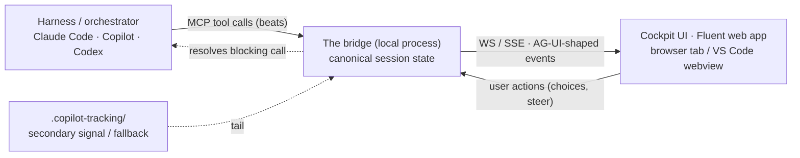

# RPI Cockpit — design spec

**Status:** draft for review · **Date:** 2026-06-24 · **Working name:** RPI Cockpit

## Summary

When you run an hve-core RPI-style agent, the work happens in a chat transcript: phases, subagents, artifacts, and decisions all scroll by as text. It is hard to tell what comes first, what is running now, and what comes next — and the moments where the agent needs a judgment call are buried in prose.

The RPI Cockpit is a local web surface that makes a running agent session **legible** and **interactive** without taking over orchestration. The harness you already use — Claude Code, GitHub Copilot, or Codex — stays the orchestrator. The cockpit is a *membrane* between you and that running agent: it shows the RPI loop in real time, lets you steer which subagents run, and surfaces the agent's decisions as graphical choices. Think "PrixmaViz for the RPI loop": a plugin that spins up a local server, talks to the agent over MCP, and renders a live Fluent UI in the browser (or a VS Code webview).

## Principles and non-goals

**Three verbs, no fourth:**

- **Show** — make the loop legible: which phase is live, which subagents are running, what artifacts exist, what just happened.
- **Steer** — surface controls: pick or swap the subagent for a step, pause, redirect.
- **Decide** — present the agent's deep options as choices and capture the answer.

**Principles:** membrane not brain (never orchestrates) · host-agnostic via MCP · persistent but session-aware · unmistakably Microsoft (Fluent 2).

**Non-goals (v1):** not an orchestration runtime; does not host models or tools; does not replace the harness; no multi-user or remote; does not change how the harness runs the loop.

## Architecture

One local process — **the bridge** — with two faces and one source of truth.

- **Agent face (MCP).** The harness loads the bridge as an MCP server. Agents call a small vocabulary of *beats* at key moments. MCP is the deciding constraint: it is the one inbound seam all three harnesses expose — they sandbox the agent away from arbitrary localhost, but they surface MCP tools as a sanctioned channel.
- **Browser face (HTTP + WS/SSE).** Serves the Fluent cockpit, streams events to it, and receives user actions. This is the "API interface" — the bridge *is* a web server. MCP is a thin adapter over the same internal functions, not a second system.
- **State.** The bridge owns canonical session state (phase, subagents, artifacts, pending decisions, history). The harness stays dumb about UI; it only emits beats.

Alternatives considered and rejected: owning an orchestration runtime (re-hosting the loop) — rejected because the harness must remain the orchestrator. A pure artifact-tail observer (watch `.copilot-tracking/`) — rejected as the *primary* mechanism because it is one-way and eventual, but it survives as a **fallback signal** (see Failure modes).

### Event and tool vocabulary (AG-UI-shaped)

Beats the agent emits (MCP tools) map to events the UI receives:

- `session.begin(task, host)` — open or attach a session.
- `phase.enter(phase)` — Research | Plan | Implement | Review | Discover.
- `subagent.start(name, role)` / `subagent.stop(name, result)`.
- `artifact.update(path, summary)` — research / plan / changes / review files.
- `validate(status)` — lint / types / tests / build gate.
- `present_options(prompt, options[]) -> choice` — **blocking**; returns the user's pick.
- `request_input(prompt, schema) -> value` — **blocking**; free-form or structured input.

Events are modeled on AG-UI (the Agent-User Interaction Protocol) so we can reuse its shape. Whether we adopt the AG-UI SDK directly or emit AG-UI-shaped events over our own WS is a planning-time decision.

### The decision handshake

`present_options` and `request_input` are the heart of **Decide**. The tool call does not return until the user acts in the cockpit; the bridge resolves it with the user's choice, and the harness continues orchestrating. This is how the *user* makes the decision graphically while the *harness* keeps the loop — two-way control with zero orchestration owned by the UI.

**Risk to validate first:** long-blocking MCP tools behave differently across Claude Code, Copilot, and Codex (timeouts and elicitation support vary). Mitigation: the bridge returns a pending ticket and the agent polls, or uses MCP's elicitation capability where supported. This is the first thing to spike.

### Lifecycle

A persistent, lightweight local server. It boots on first use (first `session.begin`) and stays warm — one stable tab or webview, live updates, no tab-churn. Sessions dock into it; the cockpit and its history outlive any single run. Closing the tab leaves the server up; reopening reattaches.

### Packaging

Ships as a **plugin** that bundles three things: the MCP bridge, the lightly-instrumented agents, and the Fluent web UI. "Plugin" is distribution; "MCP server" is the runtime seam; they compose. PrixmaViz (already in the author's environment) is the existence-proof of this exact pattern.

## Components

Each unit has one purpose, a clear interface, and explicit dependencies.

1. **Bridge core** — the session state model and transitions. In: beats. Out: state snapshots and event deltas. Deps: none (pure, fully testable).
2. **MCP face** — defines the beat tools, validates inputs, forwards to bridge core, holds blocking calls open. Deps: bridge core, an MCP server library.
3. **Web/event face** — HTTP server (serves UI), WS/SSE (streams events), action endpoint (user to bridge). Deps: bridge core.
4. **Cockpit UI** — the Fluent web app: Show panes (stepper, subagents, validation gate, artifacts, activity stream), Steer controls, Decide surface, theming. Deps: web/event face.
5. **Agent instrumentation** — a shared instruction snippet, referenced by the RPI agents, that says when to call which beat. Deps: the beat vocabulary. Goal: minimize per-agent edits by centralizing the "when to narrate" rules.

## Data flow (one session)

`session.begin` (cockpit opens, session docked) → `phase.enter(Research)` (stepper advances, activity logs it) → `subagent.start(Researcher Subagent)` (live card) → `artifact.update(research.md)` → `phase.enter(Plan)` → `phase.enter(Implement)` → `validate(lint ok, types ok, tests running)` (gate updates) → `present_options(3 approaches)` (**Decide card appears, agent blocks**) → user clicks B → tool returns B → implement continues → `phase.enter(Review)` → outcome → `phase.enter(Discover)` → suggestions. Every beat is one UI update and one line in the activity stream.

## Visual identity

Fluent 2 — the single design language. Materials (Mica, Acrylic) are used on chrome and rails only; content surfaces stay solid for legibility. **Light is the signature default** — it reads as a Microsoft product and differentiates from the dark-terminal agent tools. **Dark** ships too, and when embedded as a VS Code webview the cockpit **auto-adopts the editor theme**. Theme is a user-selectable setting with smart context defaults. Reference mockup: `mockups/rpi-cockpit-fluent.html` (toggle Fluent / VS Code / Mica in the command bar).

## Failure modes

- **Blocking-tool timeout, or a host that will not hold a call open** → pending-ticket plus poll, or MCP elicitation; the UI shows "agent waiting on you" with elapsed time; on timeout the agent proceeds with the recommended default and the cockpit flags it.
- **Agent skips a beat** → the UI marks that state "inferred"; the bridge tails `.copilot-tracking/` as a secondary signal to reconcile (the artifact-tail approach as a safety net).
- **Bridge not running or port in use** → the MCP tool auto-starts the server or returns a clear, actionable error; deterministic port with fallback.
- **No MCP support in a host** → degrade to read-only artifact-tail mode (Show only; no Steer or Decide).
- **Multiple concurrent sessions** → each has an id; the cockpit lists and switches between them.

## Scope

**MVP (v1):** bridge + **Show** + **Decide**, one reference harness (Claude Code), standalone browser tab, light and dark themes. This delivers "understand what is happening" plus "make the decisions."

**Fast-follow (v1.1):** **Steer** (subagent routing, pause, redirect); VS Code webview plus editor-adaptive theme; Copilot and Codex validation; multi-session.

**Later:** branch and replay of phases; remote or multi-user; richer materials.

## Open questions

1. Blocking MCP behavior per host — **spike before committing** the handshake design.
2. Adopt the AG-UI SDK and protocol directly, or emit AG-UI-shaped events over our own WS?
3. Instrumentation burden — can a single shared instruction file cover all RPI agents with near-zero per-agent edits?
4. Name (working title: RPI Cockpit).

## Testing

- **Bridge core:** unit tests for state transitions and event deltas (pure, easy to cover).
- **MCP face:** contract tests per beat; an integration test for the blocking `present_options` resolve and the polling fallback.
- **UI:** component tests for the three panes; theme and visual checks across light, dark, and editor modes.
- **Cross-host smoke matrix:** the MCP seam against Claude Code, Copilot, and Codex.
- **E2E:** a scripted RPI session drives the bridge; assert the cockpit reflects every beat and the handshake round-trips.
