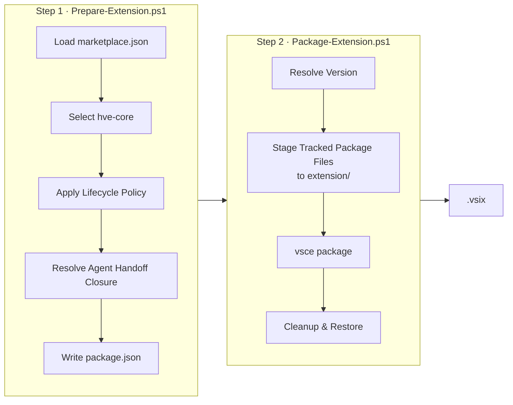
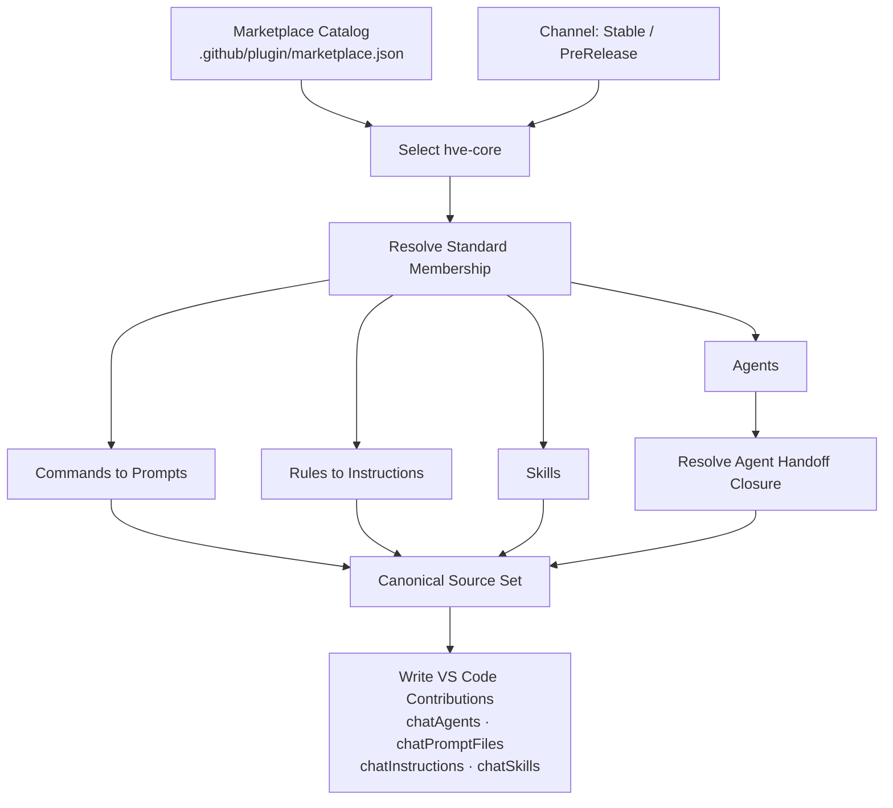
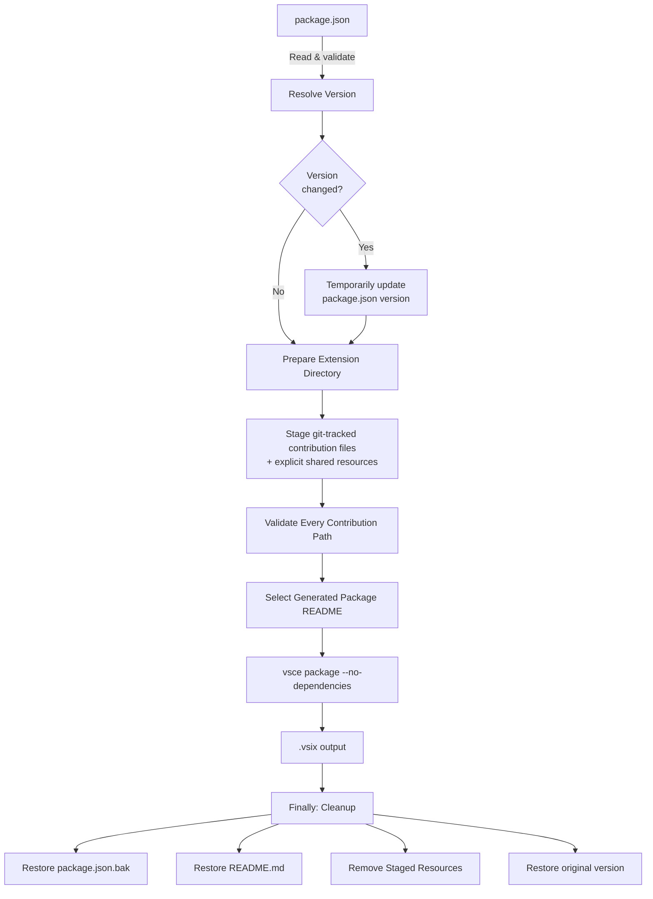

This folder contains the VS Code extension configuration for HVE Core.

## Structure

```plaintext
extension/
├── .github/              # Tracked package sources staged temporarily
├── docs/templates/       # Explicit shared resources staged temporarily
├── package.json          # Generated hve-core extension manifest
├── templates/            # Source templates for package generation
├── .vscodeignore         # Controls what gets packaged into the .vsix
├── README.md             # Extension marketplace description
├── LICENSE               # Copy of root LICENSE
├── CHANGELOG.md          # Copy of root CHANGELOG
└── PACKAGING.md          # This file
```

## Extension Configuration

### Extension Kind

The extension is configured with `"extensionKind": ["workspace", "ui"]` in `package.json` to support multiple execution contexts:

* In workspace mode, the extension runs in the workspace (remote) extension host and accesses its bundled files from the extension installation directory in the remote/workspace context (for example, the packaged `.github/` folder).
* In UI mode, the extension runs in the UI extension host on the user's local machine and accesses the same bundled extension files from the local installation directory.

Access to files in the user's project workspace always uses the standard VS Code workspace APIs and is independent of the extension kind. Both modes use the same packaged extension assets and differ only in execution context (local UI versus remote/workspace). This bundling approach ensures GitHub Copilot can reliably access instruction files and scripts regardless of cross-platform path resolution issues (for example, Windows/WSL environments).

This is a declarative extension: it contributes configuration and file paths, and VS Code (together with the GitHub Copilot extension) resolves those paths based on the selected extension host and the extension installation location; it does not implement any custom runtime fallback mechanism between workspace and bundled files.

## Prerequisites

Install project dependencies (includes the VS Code Extension Manager CLI):

```bash
npm ci
```

Packaging scripts invoke the repository-pinned `vsce` executable. They do not
download or install a fallback version.

Install the PowerShell-Yaml module (required for Prepare-Extension.ps1):

```powershell
Install-Module -Name PowerShell-Yaml -RequiredVersion 0.4.7 -Scope CurrentUser
```

## Automated CI/CD Workflows

The extension is automatically packaged and published through GitHub Actions:

| Workflow                                           | Trigger                          | Purpose                                                    |
|----------------------------------------------------|----------------------------------|------------------------------------------------------------|
| `.github/workflows/extension-package.yml`          | Reusable workflow                | Packages a source-explicit extension                       |
| `.github/workflows/release-prerelease.yml`         | Manual with an explicit main SHA | Builds and publishes the immutable PreRelease              |
| `.github/workflows/release-stable.yml`             | Push to main                     | Validates `main` and opens the reviewed Stable promotion   |
| `.github/workflows/release-stable-publish.yml`     | Merged PR to `release/stable`    | Runs release-please and publishes verified Stable evidence |
| `.github/workflows/release-marketplace-stable.yml` | Published Stable release         | Publishes the Stable VSIX to VS Code Marketplace           |

`release-stable.yml` opens the reviewed `main` to `release/stable` promotion after validation. After the promotion merges, `release-stable-publish.yml` runs release-please on `release/stable`. Release-please owns the managed Stable release PR and draft Stable release.

When that managed PR merges, the workflow packages and attests the VSIX and plugin, publishes the immutable `plugins-v<version>` snapshot, finalizes the draft, and opens the reviewed `release/stable` to `main` metadata synchronization PR.

## Packaging Pipeline Overview

Extension packaging is a two-step process: **Prepare** resolves the `hve-core`
recipe into VS Code contributions, then **Package** stages its tracked files,
runs the pinned `vsce`, and cleans up.



### Package Projection and Resolution

The prepare step reads `.github/plugin/marketplace.json`, selects `hve-core`,
maps its standard component paths to canonical `.github` sources, applies
lifecycle policy, and resolves transitive agent handoffs through
the shared marketplace projection.



## Packaging the Extension

### Using the Automated Scripts (Recommended)

#### Step 1: Prepare the Extension

First, generate the extension manifest from the marketplace recipe:

```bash
# Discover components and update package.json (Stable channel)
pwsh ./scripts/extension/Prepare-Extension.ps1

# Or use npm script
npm run extension:prepare

# For PreRelease channel
pwsh ./scripts/extension/Prepare-Extension.ps1 -Channel PreRelease

# Or use npm script
npm run extension:prepare:prerelease
```

The preparation script automatically:

* Reads identity, display name, membership, lifecycle maturity, and documentation
    from `.github/plugin/marketplace.json`
* Resolves canonical source paths and transitive agent handoffs through the
    shared marketplace helper
* Generates the one HVE Core extension manifest
* Writes HVE Core's VS Code contribution paths
* Uses the existing template version without modifying its source

When invoked via the npm scripts (`extension:prepare` and `extension:prepare:prerelease`), a postprocess step also runs after preparation, auto-fixing markdown formatting in `extension/**/*.md`:

* `markdownlint-cli2 --fix`
* `markdown-table-formatter`

Running `pwsh ./scripts/extension/Prepare-Extension.ps1` directly skips this postprocess step.

#### Step 2: Package the Extension

Then package the extension:

```bash
# Package using version from package.json (Stable channel)
pwsh ./scripts/extension/Package-Extension.ps1

# Or use npm script
npm run extension:package

# Package for PreRelease channel
pwsh ./scripts/extension/Package-Extension.ps1 -PreRelease

# Or use npm script
npm run extension:package:prerelease

# Package with specific version
pwsh ./scripts/extension/Package-Extension.ps1 -Version "1.0.3"

# Package with dev patch number (e.g., 1.0.2-dev.123)
pwsh ./scripts/extension/Package-Extension.ps1 -DevPatchNumber "123"

# Package with version and dev patch number
pwsh ./scripts/extension/Package-Extension.ps1 -Version "1.1.0" -DevPatchNumber "456"
```

The packaging script automatically:

* Uses version from `package.json` (or specified version)
* Optionally appends dev patch number for pre-release builds
* Stages only git-tracked files beneath prepared contribution paths
* Adds the explicit shared resources required by the package
* Packages the extension using `vsce`
* Cleans up temporary files and restores all modified files



## Publishing the Extension

**Important:** Stable versions are managed by release-please on `release/stable`
through `extension/templates/package.template.json`. `Prepare-Extension.ps1`
generates the extension manifest with the released version before packaging.
PreRelease supplies an ephemeral odd-minor version without changing tracked
version files.

### Setup Personal Access Token (one-time)

Set your Azure DevOps PAT as an environment variable:

```bash
export VSCE_PAT=your-token-here
```

To get a PAT from your Azure DevOps organization:

1. Open **User settings → Personal access tokens → New Token**
2. Set scope to **Marketplace (Manage)**
3. Copy the token

### Publish command

```bash
# Publish the packaged extension (replace X.Y.Z with actual version)
vsce publish --packagePath "extension/hve-core-X.Y.Z.vsix"

# Or use the latest .vsix file
VSIX_FILE=$(ls -t extension/hve-core-*.vsix | head -1)
vsce publish --packagePath "$VSIX_FILE"
```

## What Gets Included

The generated manifest and tracked staging allowlist control what gets packaged.
The archive can include:

* Declared `.github/agents/**` agent definitions
* Declared `.github/prompts/**` prompt templates
* Declared `.github/instructions/**` instruction files
* Declared `.github/skills/**` skill packages
* Explicit shared resources such as `docs/templates/**`
* `package.json` - Extension manifest
* `README.md` - Extension description
* `LICENSE` - License file
* `CHANGELOG.md` - Version history

## Testing Locally

Install the packaged extension locally:

```bash
code --install-extension hve-core-*.vsix
```

## Version Management

### How Versions Are Managed

The committed extension version source is `extension/templates/package.template.json`. Release-please updates this file in its managed Stable release PR on `release/stable`, and the release postprocessor synchronizes the other committed version fields and `plugins-v<version>` locator on the same branch. PreRelease supplies an ephemeral odd-minor version at package time. `Prepare-Extension.ps1` generates `extension/package.json` from the template before artifact discovery.

Generated package files are ephemeral build artifacts (gitignored). They are created and consumed by `Prepare-Extension.ps1` and `Package-Extension.ps1` at build time.

### Development Builds

For pre-release or CI builds, use the dev patch number:

```bash
# Creates version like 1.0.2-dev.123
pwsh ./scripts/extension/Package-Extension.ps1 -DevPatchNumber "123"
```

This temporarily modifies the version during packaging but restores it afterward.

### Override Version at Package Time

You can override the version without modifying `package.json`:

```bash
# Package as 1.1.0 without updating package.json
pwsh ./scripts/extension/Package-Extension.ps1 -Version "1.1.0"
```

## Pre-Release Channel

The extension supports dual-channel publishing to VS Code Marketplace with separate stable and pre-release tracks.

### EVEN/ODD Versioning Strategy

| Minor Version     | Channel    | Example      | Active Lifecycle Labels             |
|-------------------|------------|--------------|-------------------------------------|
| EVEN (0, 2, 4...) | Stable     | 1.0.0, 1.2.0 | `stable`, `preview`, `experimental` |
| ODD (1, 3, 5...)  | PreRelease | 1.1.0, 1.3.0 | `stable`, `preview`, `experimental` |

Users can switch between channels in VS Code via the "Switch to Pre-Release Version" button on the extension page.

### Pre-Release Packaging

Package for the pre-release channel with the `-PreRelease` switch:

```bash
# Prepare the PreRelease channel
pwsh ./scripts/extension/Prepare-Extension.ps1 -Channel PreRelease
# Or use npm script
npm run extension:prepare:prerelease

# Package for the PreRelease channel
pwsh ./scripts/extension/Package-Extension.ps1 -Version "1.1.0" -PreRelease
# Or use npm script for default version
npm run extension:package:prerelease
```

The `-PreRelease` switch adds `--pre-release` to the vsce command, marking the package for the Marketplace pre-release track.

### Pre-Release Workflow

Use the manual workflow for publishing pre-releases:

1. Go to **Actions** > **Pre-Release Pipeline**
2. Enter the full 40-character SHA of the approved commit on `main`
3. Run the workflow

The workflow verifies that the SHA belongs to `main`, computes an ephemeral odd-minor version, stages a resumable draft, packages the VSIX and plugin from that source, publishes the matching immutable plugin snapshot, and finalizes the PreRelease. The published release then triggers the PreRelease marketplace workflow.

### Lifecycle Disclosure

Stable and PreRelease package the same active component set. Lifecycle labels disclose support posture and are not channel filters:

| Lifecycle Label | Stable | PreRelease |
|-----------------|--------|------------|
| `stable`        | Yes    | Yes        |
| `preview`       | Yes    | Yes        |
| `experimental`  | Yes    | Yes        |
| `deprecated`    | No     | No         |
| `removed`       | No     | No         |

See [Marketplace Packages](../docs/contributing/ai-artifacts-common.md#marketplace-packages) for contributor guidance.

## Marketplace Build

`.github/plugin/marketplace.json` defines the `hve-core` identity, display name, membership, lifecycle labels, and documentation. `Get-MarketplacePackageMatrix.ps1` emits exactly that identity for either channel.

Prepare and package one ID directly:

```powershell
pwsh ./scripts/extension/Prepare-Extension.ps1 -PackageId hve-core -Channel Stable
pwsh ./scripts/extension/Package-Extension.ps1 -PackageId hve-core
```

Preparation consumes the shared handoff-resolved projection. Packaging stages
only git-tracked contribution paths plus explicit shared resources and invokes
the repository-pinned `vsce`. No retired manifest reader, full-tree copy, or
installer fallback is used.

To add a distributable component, update the `hve-core` recipe and [HVE Core](../docs/plugins/hve-core.md), then run marketplace validation and both extension preparation channels.

## Notes

* Selected tracked source files and shared resources are staged temporarily and removed after packaging
* `LICENSE` and `CHANGELOG.md` are copied from root during packaging and excluded from git
* Only declared package files and explicit shared resources are included
* Repo-specific instructions at the root of `.github/instructions/` are excluded from all builds
* Non-essential files are excluded (workflows, issue templates, agent installer, etc.)
* The root `package.json` contains development scripts for the repository

---

<!-- markdownlint-disable MD036 -->
*🤖 Crafted with precision by ✨Copilot following brilliant human instruction,
then carefully refined by our team of discerning human reviewers.*
<!-- markdownlint-enable MD036 -->
