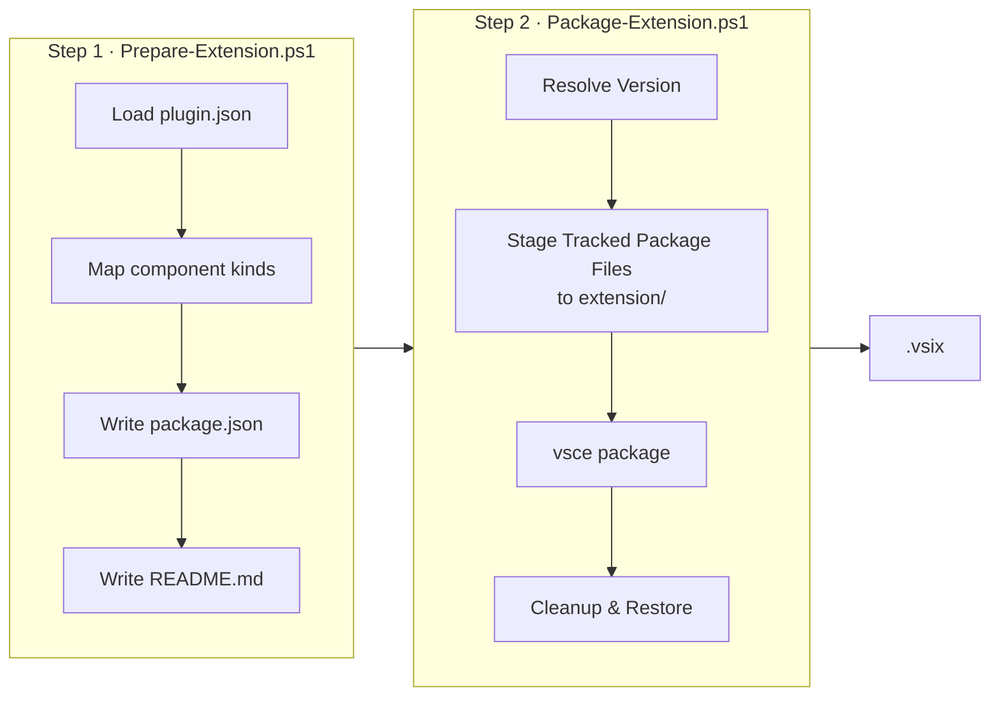
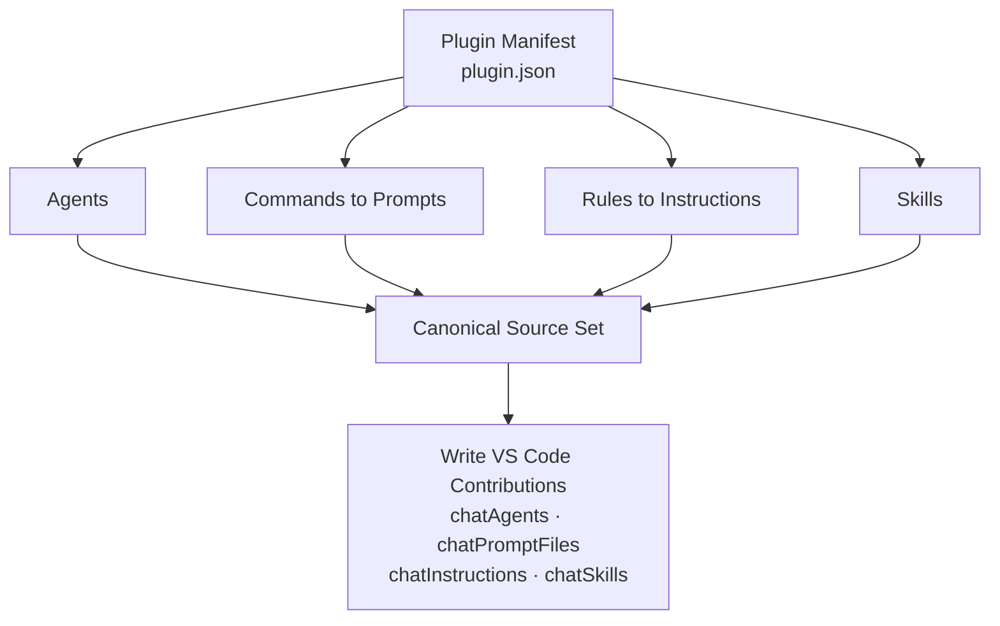
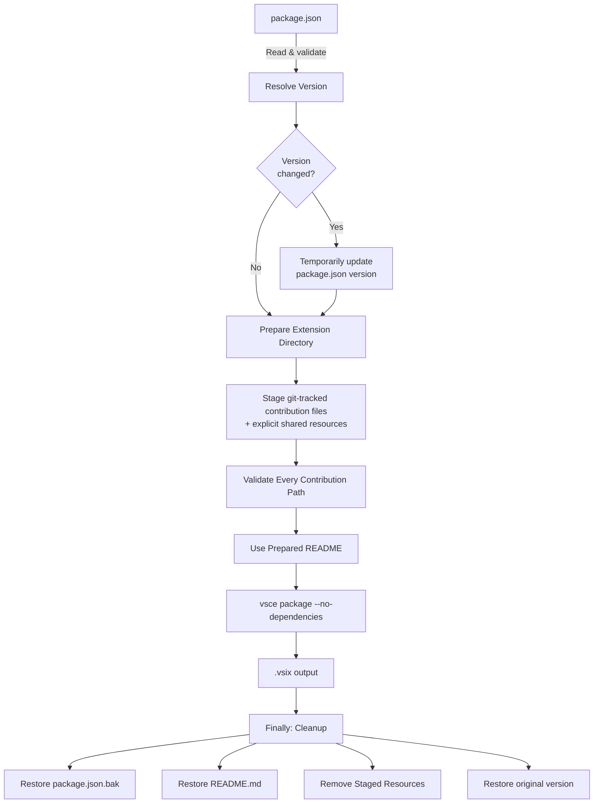

This folder contains the VS Code extension configuration for HVE Core.

## Structure

```plaintext
extension/
├── .github/              # Tracked package sources staged temporarily
├── docs/templates/       # Explicit shared resources staged temporarily
├── package.json          # Generated hve-core extension manifest
├── templates/            # Source templates for package generation
├── .vscodeignore         # Controls what gets packaged into the .vsix
├── README.md             # Extension marketplace description
├── LICENSE               # Copy of root LICENSE
├── CHANGELOG.md          # Copy of root CHANGELOG
└── PACKAGING.md          # This file
```

## Extension Configuration

### Extension Kind

The extension is configured with `"extensionKind": ["workspace", "ui"]` in `package.json` to support multiple execution contexts:

* In workspace mode, the extension runs in the workspace (remote) extension host and accesses its bundled files from the extension installation directory in the remote/workspace context (for example, the packaged `.github/` folder).
* In UI mode, the extension runs in the UI extension host on the user's local machine and accesses the same bundled extension files from the local installation directory.

Access to files in the user's project workspace always uses the standard VS Code workspace APIs and is independent of the extension kind. Both modes use the same packaged extension assets and differ only in execution context (local UI versus remote/workspace). This bundling approach ensures GitHub Copilot can reliably access instruction files and scripts regardless of cross-platform path resolution issues (for example, Windows/WSL environments).

This is a declarative extension: it contributes configuration and file paths, and VS Code (together with the GitHub Copilot extension) resolves those paths based on the selected extension host and the extension installation location; it does not implement any custom runtime fallback mechanism between workspace and bundled files.

## Prerequisites

Install project dependencies (includes the VS Code Extension Manager CLI):

```bash
npm ci
```

Packaging scripts invoke the repository-pinned `vsce` executable. They do not
download or install a fallback version.

Install the PowerShell-Yaml module (required for Prepare-Extension.ps1):

```powershell
Install-Module -Name PowerShell-Yaml -RequiredVersion 0.4.7 -Scope CurrentUser
```

## Automated CI/CD Workflows

The extension is automatically packaged and published through GitHub Actions:

| Workflow                                               | Trigger                            | Purpose                                                 |
|--------------------------------------------------------|------------------------------------|---------------------------------------------------------|
| `.github/workflows/release-prerelease-prepare.yml`     | Merged PR to `main`; dispatch      | Opens the reviewed `main` to PreRelease promotion       |
| `.github/workflows/release-prerelease.yml`             | Merged PR to `release/prerelease`  | Prepares metadata or creates the exact tag and draft    |
| `.github/workflows/release-stable.yml`                 | Published PreRelease; dispatch     | Opens the reviewed PreRelease to Stable promotion       |
| `.github/workflows/release-stable-publish.yml`         | Merged PR to `release/stable`      | Prepares metadata or creates the exact tag and draft    |
| `.github/workflows/release-vsix-publish.yml`           | Push of `v*` or `prerelease-v*`    | Produces and publishes the release assets from the tag  |
| `.github/workflows/extension-provenance-signer.yml`    | Reusable workflow                  | Packages, transfers, and attests the VSIX in split jobs |
| `.github/workflows/release-marketplace-stable.yml`     | Published Stable release; dispatch | Publishes the release VSIX to VS Code Marketplace       |
| `.github/workflows/release-marketplace-prerelease.yml` | Published PreRelease; dispatch     | Publishes the release VSIX to VS Code Marketplace       |

`release-prerelease-prepare.yml` opens the reviewed, target-based `main` to
`release/prerelease` promotion. Its merge creates no tag and runs
`release-prerelease.yml` in PR-only mode. Release-please owns the later managed
PR. Merging that exact managed head selects tag-only mode. Release-please
creates the exact odd-minor tag and draft release at its merge commit.

The resulting tag push starts `release-vsix-publish.yml`, the sole post-tag
producer. It validates the protected exact tag, source commit, channel branch,
and committed release state, then discovers the exact draft through at most 12
attempts separated by 10 seconds. It packages one VSIX from the immutable tag,
attaches SPDX, Sigstore, and in-toto sidecars plus
`dependencies.spdx.json`, verifies provenance, and publishes the prerelease
with a release GitHub App token. That published event triggers PreRelease
Marketplace publication. Release branches, tags, and published GitHub releases
retain release state and history; publication does not update `main`.

`release-stable.yml` starts from the published PreRelease event or a recovery
dispatch and opens the reviewed `release/prerelease` to `release/stable`
promotion. Its merge creates no tag and runs `release-stable-publish.yml` in
PR-only mode. Merging the later managed Stable PR lets release-please create the
exact even-minor tag and draft at its merge commit. The tag push starts the same
post-tag producer, which performs the shared validation, packaging, attestation,
and publication path. Stable additionally retains OpenVEX, dependency-diff, and
verification-note behavior. The published event triggers Stable Marketplace
publication.

If a tag-triggered run fails, classify the tag and release state first. A
matching draft or published release can use the original immutable tag-push
workflow. A tag-only state first requires release-please to create the exact
draft; a draft-only state first requires release-please to materialize the tag.
Partial assets may be restored while the release remains draft, but publication
waits for the complete dependency graph and provenance verification. Published
recovery verifies exact assets and provenance without rebuilding. The producer
has no default `workflow_dispatch` recovery path. Never move, delete, or
recreate a release tag, create a replacement release identity, or convert a
published release back to draft. Bounded discovery fails closed and does not
guarantee draft visibility.

Release branches and exact tags retain the repository-root plugin source from their selected snapshots. Their reviewed, immutable VSIX assets remain release-gated, SBOM-covered, and attested. The ref-less main catalog represents `main`, receives no post-release synchronization, and requires an explicit marketplace refresh and plugin update; its bytes have no release gate, SBOM, or attestation.

The moving registrations are `microsoft/hve-core#release/prerelease` and
`microsoft/hve-core#release/stable`; immutable registrations use
`#prerelease-v<version>` and `#v<version>`.

Tag governance is a mandatory activation prerequisite for this pipeline, but
it is not yet active or proven. The intended configuration has two rulesets:

* `release-tags-creation-by-release-app` restricts creation only and grants a
    bypass to the Release App
* `release-tags-immutable` restricts updates, deletion, and force pushes with
    no bypass

Do not treat repository configuration or this documentation as evidence that
either ruleset is installed.

For ordinary promotions, PreRelease reads `release/prerelease` and returns the
same major, minor plus two, and patch zero. Stable reads the promoted
PreRelease version and returns its major, its minor plus one, and patch zero.
The ordinary sequence is `3.3.101` to `3.5.0` to `3.6.0`. Current Stable state
only rejects a non-advancing candidate. Neither channel classifies commits or
automatically selects a patch, minor, or major release class. The plugin
manifest and VSIX use the identical channel version. A major-line transition or Stable
patch or hotfix needs a separate explicit manifest and release-state decision.

## Packaging Pipeline Overview

Extension packaging is a two-step process: **Prepare** maps root `plugin.json`
into VS Code contributions, then **Package** stages its tracked files, runs the
pinned `vsce`, and cleans up.



### Manifest Projection

The prepare step reads root `plugin.json` and maps each repository-relative `.github/...` component to its VS Code contribution type. Hooks are omitted because VS Code has no declarative hook contribution point. Root `README.md` and `LICENSE` are plugin metadata, not extension contributions; the VSIX retains `extension/README.md` and `extension/LICENSE`.



## Packaging the Extension

### Using the Automated Scripts (Recommended)

#### Step 1: Prepare the Extension

First, prepare the extension manifest from the plugin manifest:

```bash
# Discover components and update package.json (Stable channel)
pwsh ./scripts/extension/Prepare-Extension.ps1

# Or use npm script
npm run extension:prepare

# For PreRelease channel
pwsh ./scripts/extension/Prepare-Extension.ps1 -Channel PreRelease

# Or use npm script
npm run extension:prepare:prerelease
```

The preparation script automatically:

* Reads identity, description, and membership from root `plugin.json`
* Maps canonical source paths to VS Code contribution kinds
* Refreshes the one HVE Core extension manifest and README
* Writes HVE Core's VS Code contribution paths
* Uses the existing template version without modifying its source

When invoked via the npm scripts (`extension:prepare` and `extension:prepare:prerelease`), a postprocess step also runs after preparation, auto-fixing markdown formatting in `extension/**/*.md`:

* `markdownlint-cli2 --fix`
* `markdown-table-formatter`

Running `pwsh ./scripts/extension/Prepare-Extension.ps1` directly skips this postprocess step.

#### Step 2: Package the Extension

Then package the extension:

```bash
# Package using version from package.json (Stable channel)
pwsh ./scripts/extension/Package-Extension.ps1

# Or use npm script
npm run extension:package

# Package for PreRelease channel
pwsh ./scripts/extension/Package-Extension.ps1 -PreRelease

# Or use npm script
npm run extension:package:prerelease

# Package with specific version
pwsh ./scripts/extension/Package-Extension.ps1 -Version "1.0.3"

# Package with dev patch number (e.g., 1.0.2-dev.123)
pwsh ./scripts/extension/Package-Extension.ps1 -DevPatchNumber "123"

# Package with version and dev patch number
pwsh ./scripts/extension/Package-Extension.ps1 -Version "1.1.0" -DevPatchNumber "456"
```

The packaging script automatically:

* Uses version from `package.json` (or specified version)
* Optionally appends dev patch number for pre-release builds
* Stages only git-tracked files beneath prepared contribution paths
* Adds the explicit shared resources required by the package
* Packages the extension using `vsce`
* Cleans up temporary files and restores all modified files



## Publishing the Extension

Production channel publication is workflow-owned. Do not bypass the release
asset, attestation verification, or Azure OIDC path with a PAT-based direct
publish.

| Channel    | Release asset selector  | Attestation signer                | Marketplace mode                  |
|------------|-------------------------|-----------------------------------|-----------------------------------|
| PreRelease | `prerelease-v<version>` | `extension-provenance-signer.yml` | `vsce --pre-release` through OIDC |
| Stable     | `v<version>`            | `extension-provenance-signer.yml` | Stable publication through OIDC   |

The generic publisher receives the exact channel tag, downloads the one matching
VSIX release asset, verifies its provenance against `extension-provenance-signer.yml`
at signer revision `3a09401536cef0c4559db1aa64b7d1010638fd67`, and publishes it
with `--azure-credential`.

Release verification first authenticates the attestation cryptographically,
then applies fail-closed semantic policy. The policy checks the exact subject
name and digest, signer workflow and signer revision, source ref and revision,
SLSA provenance v1, GitHub Actions `workflow/v1`, the `push` event, a
GitHub-hosted runner, the complete external-parameter shape, the resolved
dependency, and builder identity.

This architecture does not establish SLSA Build Level 3. Future Stable and
PreRelease releases still need successful runtime evidence, active tag
governance evidence, platform assurance mapping, and qualified human review
before making that claim.

## What Gets Included

The prepared manifest and tracked staging allowlist control what gets packaged.
The archive can include:

* Declared `.github/agents/**` agent definitions
* Declared `.github/prompts/**` prompt templates
* Declared `.github/instructions/**` instruction files
* Declared `.github/skills/**` skill packages
* Explicit shared resources such as `docs/templates/**`
* `package.json` - Extension manifest
* `README.md` - Extension description
* `LICENSE` - License file
* `CHANGELOG.md` - Version history

## Testing Locally

Install the packaged extension locally:

```bash
code --install-extension hve-core-*.vsix
```

## Version Management

### How Versions Are Managed

The Stable channel manifest is `.release-please-manifest.json` on
`release/stable`. The PreRelease channel manifest is
`.release-please-prerelease-manifest.json` on `release/prerelease`.
Promotion preparation writes an exact `release-as` for the intended even-minor
or odd-minor version. Release-please consumes that intent in its managed PR,
and postprocessing removes it before merge.

Ordinary release allocation uses the channel formulas rather than commit
classification. PreRelease advances from its current branch version by two
minor values and resets patch to zero. Stable advances from the promoted
PreRelease version by one minor value and resets patch to zero; current Stable
state only guards against non-advancement. A major-line transition or Stable
patch or hotfix remains a separate explicit manifest and release-state
decision.

Each managed PR synchronizes `package.json`, `package-lock.json`,
`extension/templates/package.template.json`, root `plugin.json`,
`.github/plugin/marketplace.json`, the channel manifest, and `CHANGELOG.md` on
its release branch.
`Prepare-Extension.ps1` generates `extension/package.json` from the template
before artifact discovery, and release packaging supplies the verified release
version and release tag explicitly.

`Prepare-Extension.ps1` refreshes the tracked `extension/package.json` and `extension/README.md`. `Package-Extension.ps1` consumes those files and stages temporary shared resources during packaging.

### Development Builds

For pre-release or CI builds, use the dev patch number:

```bash
# Creates version like 1.0.2-dev.123
pwsh ./scripts/extension/Package-Extension.ps1 -DevPatchNumber "123"
```

This temporarily modifies the version during packaging but restores it afterward.

### Override Version at Package Time

You can override the version without modifying `package.json`:

```bash
# Package as 1.1.0 without updating package.json
pwsh ./scripts/extension/Package-Extension.ps1 -Version "1.1.0"
```

## Pre-Release Channel

The extension supports dual-channel publishing to VS Code Marketplace with separate stable and pre-release tracks.

### Even/Odd Versioning Policy

| Minor Version     | Channel    | Example      | Component Membership |
|-------------------|------------|--------------|----------------------|
| EVEN (0, 2, 4...) | Stable     | 1.0.0, 1.2.0 | Complete manifest    |
| ODD (1, 3, 5...)  | PreRelease | 1.1.0, 1.3.0 | Complete manifest    |

Odd/even minor parity is repository policy aligned with VS Code Marketplace
guidance and behavior, not a requirement of `MAJOR.MINOR.PATCH` syntax. Hosted
Marketplace selection and installed-client switching remain operator
observations, not results of local packaging or documentation validation.

### Pre-Release Packaging

Package for the pre-release channel with the `-PreRelease` switch:

```bash
# Prepare the PreRelease channel
pwsh ./scripts/extension/Prepare-Extension.ps1 -Channel PreRelease
# Or use npm script
npm run extension:prepare:prerelease

# Package for the PreRelease channel
pwsh ./scripts/extension/Package-Extension.ps1 -Version "1.1.0" -PreRelease
# Or use npm script for default version
npm run extension:package:prerelease
```

The `-PreRelease` switch adds `--pre-release` to the vsce command, marking the package for the Marketplace pre-release track.

### Pre-Release Workflow

Use the reviewed two-PR workflow for publishing pre-releases:

1. Review the target-based `main` to `release/prerelease` promotion PR from
    `release-promotion--main--to--release-prerelease`.
2. Confirm `PR Validation Success` passes and the exact intent is odd-minor.
3. Merge the promotion. It creates no tag and runs release-please in PR-only
    mode.
4. Review the managed PR from
    `release-please--branches--release/prerelease`, including synchronized
    version fields, changelog, plugin manifest, and marketplace version parity.
5. Merge the managed PR. Verify release-please creates the exact
    `prerelease-v<version>` tag and draft release at that merge commit.
6. Verify the tag push starts `release-vsix-publish.yml`, which proves the
    protected tag identity, source commit, target-branch ancestry, committed
    release state, and matching draft.
7. Verify extension packaging uses the release tag and attaches one VSIX, its
    SPDX, Sigstore, and in-toto sidecars, and `dependencies.spdx.json` for the
    same release SHA.
8. Verify the release GitHub App token publishes the prerelease. The
    Marketplace workflow passes the validated tag and
    `.github/workflows/extension-provenance-signer.yml` signer to the generic
    publisher for release-asset verification and OIDC publication.

### Content Parity

Stable and PreRelease package the same complete component set:

| Content               | Stable | PreRelease |
|-----------------------|--------|------------|
| Plugin manifest paths | Same   | Same       |
| Extension README      | Same   | Same       |
| VS Code contributions | Same   | Same       |

See [Plugin Membership](../docs/contributing/ai-artifacts-common.md#plugin-membership) for contributor guidance.

## Marketplace Build

Root `plugin.json` defines the complete extension membership. `.github/plugin/marketplace.json` provides one relative `hve-core` locator to the repository root for Copilot CLI registration. Extension preparation consumes only manifest-declared `.github` components and does not add root plugin metadata to contribution membership.

Prepare and package directly:

```powershell
pwsh ./scripts/extension/Prepare-Extension.ps1 -Channel Stable
pwsh ./scripts/extension/Package-Extension.ps1
```

Preparation consumes the plugin manifest. Packaging stages only git-tracked
contribution paths plus explicit shared resources and invokes the
repository-pinned `vsce`.

Remote release, asset, workflow, and installed-client checks in this guide are
authorized manual actions. Local packaging and documentation checks do not
execute or verify them.

To add a distributable component, place it under an eligible package-scoped path, run `npm run plugin:sync`, update [HVE Core](../docs/plugins/hve-core.md), run `npm run plugin:validate`, and check both extension preparation channels.

## Notes

* Selected tracked source files and shared resources are staged temporarily and removed after packaging
* `LICENSE` and `CHANGELOG.md` are copied from root during packaging and excluded from git
* Only declared plugin files and explicit shared resources are included
* Repo-specific instructions at the root of `.github/instructions/` are excluded from all builds
* Non-essential files are excluded (workflows, issue templates, agent installer, etc.)
* The root `package.json` contains development scripts for the repository

---

<!-- markdownlint-disable MD036 -->
*🤖 Crafted with precision by ✨Copilot following brilliant human instruction,
then carefully refined by our team of discerning human reviewers.*
<!-- markdownlint-enable MD036 -->
