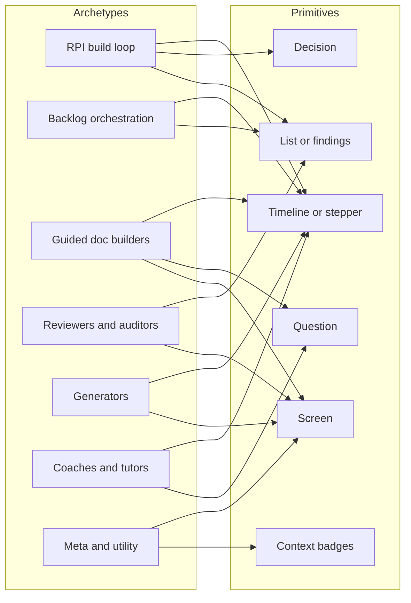

<!-- markdownlint-disable MD013 -->
# Cockpit representation map

## Purpose

Before building any renderer, this maps the full HVE Core surface (about 65 agents, 71 prompts, 70 instructions, 13 skill packs, 13 collections) onto a small set of cockpit primitives. The cockpit cannot have a bespoke UI per agent. Instead, HVE Core's work collapses into a handful of workflow archetypes, and each archetype shares one representation built from generic primitives.

## Workflow archetypes

| Archetype | Example agents and prompts | The shape | Cockpit representation | Coverage today |
|---|---|---|---|---|
| RPI build loop | rpi-agent, task-researcher/planner/implementor/reviewer/challenger | Phases research, plan, implement, review, discover; subagents; validation gate; decisions | Phase stepper, live subagents, validation gate, decision cards | Full (this is what v0 built) |
| Backlog orchestration | GitHub, ADO, and Jira backlog managers; the ado and jira prompts (discover, triage, sprint plan, execute) | Work items move through states; autonomy tiers; sprint context | A kanban board of items and states, plus the action the agent is taking | None |
| Guided doc builders | PRD, BRD, and ADR builders; security, SSSC, RAI, and accessibility planners; the PM advisor | A phase-gated question and answer (a state file) that builds a document and ends in a backlog handoff | An interview view: a stepper, the current question, the growing document, the handoff | Partial (decision cards cover the picks; no document-progress view) |
| Reviewers and auditors | code-review (four variants), pr-review, security, RAI, and accessibility reviewers | A scan that produces a findings list (severity, file and line, verdict) | A findings panel grouped by severity, file-linked, with accept and dismiss | None (could ride the screen pane) |
| Generators | data-science (notebook, dashboard, dataset, spec); pptx | Inputs become a concrete artifact | Input, generation progress, artifact preview | Partial (the screen pane previews HTML; no input or progress model) |
| Coaches and tutors | design-thinking (coach, tutor), agile coach, experiment designer, UX designer | A method or curriculum-driven conversation with progress | A framework-progress view (which method or stage), plus the exchange | None |
| Meta and utility | prompt-builder, documentation, memory, issue-triage, dependency-reviewer, agentic-workflows | Single-purpose operations; memory is ambient | Simple activity and result cards; memory as ambient status | Partial |

## The primitives the cockpit actually needs

The cockpit's v0 beats are RPI-specific: the phase value is literally `research`, `plan`, `implement`, `review`, or `discover`. To cover the surface above, the protocol generalizes to a small set of archetype-agnostic primitives, and RPI becomes one composition of them rather than the whole UI.

| Primitive | What it represents | Status |
|---|---|---|
| Timeline or stepper | Any agent's stages: RPI phases, backlog states, planner phases, design-thinking methods | Exists, but hardcoded to the RPI phase enum |
| Decision | A bounded choice the agent blocks on (`present_options`) | Exists |
| List or findings | Severity-tagged items with file links: review findings, backlog items | Missing |
| Question | The agent asks, you answer in free form (a generalization of the decision) | Missing |
| Screen | Arbitrary rich content the agent paints: document previews, generated artifacts, dashboards | Exists (sandboxed iframe) |
| App frame | A trusted iframe to the app under development (its localhost preview), embedded beside the cockpit | Missing |
| Context badges | The active instructions, skills, and collection, for legibility | Missing |

Every archetype can fall back to the screen primitive for anything bespoke, and every archetype benefits from context badges. The app frame is different in kind: it embeds the user's own app under development (a trusted localhost iframe) beside the cockpit, the trusted sibling of the untrusted, sandboxed screen.

## Where the non-agent features land

The features that are not agents map onto the same model:

| Feature | Count | Cockpit role |
|---|---|---|
| Prompts | 71 | The launcher: what the user starts, and the handoffs to what comes next |
| Instructions | 70 | Context badges: which coding standards are active for this work |
| Skills | 13 packs | Context badges: which reusable tool the agent just used |
| Collections | 13 | Install context, not per-session |

## Proof ordering after RPI

RPI is the first proof. The recommended order for the second and third compositions is adjustable, but the reasoning is:

1. Reviewers and auditors (the findings panel). Highest frequency across HVE Core (code review, PR review, security), and it exercises the new list primitive cleanly.
2. Guided doc builders (the interview view). A flagship HVE use case, combining the document-progress view with the question primitive.
3. Backlog orchestration (the kanban). The most complex workflows, and the ones that most need legibility.

## What this changes in the roadmap

The v1 protocol work should bake in the generic primitives (timeline, decision, list, question, screen, context) with RPI as the first composition, rather than shipping an RPI-only renderer that has to be torn up the moment the cockpit points at a reviewer or a backlog manager.
